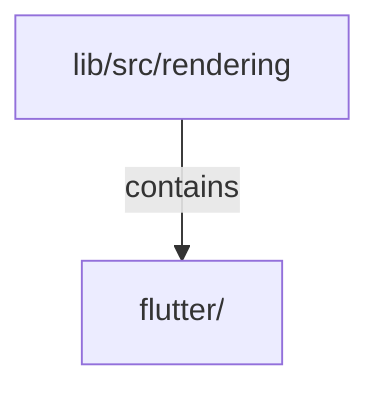

# lib/src/rendering：架構分析入口

[上一層](../README.md)

## 範圍

閱讀 `lib/src/rendering` 的直接子目錄與 Dart 檔案。結構圖表示實際檔案包含關係；依賴圖表示本層檔案明寫的 directives。每個檔案頁另列直接依賴、宣告、欄位、方法、建構子及行號證據。

## 模組閱讀重點

## 分析入口

`flutter/internal/klp_flutter_renderer.dart` 將封閉 `KlpBoundTemplate` 分派成 Flutter 原語：文字、線性排版、表面、選擇操作、三區配置及單方向尺寸。`KlpBoundPlacement` 包住已完成內容，renderer 使用位置 id 建立 key；此層不辨認自訂插槽，也不接受未完成子項。所有風格值來自已解析 bound 資料；`klp_flutter_values.dart` 只轉換平台型別，不建立另一份 token 預設。此層不引用 rail 或其他功能，也不執行消費端資料 selector。

`klp_flutter_choice.dart` 擁有 Flutter 焦點，借用同一選取來源並管理訂閱；滑鼠、Enter、Space 與語意操作共用啟動入口。相同 id 的放置以 key 保留 element；風格更新不重建選取來源。停用項目不能鍵盤聚焦，停用語意使用空的 focused 狀態。

`klp_flutter_extent.dart` 以方向起點承接父限制，讓指定方向保有語意尺寸並限縮至可用空間，另一有界方向填滿父層。`klp_flutter_regions.dart` 先分配邊側，再讓中間取得剩餘空間；過窄時整體可捲動。兩種情況保留相同祖先拓樸，只切換區域尺寸限制，避免換風格跨越門檻時釋放焦點。`klp_flutter_linear.dart` 沿主要方向提供捲動。

`klp_flutter_retained_stack.dart` 呈現封閉 `KlpBoundRetainedStack`，以完整 `KlpPlacementId` 保存每頁 element 與 FocusScope。非目前頁保留子樹，但以 Offstage、IgnorePointer、ExcludeSemantics、TickerMode 及停用 FocusScope 排除互動。返回時只嘗試恢復仍掛載、可聚焦且仍屬該頁的葉焦點；它不授權已過期或隱藏 scope 的資料回呼。Application router 透過 retained screens adapter 接入此原語，renderer 本身不讀路由目的地或執行畫面 mapper。

目前是第一組實際渲染原語；同層 key 不保證跨父容器移動保留焦點，該情境仍未查證。完整平台、動畫、無障礙與巢狀捲動策略仍需後續擴充及驗證。未建立新正式預設風格或完整畫面 golden。參見 [重構進度](../../restructure-progress.md)。

## 本層直接依賴圖

箭頭以本層 Dart 檔案明寫的 directive 彙總到目標所在目錄或外部套件邊界；不遞迴將子目錄依賴算入本層。相同目標的不同 directive 類型分開計數。

本層檔案未宣告跨目錄依賴；子目錄依賴請循下一層入口閱讀。

| 目標邊界 | 關係 | directive 數 | 第一筆來源證據 |
|---|---|---|---|
| 無 | — | 0 | 來源清單見本層檔案 |

## 目錄結構圖

## 子目錄

| 目錄 | 導航 | 來源證據 |
|---|---|---|
| `flutter/` | [架構入口](flutter/README.md) | [來源目錄](../../../../lib/src/rendering/flutter) |

## 本層檔案

| 檔案 | 宣告 | 細節 | 來源證據 |
|---|---|---|---|
| 無 | 本層沒有 Dart 檔案 | — | — |

## 閱讀說明

箭頭只表示來源明寫的靜態關係；import 不等於呼叫。未分析動態呼叫、欄位的實際物件擁有權、狀態轉移或渲染流程；型別未進行語意解析，繼承目標保留原始型別拼寫。public／private 依 Dart 名稱前綴判斷；public 宣告不代表已由 `lib/kallopis.dart` 匯出。

本頁的目錄與檔案由來源清冊產生；`manifest.json` 位於本圖集根目錄，可核對 SHA-256 與覆蓋數。人工模組摘要存於 `tool/architecture_atlas/briefs/`，重新生成時保留。
