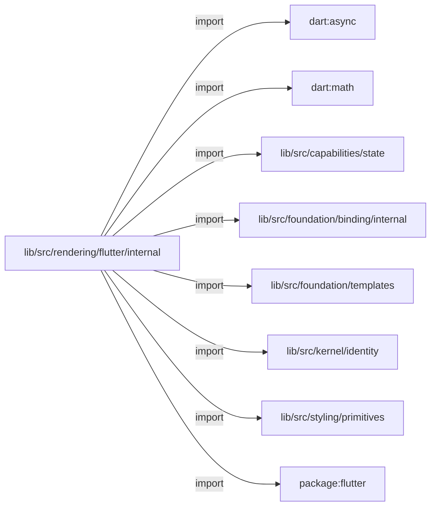
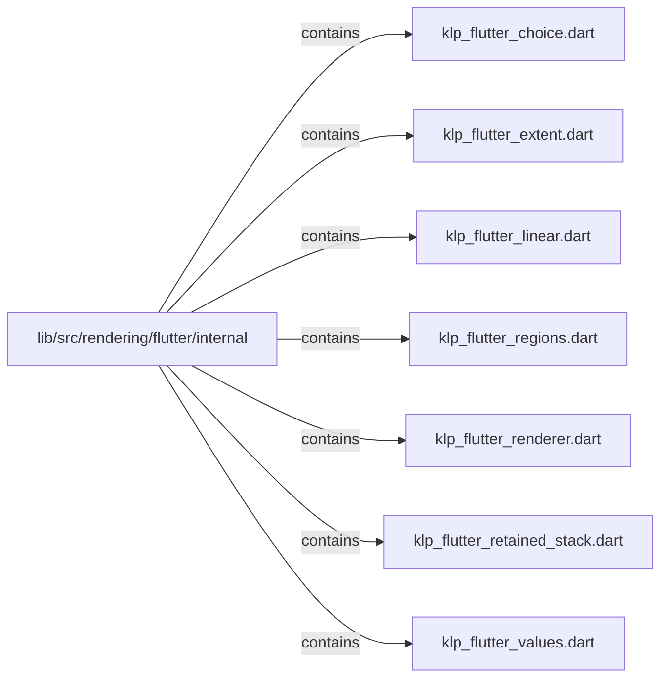

# lib/src/rendering/flutter/internal：架構分析入口

[上一層](../README.md)

## 範圍

閱讀 `lib/src/rendering/flutter/internal` 的直接子目錄與 Dart 檔案。結構圖表示實際檔案包含關係；依賴圖表示本層檔案明寫的 directives。每個檔案頁另列直接依賴、宣告、欄位、方法、建構子及行號證據。

## 本層直接依賴圖

箭頭以本層 Dart 檔案明寫的 directive 彙總到目標所在目錄或外部套件邊界；不遞迴將子目錄依賴算入本層。相同目標的不同 directive 類型分開計數。

| 目標邊界 | 關係 | directive 數 | 第一筆來源證據 |
|---|---|---|---|
| <code>dart:async</code> | import | 1 | [lib/src/rendering/flutter/internal/klp_flutter_choice.dart:1](../../../../../../lib/src/rendering/flutter/internal/klp_flutter_choice.dart#L1) |
| <code>dart:math</code> | import | 1 | [lib/src/rendering/flutter/internal/klp_flutter_extent.dart:1](../../../../../../lib/src/rendering/flutter/internal/klp_flutter_extent.dart#L1) |
| <code>lib/src/capabilities/state</code> | import | 1 | [lib/src/rendering/flutter/internal/klp_flutter_choice.dart:6](../../../../../../lib/src/rendering/flutter/internal/klp_flutter_choice.dart#L6) |
| <code>lib/src/foundation/binding/internal</code> | import | 7 | [lib/src/rendering/flutter/internal/klp_flutter_choice.dart:7](../../../../../../lib/src/rendering/flutter/internal/klp_flutter_choice.dart#L7) |
| <code>lib/src/foundation/templates</code> | import | 2 | [lib/src/rendering/flutter/internal/klp_flutter_extent.dart:6](../../../../../../lib/src/rendering/flutter/internal/klp_flutter_extent.dart#L6) |
| <code>lib/src/kernel/identity</code> | import | 1 | [lib/src/rendering/flutter/internal/klp_flutter_retained_stack.dart:4](../../../../../../lib/src/rendering/flutter/internal/klp_flutter_retained_stack.dart#L4) |
| <code>lib/src/styling/primitives</code> | import | 1 | [lib/src/rendering/flutter/internal/klp_flutter_values.dart:5](../../../../../../lib/src/rendering/flutter/internal/klp_flutter_values.dart#L5) |
| <code>package:flutter</code> | import | 8 | [lib/src/rendering/flutter/internal/klp_flutter_choice.dart:3](../../../../../../lib/src/rendering/flutter/internal/klp_flutter_choice.dart#L3) |

### 同目錄依賴

| 來源 → 目標 | 關係 | 證據 |
|---|---|---|
| <code>klp_flutter_choice.dart → klp_flutter_renderer.dart</code> | import | [lib/src/rendering/flutter/internal/klp_flutter_choice.dart:8](../../../../../../lib/src/rendering/flutter/internal/klp_flutter_choice.dart#L8) |
| <code>klp_flutter_choice.dart → klp_flutter_values.dart</code> | import | [lib/src/rendering/flutter/internal/klp_flutter_choice.dart:9](../../../../../../lib/src/rendering/flutter/internal/klp_flutter_choice.dart#L9) |
| <code>klp_flutter_extent.dart → klp_flutter_renderer.dart</code> | import | [lib/src/rendering/flutter/internal/klp_flutter_extent.dart:7](../../../../../../lib/src/rendering/flutter/internal/klp_flutter_extent.dart#L7) |
| <code>klp_flutter_linear.dart → klp_flutter_renderer.dart</code> | import | [lib/src/rendering/flutter/internal/klp_flutter_linear.dart:4](../../../../../../lib/src/rendering/flutter/internal/klp_flutter_linear.dart#L4) |
| <code>klp_flutter_linear.dart → klp_flutter_values.dart</code> | import | [lib/src/rendering/flutter/internal/klp_flutter_linear.dart:5](../../../../../../lib/src/rendering/flutter/internal/klp_flutter_linear.dart#L5) |
| <code>klp_flutter_regions.dart → klp_flutter_renderer.dart</code> | import | [lib/src/rendering/flutter/internal/klp_flutter_regions.dart:4](../../../../../../lib/src/rendering/flutter/internal/klp_flutter_regions.dart#L4) |
| <code>klp_flutter_regions.dart → klp_flutter_values.dart</code> | import | [lib/src/rendering/flutter/internal/klp_flutter_regions.dart:5](../../../../../../lib/src/rendering/flutter/internal/klp_flutter_regions.dart#L5) |
| <code>klp_flutter_renderer.dart → klp_flutter_choice.dart</code> | import | [lib/src/rendering/flutter/internal/klp_flutter_renderer.dart:4](../../../../../../lib/src/rendering/flutter/internal/klp_flutter_renderer.dart#L4) |
| <code>klp_flutter_renderer.dart → klp_flutter_extent.dart</code> | import | [lib/src/rendering/flutter/internal/klp_flutter_renderer.dart:5](../../../../../../lib/src/rendering/flutter/internal/klp_flutter_renderer.dart#L5) |
| <code>klp_flutter_renderer.dart → klp_flutter_linear.dart</code> | import | [lib/src/rendering/flutter/internal/klp_flutter_renderer.dart:6](../../../../../../lib/src/rendering/flutter/internal/klp_flutter_renderer.dart#L6) |
| <code>klp_flutter_renderer.dart → klp_flutter_regions.dart</code> | import | [lib/src/rendering/flutter/internal/klp_flutter_renderer.dart:7](../../../../../../lib/src/rendering/flutter/internal/klp_flutter_renderer.dart#L7) |
| <code>klp_flutter_renderer.dart → klp_flutter_retained_stack.dart</code> | import | [lib/src/rendering/flutter/internal/klp_flutter_renderer.dart:8](../../../../../../lib/src/rendering/flutter/internal/klp_flutter_renderer.dart#L8) |
| <code>klp_flutter_renderer.dart → klp_flutter_values.dart</code> | import | [lib/src/rendering/flutter/internal/klp_flutter_renderer.dart:9](../../../../../../lib/src/rendering/flutter/internal/klp_flutter_renderer.dart#L9) |
| <code>klp_flutter_retained_stack.dart → klp_flutter_renderer.dart</code> | import | [lib/src/rendering/flutter/internal/klp_flutter_retained_stack.dart:5](../../../../../../lib/src/rendering/flutter/internal/klp_flutter_retained_stack.dart#L5) |

## 目錄結構圖

## 子目錄

| 目錄 | 導航 | 來源證據 |
|---|---|---|
| 無 | 目前沒有下一層目錄 | — |

## 本層檔案

| 檔案 | 宣告 | 細節 | 來源證據 |
|---|---|---|---|
| `klp_flutter_choice.dart` | KlpFlutterChoice, _KlpFlutterChoiceState | [架構與 API](klp_flutter_choice.md) | [lib/src/rendering/flutter/internal/klp_flutter_choice.dart:1](../../../../../../lib/src/rendering/flutter/internal/klp_flutter_choice.dart#L1) |
| `klp_flutter_extent.dart` | KlpFlutterExtent | [架構與 API](klp_flutter_extent.md) | [lib/src/rendering/flutter/internal/klp_flutter_extent.dart:1](../../../../../../lib/src/rendering/flutter/internal/klp_flutter_extent.dart#L1) |
| `klp_flutter_linear.dart` | KlpFlutterLinear | [架構與 API](klp_flutter_linear.md) | [lib/src/rendering/flutter/internal/klp_flutter_linear.dart:1](../../../../../../lib/src/rendering/flutter/internal/klp_flutter_linear.dart#L1) |
| `klp_flutter_regions.dart` | KlpFlutterRegions | [架構與 API](klp_flutter_regions.md) | [lib/src/rendering/flutter/internal/klp_flutter_regions.dart:1](../../../../../../lib/src/rendering/flutter/internal/klp_flutter_regions.dart#L1) |
| `klp_flutter_renderer.dart` | KlpFlutterRenderer | [架構與 API](klp_flutter_renderer.md) | [lib/src/rendering/flutter/internal/klp_flutter_renderer.dart:1](../../../../../../lib/src/rendering/flutter/internal/klp_flutter_renderer.dart#L1) |
| `klp_flutter_retained_stack.dart` | KlpFlutterRetainedStack, _KlpFlutterRetainedStackState | [架構與 API](klp_flutter_retained_stack.md) | [lib/src/rendering/flutter/internal/klp_flutter_retained_stack.dart:1](../../../../../../lib/src/rendering/flutter/internal/klp_flutter_retained_stack.dart#L1) |
| `klp_flutter_values.dart` | klpFlutterColor, klpFlutterAxis, klpFlutterTextStyle | [架構與 API](klp_flutter_values.md) | [lib/src/rendering/flutter/internal/klp_flutter_values.dart:1](../../../../../../lib/src/rendering/flutter/internal/klp_flutter_values.dart#L1) |

## 閱讀說明

箭頭只表示來源明寫的靜態關係；import 不等於呼叫。未分析動態呼叫、欄位的實際物件擁有權、狀態轉移或渲染流程；型別未進行語意解析，繼承目標保留原始型別拼寫。public／private 依 Dart 名稱前綴判斷；public 宣告不代表已由 `lib/kallopis.dart` 匯出。

本頁的目錄與檔案由來源清冊產生；`manifest.json` 位於本圖集根目錄，可核對 SHA-256 與覆蓋數。人工模組摘要存於 `tool/architecture_atlas/briefs/`，重新生成時保留。
