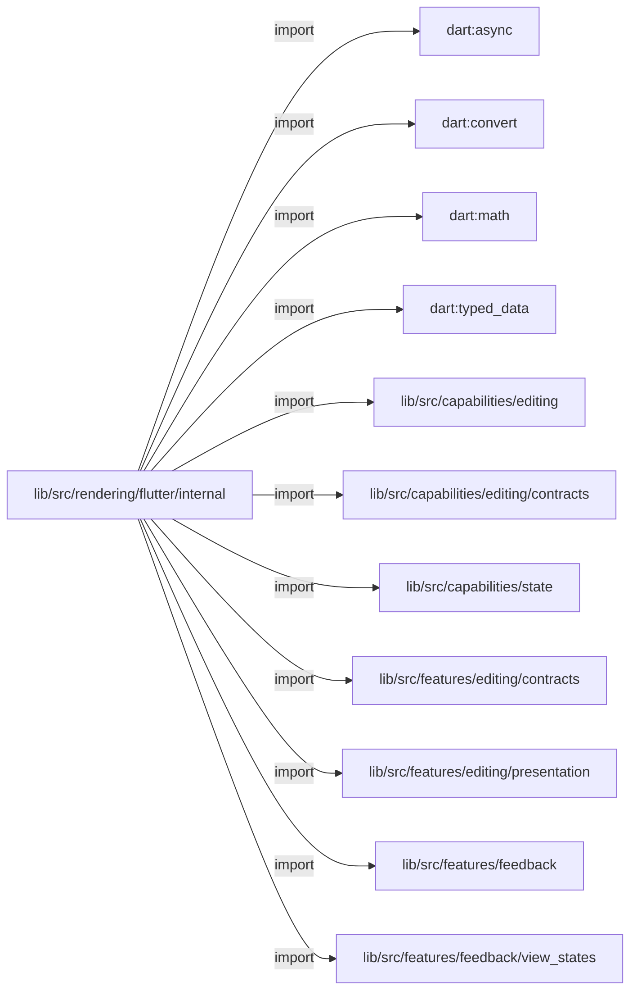
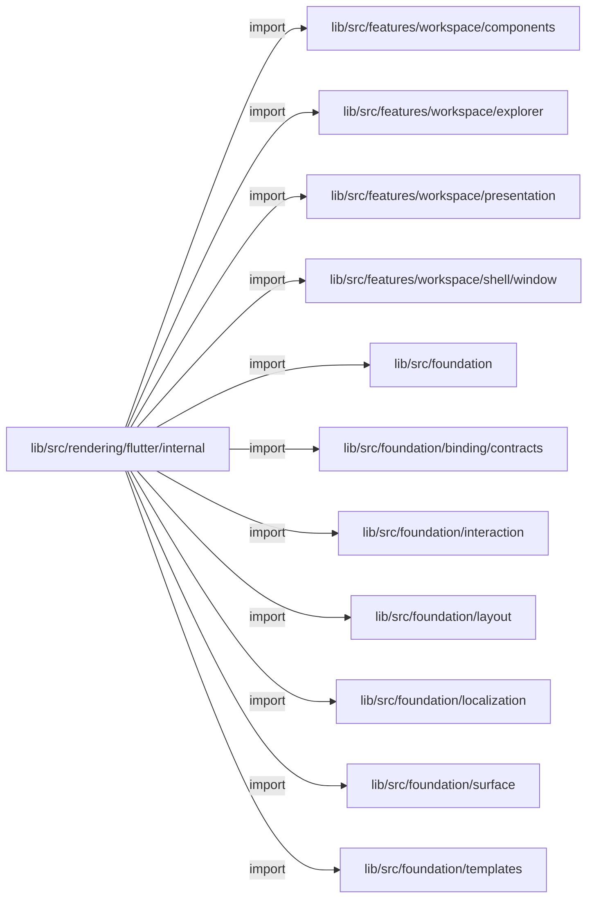
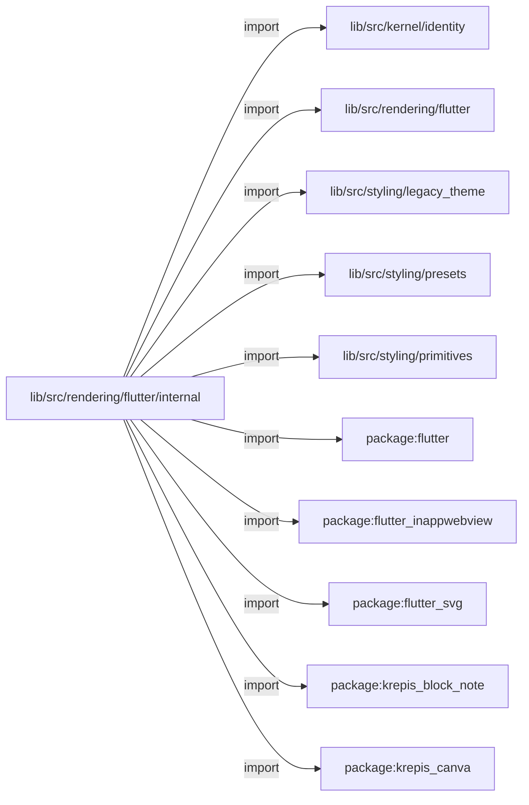
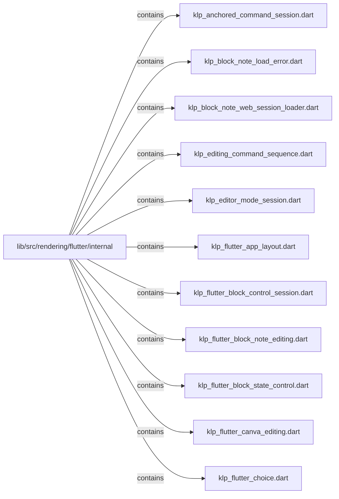
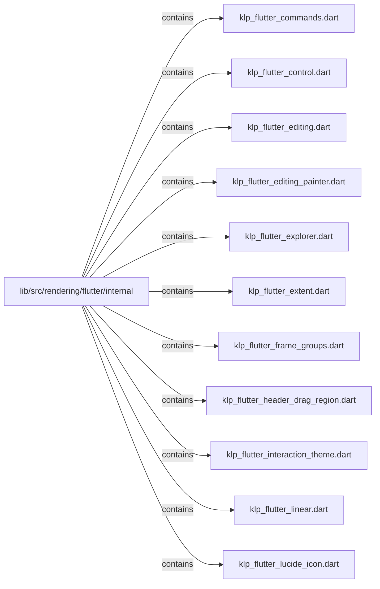
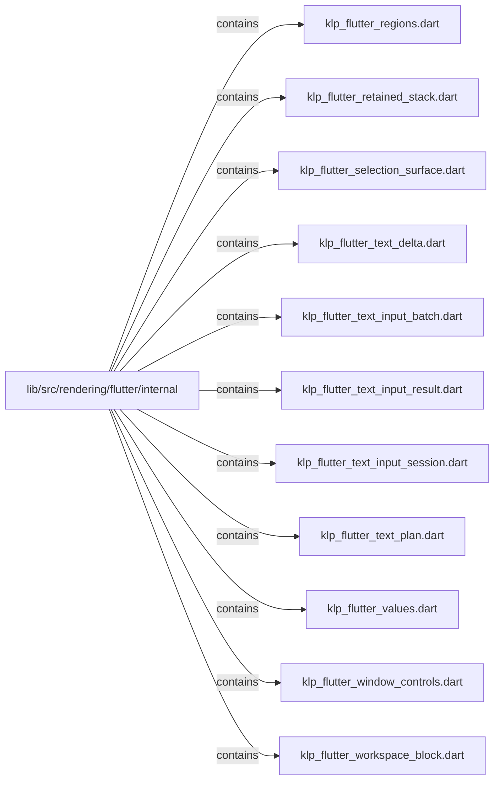
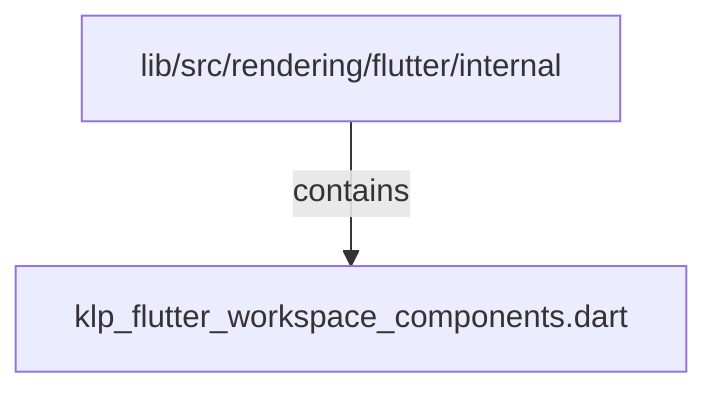

# lib/src/rendering/flutter/internal：架構分析入口

[上一層](../README.md)

## 範圍

閱讀 `lib/src/rendering/flutter/internal` 的直接子目錄與 Dart 檔案。結構圖表示實際檔案包含關係；依賴圖表示本層檔案明寫的 directives。每個檔案頁另列直接依賴、宣告、欄位、方法、建構子及行號證據。

## 本層直接依賴圖

箭頭以本層 Dart 檔案明寫的 directive 彙總到目標所在目錄或外部套件邊界；不遞迴將子目錄依賴算入本層。相同目標的不同 directive 類型分開計數。

| 目標邊界 | 關係 | directive 數 | 第一筆來源證據 |
|---|---|---|---|
| <code>dart:async</code> | import | 9 | [lib/src/rendering/flutter/internal/klp_block_note_web_session_loader.dart:1](../../../../../../lib/src/rendering/flutter/internal/klp_block_note_web_session_loader.dart#L1) |
| <code>dart:convert</code> | import | 2 | [lib/src/rendering/flutter/internal/klp_flutter_block_note_editing.dart:5](../../../../../../lib/src/rendering/flutter/internal/klp_flutter_block_note_editing.dart#L5) |
| <code>dart:math</code> | import | 3 | [lib/src/rendering/flutter/internal/klp_flutter_control.dart:1](../../../../../../lib/src/rendering/flutter/internal/klp_flutter_control.dart#L1) |
| <code>dart:typed_data</code> | import | 1 | [lib/src/rendering/flutter/internal/klp_flutter_editing_painter.dart:1](../../../../../../lib/src/rendering/flutter/internal/klp_flutter_editing_painter.dart#L1) |
| <code>lib/src/capabilities/editing</code> | import | 3 | [lib/src/rendering/flutter/internal/klp_flutter_block_control_session.dart:3](../../../../../../lib/src/rendering/flutter/internal/klp_flutter_block_control_session.dart#L3) |
| <code>lib/src/capabilities/editing/contracts</code> | import | 52 | [lib/src/rendering/flutter/internal/klp_anchored_command_session.dart:2](../../../../../../lib/src/rendering/flutter/internal/klp_anchored_command_session.dart#L2) |
| <code>lib/src/capabilities/state</code> | import | 2 | [lib/src/rendering/flutter/internal/klp_flutter_choice.dart:6](../../../../../../lib/src/rendering/flutter/internal/klp_flutter_choice.dart#L6) |
| <code>lib/src/features/editing/contracts</code> | import | 3 | [lib/src/rendering/flutter/internal/klp_flutter_block_note_editing.dart:3](../../../../../../lib/src/rendering/flutter/internal/klp_flutter_block_note_editing.dart#L3) |
| <code>lib/src/features/editing/presentation</code> | import | 8 | [lib/src/rendering/flutter/internal/klp_anchored_command_session.dart:1](../../../../../../lib/src/rendering/flutter/internal/klp_anchored_command_session.dart#L1) |
| <code>lib/src/features/feedback</code> | import | 2 | [lib/src/rendering/flutter/internal/klp_block_note_load_error.dart:3](../../../../../../lib/src/rendering/flutter/internal/klp_block_note_load_error.dart#L3) |
| <code>lib/src/features/feedback/view_states</code> | import | 2 | [lib/src/rendering/flutter/internal/klp_block_note_load_error.dart:5](../../../../../../lib/src/rendering/flutter/internal/klp_block_note_load_error.dart#L5) |
| <code>lib/src/features/workspace/components</code> | import | 1 | [lib/src/rendering/flutter/internal/klp_flutter_commands.dart:2](../../../../../../lib/src/rendering/flutter/internal/klp_flutter_commands.dart#L2) |
| <code>lib/src/features/workspace/explorer</code> | import | 2 | [lib/src/rendering/flutter/internal/klp_flutter_explorer.dart:5](../../../../../../lib/src/rendering/flutter/internal/klp_flutter_explorer.dart#L5) |
| <code>lib/src/features/workspace/presentation</code> | import | 6 | [lib/src/rendering/flutter/internal/klp_flutter_app_layout.dart:1](../../../../../../lib/src/rendering/flutter/internal/klp_flutter_app_layout.dart#L1) |
| <code>lib/src/features/workspace/shell/window</code> | import | 4 | [lib/src/rendering/flutter/internal/klp_flutter_window_controls.dart:2](../../../../../../lib/src/rendering/flutter/internal/klp_flutter_window_controls.dart#L2) |
| <code>lib/src/foundation</code> | import | 6 | [lib/src/rendering/flutter/internal/klp_flutter_block_state_control.dart:4](../../../../../../lib/src/rendering/flutter/internal/klp_flutter_block_state_control.dart#L4) |
| <code>lib/src/foundation/binding/contracts</code> | import | 13 | [lib/src/rendering/flutter/internal/klp_flutter_app_layout.dart:6](../../../../../../lib/src/rendering/flutter/internal/klp_flutter_app_layout.dart#L6) |
| <code>lib/src/foundation/interaction</code> | import | 1 | [lib/src/rendering/flutter/internal/klp_anchored_command_session.dart:7](../../../../../../lib/src/rendering/flutter/internal/klp_anchored_command_session.dart#L7) |
| <code>lib/src/foundation/layout</code> | import | 1 | [lib/src/rendering/flutter/internal/klp_block_note_load_error.dart:6](../../../../../../lib/src/rendering/flutter/internal/klp_block_note_load_error.dart#L6) |
| <code>lib/src/foundation/localization</code> | import | 3 | [lib/src/rendering/flutter/internal/klp_block_note_load_error.dart:1](../../../../../../lib/src/rendering/flutter/internal/klp_block_note_load_error.dart#L1) |
| <code>lib/src/foundation/surface</code> | import | 1 | [lib/src/rendering/flutter/internal/klp_block_note_load_error.dart:7](../../../../../../lib/src/rendering/flutter/internal/klp_block_note_load_error.dart#L7) |
| <code>lib/src/foundation/templates</code> | import | 2 | [lib/src/rendering/flutter/internal/klp_flutter_extent.dart:6](../../../../../../lib/src/rendering/flutter/internal/klp_flutter_extent.dart#L6) |
| <code>lib/src/kernel/identity</code> | import | 2 | [lib/src/rendering/flutter/internal/klp_flutter_explorer.dart:8](../../../../../../lib/src/rendering/flutter/internal/klp_flutter_explorer.dart#L8) |
| <code>lib/src/rendering/flutter</code> | import | 10 | [lib/src/rendering/flutter/internal/klp_flutter_app_layout.dart:7](../../../../../../lib/src/rendering/flutter/internal/klp_flutter_app_layout.dart#L7) |
| <code>lib/src/styling/legacy_theme</code> | import | 1 | [lib/src/rendering/flutter/internal/klp_flutter_window_controls.dart:7](../../../../../../lib/src/rendering/flutter/internal/klp_flutter_window_controls.dart#L7) |
| <code>lib/src/styling/presets</code> | import | 1 | [lib/src/rendering/flutter/internal/klp_flutter_app_layout.dart:3](../../../../../../lib/src/rendering/flutter/internal/klp_flutter_app_layout.dart#L3) |
| <code>lib/src/styling/primitives</code> | import | 3 | [lib/src/rendering/flutter/internal/klp_flutter_values.dart:5](../../../../../../lib/src/rendering/flutter/internal/klp_flutter_values.dart#L5) |
| <code>package:flutter</code> | import | 39 | [lib/src/rendering/flutter/internal/klp_block_note_load_error.dart:2](../../../../../../lib/src/rendering/flutter/internal/klp_block_note_load_error.dart#L2) |
| <code>package:flutter_inappwebview</code> | import | 2 | [lib/src/rendering/flutter/internal/klp_flutter_block_note_editing.dart:8](../../../../../../lib/src/rendering/flutter/internal/klp_flutter_block_note_editing.dart#L8) |
| <code>package:flutter_svg</code> | import | 1 | [lib/src/rendering/flutter/internal/klp_flutter_lucide_icon.dart:2](../../../../../../lib/src/rendering/flutter/internal/klp_flutter_lucide_icon.dart#L2) |
| <code>package:krepis_block_note</code> | import | 1 | [lib/src/rendering/flutter/internal/klp_flutter_block_note_editing.dart:9](../../../../../../lib/src/rendering/flutter/internal/klp_flutter_block_note_editing.dart#L9) |
| <code>package:krepis_canva</code> | import | 1 | [lib/src/rendering/flutter/internal/klp_flutter_canva_editing.dart:8](../../../../../../lib/src/rendering/flutter/internal/klp_flutter_canva_editing.dart#L8) |

### 同目錄依賴

| 來源 → 目標 | 關係 | 證據 |
|---|---|---|
| <code>klp_block_note_load_error.dart → klp_block_note_web_session_loader.dart</code> | import | [lib/src/rendering/flutter/internal/klp_block_note_load_error.dart:9](../../../../../../lib/src/rendering/flutter/internal/klp_block_note_load_error.dart#L9) |
| <code>klp_flutter_app_layout.dart → klp_flutter_header_drag_region.dart</code> | import | [lib/src/rendering/flutter/internal/klp_flutter_app_layout.dart:4](../../../../../../lib/src/rendering/flutter/internal/klp_flutter_app_layout.dart#L4) |
| <code>klp_flutter_app_layout.dart → klp_flutter_values.dart</code> | import | [lib/src/rendering/flutter/internal/klp_flutter_app_layout.dart:8](../../../../../../lib/src/rendering/flutter/internal/klp_flutter_app_layout.dart#L8) |
| <code>klp_flutter_block_control_session.dart → klp_editing_command_sequence.dart</code> | import | [lib/src/rendering/flutter/internal/klp_flutter_block_control_session.dart:11](../../../../../../lib/src/rendering/flutter/internal/klp_flutter_block_control_session.dart#L11) |
| <code>klp_flutter_block_note_editing.dart → klp_block_note_load_error.dart</code> | import | [lib/src/rendering/flutter/internal/klp_flutter_block_note_editing.dart:12](../../../../../../lib/src/rendering/flutter/internal/klp_flutter_block_note_editing.dart#L12) |
| <code>klp_flutter_block_note_editing.dart → klp_block_note_web_session_loader.dart</code> | import | [lib/src/rendering/flutter/internal/klp_flutter_block_note_editing.dart:13](../../../../../../lib/src/rendering/flutter/internal/klp_flutter_block_note_editing.dart#L13) |
| <code>klp_flutter_block_state_control.dart → klp_flutter_values.dart</code> | import | [lib/src/rendering/flutter/internal/klp_flutter_block_state_control.dart:6](../../../../../../lib/src/rendering/flutter/internal/klp_flutter_block_state_control.dart#L6) |
| <code>klp_flutter_block_state_control.dart → klp_flutter_selection_surface.dart</code> | import | [lib/src/rendering/flutter/internal/klp_flutter_block_state_control.dart:7](../../../../../../lib/src/rendering/flutter/internal/klp_flutter_block_state_control.dart#L7) |
| <code>klp_flutter_choice.dart → klp_flutter_values.dart</code> | import | [lib/src/rendering/flutter/internal/klp_flutter_choice.dart:9](../../../../../../lib/src/rendering/flutter/internal/klp_flutter_choice.dart#L9) |
| <code>klp_flutter_choice.dart → klp_flutter_selection_surface.dart</code> | import | [lib/src/rendering/flutter/internal/klp_flutter_choice.dart:10](../../../../../../lib/src/rendering/flutter/internal/klp_flutter_choice.dart#L10) |
| <code>klp_flutter_control.dart → klp_flutter_values.dart</code> | import | [lib/src/rendering/flutter/internal/klp_flutter_control.dart:7](../../../../../../lib/src/rendering/flutter/internal/klp_flutter_control.dart#L7) |
| <code>klp_flutter_control.dart → klp_flutter_selection_surface.dart</code> | import | [lib/src/rendering/flutter/internal/klp_flutter_control.dart:8](../../../../../../lib/src/rendering/flutter/internal/klp_flutter_control.dart#L8) |
| <code>klp_flutter_editing.dart → klp_flutter_control.dart</code> | import | [lib/src/rendering/flutter/internal/klp_flutter_editing.dart:32](../../../../../../lib/src/rendering/flutter/internal/klp_flutter_editing.dart#L32) |
| <code>klp_flutter_editing.dart → klp_flutter_block_state_control.dart</code> | import | [lib/src/rendering/flutter/internal/klp_flutter_editing.dart:33](../../../../../../lib/src/rendering/flutter/internal/klp_flutter_editing.dart#L33) |
| <code>klp_flutter_editing.dart → klp_flutter_values.dart</code> | import | [lib/src/rendering/flutter/internal/klp_flutter_editing.dart:34](../../../../../../lib/src/rendering/flutter/internal/klp_flutter_editing.dart#L34) |
| <code>klp_flutter_editing.dart → klp_flutter_editing_painter.dart</code> | import | [lib/src/rendering/flutter/internal/klp_flutter_editing.dart:35](../../../../../../lib/src/rendering/flutter/internal/klp_flutter_editing.dart#L35) |
| <code>klp_flutter_editing.dart → klp_flutter_text_input_batch.dart</code> | import | [lib/src/rendering/flutter/internal/klp_flutter_editing.dart:36](../../../../../../lib/src/rendering/flutter/internal/klp_flutter_editing.dart#L36) |
| <code>klp_flutter_editing.dart → klp_flutter_text_input_session.dart</code> | import | [lib/src/rendering/flutter/internal/klp_flutter_editing.dart:37](../../../../../../lib/src/rendering/flutter/internal/klp_flutter_editing.dart#L37) |
| <code>klp_flutter_editing.dart → klp_editing_command_sequence.dart</code> | import | [lib/src/rendering/flutter/internal/klp_flutter_editing.dart:38](../../../../../../lib/src/rendering/flutter/internal/klp_flutter_editing.dart#L38) |
| <code>klp_flutter_editing.dart → klp_flutter_block_control_session.dart</code> | import | [lib/src/rendering/flutter/internal/klp_flutter_editing.dart:39](../../../../../../lib/src/rendering/flutter/internal/klp_flutter_editing.dart#L39) |
| <code>klp_flutter_editing.dart → klp_anchored_command_session.dart</code> | import | [lib/src/rendering/flutter/internal/klp_flutter_editing.dart:40](../../../../../../lib/src/rendering/flutter/internal/klp_flutter_editing.dart#L40) |
| <code>klp_flutter_editing.dart → klp_editor_mode_session.dart</code> | import | [lib/src/rendering/flutter/internal/klp_flutter_editing.dart:41](../../../../../../lib/src/rendering/flutter/internal/klp_flutter_editing.dart#L41) |
| <code>klp_flutter_editing_painter.dart → klp_flutter_values.dart</code> | import | [lib/src/rendering/flutter/internal/klp_flutter_editing_painter.dart:8](../../../../../../lib/src/rendering/flutter/internal/klp_flutter_editing_painter.dart#L8) |
| <code>klp_flutter_explorer.dart → klp_flutter_commands.dart</code> | import | [lib/src/rendering/flutter/internal/klp_flutter_explorer.dart:9](../../../../../../lib/src/rendering/flutter/internal/klp_flutter_explorer.dart#L9) |
| <code>klp_flutter_explorer.dart → klp_flutter_lucide_icon.dart</code> | import | [lib/src/rendering/flutter/internal/klp_flutter_explorer.dart:10](../../../../../../lib/src/rendering/flutter/internal/klp_flutter_explorer.dart#L10) |
| <code>klp_flutter_explorer.dart → klp_flutter_selection_surface.dart</code> | import | [lib/src/rendering/flutter/internal/klp_flutter_explorer.dart:11](../../../../../../lib/src/rendering/flutter/internal/klp_flutter_explorer.dart#L11) |
| <code>klp_flutter_explorer.dart → klp_flutter_values.dart</code> | import | [lib/src/rendering/flutter/internal/klp_flutter_explorer.dart:12](../../../../../../lib/src/rendering/flutter/internal/klp_flutter_explorer.dart#L12) |
| <code>klp_flutter_frame_groups.dart → klp_flutter_values.dart</code> | import | [lib/src/rendering/flutter/internal/klp_flutter_frame_groups.dart:8](../../../../../../lib/src/rendering/flutter/internal/klp_flutter_frame_groups.dart#L8) |
| <code>klp_flutter_linear.dart → klp_flutter_values.dart</code> | import | [lib/src/rendering/flutter/internal/klp_flutter_linear.dart:5](../../../../../../lib/src/rendering/flutter/internal/klp_flutter_linear.dart#L5) |
| <code>klp_flutter_regions.dart → klp_flutter_values.dart</code> | import | [lib/src/rendering/flutter/internal/klp_flutter_regions.dart:5](../../../../../../lib/src/rendering/flutter/internal/klp_flutter_regions.dart#L5) |
| <code>klp_flutter_text_input_batch.dart → klp_flutter_text_delta.dart</code> | import | [lib/src/rendering/flutter/internal/klp_flutter_text_input_batch.dart:3](../../../../../../lib/src/rendering/flutter/internal/klp_flutter_text_input_batch.dart#L3) |
| <code>klp_flutter_text_input_batch.dart → klp_flutter_text_input_result.dart</code> | import | [lib/src/rendering/flutter/internal/klp_flutter_text_input_batch.dart:4](../../../../../../lib/src/rendering/flutter/internal/klp_flutter_text_input_batch.dart#L4) |
| <code>klp_flutter_text_input_batch.dart → klp_flutter_text_input_session.dart</code> | import | [lib/src/rendering/flutter/internal/klp_flutter_text_input_batch.dart:5](../../../../../../lib/src/rendering/flutter/internal/klp_flutter_text_input_batch.dart#L5) |
| <code>klp_flutter_text_input_batch.dart → klp_flutter_text_plan.dart</code> | import | [lib/src/rendering/flutter/internal/klp_flutter_text_input_batch.dart:6](../../../../../../lib/src/rendering/flutter/internal/klp_flutter_text_input_batch.dart#L6) |
| <code>klp_flutter_text_input_session.dart → klp_flutter_text_input_result.dart</code> | import | [lib/src/rendering/flutter/internal/klp_flutter_text_input_session.dart:9](../../../../../../lib/src/rendering/flutter/internal/klp_flutter_text_input_session.dart#L9) |
| <code>klp_flutter_text_input_session.dart → klp_flutter_text_plan.dart</code> | import | [lib/src/rendering/flutter/internal/klp_flutter_text_input_session.dart:10](../../../../../../lib/src/rendering/flutter/internal/klp_flutter_text_input_session.dart#L10) |
| <code>klp_flutter_text_input_session.dart → klp_editing_command_sequence.dart</code> | import | [lib/src/rendering/flutter/internal/klp_flutter_text_input_session.dart:11](../../../../../../lib/src/rendering/flutter/internal/klp_flutter_text_input_session.dart#L11) |
| <code>klp_flutter_text_plan.dart → klp_flutter_text_delta.dart</code> | import | [lib/src/rendering/flutter/internal/klp_flutter_text_plan.dart:4](../../../../../../lib/src/rendering/flutter/internal/klp_flutter_text_plan.dart#L4) |
| <code>klp_flutter_window_controls.dart → klp_flutter_values.dart</code> | import | [lib/src/rendering/flutter/internal/klp_flutter_window_controls.dart:8](../../../../../../lib/src/rendering/flutter/internal/klp_flutter_window_controls.dart#L8) |
| <code>klp_flutter_workspace_block.dart → klp_flutter_commands.dart</code> | import | [lib/src/rendering/flutter/internal/klp_flutter_workspace_block.dart:2](../../../../../../lib/src/rendering/flutter/internal/klp_flutter_workspace_block.dart#L2) |
| <code>klp_flutter_workspace_block.dart → klp_flutter_lucide_icon.dart</code> | import | [lib/src/rendering/flutter/internal/klp_flutter_workspace_block.dart:8](../../../../../../lib/src/rendering/flutter/internal/klp_flutter_workspace_block.dart#L8) |
| <code>klp_flutter_workspace_block.dart → klp_flutter_values.dart</code> | import | [lib/src/rendering/flutter/internal/klp_flutter_workspace_block.dart:9](../../../../../../lib/src/rendering/flutter/internal/klp_flutter_workspace_block.dart#L9) |
| <code>klp_flutter_workspace_block.dart → klp_flutter_selection_surface.dart</code> | import | [lib/src/rendering/flutter/internal/klp_flutter_workspace_block.dart:10](../../../../../../lib/src/rendering/flutter/internal/klp_flutter_workspace_block.dart#L10) |
| <code>klp_flutter_workspace_block.dart → klp_flutter_interaction_theme.dart</code> | import | [lib/src/rendering/flutter/internal/klp_flutter_workspace_block.dart:11](../../../../../../lib/src/rendering/flutter/internal/klp_flutter_workspace_block.dart#L11) |
| <code>klp_flutter_workspace_components.dart → klp_flutter_lucide_icon.dart</code> | import | [lib/src/rendering/flutter/internal/klp_flutter_workspace_components.dart:7](../../../../../../lib/src/rendering/flutter/internal/klp_flutter_workspace_components.dart#L7) |
| <code>klp_flutter_workspace_components.dart → klp_flutter_values.dart</code> | import | [lib/src/rendering/flutter/internal/klp_flutter_workspace_components.dart:8](../../../../../../lib/src/rendering/flutter/internal/klp_flutter_workspace_components.dart#L8) |
| <code>klp_flutter_workspace_components.dart → klp_flutter_selection_surface.dart</code> | import | [lib/src/rendering/flutter/internal/klp_flutter_workspace_components.dart:9](../../../../../../lib/src/rendering/flutter/internal/klp_flutter_workspace_components.dart#L9) |

## 目錄結構圖

## 子目錄

| 目錄 | 導航 | 來源證據 |
|---|---|---|
| 無 | 目前沒有下一層目錄 | — |

## 本層檔案

| 檔案 | 宣告 | 細節 | 來源證據 |
|---|---|---|---|
| `klp_anchored_command_session.dart` | KlpAnchoredCommandSession, _sameTarget | [架構與 API](klp_anchored_command_session.md) | [lib/src/rendering/flutter/internal/klp_anchored_command_session.dart:1](../../../../../../lib/src/rendering/flutter/internal/klp_anchored_command_session.dart#L1) |
| `klp_block_note_load_error.dart` | KlpBlockNoteLoadError, KlpBlockNoteLoadSurface | [架構與 API](klp_block_note_load_error.md) | [lib/src/rendering/flutter/internal/klp_block_note_load_error.dart:1](../../../../../../lib/src/rendering/flutter/internal/klp_block_note_load_error.dart#L1) |
| `klp_block_note_web_session_loader.dart` | KlpBlockNoteWebSessionLoader | [架構與 API](klp_block_note_web_session_loader.md) | [lib/src/rendering/flutter/internal/klp_block_note_web_session_loader.dart:1](../../../../../../lib/src/rendering/flutter/internal/klp_block_note_web_session_loader.dart#L1) |
| `klp_editing_command_sequence.dart` | KlpEditingCommandSequence | [架構與 API](klp_editing_command_sequence.md) | [lib/src/rendering/flutter/internal/klp_editing_command_sequence.dart:1](../../../../../../lib/src/rendering/flutter/internal/klp_editing_command_sequence.dart#L1) |
| `klp_editor_mode_session.dart` | klpCanRouteEditorViewport, KlpEditorModeSession | [架構與 API](klp_editor_mode_session.md) | [lib/src/rendering/flutter/internal/klp_editor_mode_session.dart:1](../../../../../../lib/src/rendering/flutter/internal/klp_editor_mode_session.dart#L1) |
| `klp_flutter_app_layout.dart` | KlpFlutterAppLayout, _FloatingWorkspace, _FloatingWorkspaceState, _FloatingPosition | [架構與 API](klp_flutter_app_layout.md) | [lib/src/rendering/flutter/internal/klp_flutter_app_layout.dart:1](../../../../../../lib/src/rendering/flutter/internal/klp_flutter_app_layout.dart#L1) |
| `klp_flutter_block_control_session.dart` | KlpFlutterBlockControlSession, _DropStart | [架構與 API](klp_flutter_block_control_session.md) | [lib/src/rendering/flutter/internal/klp_flutter_block_control_session.dart:1](../../../../../../lib/src/rendering/flutter/internal/klp_flutter_block_control_session.dart#L1) |
| `klp_flutter_block_note_editing.dart` | KlpFlutterBlockNoteEditing, _KlpFlutterBlockNoteEditingState | [架構與 API](klp_flutter_block_note_editing.md) | [lib/src/rendering/flutter/internal/klp_flutter_block_note_editing.dart:1](../../../../../../lib/src/rendering/flutter/internal/klp_flutter_block_note_editing.dart#L1) |
| `klp_flutter_block_state_control.dart` | KlpFlutterBlockStateKind, KlpFlutterBlockStateControl, _KlpFlutterBlockStateControlState | [架構與 API](klp_flutter_block_state_control.md) | [lib/src/rendering/flutter/internal/klp_flutter_block_state_control.dart:1](../../../../../../lib/src/rendering/flutter/internal/klp_flutter_block_state_control.dart#L1) |
| `klp_flutter_canva_editing.dart` | KlpFlutterCanvaEditing, _KlpFlutterCanvaEditingState | [架構與 API](klp_flutter_canva_editing.md) | [lib/src/rendering/flutter/internal/klp_flutter_canva_editing.dart:1](../../../../../../lib/src/rendering/flutter/internal/klp_flutter_canva_editing.dart#L1) |
| `klp_flutter_choice.dart` | KlpFlutterChoice, _KlpFlutterChoiceState | [架構與 API](klp_flutter_choice.md) | [lib/src/rendering/flutter/internal/klp_flutter_choice.dart:1](../../../../../../lib/src/rendering/flutter/internal/klp_flutter_choice.dart#L1) |
| `klp_flutter_commands.dart` | KlpFlutterCommandStyle, showKlpCommandMenu, runKlpCommand, _CommandInputDialog, _CommandInputDialogState | [架構與 API](klp_flutter_commands.md) | [lib/src/rendering/flutter/internal/klp_flutter_commands.dart:1](../../../../../../lib/src/rendering/flutter/internal/klp_flutter_commands.dart#L1) |
| `klp_flutter_control.dart` | KlpFlutterControl, _ControlState | [架構與 API](klp_flutter_control.md) | [lib/src/rendering/flutter/internal/klp_flutter_control.dart:1](../../../../../../lib/src/rendering/flutter/internal/klp_flutter_control.dart#L1) |
| `klp_flutter_editing.dart` | KlpFlutterEditing, _KlpFlutterEditingState, _KlpControlAction, _KlpAnchoredMenuLayout, _KlpEditingGeometryReporter, _KlpEditingGeometryRender | [架構與 API](klp_flutter_editing.md) | [lib/src/rendering/flutter/internal/klp_flutter_editing.dart:1](../../../../../../lib/src/rendering/flutter/internal/klp_flutter_editing.dart#L1) |
| `klp_flutter_editing_painter.dart` | KlpFlutterEditingPainter | [架構與 API](klp_flutter_editing_painter.md) | [lib/src/rendering/flutter/internal/klp_flutter_editing_painter.dart:1](../../../../../../lib/src/rendering/flutter/internal/klp_flutter_editing_painter.dart#L1) |
| `klp_flutter_explorer.dart` | KlpFlutterExplorer, _KlpFlutterExplorerState | [架構與 API](klp_flutter_explorer.md) | [lib/src/rendering/flutter/internal/klp_flutter_explorer.dart:1](../../../../../../lib/src/rendering/flutter/internal/klp_flutter_explorer.dart#L1) |
| `klp_flutter_extent.dart` | KlpFlutterExtent | [架構與 API](klp_flutter_extent.md) | [lib/src/rendering/flutter/internal/klp_flutter_extent.dart:1](../../../../../../lib/src/rendering/flutter/internal/klp_flutter_extent.dart#L1) |
| `klp_flutter_frame_groups.dart` | KlpFlutterFrameGroups, KlpFlutterFrameGroup, _FrameGroupDivider, _DashedDividerPainter | [架構與 API](klp_flutter_frame_groups.md) | [lib/src/rendering/flutter/internal/klp_flutter_frame_groups.dart:1](../../../../../../lib/src/rendering/flutter/internal/klp_flutter_frame_groups.dart#L1) |
| `klp_flutter_header_drag_region.dart` | KlpFlutterHeaderDragRegion | [架構與 API](klp_flutter_header_drag_region.md) | [lib/src/rendering/flutter/internal/klp_flutter_header_drag_region.dart:1](../../../../../../lib/src/rendering/flutter/internal/klp_flutter_header_drag_region.dart#L1) |
| `klp_flutter_interaction_theme.dart` | KlpFlutterInteractionTheme | [架構與 API](klp_flutter_interaction_theme.md) | [lib/src/rendering/flutter/internal/klp_flutter_interaction_theme.dart:1](../../../../../../lib/src/rendering/flutter/internal/klp_flutter_interaction_theme.dart#L1) |
| `klp_flutter_linear.dart` | KlpFlutterLinear | [架構與 API](klp_flutter_linear.md) | [lib/src/rendering/flutter/internal/klp_flutter_linear.dart:1](../../../../../../lib/src/rendering/flutter/internal/klp_flutter_linear.dart#L1) |
| `klp_flutter_lucide_icon.dart` | KlpFlutterLucideIcon | [架構與 API](klp_flutter_lucide_icon.md) | [lib/src/rendering/flutter/internal/klp_flutter_lucide_icon.dart:1](../../../../../../lib/src/rendering/flutter/internal/klp_flutter_lucide_icon.dart#L1) |
| `klp_flutter_regions.dart` | KlpFlutterRegions | [架構與 API](klp_flutter_regions.md) | [lib/src/rendering/flutter/internal/klp_flutter_regions.dart:1](../../../../../../lib/src/rendering/flutter/internal/klp_flutter_regions.dart#L1) |
| `klp_flutter_retained_stack.dart` | KlpFlutterRetainedStack, _KlpFlutterRetainedStackState | [架構與 API](klp_flutter_retained_stack.md) | [lib/src/rendering/flutter/internal/klp_flutter_retained_stack.dart:1](../../../../../../lib/src/rendering/flutter/internal/klp_flutter_retained_stack.dart#L1) |
| `klp_flutter_selection_surface.dart` | KlpFlutterSelectionSurface, _SelectionSurfaceState | [架構與 API](klp_flutter_selection_surface.md) | [lib/src/rendering/flutter/internal/klp_flutter_selection_surface.dart:1](../../../../../../lib/src/rendering/flutter/internal/klp_flutter_selection_surface.dart#L1) |
| `klp_flutter_text_delta.dart` | KlpInputReplacement, KlpFlutterTextDelta | [架構與 API](klp_flutter_text_delta.md) | [lib/src/rendering/flutter/internal/klp_flutter_text_delta.dart:1](../../../../../../lib/src/rendering/flutter/internal/klp_flutter_text_delta.dart#L1) |
| `klp_flutter_text_input_batch.dart` | KlpFlutterTextInputBatch | [架構與 API](klp_flutter_text_input_batch.md) | [lib/src/rendering/flutter/internal/klp_flutter_text_input_batch.dart:1](../../../../../../lib/src/rendering/flutter/internal/klp_flutter_text_input_batch.dart#L1) |
| `klp_flutter_text_input_result.dart` | KlpFlutterTextInputResult | [架構與 API](klp_flutter_text_input_result.md) | [lib/src/rendering/flutter/internal/klp_flutter_text_input_result.dart:1](../../../../../../lib/src/rendering/flutter/internal/klp_flutter_text_input_result.dart#L1) |
| `klp_flutter_text_input_session.dart` | KlpFlutterTextInputSession | [架構與 API](klp_flutter_text_input_session.md) | [lib/src/rendering/flutter/internal/klp_flutter_text_input_session.dart:1](../../../../../../lib/src/rendering/flutter/internal/klp_flutter_text_input_session.dart#L1) |
| `klp_flutter_text_plan.dart` | KlpCompositionResolution, KlpFlutterTextPlan | [架構與 API](klp_flutter_text_plan.md) | [lib/src/rendering/flutter/internal/klp_flutter_text_plan.dart:1](../../../../../../lib/src/rendering/flutter/internal/klp_flutter_text_plan.dart#L1) |
| `klp_flutter_values.dart` | klpFlutterColor, klpFlutterAxis, klpFlutterTextStyle | [架構與 API](klp_flutter_values.md) | [lib/src/rendering/flutter/internal/klp_flutter_values.dart:1](../../../../../../lib/src/rendering/flutter/internal/klp_flutter_values.dart#L1) |
| `klp_flutter_window_controls.dart` | KlpFlutterWindowControls, _WindowControlsState | [架構與 API](klp_flutter_window_controls.md) | [lib/src/rendering/flutter/internal/klp_flutter_window_controls.dart:1](../../../../../../lib/src/rendering/flutter/internal/klp_flutter_window_controls.dart#L1) |
| `klp_flutter_workspace_block.dart` | KlpFlutterWorkspaceBlock, _WorkspaceDashPainter | [架構與 API](klp_flutter_workspace_block.md) | [lib/src/rendering/flutter/internal/klp_flutter_workspace_block.dart:1](../../../../../../lib/src/rendering/flutter/internal/klp_flutter_workspace_block.dart#L1) |
| `klp_flutter_workspace_components.dart` | KlpFlutterDocumentTabs, _DocumentTab, KlpFlutterWindowControls, _ActionSurface, _ActionSurfaceState, _tabsTextStyle, _resolvedTextStyle | [架構與 API](klp_flutter_workspace_components.md) | [lib/src/rendering/flutter/internal/klp_flutter_workspace_components.dart:1](../../../../../../lib/src/rendering/flutter/internal/klp_flutter_workspace_components.dart#L1) |

## 閱讀說明

箭頭只表示來源明寫的靜態關係；import 不等於呼叫。未分析動態呼叫、欄位的實際物件擁有權、狀態轉移或渲染流程；型別未進行語意解析，繼承目標保留原始型別拼寫。public／private 依 Dart 名稱前綴判斷；public 宣告不代表已由 `lib/kallopis.dart` 匯出。

本頁的目錄與檔案由來源清冊產生；`manifest.json` 位於本圖集根目錄，可核對 SHA-256 與覆蓋數。人工模組摘要存於 `tool/architecture_atlas/briefs/`，重新生成時保留。
