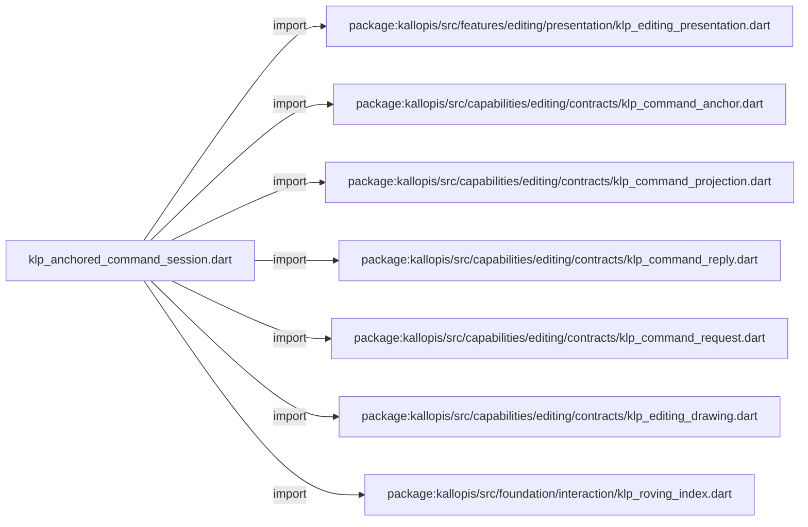
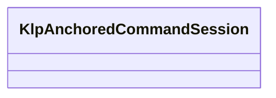

# klp_anchored_command_session.dart：直接依賴與宣告架構

[回到目錄](README.md) · [來源檔案](../../../../../../lib/src/rendering/flutter/internal/klp_anchored_command_session.dart)

## 範圍

核心是 `lib/src/rendering/flutter/internal/klp_anchored_command_session.dart`。主要視角為該檔案明寫的 import／export／part；輔助視角為本檔宣告及 extends／implements／with／on 關係。只展開一層外部邊界。

## 直接依賴圖

## 依賴證據

| 關係 | 原始 directive | 來源 |
|---|---|---|
| import | <code>import &#x27;package:kallopis/src/features/editing/presentation/klp_editing_presentation.dart&#x27;;</code> | [lib/src/rendering/flutter/internal/klp_anchored_command_session.dart:1](../../../../../../lib/src/rendering/flutter/internal/klp_anchored_command_session.dart#L1) |
| import | <code>import &#x27;package:kallopis/src/capabilities/editing/contracts/klp_command_anchor.dart&#x27;;</code> | [lib/src/rendering/flutter/internal/klp_anchored_command_session.dart:2](../../../../../../lib/src/rendering/flutter/internal/klp_anchored_command_session.dart#L2) |
| import | <code>import &#x27;package:kallopis/src/capabilities/editing/contracts/klp_command_projection.dart&#x27;;</code> | [lib/src/rendering/flutter/internal/klp_anchored_command_session.dart:3](../../../../../../lib/src/rendering/flutter/internal/klp_anchored_command_session.dart#L3) |
| import | <code>import &#x27;package:kallopis/src/capabilities/editing/contracts/klp_command_reply.dart&#x27;;</code> | [lib/src/rendering/flutter/internal/klp_anchored_command_session.dart:4](../../../../../../lib/src/rendering/flutter/internal/klp_anchored_command_session.dart#L4) |
| import | <code>import &#x27;package:kallopis/src/capabilities/editing/contracts/klp_command_request.dart&#x27;;</code> | [lib/src/rendering/flutter/internal/klp_anchored_command_session.dart:5](../../../../../../lib/src/rendering/flutter/internal/klp_anchored_command_session.dart#L5) |
| import | <code>import &#x27;package:kallopis/src/capabilities/editing/contracts/klp_editing_drawing.dart&#x27;;</code> | [lib/src/rendering/flutter/internal/klp_anchored_command_session.dart:6](../../../../../../lib/src/rendering/flutter/internal/klp_anchored_command_session.dart#L6) |
| import | <code>import &#x27;package:kallopis/src/foundation/interaction/klp_roving_index.dart&#x27;;</code> | [lib/src/rendering/flutter/internal/klp_anchored_command_session.dart:7](../../../../../../lib/src/rendering/flutter/internal/klp_anchored_command_session.dart#L7) |

## 宣告關係圖

本組節點是本檔宣告；沒有箭頭的宣告未在此圖主張互相依賴。

## 宣告與成員證據

成員包含 public 與 private；簽章取自來源，省略函式本體與欄位初始值。`(inferred)` 表示來源未明寫型別；建構子只顯示參數部分，不含初始化列表。

### KlpAnchoredCommandSession

ClassDeclaration · public · [lib/src/rendering/flutter/internal/klp_anchored_command_session.dart:9](../../../../../../lib/src/rendering/flutter/internal/klp_anchored_command_session.dart#L9)

<code>final class KlpAnchoredCommandSession</code>

來源註解摘要：K03 無畫面的狀態機；開啟入口與選單布局定型後由 renderer 呼叫。

| 成員 | 可見性 | 簽章／型別 | 來源註解摘要 | 證據 |
|---|---|---|---|---|
| field <code>_commands</code> | private | <code>final KlpBoundAnchoredCommands _commands</code> |  | [lib/src/rendering/flutter/internal/klp_anchored_command_session.dart:11](../../../../../../lib/src/rendering/flutter/internal/klp_anchored_command_session.dart#L11) |
| field <code>_drawing</code> | private | <code>final KlpEditingDrawing Function() _drawing</code> |  | [lib/src/rendering/flutter/internal/klp_anchored_command_session.dart:12](../../../../../../lib/src/rendering/flutter/internal/klp_anchored_command_session.dart#L12) |
| field <code>_interrupt</code> | private | <code>final Future&lt;void&gt; Function() _interrupt</code> |  | [lib/src/rendering/flutter/internal/klp_anchored_command_session.dart:13](../../../../../../lib/src/rendering/flutter/internal/klp_anchored_command_session.dart#L13) |
| field <code>_projection</code> | private | <code>KlpCommandProjection? _projection</code> |  | [lib/src/rendering/flutter/internal/klp_anchored_command_session.dart:14](../../../../../../lib/src/rendering/flutter/internal/klp_anchored_command_session.dart#L14) |
| field <code>_intentAnchor</code> | private | <code>KlpCommandAnchor? _intentAnchor</code> |  | [lib/src/rendering/flutter/internal/klp_anchored_command_session.dart:15](../../../../../../lib/src/rendering/flutter/internal/klp_anchored_command_session.dart#L15) |
| field <code>_highlightedId</code> | private | <code>String? _highlightedId</code> |  | [lib/src/rendering/flutter/internal/klp_anchored_command_session.dart:16](../../../../../../lib/src/rendering/flutter/internal/klp_anchored_command_session.dart#L16) |
| field <code>_opened</code> | private | <code>bool _opened</code> |  | [lib/src/rendering/flutter/internal/klp_anchored_command_session.dart:17](../../../../../../lib/src/rendering/flutter/internal/klp_anchored_command_session.dart#L17) |
| field <code>_pending</code> | private | <code>bool _pending</code> |  | [lib/src/rendering/flutter/internal/klp_anchored_command_session.dart:18](../../../../../../lib/src/rendering/flutter/internal/klp_anchored_command_session.dart#L18) |
| field <code>_requiresResync</code> | private | <code>bool _requiresResync</code> |  | [lib/src/rendering/flutter/internal/klp_anchored_command_session.dart:19](../../../../../../lib/src/rendering/flutter/internal/klp_anchored_command_session.dart#L19) |
| field <code>_disposed</code> | private | <code>bool _disposed</code> |  | [lib/src/rendering/flutter/internal/klp_anchored_command_session.dart:20](../../../../../../lib/src/rendering/flutter/internal/klp_anchored_command_session.dart#L20) |
| field <code>_generation</code> | private | <code>int _generation</code> |  | [lib/src/rendering/flutter/internal/klp_anchored_command_session.dart:21](../../../../../../lib/src/rendering/flutter/internal/klp_anchored_command_session.dart#L21) |
| constructor <code>KlpAnchoredCommandSession</code> | public | <code>KlpAnchoredCommandSession(this._commands, this._drawing, this._interrupt)</code> |  | [lib/src/rendering/flutter/internal/klp_anchored_command_session.dart:23](../../../../../../lib/src/rendering/flutter/internal/klp_anchored_command_session.dart#L23) |
| getter <code>opened</code> | public | <code>bool get opened</code> |  | [lib/src/rendering/flutter/internal/klp_anchored_command_session.dart:25](../../../../../../lib/src/rendering/flutter/internal/klp_anchored_command_session.dart#L25) |
| getter <code>pending</code> | public | <code>bool get pending</code> |  | [lib/src/rendering/flutter/internal/klp_anchored_command_session.dart:26](../../../../../../lib/src/rendering/flutter/internal/klp_anchored_command_session.dart#L26) |
| getter <code>requiresResync</code> | public | <code>bool get requiresResync</code> |  | [lib/src/rendering/flutter/internal/klp_anchored_command_session.dart:27](../../../../../../lib/src/rendering/flutter/internal/klp_anchored_command_session.dart#L27) |
| getter <code>highlightedId</code> | public | <code>String? get highlightedId</code> |  | [lib/src/rendering/flutter/internal/klp_anchored_command_session.dart:28](../../../../../../lib/src/rendering/flutter/internal/klp_anchored_command_session.dart#L28) |
| getter <code>projection</code> | public | <code>KlpCommandProjection? get projection</code> |  | [lib/src/rendering/flutter/internal/klp_anchored_command_session.dart:29](../../../../../../lib/src/rendering/flutter/internal/klp_anchored_command_session.dart#L29) |
| method <code>open</code> | public | <code>Future&lt;bool&gt; open()</code> |  | [lib/src/rendering/flutter/internal/klp_anchored_command_session.dart:31](../../../../../../lib/src/rendering/flutter/internal/klp_anchored_command_session.dart#L31) |
| method <code>next</code> | public | <code>void next()</code> |  | [lib/src/rendering/flutter/internal/klp_anchored_command_session.dart:51](../../../../../../lib/src/rendering/flutter/internal/klp_anchored_command_session.dart#L51) |
| method <code>previous</code> | public | <code>void previous()</code> |  | [lib/src/rendering/flutter/internal/klp_anchored_command_session.dart:52](../../../../../../lib/src/rendering/flutter/internal/klp_anchored_command_session.dart#L52) |
| method <code>home</code> | public | <code>void home()</code> |  | [lib/src/rendering/flutter/internal/klp_anchored_command_session.dart:53](../../../../../../lib/src/rendering/flutter/internal/klp_anchored_command_session.dart#L53) |
| method <code>end</code> | public | <code>void end()</code> |  | [lib/src/rendering/flutter/internal/klp_anchored_command_session.dart:54](../../../../../../lib/src/rendering/flutter/internal/klp_anchored_command_session.dart#L54) |
| method <code>select</code> | public | <code>void select(String id)</code> |  | [lib/src/rendering/flutter/internal/klp_anchored_command_session.dart:55](../../../../../../lib/src/rendering/flutter/internal/klp_anchored_command_session.dart#L55) |
| method <code>confirm</code> | public | <code>Future&lt;KlpCommandReply&gt; confirm()</code> |  | [lib/src/rendering/flutter/internal/klp_anchored_command_session.dart:63](../../../../../../lib/src/rendering/flutter/internal/klp_anchored_command_session.dart#L63) |
| method <code>_move</code> | private | <code>void _move({required bool forward})</code> |  | [lib/src/rendering/flutter/internal/klp_anchored_command_session.dart:105](../../../../../../lib/src/rendering/flutter/internal/klp_anchored_command_session.dart#L105) |
| method <code>_edge</code> | private | <code>void _edge({required bool first})</code> |  | [lib/src/rendering/flutter/internal/klp_anchored_command_session.dart:113](../../../../../../lib/src/rendering/flutter/internal/klp_anchored_command_session.dart#L113) |
| method <code>_ready</code> | private | <code>KlpCommandProjection _ready()</code> |  | [lib/src/rendering/flutter/internal/klp_anchored_command_session.dart:122](../../../../../../lib/src/rendering/flutter/internal/klp_anchored_command_session.dart#L122) |
| method <code>_adoptCurrent</code> | private | <code>void _adoptCurrent({bool selectFallback = true})</code> |  | [lib/src/rendering/flutter/internal/klp_anchored_command_session.dart:128](../../../../../../lib/src/rendering/flutter/internal/klp_anchored_command_session.dart#L128) |
| method <code>close</code> | public | <code>void close()</code> |  | [lib/src/rendering/flutter/internal/klp_anchored_command_session.dart:144](../../../../../../lib/src/rendering/flutter/internal/klp_anchored_command_session.dart#L144) |
| method <code>resynchronize</code> | public | <code>void resynchronize()</code> |  | [lib/src/rendering/flutter/internal/klp_anchored_command_session.dart:153](../../../../../../lib/src/rendering/flutter/internal/klp_anchored_command_session.dart#L153) |
| method <code>dispose</code> | public | <code>void dispose()</code> |  | [lib/src/rendering/flutter/internal/klp_anchored_command_session.dart:160](../../../../../../lib/src/rendering/flutter/internal/klp_anchored_command_session.dart#L160) |

### _sameTarget

FunctionDeclaration · private · [lib/src/rendering/flutter/internal/klp_anchored_command_session.dart:167](../../../../../../lib/src/rendering/flutter/internal/klp_anchored_command_session.dart#L167)

<code>bool _sameTarget(KlpCommandAnchor left, KlpCommandAnchor right)</code>

## 閱讀說明與限制

箭頭只表示來源明寫的靜態關係；import 不等於呼叫。未分析動態呼叫、欄位的實際物件擁有權、狀態轉移或渲染流程；型別未進行語意解析，繼承目標保留原始型別拼寫。public／private 依 Dart 名稱前綴判斷；public 宣告不代表已由 `lib/kallopis.dart` 匯出。

本頁由 `tool/architecture_atlas` 產生；編輯來源或生成工具後重新產生，避免手改本頁。
