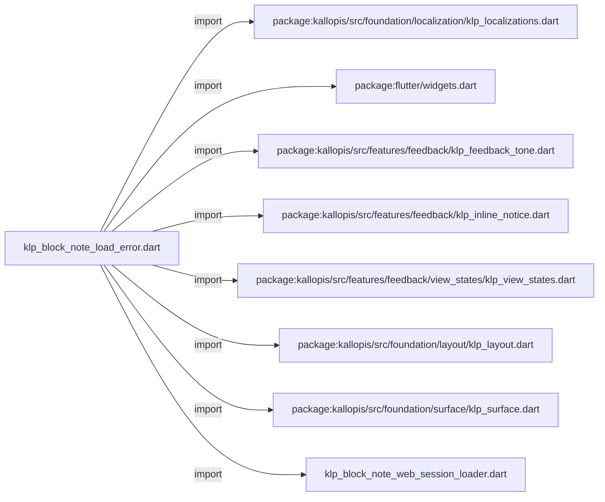
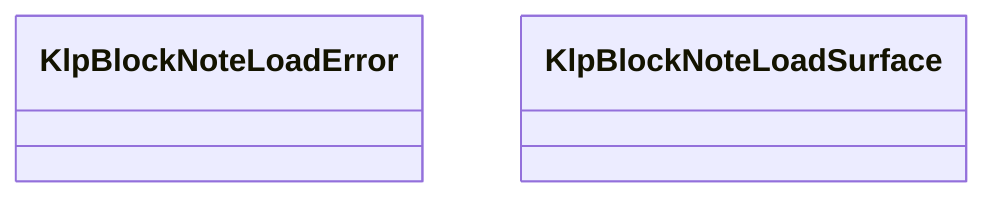
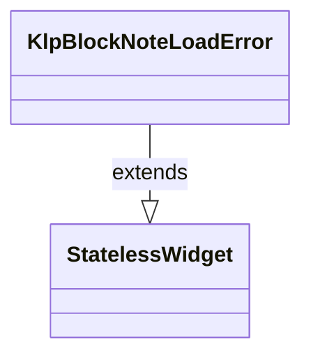
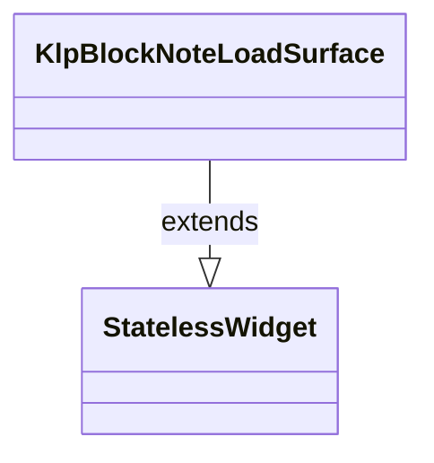

# klp_block_note_load_error.dart：直接依賴與宣告架構

[回到目錄](README.md) · [來源檔案](../../../../../../lib/src/rendering/flutter/internal/klp_block_note_load_error.dart)

## 範圍

核心是 `lib/src/rendering/flutter/internal/klp_block_note_load_error.dart`。主要視角為該檔案明寫的 import／export／part；輔助視角為本檔宣告及 extends／implements／with／on 關係。只展開一層外部邊界。

## 直接依賴圖

## 依賴證據

| 關係 | 原始 directive | 來源 |
|---|---|---|
| import | <code>import &#x27;package:kallopis/src/foundation/localization/klp_localizations.dart&#x27;;</code> | [lib/src/rendering/flutter/internal/klp_block_note_load_error.dart:1](../../../../../../lib/src/rendering/flutter/internal/klp_block_note_load_error.dart#L1) |
| import | <code>import &#x27;package:flutter/widgets.dart&#x27;;</code> | [lib/src/rendering/flutter/internal/klp_block_note_load_error.dart:2](../../../../../../lib/src/rendering/flutter/internal/klp_block_note_load_error.dart#L2) |
| import | <code>import &#x27;package:kallopis/src/features/feedback/klp_feedback_tone.dart&#x27;;</code> | [lib/src/rendering/flutter/internal/klp_block_note_load_error.dart:3](../../../../../../lib/src/rendering/flutter/internal/klp_block_note_load_error.dart#L3) |
| import | <code>import &#x27;package:kallopis/src/features/feedback/klp_inline_notice.dart&#x27;;</code> | [lib/src/rendering/flutter/internal/klp_block_note_load_error.dart:4](../../../../../../lib/src/rendering/flutter/internal/klp_block_note_load_error.dart#L4) |
| import | <code>import &#x27;package:kallopis/src/features/feedback/view_states/klp_view_states.dart&#x27;;</code> | [lib/src/rendering/flutter/internal/klp_block_note_load_error.dart:5](../../../../../../lib/src/rendering/flutter/internal/klp_block_note_load_error.dart#L5) |
| import | <code>import &#x27;package:kallopis/src/foundation/layout/klp_layout.dart&#x27;;</code> | [lib/src/rendering/flutter/internal/klp_block_note_load_error.dart:6](../../../../../../lib/src/rendering/flutter/internal/klp_block_note_load_error.dart#L6) |
| import | <code>import &#x27;package:kallopis/src/foundation/surface/klp_surface.dart&#x27;;</code> | [lib/src/rendering/flutter/internal/klp_block_note_load_error.dart:7](../../../../../../lib/src/rendering/flutter/internal/klp_block_note_load_error.dart#L7) |
| import | <code>import &#x27;klp_block_note_web_session_loader.dart&#x27;;</code> | [lib/src/rendering/flutter/internal/klp_block_note_load_error.dart:9](../../../../../../lib/src/rendering/flutter/internal/klp_block_note_load_error.dart#L9) |

## 宣告關係圖

本組節點是本檔宣告；沒有箭頭的宣告未在此圖主張互相依賴。

## 宣告與成員證據

成員包含 public 與 private；簽章取自來源，省略函式本體與欄位初始值。`(inferred)` 表示來源未明寫型別；建構子只顯示參數部分，不含初始化列表。

### KlpBlockNoteLoadError

ClassDeclaration · public · [lib/src/rendering/flutter/internal/klp_block_note_load_error.dart:11](../../../../../../lib/src/rendering/flutter/internal/klp_block_note_load_error.dart#L11)

<code>final class KlpBlockNoteLoadError extends StatelessWidget</code>

來源註解摘要：固定的 BlockNote 載入失敗呈現，不開放 consumer 置換內容或風格。

- `extends` → <code>StatelessWidget</code>：[lib/src/rendering/flutter/internal/klp_block_note_load_error.dart:12](../../../../../../lib/src/rendering/flutter/internal/klp_block_note_load_error.dart#L12)

| 成員 | 可見性 | 簽章／型別 | 來源註解摘要 | 證據 |
|---|---|---|---|---|
| field <code>canRetry</code> | public | <code>final bool canRetry</code> |  | [lib/src/rendering/flutter/internal/klp_block_note_load_error.dart:13](../../../../../../lib/src/rendering/flutter/internal/klp_block_note_load_error.dart#L13) |
| field <code>onRetry</code> | public | <code>final VoidCallback onRetry</code> |  | [lib/src/rendering/flutter/internal/klp_block_note_load_error.dart:14](../../../../../../lib/src/rendering/flutter/internal/klp_block_note_load_error.dart#L14) |
| constructor <code>KlpBlockNoteLoadError</code> | public | <code>const KlpBlockNoteLoadError({required this.canRetry, required this.onRetry, super.key})</code> |  | [lib/src/rendering/flutter/internal/klp_block_note_load_error.dart:15](../../../../../../lib/src/rendering/flutter/internal/klp_block_note_load_error.dart#L15) |
| method <code>build</code> | public | <code>Widget build(BuildContext context)</code> |  | [lib/src/rendering/flutter/internal/klp_block_note_load_error.dart:17](../../../../../../lib/src/rendering/flutter/internal/klp_block_note_load_error.dart#L17) |

### KlpBlockNoteLoadSurface

ClassDeclaration · public · [lib/src/rendering/flutter/internal/klp_block_note_load_error.dart:36](../../../../../../lib/src/rendering/flutter/internal/klp_block_note_load_error.dart#L36)

<code>final class KlpBlockNoteLoadSurface extends StatelessWidget</code>

來源註解摘要：疊加載入狀態並持續保留同一個 WebView child，避免卸載尚未儲存的正文。

- `extends` → <code>StatelessWidget</code>：[lib/src/rendering/flutter/internal/klp_block_note_load_error.dart:37](../../../../../../lib/src/rendering/flutter/internal/klp_block_note_load_error.dart#L37)

| 成員 | 可見性 | 簽章／型別 | 來源註解摘要 | 證據 |
|---|---|---|---|---|
| field <code>loader</code> | public | <code>final KlpBlockNoteWebSessionLoader loader</code> |  | [lib/src/rendering/flutter/internal/klp_block_note_load_error.dart:38](../../../../../../lib/src/rendering/flutter/internal/klp_block_note_load_error.dart#L38) |
| field <code>child</code> | public | <code>final Widget child</code> |  | [lib/src/rendering/flutter/internal/klp_block_note_load_error.dart:39](../../../../../../lib/src/rendering/flutter/internal/klp_block_note_load_error.dart#L39) |
| field <code>onRetry</code> | public | <code>final VoidCallback onRetry</code> |  | [lib/src/rendering/flutter/internal/klp_block_note_load_error.dart:40](../../../../../../lib/src/rendering/flutter/internal/klp_block_note_load_error.dart#L40) |
| constructor <code>KlpBlockNoteLoadSurface</code> | public | <code>const KlpBlockNoteLoadSurface({required this.loader, required this.child, required this.onRetry, super.key})</code> |  | [lib/src/rendering/flutter/internal/klp_block_note_load_error.dart:41](../../../../../../lib/src/rendering/flutter/internal/klp_block_note_load_error.dart#L41) |
| method <code>build</code> | public | <code>Widget build(BuildContext context)</code> |  | [lib/src/rendering/flutter/internal/klp_block_note_load_error.dart:43](../../../../../../lib/src/rendering/flutter/internal/klp_block_note_load_error.dart#L43) |

## 閱讀說明與限制

箭頭只表示來源明寫的靜態關係；import 不等於呼叫。未分析動態呼叫、欄位的實際物件擁有權、狀態轉移或渲染流程；型別未進行語意解析，繼承目標保留原始型別拼寫。public／private 依 Dart 名稱前綴判斷；public 宣告不代表已由 `lib/kallopis.dart` 匯出。

本頁由 `tool/architecture_atlas` 產生；編輯來源或生成工具後重新產生，避免手改本頁。
