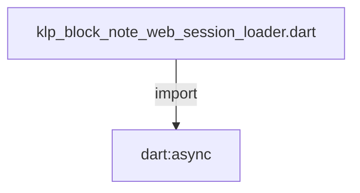
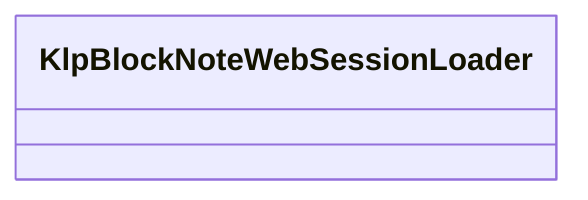

# klp_block_note_web_session_loader.dart：直接依賴與宣告架構

[回到目錄](README.md) · [來源檔案](../../../../../../lib/src/rendering/flutter/internal/klp_block_note_web_session_loader.dart)

## 範圍

核心是 `lib/src/rendering/flutter/internal/klp_block_note_web_session_loader.dart`。主要視角為該檔案明寫的 import／export／part；輔助視角為本檔宣告及 extends／implements／with／on 關係。只展開一層外部邊界。

## 直接依賴圖

## 依賴證據

| 關係 | 原始 directive | 來源 |
|---|---|---|
| import | <code>import &#x27;dart:async&#x27;;</code> | [lib/src/rendering/flutter/internal/klp_block_note_web_session_loader.dart:1](../../../../../../lib/src/rendering/flutter/internal/klp_block_note_web_session_loader.dart#L1) |

## 宣告關係圖

本組節點是本檔宣告；沒有箭頭的宣告未在此圖主張互相依賴。

## 宣告與成員證據

成員包含 public 與 private；簽章取自來源，省略函式本體與欄位初始值。`(inferred)` 表示來源未明寫型別；建構子只顯示參數部分，不含初始化列表。

### KlpBlockNoteWebSessionLoader

ClassDeclaration · public · [lib/src/rendering/flutter/internal/klp_block_note_web_session_loader.dart:3](../../../../../../lib/src/rendering/flutter/internal/klp_block_note_web_session_loader.dart#L3)

<code>final class KlpBlockNoteWebSessionLoader</code>

來源註解摘要：管理首次 Web editor 開啟；成功後不允許重送初始文件。

| 成員 | 可見性 | 簽章／型別 | 來源註解摘要 | 證據 |
|---|---|---|---|---|
| field <code>_attempt</code> | private | <code>final Future&lt;void&gt; Function() _attempt</code> |  | [lib/src/rendering/flutter/internal/klp_block_note_web_session_loader.dart:5](../../../../../../lib/src/rendering/flutter/internal/klp_block_note_web_session_loader.dart#L5) |
| field <code>onFailure</code> | public | <code>final void Function(Object error, StackTrace stackTrace) onFailure</code> |  | [lib/src/rendering/flutter/internal/klp_block_note_web_session_loader.dart:6](../../../../../../lib/src/rendering/flutter/internal/klp_block_note_web_session_loader.dart#L6) |
| field <code>_error</code> | private | <code>Object? _error</code> |  | [lib/src/rendering/flutter/internal/klp_block_note_web_session_loader.dart:7](../../../../../../lib/src/rendering/flutter/internal/klp_block_note_web_session_loader.dart#L7) |
| field <code>_opened</code> | private | <code>bool _opened</code> |  | [lib/src/rendering/flutter/internal/klp_block_note_web_session_loader.dart:8](../../../../../../lib/src/rendering/flutter/internal/klp_block_note_web_session_loader.dart#L8) |
| field <code>_active</code> | private | <code>Future&lt;void&gt;? _active</code> |  | [lib/src/rendering/flutter/internal/klp_block_note_web_session_loader.dart:9](../../../../../../lib/src/rendering/flutter/internal/klp_block_note_web_session_loader.dart#L9) |
| constructor <code>KlpBlockNoteWebSessionLoader</code> | public | <code>KlpBlockNoteWebSessionLoader(this._attempt, {required this.onFailure})</code> |  | [lib/src/rendering/flutter/internal/klp_block_note_web_session_loader.dart:11](../../../../../../lib/src/rendering/flutter/internal/klp_block_note_web_session_loader.dart#L11) |
| getter <code>error</code> | public | <code>Object? get error</code> |  | [lib/src/rendering/flutter/internal/klp_block_note_web_session_loader.dart:13](../../../../../../lib/src/rendering/flutter/internal/klp_block_note_web_session_loader.dart#L13) |
| getter <code>opening</code> | public | <code>bool get opening</code> |  | [lib/src/rendering/flutter/internal/klp_block_note_web_session_loader.dart:14](../../../../../../lib/src/rendering/flutter/internal/klp_block_note_web_session_loader.dart#L14) |
| getter <code>canRetry</code> | public | <code>bool get canRetry</code> |  | [lib/src/rendering/flutter/internal/klp_block_note_web_session_loader.dart:15](../../../../../../lib/src/rendering/flutter/internal/klp_block_note_web_session_loader.dart#L15) |
| method <code>markOpened</code> | public | <code>void markOpened()</code> | 上游開啟成功後立即固定；後續通知失敗不能重播初始文件。 | [lib/src/rendering/flutter/internal/klp_block_note_web_session_loader.dart:17](../../../../../../lib/src/rendering/flutter/internal/klp_block_note_web_session_loader.dart#L17) |
| method <code>open</code> | public | <code>Future&lt;void&gt; open()</code> |  | [lib/src/rendering/flutter/internal/klp_block_note_web_session_loader.dart:20](../../../../../../lib/src/rendering/flutter/internal/klp_block_note_web_session_loader.dart#L20) |
| method <code>retry</code> | public | <code>Future&lt;void&gt; retry()</code> |  | [lib/src/rendering/flutter/internal/klp_block_note_web_session_loader.dart:31](../../../../../../lib/src/rendering/flutter/internal/klp_block_note_web_session_loader.dart#L31) |
| method <code>reportFailure</code> | public | <code>void reportFailure(Object error)</code> |  | [lib/src/rendering/flutter/internal/klp_block_note_web_session_loader.dart:38](../../../../../../lib/src/rendering/flutter/internal/klp_block_note_web_session_loader.dart#L38) |
| method <code>_run</code> | private | <code>Future&lt;void&gt; _run()</code> |  | [lib/src/rendering/flutter/internal/klp_block_note_web_session_loader.dart:42](../../../../../../lib/src/rendering/flutter/internal/klp_block_note_web_session_loader.dart#L42) |

## 閱讀說明與限制

箭頭只表示來源明寫的靜態關係；import 不等於呼叫。未分析動態呼叫、欄位的實際物件擁有權、狀態轉移或渲染流程；型別未進行語意解析，繼承目標保留原始型別拼寫。public／private 依 Dart 名稱前綴判斷；public 宣告不代表已由 `lib/kallopis.dart` 匯出。

本頁由 `tool/architecture_atlas` 產生；編輯來源或生成工具後重新產生，避免手改本頁。
