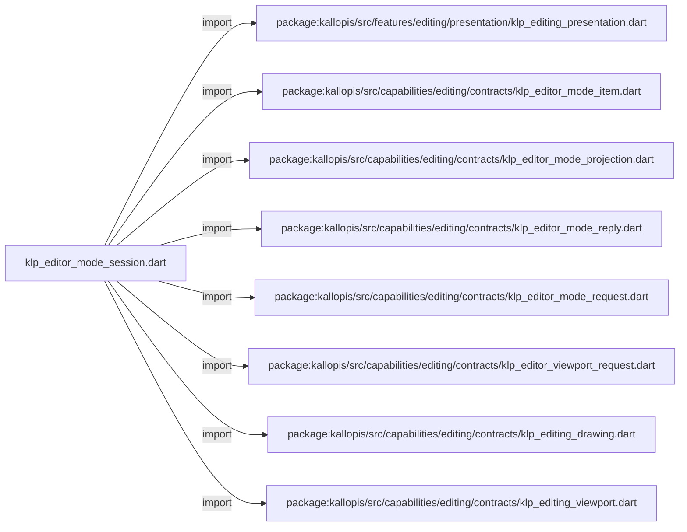
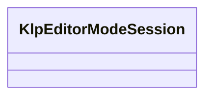

# klp_editor_mode_session.dart：直接依賴與宣告架構

[回到目錄](README.md) · [來源檔案](../../../../../../lib/src/rendering/flutter/internal/klp_editor_mode_session.dart)

## 範圍

核心是 `lib/src/rendering/flutter/internal/klp_editor_mode_session.dart`。主要視角為該檔案明寫的 import／export／part；輔助視角為本檔宣告及 extends／implements／with／on 關係。只展開一層外部邊界。

## 直接依賴圖

## 依賴證據

| 關係 | 原始 directive | 來源 |
|---|---|---|
| import | <code>import &#x27;package:kallopis/src/features/editing/presentation/klp_editing_presentation.dart&#x27;;</code> | [lib/src/rendering/flutter/internal/klp_editor_mode_session.dart:1](../../../../../../lib/src/rendering/flutter/internal/klp_editor_mode_session.dart#L1) |
| import | <code>import &#x27;package:kallopis/src/capabilities/editing/contracts/klp_editor_mode_item.dart&#x27;;</code> | [lib/src/rendering/flutter/internal/klp_editor_mode_session.dart:2](../../../../../../lib/src/rendering/flutter/internal/klp_editor_mode_session.dart#L2) |
| import | <code>import &#x27;package:kallopis/src/capabilities/editing/contracts/klp_editor_mode_projection.dart&#x27;;</code> | [lib/src/rendering/flutter/internal/klp_editor_mode_session.dart:3](../../../../../../lib/src/rendering/flutter/internal/klp_editor_mode_session.dart#L3) |
| import | <code>import &#x27;package:kallopis/src/capabilities/editing/contracts/klp_editor_mode_reply.dart&#x27;;</code> | [lib/src/rendering/flutter/internal/klp_editor_mode_session.dart:4](../../../../../../lib/src/rendering/flutter/internal/klp_editor_mode_session.dart#L4) |
| import | <code>import &#x27;package:kallopis/src/capabilities/editing/contracts/klp_editor_mode_request.dart&#x27;;</code> | [lib/src/rendering/flutter/internal/klp_editor_mode_session.dart:5](../../../../../../lib/src/rendering/flutter/internal/klp_editor_mode_session.dart#L5) |
| import | <code>import &#x27;package:kallopis/src/capabilities/editing/contracts/klp_editor_viewport_request.dart&#x27;;</code> | [lib/src/rendering/flutter/internal/klp_editor_mode_session.dart:6](../../../../../../lib/src/rendering/flutter/internal/klp_editor_mode_session.dart#L6) |
| import | <code>import &#x27;package:kallopis/src/capabilities/editing/contracts/klp_editing_drawing.dart&#x27;;</code> | [lib/src/rendering/flutter/internal/klp_editor_mode_session.dart:7](../../../../../../lib/src/rendering/flutter/internal/klp_editor_mode_session.dart#L7) |
| import | <code>import &#x27;package:kallopis/src/capabilities/editing/contracts/klp_editing_viewport.dart&#x27;;</code> | [lib/src/rendering/flutter/internal/klp_editor_mode_session.dart:8](../../../../../../lib/src/rendering/flutter/internal/klp_editor_mode_session.dart#L8) |

## 宣告關係圖

本組節點是本檔宣告；沒有箭頭的宣告未在此圖主張互相依賴。

## 宣告與成員證據

成員包含 public 與 private；簽章取自來源，省略函式本體與欄位初始值。`(inferred)` 表示來源未明寫型別；建構子只顯示參數部分，不含初始化列表。

### klpCanRouteEditorViewport

FunctionDeclaration · public · [lib/src/rendering/flutter/internal/klp_editor_mode_session.dart:10](../../../../../../lib/src/rendering/flutter/internal/klp_editor_mode_session.dart#L10)

<code>bool klpCanRouteEditorViewport(KlpEditingDrawing drawing, KlpEditingViewport viewport, {required bool pending})</code>

來源註解摘要：只讓同一個已排版 viewport 的導覽工具接收平台事件。

### KlpEditorModeSession

ClassDeclaration · public · [lib/src/rendering/flutter/internal/klp_editor_mode_session.dart:19](../../../../../../lib/src/rendering/flutter/internal/klp_editor_mode_session.dart#L19)

<code>final class KlpEditorModeSession</code>

來源註解摘要：K04 無工具列外觀的排他狀態機；handler 只依來源已確認的 active tool 啟用。

| 成員 | 可見性 | 簽章／型別 | 來源註解摘要 | 證據 |
|---|---|---|---|---|
| field <code>_toolbar</code> | private | <code>final KlpBoundModeToolbar _toolbar</code> |  | [lib/src/rendering/flutter/internal/klp_editor_mode_session.dart:21](../../../../../../lib/src/rendering/flutter/internal/klp_editor_mode_session.dart#L21) |
| field <code>_drawing</code> | private | <code>final KlpEditingDrawing Function() _drawing</code> |  | [lib/src/rendering/flutter/internal/klp_editor_mode_session.dart:22](../../../../../../lib/src/rendering/flutter/internal/klp_editor_mode_session.dart#L22) |
| field <code>_interrupt</code> | private | <code>final Future&lt;void&gt; Function() _interrupt</code> |  | [lib/src/rendering/flutter/internal/klp_editor_mode_session.dart:23](../../../../../../lib/src/rendering/flutter/internal/klp_editor_mode_session.dart#L23) |
| field <code>_onAuthoritySettled</code> | private | <code>final void Function() _onAuthoritySettled</code> |  | [lib/src/rendering/flutter/internal/klp_editor_mode_session.dart:24](../../../../../../lib/src/rendering/flutter/internal/klp_editor_mode_session.dart#L24) |
| field <code>_pending</code> | private | <code>bool _pending</code> |  | [lib/src/rendering/flutter/internal/klp_editor_mode_session.dart:25](../../../../../../lib/src/rendering/flutter/internal/klp_editor_mode_session.dart#L25) |
| field <code>_requiresResync</code> | private | <code>bool _requiresResync</code> |  | [lib/src/rendering/flutter/internal/klp_editor_mode_session.dart:26](../../../../../../lib/src/rendering/flutter/internal/klp_editor_mode_session.dart#L26) |
| field <code>_closed</code> | private | <code>bool _closed</code> |  | [lib/src/rendering/flutter/internal/klp_editor_mode_session.dart:27](../../../../../../lib/src/rendering/flutter/internal/klp_editor_mode_session.dart#L27) |
| field <code>_generation</code> | private | <code>int _generation</code> |  | [lib/src/rendering/flutter/internal/klp_editor_mode_session.dart:28](../../../../../../lib/src/rendering/flutter/internal/klp_editor_mode_session.dart#L28) |
| constructor <code>KlpEditorModeSession</code> | public | <code>KlpEditorModeSession(this._toolbar, this._drawing, this._interrupt, this._onAuthoritySettled)</code> |  | [lib/src/rendering/flutter/internal/klp_editor_mode_session.dart:30](../../../../../../lib/src/rendering/flutter/internal/klp_editor_mode_session.dart#L30) |
| getter <code>pending</code> | public | <code>bool get pending</code> |  | [lib/src/rendering/flutter/internal/klp_editor_mode_session.dart:32](../../../../../../lib/src/rendering/flutter/internal/klp_editor_mode_session.dart#L32) |
| getter <code>requiresResync</code> | public | <code>bool get requiresResync</code> |  | [lib/src/rendering/flutter/internal/klp_editor_mode_session.dart:33](../../../../../../lib/src/rendering/flutter/internal/klp_editor_mode_session.dart#L33) |
| getter <code>projection</code> | public | <code>KlpEditorModeProjection get projection</code> |  | [lib/src/rendering/flutter/internal/klp_editor_mode_session.dart:34](../../../../../../lib/src/rendering/flutter/internal/klp_editor_mode_session.dart#L34) |
| method <code>switchTo</code> | public | <code>Future&lt;KlpEditorModeReply&gt; switchTo(String modeId, String toolId)</code> |  | [lib/src/rendering/flutter/internal/klp_editor_mode_session.dart:36](../../../../../../lib/src/rendering/flutter/internal/klp_editor_mode_session.dart#L36) |
| method <code>navigateBy</code> | public | <code>Future&lt;KlpEditorModeReply&gt; navigateBy(double deltaY)</code> |  | [lib/src/rendering/flutter/internal/klp_editor_mode_session.dart:82](../../../../../../lib/src/rendering/flutter/internal/klp_editor_mode_session.dart#L82) |
| method <code>_begin</code> | private | <code>void _begin()</code> |  | [lib/src/rendering/flutter/internal/klp_editor_mode_session.dart:120](../../../../../../lib/src/rendering/flutter/internal/klp_editor_mode_session.dart#L120) |
| method <code>_current</code> | private | <code>KlpEditorModeProjection _current()</code> |  | [lib/src/rendering/flutter/internal/klp_editor_mode_session.dart:125](../../../../../../lib/src/rendering/flutter/internal/klp_editor_mode_session.dart#L125) |
| method <code>_validateReply</code> | private | <code>void _validateReply(KlpEditorModeReply reply)</code> |  | [lib/src/rendering/flutter/internal/klp_editor_mode_session.dart:130](../../../../../../lib/src/rendering/flutter/internal/klp_editor_mode_session.dart#L130) |
| method <code>resynchronize</code> | public | <code>void resynchronize()</code> |  | [lib/src/rendering/flutter/internal/klp_editor_mode_session.dart:137](../../../../../../lib/src/rendering/flutter/internal/klp_editor_mode_session.dart#L137) |
| method <code>close</code> | public | <code>void close()</code> |  | [lib/src/rendering/flutter/internal/klp_editor_mode_session.dart:143](../../../../../../lib/src/rendering/flutter/internal/klp_editor_mode_session.dart#L143) |

## 閱讀說明與限制

箭頭只表示來源明寫的靜態關係；import 不等於呼叫。未分析動態呼叫、欄位的實際物件擁有權、狀態轉移或渲染流程；型別未進行語意解析，繼承目標保留原始型別拼寫。public／private 依 Dart 名稱前綴判斷；public 宣告不代表已由 `lib/kallopis.dart` 匯出。

本頁由 `tool/architecture_atlas` 產生；編輯來源或生成工具後重新產生，避免手改本頁。
