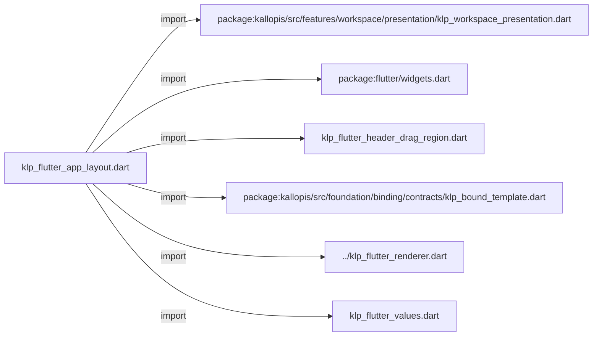
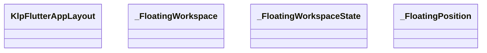
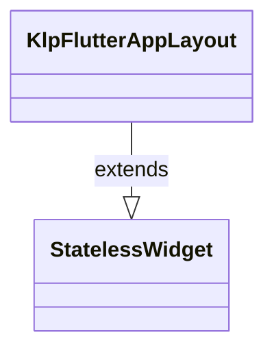
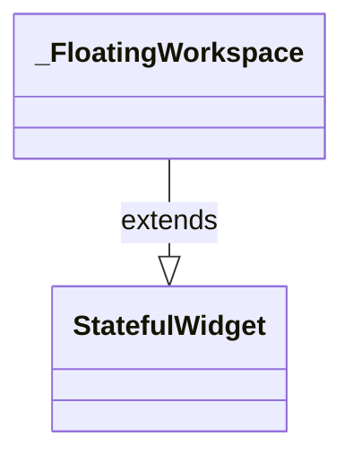
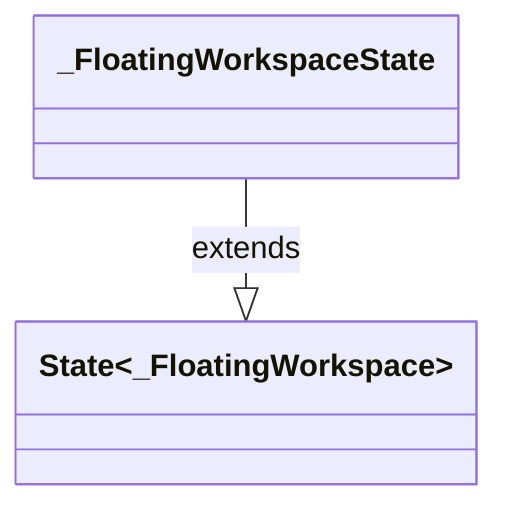
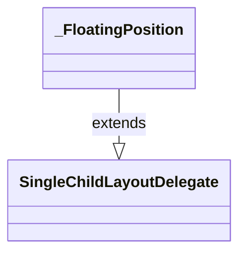

# klp_flutter_app_layout.dart：直接依賴與宣告架構

[回到目錄](README.md) · [來源檔案](../../../../../../lib/src/rendering/flutter/internal/klp_flutter_app_layout.dart)

## 範圍

核心是 `lib/src/rendering/flutter/internal/klp_flutter_app_layout.dart`。主要視角為該檔案明寫的 import／export／part；輔助視角為本檔宣告及 extends／implements／with／on 關係。只展開一層外部邊界。

## 直接依賴圖

## 依賴證據

| 關係 | 原始 directive | 來源 |
|---|---|---|
| import | <code>import &#x27;package:kallopis/src/features/workspace/presentation/klp_workspace_presentation.dart&#x27;;</code> | [lib/src/rendering/flutter/internal/klp_flutter_app_layout.dart:1](../../../../../../lib/src/rendering/flutter/internal/klp_flutter_app_layout.dart#L1) |
| import | <code>import &#x27;package:flutter/widgets.dart&#x27;;</code> | [lib/src/rendering/flutter/internal/klp_flutter_app_layout.dart:2](../../../../../../lib/src/rendering/flutter/internal/klp_flutter_app_layout.dart#L2) |
| import | <code>import &#x27;klp_flutter_header_drag_region.dart&#x27;;</code> | [lib/src/rendering/flutter/internal/klp_flutter_app_layout.dart:3](../../../../../../lib/src/rendering/flutter/internal/klp_flutter_app_layout.dart#L3) |
| import | <code>import &#x27;package:kallopis/src/foundation/binding/contracts/klp_bound_template.dart&#x27;;</code> | [lib/src/rendering/flutter/internal/klp_flutter_app_layout.dart:5](../../../../../../lib/src/rendering/flutter/internal/klp_flutter_app_layout.dart#L5) |
| import | <code>import &#x27;../klp_flutter_renderer.dart&#x27;;</code> | [lib/src/rendering/flutter/internal/klp_flutter_app_layout.dart:6](../../../../../../lib/src/rendering/flutter/internal/klp_flutter_app_layout.dart#L6) |
| import | <code>import &#x27;klp_flutter_values.dart&#x27;;</code> | [lib/src/rendering/flutter/internal/klp_flutter_app_layout.dart:7](../../../../../../lib/src/rendering/flutter/internal/klp_flutter_app_layout.dart#L7) |

## 宣告關係圖

本組節點是本檔宣告；沒有箭頭的宣告未在此圖主張互相依賴。

## 宣告與成員證據

成員包含 public 與 private；簽章取自來源，省略函式本體與欄位初始值。`(inferred)` 表示來源未明寫型別；建構子只顯示參數部分，不含初始化列表。

### KlpFlutterAppLayout

ClassDeclaration · public · [lib/src/rendering/flutter/internal/klp_flutter_app_layout.dart:9](../../../../../../lib/src/rendering/flutter/internal/klp_flutter_app_layout.dart#L9)

<code>final class KlpFlutterAppLayout extends StatelessWidget</code>

來源註解摘要：封閉 app layout renderer；消費端不能直接取得 Flutter child 或 layout callback。

- `extends` → <code>StatelessWidget</code>：[lib/src/rendering/flutter/internal/klp_flutter_app_layout.dart:10](../../../../../../lib/src/rendering/flutter/internal/klp_flutter_app_layout.dart#L10)

| 成員 | 可見性 | 簽章／型別 | 來源註解摘要 | 證據 |
|---|---|---|---|---|
| field <code>content</code> | public | <code>final KlpBoundAppLayout content</code> |  | [lib/src/rendering/flutter/internal/klp_flutter_app_layout.dart:12](../../../../../../lib/src/rendering/flutter/internal/klp_flutter_app_layout.dart#L12) |
| constructor <code>KlpFlutterAppLayout</code> | public | <code>const KlpFlutterAppLayout({required this.content, super.key})</code> |  | [lib/src/rendering/flutter/internal/klp_flutter_app_layout.dart:14](../../../../../../lib/src/rendering/flutter/internal/klp_flutter_app_layout.dart#L14) |
| method <code>build</code> | public | <code>Widget build(BuildContext context)</code> |  | [lib/src/rendering/flutter/internal/klp_flutter_app_layout.dart:16](../../../../../../lib/src/rendering/flutter/internal/klp_flutter_app_layout.dart#L16) |
| method <code>_linearChildren</code> | private | <code>List&lt;Widget&gt; _linearChildren(Axis axis)</code> |  | [lib/src/rendering/flutter/internal/klp_flutter_app_layout.dart:44](../../../../../../lib/src/rendering/flutter/internal/klp_flutter_app_layout.dart#L44) |

### _FloatingWorkspace

ClassDeclaration · private · [lib/src/rendering/flutter/internal/klp_flutter_app_layout.dart:72](../../../../../../lib/src/rendering/flutter/internal/klp_flutter_app_layout.dart#L72)

<code>final class _FloatingWorkspace extends StatefulWidget</code>

來源註解摘要：浮動位置是呈現狀態；點擊沿用 action，拖曳只移動按鈕而不執行操作。

- `extends` → <code>StatefulWidget</code>：[lib/src/rendering/flutter/internal/klp_flutter_app_layout.dart:73](../../../../../../lib/src/rendering/flutter/internal/klp_flutter_app_layout.dart#L73)

| 成員 | 可見性 | 簽章／型別 | 來源註解摘要 | 證據 |
|---|---|---|---|---|
| field <code>content</code> | public | <code>final KlpBoundAppLayout content</code> |  | [lib/src/rendering/flutter/internal/klp_flutter_app_layout.dart:74](../../../../../../lib/src/rendering/flutter/internal/klp_flutter_app_layout.dart#L74) |
| field <code>child</code> | public | <code>final Widget child</code> |  | [lib/src/rendering/flutter/internal/klp_flutter_app_layout.dart:75](../../../../../../lib/src/rendering/flutter/internal/klp_flutter_app_layout.dart#L75) |
| constructor <code>_FloatingWorkspace</code> | private | <code>const _FloatingWorkspace({required this.content, required this.child})</code> |  | [lib/src/rendering/flutter/internal/klp_flutter_app_layout.dart:76](../../../../../../lib/src/rendering/flutter/internal/klp_flutter_app_layout.dart#L76) |
| method <code>createState</code> | public | <code>State&lt;_FloatingWorkspace&gt; createState()</code> |  | [lib/src/rendering/flutter/internal/klp_flutter_app_layout.dart:77](../../../../../../lib/src/rendering/flutter/internal/klp_flutter_app_layout.dart#L77) |

### _FloatingWorkspaceState

ClassDeclaration · private · [lib/src/rendering/flutter/internal/klp_flutter_app_layout.dart:81](../../../../../../lib/src/rendering/flutter/internal/klp_flutter_app_layout.dart#L81)

<code>final class _FloatingWorkspaceState extends State&lt;_FloatingWorkspace&gt;</code>

- `extends` → <code>State&lt;_FloatingWorkspace&gt;</code>：[lib/src/rendering/flutter/internal/klp_flutter_app_layout.dart:81](../../../../../../lib/src/rendering/flutter/internal/klp_flutter_app_layout.dart#L81)

| 成員 | 可見性 | 簽章／型別 | 來源註解摘要 | 證據 |
|---|---|---|---|---|
| field <code>_buttonKey</code> | private | <code>final (inferred) _buttonKey</code> |  | [lib/src/rendering/flutter/internal/klp_flutter_app_layout.dart:82](../../../../../../lib/src/rendering/flutter/internal/klp_flutter_app_layout.dart#L82) |
| field <code>_areaKey</code> | private | <code>final (inferred) _areaKey</code> |  | [lib/src/rendering/flutter/internal/klp_flutter_app_layout.dart:83](../../../../../../lib/src/rendering/flutter/internal/klp_flutter_app_layout.dart#L83) |
| field <code>_position</code> | private | <code>Offset? _position</code> |  | [lib/src/rendering/flutter/internal/klp_flutter_app_layout.dart:84](../../../../../../lib/src/rendering/flutter/internal/klp_flutter_app_layout.dart#L84) |
| method <code>build</code> | public | <code>Widget build(BuildContext context)</code> |  | [lib/src/rendering/flutter/internal/klp_flutter_app_layout.dart:86](../../../../../../lib/src/rendering/flutter/internal/klp_flutter_app_layout.dart#L86) |

### _FloatingPosition

ClassDeclaration · private · [lib/src/rendering/flutter/internal/klp_flutter_app_layout.dart:117](../../../../../../lib/src/rendering/flutter/internal/klp_flutter_app_layout.dart#L117)

<code>final class _FloatingPosition extends SingleChildLayoutDelegate</code>

- `extends` → <code>SingleChildLayoutDelegate</code>：[lib/src/rendering/flutter/internal/klp_flutter_app_layout.dart:117](../../../../../../lib/src/rendering/flutter/internal/klp_flutter_app_layout.dart#L117)

| 成員 | 可見性 | 簽章／型別 | 來源註解摘要 | 證據 |
|---|---|---|---|---|
| field <code>position</code> | public | <code>final Offset? position</code> |  | [lib/src/rendering/flutter/internal/klp_flutter_app_layout.dart:118](../../../../../../lib/src/rendering/flutter/internal/klp_flutter_app_layout.dart#L118) |
| field <code>inset</code> | public | <code>final double inset</code> |  | [lib/src/rendering/flutter/internal/klp_flutter_app_layout.dart:119](../../../../../../lib/src/rendering/flutter/internal/klp_flutter_app_layout.dart#L119) |
| field <code>headerExtent</code> | public | <code>final double headerExtent</code> |  | [lib/src/rendering/flutter/internal/klp_flutter_app_layout.dart:120](../../../../../../lib/src/rendering/flutter/internal/klp_flutter_app_layout.dart#L120) |
| constructor <code>_FloatingPosition</code> | private | <code>const _FloatingPosition(this.position, this.inset, this.headerExtent)</code> |  | [lib/src/rendering/flutter/internal/klp_flutter_app_layout.dart:121](../../../../../../lib/src/rendering/flutter/internal/klp_flutter_app_layout.dart#L121) |
| method <code>getConstraintsForChild</code> | public | <code>BoxConstraints getConstraintsForChild(BoxConstraints constraints)</code> |  | [lib/src/rendering/flutter/internal/klp_flutter_app_layout.dart:122](../../../../../../lib/src/rendering/flutter/internal/klp_flutter_app_layout.dart#L122) |
| method <code>getPositionForChild</code> | public | <code>Offset getPositionForChild(Size size, Size childSize)</code> |  | [lib/src/rendering/flutter/internal/klp_flutter_app_layout.dart:124](../../../../../../lib/src/rendering/flutter/internal/klp_flutter_app_layout.dart#L124) |
| method <code>shouldRelayout</code> | public | <code>bool shouldRelayout(_FloatingPosition oldDelegate)</code> |  | [lib/src/rendering/flutter/internal/klp_flutter_app_layout.dart:132](../../../../../../lib/src/rendering/flutter/internal/klp_flutter_app_layout.dart#L132) |

## 閱讀說明與限制

箭頭只表示來源明寫的靜態關係；import 不等於呼叫。未分析動態呼叫、欄位的實際物件擁有權、狀態轉移或渲染流程；型別未進行語意解析，繼承目標保留原始型別拼寫。public／private 依 Dart 名稱前綴判斷；public 宣告不代表已由 `lib/kallopis.dart` 匯出。

本頁由 `tool/architecture_atlas` 產生；編輯來源或生成工具後重新產生，避免手改本頁。
