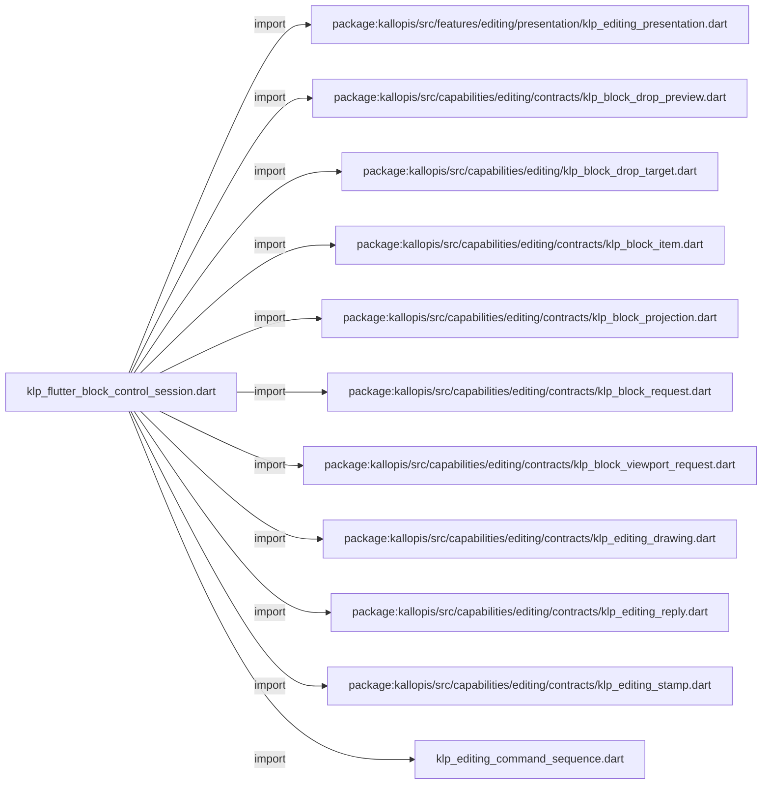
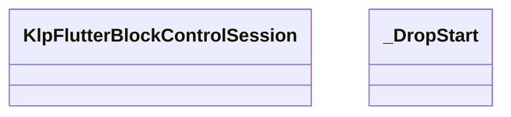

# klp_flutter_block_control_session.dart：直接依賴與宣告架構

[回到目錄](README.md) · [來源檔案](../../../../../../lib/src/rendering/flutter/internal/klp_flutter_block_control_session.dart)

## 範圍

核心是 `lib/src/rendering/flutter/internal/klp_flutter_block_control_session.dart`。主要視角為該檔案明寫的 import／export／part；輔助視角為本檔宣告及 extends／implements／with／on 關係。只展開一層外部邊界。

## 直接依賴圖

## 依賴證據

| 關係 | 原始 directive | 來源 |
|---|---|---|
| import | <code>import &#x27;package:kallopis/src/features/editing/presentation/klp_editing_presentation.dart&#x27;;</code> | [lib/src/rendering/flutter/internal/klp_flutter_block_control_session.dart:1](../../../../../../lib/src/rendering/flutter/internal/klp_flutter_block_control_session.dart#L1) |
| import | <code>import &#x27;package:kallopis/src/capabilities/editing/contracts/klp_block_drop_preview.dart&#x27;;</code> | [lib/src/rendering/flutter/internal/klp_flutter_block_control_session.dart:2](../../../../../../lib/src/rendering/flutter/internal/klp_flutter_block_control_session.dart#L2) |
| import | <code>import &#x27;package:kallopis/src/capabilities/editing/klp_block_drop_target.dart&#x27;;</code> | [lib/src/rendering/flutter/internal/klp_flutter_block_control_session.dart:3](../../../../../../lib/src/rendering/flutter/internal/klp_flutter_block_control_session.dart#L3) |
| import | <code>import &#x27;package:kallopis/src/capabilities/editing/contracts/klp_block_item.dart&#x27;;</code> | [lib/src/rendering/flutter/internal/klp_flutter_block_control_session.dart:4](../../../../../../lib/src/rendering/flutter/internal/klp_flutter_block_control_session.dart#L4) |
| import | <code>import &#x27;package:kallopis/src/capabilities/editing/contracts/klp_block_projection.dart&#x27;;</code> | [lib/src/rendering/flutter/internal/klp_flutter_block_control_session.dart:5](../../../../../../lib/src/rendering/flutter/internal/klp_flutter_block_control_session.dart#L5) |
| import | <code>import &#x27;package:kallopis/src/capabilities/editing/contracts/klp_block_request.dart&#x27;;</code> | [lib/src/rendering/flutter/internal/klp_flutter_block_control_session.dart:6](../../../../../../lib/src/rendering/flutter/internal/klp_flutter_block_control_session.dart#L6) |
| import | <code>import &#x27;package:kallopis/src/capabilities/editing/contracts/klp_block_viewport_request.dart&#x27;;</code> | [lib/src/rendering/flutter/internal/klp_flutter_block_control_session.dart:7](../../../../../../lib/src/rendering/flutter/internal/klp_flutter_block_control_session.dart#L7) |
| import | <code>import &#x27;package:kallopis/src/capabilities/editing/contracts/klp_editing_drawing.dart&#x27;;</code> | [lib/src/rendering/flutter/internal/klp_flutter_block_control_session.dart:8](../../../../../../lib/src/rendering/flutter/internal/klp_flutter_block_control_session.dart#L8) |
| import | <code>import &#x27;package:kallopis/src/capabilities/editing/contracts/klp_editing_reply.dart&#x27;;</code> | [lib/src/rendering/flutter/internal/klp_flutter_block_control_session.dart:9](../../../../../../lib/src/rendering/flutter/internal/klp_flutter_block_control_session.dart#L9) |
| import | <code>import &#x27;package:kallopis/src/capabilities/editing/contracts/klp_editing_stamp.dart&#x27;;</code> | [lib/src/rendering/flutter/internal/klp_flutter_block_control_session.dart:10](../../../../../../lib/src/rendering/flutter/internal/klp_flutter_block_control_session.dart#L10) |
| import | <code>import &#x27;klp_editing_command_sequence.dart&#x27;;</code> | [lib/src/rendering/flutter/internal/klp_flutter_block_control_session.dart:11](../../../../../../lib/src/rendering/flutter/internal/klp_flutter_block_control_session.dart#L11) |

## 宣告關係圖

本組節點是本檔宣告；沒有箭頭的宣告未在此圖主張互相依賴。

## 宣告與成員證據

成員包含 public 與 private；簽章取自來源，省略函式本體與欄位初始值。`(inferred)` 表示來源未明寫型別；建構子只顯示參數部分，不含初始化列表。

### KlpFlutterBlockControlSession

ClassDeclaration · public · [lib/src/rendering/flutter/internal/klp_flutter_block_control_session.dart:13](../../../../../../lib/src/rendering/flutter/internal/klp_flutter_block_control_session.dart#L13)

<code>final class KlpFlutterBlockControlSession</code>

來源註解摘要：K02 單一區塊命令機制；可見控制位置定型前不自行建立第二份選取狀態。

| 成員 | 可見性 | 簽章／型別 | 來源註解摘要 | 證據 |
|---|---|---|---|---|
| field <code>_controls</code> | private | <code>final KlpBoundBlockControls _controls</code> |  | [lib/src/rendering/flutter/internal/klp_flutter_block_control_session.dart:15](../../../../../../lib/src/rendering/flutter/internal/klp_flutter_block_control_session.dart#L15) |
| field <code>_sequence</code> | private | <code>final KlpEditingCommandSequence _sequence</code> |  | [lib/src/rendering/flutter/internal/klp_flutter_block_control_session.dart:16](../../../../../../lib/src/rendering/flutter/internal/klp_flutter_block_control_session.dart#L16) |
| field <code>_drawing</code> | private | <code>final KlpEditingDrawing Function() _drawing</code> |  | [lib/src/rendering/flutter/internal/klp_flutter_block_control_session.dart:17](../../../../../../lib/src/rendering/flutter/internal/klp_flutter_block_control_session.dart#L17) |
| field <code>_interrupt</code> | private | <code>final Future&lt;void&gt; Function() _interrupt</code> |  | [lib/src/rendering/flutter/internal/klp_flutter_block_control_session.dart:18](../../../../../../lib/src/rendering/flutter/internal/klp_flutter_block_control_session.dart#L18) |
| field <code>_busy</code> | private | <code>bool _busy</code> |  | [lib/src/rendering/flutter/internal/klp_flutter_block_control_session.dart:19](../../../../../../lib/src/rendering/flutter/internal/klp_flutter_block_control_session.dart#L19) |
| field <code>_closed</code> | private | <code>bool _closed</code> |  | [lib/src/rendering/flutter/internal/klp_flutter_block_control_session.dart:20](../../../../../../lib/src/rendering/flutter/internal/klp_flutter_block_control_session.dart#L20) |
| field <code>_dropViewportPending</code> | private | <code>bool _dropViewportPending</code> |  | [lib/src/rendering/flutter/internal/klp_flutter_block_control_session.dart:21](../../../../../../lib/src/rendering/flutter/internal/klp_flutter_block_control_session.dart#L21) |
| field <code>_drop</code> | private | <code>_DropStart? _drop</code> |  | [lib/src/rendering/flutter/internal/klp_flutter_block_control_session.dart:22](../../../../../../lib/src/rendering/flutter/internal/klp_flutter_block_control_session.dart#L22) |
| field <code>_dropPreview</code> | private | <code>KlpBlockDropPreview? _dropPreview</code> |  | [lib/src/rendering/flutter/internal/klp_flutter_block_control_session.dart:23](../../../../../../lib/src/rendering/flutter/internal/klp_flutter_block_control_session.dart#L23) |
| constructor <code>KlpFlutterBlockControlSession</code> | public | <code>KlpFlutterBlockControlSession(this._controls, this._sequence, this._drawing, this._interrupt)</code> |  | [lib/src/rendering/flutter/internal/klp_flutter_block_control_session.dart:25](../../../../../../lib/src/rendering/flutter/internal/klp_flutter_block_control_session.dart#L25) |
| method <code>select</code> | public | <code>Future&lt;KlpEditingReply&gt; select(String blockId)</code> |  | [lib/src/rendering/flutter/internal/klp_flutter_block_control_session.dart:27](../../../../../../lib/src/rendering/flutter/internal/klp_flutter_block_control_session.dart#L27) |
| method <code>selectRange</code> | public | <code>Future&lt;KlpEditingReply&gt; selectRange(String anchorId, String focusId)</code> |  | [lib/src/rendering/flutter/internal/klp_flutter_block_control_session.dart:28](../../../../../../lib/src/rendering/flutter/internal/klp_flutter_block_control_session.dart#L28) |
| method <code>moveBefore</code> | public | <code>Future&lt;KlpEditingReply&gt; moveBefore(String blockId)</code> |  | [lib/src/rendering/flutter/internal/klp_flutter_block_control_session.dart:29](../../../../../../lib/src/rendering/flutter/internal/klp_flutter_block_control_session.dart#L29) |
| method <code>moveAfter</code> | public | <code>Future&lt;KlpEditingReply&gt; moveAfter(String blockId)</code> |  | [lib/src/rendering/flutter/internal/klp_flutter_block_control_session.dart:30](../../../../../../lib/src/rendering/flutter/internal/klp_flutter_block_control_session.dart#L30) |
| method <code>convert</code> | public | <code>Future&lt;KlpEditingReply&gt; convert(String blockId, KlpBlockTextKind target)</code> |  | [lib/src/rendering/flutter/internal/klp_flutter_block_control_session.dart:31](../../../../../../lib/src/rendering/flutter/internal/klp_flutter_block_control_session.dart#L31) |
| method <code>convertSelectionToUnorderedList</code> | public | <code>Future&lt;KlpEditingReply&gt; convertSelectionToUnorderedList()</code> |  | [lib/src/rendering/flutter/internal/klp_flutter_block_control_session.dart:32](../../../../../../lib/src/rendering/flutter/internal/klp_flutter_block_control_session.dart#L32) |
| method <code>convertSelectionToOrderedList</code> | public | <code>Future&lt;KlpEditingReply&gt; convertSelectionToOrderedList()</code> |  | [lib/src/rendering/flutter/internal/klp_flutter_block_control_session.dart:33](../../../../../../lib/src/rendering/flutter/internal/klp_flutter_block_control_session.dart#L33) |
| method <code>convertSelectionToParagraph</code> | public | <code>Future&lt;KlpEditingReply&gt; convertSelectionToParagraph()</code> |  | [lib/src/rendering/flutter/internal/klp_flutter_block_control_session.dart:34](../../../../../../lib/src/rendering/flutter/internal/klp_flutter_block_control_session.dart#L34) |
| method <code>indentSelection</code> | public | <code>Future&lt;KlpEditingReply&gt; indentSelection()</code> |  | [lib/src/rendering/flutter/internal/klp_flutter_block_control_session.dart:35](../../../../../../lib/src/rendering/flutter/internal/klp_flutter_block_control_session.dart#L35) |
| method <code>outdentSelection</code> | public | <code>Future&lt;KlpEditingReply&gt; outdentSelection()</code> |  | [lib/src/rendering/flutter/internal/klp_flutter_block_control_session.dart:36](../../../../../../lib/src/rendering/flutter/internal/klp_flutter_block_control_session.dart#L36) |
| method <code>toggleTaskChecked</code> | public | <code>Future&lt;KlpEditingReply&gt; toggleTaskChecked(String blockId)</code> |  | [lib/src/rendering/flutter/internal/klp_flutter_block_control_session.dart:37](../../../../../../lib/src/rendering/flutter/internal/klp_flutter_block_control_session.dart#L37) |
| method <code>toggleCollapsed</code> | public | <code>Future&lt;KlpEditingReply&gt; toggleCollapsed(String blockId)</code> |  | [lib/src/rendering/flutter/internal/klp_flutter_block_control_session.dart:38](../../../../../../lib/src/rendering/flutter/internal/klp_flutter_block_control_session.dart#L38) |
| method <code>undo</code> | public | <code>Future&lt;KlpEditingReply&gt; undo()</code> |  | [lib/src/rendering/flutter/internal/klp_flutter_block_control_session.dart:39](../../../../../../lib/src/rendering/flutter/internal/klp_flutter_block_control_session.dart#L39) |
| method <code>redo</code> | public | <code>Future&lt;KlpEditingReply&gt; redo()</code> |  | [lib/src/rendering/flutter/internal/klp_flutter_block_control_session.dart:40](../../../../../../lib/src/rendering/flutter/internal/klp_flutter_block_control_session.dart#L40) |
| method <code>beginDrop</code> | public | <code>void beginDrop(String blockId)</code> | 指標與鍵盤共用此入口，只保留 stable source 與開始時的完整 stamp。 | [lib/src/rendering/flutter/internal/klp_flutter_block_control_session.dart:42](../../../../../../lib/src/rendering/flutter/internal/klp_flutter_block_control_session.dart#L42) |
| method <code>previewDrop</code> | public | <code>KlpBlockDropPreview previewDrop(String targetId, KlpBlockDropPlacement placement)</code> | 更新本地候選落點；不建立 request，也不改動公開投影。 | [lib/src/rendering/flutter/internal/klp_flutter_block_control_session.dart:54](../../../../../../lib/src/rendering/flutter/internal/klp_flutter_block_control_session.dart#L54) |
| method <code>cancelDrop</code> | public | <code>void cancelDrop()</code> | Esc、失焦與來源失效都只清除本地暫態，絕不反向送出移動。 | [lib/src/rendering/flutter/internal/klp_flutter_block_control_session.dart:72](../../../../../../lib/src/rendering/flutter/internal/klp_flutter_block_control_session.dart#L72) |
| method <code>clearDropPreview</code> | public | <code>void clearDropPreview()</code> | 指標暫時離開合法落點時只清除指示，拖曳來源仍維持有效。 | [lib/src/rendering/flutter/internal/klp_flutter_block_control_session.dart:78](../../../../../../lib/src/rendering/flutter/internal/klp_flutter_block_control_session.dart#L78) |
| method <code>scrollDropViewport</code> | public | <code>Future&lt;bool&gt; scrollDropViewport(double deltaY)</code> |  | [lib/src/rendering/flutter/internal/klp_flutter_block_control_session.dart:84](../../../../../../lib/src/rendering/flutter/internal/klp_flutter_block_control_session.dart#L84) |
| getter <code>dropViewportPending</code> | public | <code>bool get dropViewportPending</code> |  | [lib/src/rendering/flutter/internal/klp_flutter_block_control_session.dart:116](../../../../../../lib/src/rendering/flutter/internal/klp_flutter_block_control_session.dart#L116) |
| method <code>commitDrop</code> | public | <code>Future&lt;KlpEditingReply&gt; commitDrop()</code> |  | [lib/src/rendering/flutter/internal/klp_flutter_block_control_session.dart:118](../../../../../../lib/src/rendering/flutter/internal/klp_flutter_block_control_session.dart#L118) |
| getter <code>dropPreview</code> | public | <code>KlpBlockDropPreview? get dropPreview</code> |  | [lib/src/rendering/flutter/internal/klp_flutter_block_control_session.dart:152](../../../../../../lib/src/rendering/flutter/internal/klp_flutter_block_control_session.dart#L152) |
| method <code>_history</code> | private | <code>Future&lt;KlpEditingReply&gt; _history(KlpBlockIntent intent)</code> |  | [lib/src/rendering/flutter/internal/klp_flutter_block_control_session.dart:170](../../../../../../lib/src/rendering/flutter/internal/klp_flutter_block_control_session.dart#L170) |
| method <code>_runListOperation</code> | private | <code>Future&lt;KlpEditingReply&gt; _runListOperation(KlpBlockIntent intent)</code> |  | [lib/src/rendering/flutter/internal/klp_flutter_block_control_session.dart:177](../../../../../../lib/src/rendering/flutter/internal/klp_flutter_block_control_session.dart#L177) |
| method <code>_run</code> | private | <code>Future&lt;KlpEditingReply&gt; _run(KlpBlockIntent intent, String blockId, {String? rangeEndId, KlpBlockTextKind? conversion})</code> |  | [lib/src/rendering/flutter/internal/klp_flutter_block_control_session.dart:188](../../../../../../lib/src/rendering/flutter/internal/klp_flutter_block_control_session.dart#L188) |
| method <code>_target</code> | private | <code>String? _target(KlpBlockProjection projection, KlpBlockItem block, KlpBlockIntent intent)</code> |  | [lib/src/rendering/flutter/internal/klp_flutter_block_control_session.dart:227](../../../../../../lib/src/rendering/flutter/internal/klp_flutter_block_control_session.dart#L227) |
| method <code>_rangeMatches</code> | private | <code>bool _rangeMatches(KlpBlockProjection projection, _DropStart drop)</code> |  | [lib/src/rendering/flutter/internal/klp_flutter_block_control_session.dart:234](../../../../../../lib/src/rendering/flutter/internal/klp_flutter_block_control_session.dart#L234) |
| method <code>_block</code> | private | <code>KlpBlockItem _block(List&lt;KlpBlockItem&gt; blocks, String id)</code> |  | [lib/src/rendering/flutter/internal/klp_flutter_block_control_session.dart:236](../../../../../../lib/src/rendering/flutter/internal/klp_flutter_block_control_session.dart#L236) |
| method <code>_drawingStamp</code> | private | <code>KlpEditingStamp _drawingStamp(KlpEditingDrawing drawing)</code> |  | [lib/src/rendering/flutter/internal/klp_flutter_block_control_session.dart:238](../../../../../../lib/src/rendering/flutter/internal/klp_flutter_block_control_session.dart#L238) |
| method <code>close</code> | public | <code>void close()</code> |  | [lib/src/rendering/flutter/internal/klp_flutter_block_control_session.dart:243](../../../../../../lib/src/rendering/flutter/internal/klp_flutter_block_control_session.dart#L243) |

### _DropStart

ClassDeclaration · private · [lib/src/rendering/flutter/internal/klp_flutter_block_control_session.dart:249](../../../../../../lib/src/rendering/flutter/internal/klp_flutter_block_control_session.dart#L249)

<code>final class _DropStart</code>

| 成員 | 可見性 | 簽章／型別 | 來源註解摘要 | 證據 |
|---|---|---|---|---|
| field <code>expected</code> | public | <code>final KlpEditingStamp expected</code> |  | [lib/src/rendering/flutter/internal/klp_flutter_block_control_session.dart:250](../../../../../../lib/src/rendering/flutter/internal/klp_flutter_block_control_session.dart#L250) |
| field <code>firstId</code> | public | <code>final String firstId</code> |  | [lib/src/rendering/flutter/internal/klp_flutter_block_control_session.dart:251](../../../../../../lib/src/rendering/flutter/internal/klp_flutter_block_control_session.dart#L251) |
| field <code>lastId</code> | public | <code>final String lastId</code> |  | [lib/src/rendering/flutter/internal/klp_flutter_block_control_session.dart:252](../../../../../../lib/src/rendering/flutter/internal/klp_flutter_block_control_session.dart#L252) |
| field <code>handleId</code> | public | <code>final String handleId</code> |  | [lib/src/rendering/flutter/internal/klp_flutter_block_control_session.dart:253](../../../../../../lib/src/rendering/flutter/internal/klp_flutter_block_control_session.dart#L253) |
| constructor <code>_DropStart</code> | private | <code>const _DropStart(this.expected, this.firstId, this.lastId, this.handleId)</code> |  | [lib/src/rendering/flutter/internal/klp_flutter_block_control_session.dart:255](../../../../../../lib/src/rendering/flutter/internal/klp_flutter_block_control_session.dart#L255) |

## 閱讀說明與限制

箭頭只表示來源明寫的靜態關係；import 不等於呼叫。未分析動態呼叫、欄位的實際物件擁有權、狀態轉移或渲染流程；型別未進行語意解析，繼承目標保留原始型別拼寫。public／private 依 Dart 名稱前綴判斷；public 宣告不代表已由 `lib/kallopis.dart` 匯出。

本頁由 `tool/architecture_atlas` 產生；編輯來源或生成工具後重新產生，避免手改本頁。
