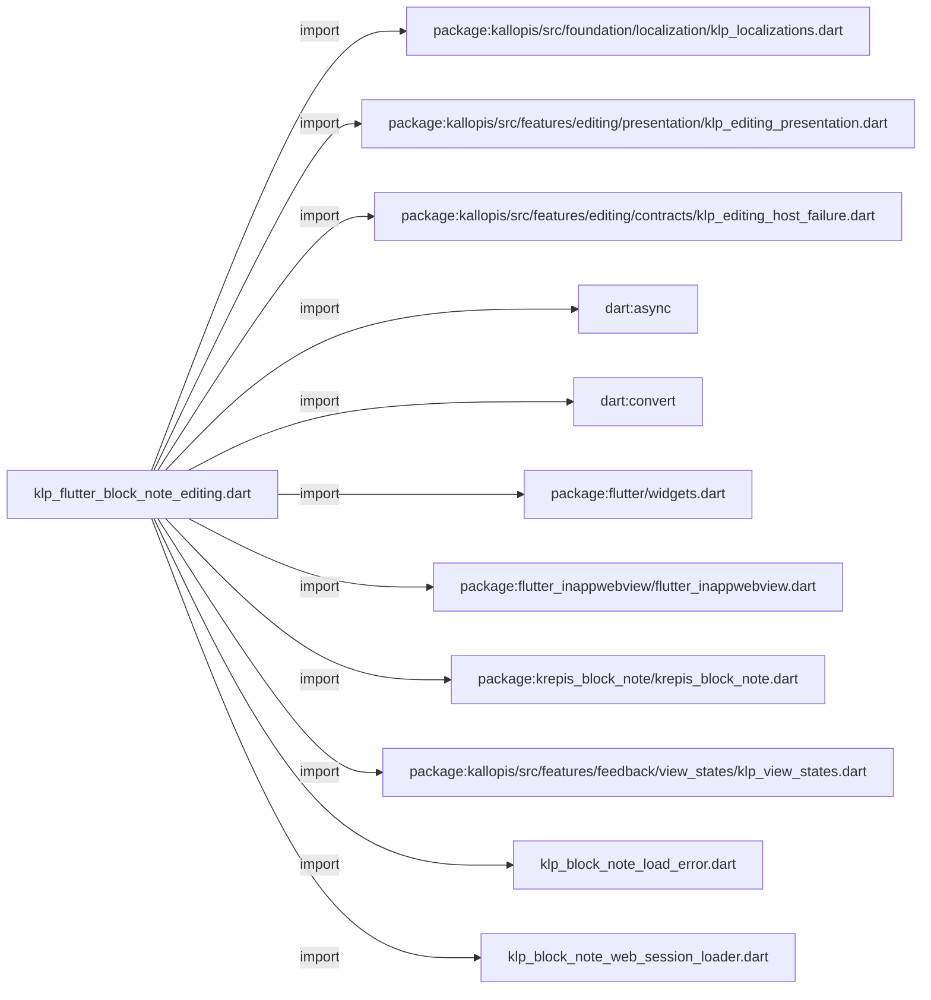
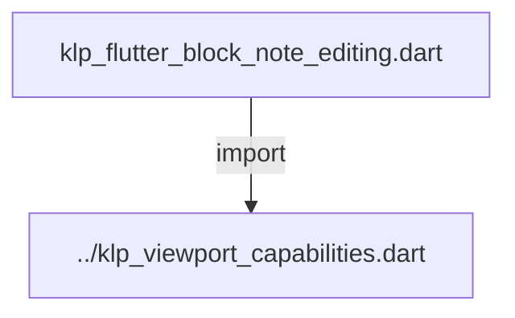
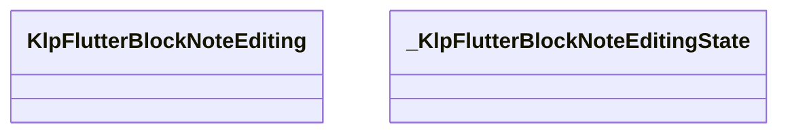
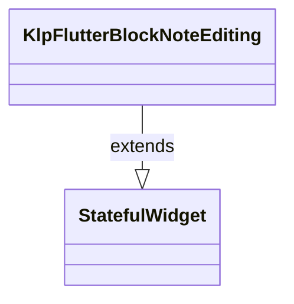
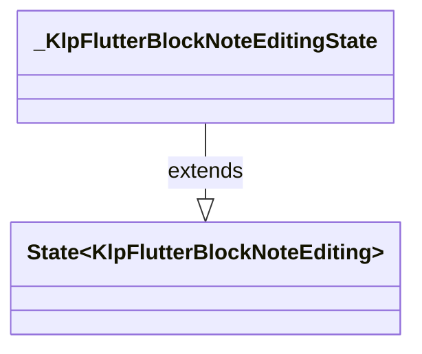

# klp_flutter_block_note_editing.dart：直接依賴與宣告架構

[回到目錄](README.md) · [來源檔案](../../../../../../lib/src/rendering/flutter/internal/klp_flutter_block_note_editing.dart)

## 範圍

核心是 `lib/src/rendering/flutter/internal/klp_flutter_block_note_editing.dart`。主要視角為該檔案明寫的 import／export／part；輔助視角為本檔宣告及 extends／implements／with／on 關係。只展開一層外部邊界。

## 直接依賴圖

## 依賴證據

| 關係 | 原始 directive | 來源 |
|---|---|---|
| import | <code>import &#x27;package:kallopis/src/foundation/localization/klp_localizations.dart&#x27;;</code> | [lib/src/rendering/flutter/internal/klp_flutter_block_note_editing.dart:1](../../../../../../lib/src/rendering/flutter/internal/klp_flutter_block_note_editing.dart#L1) |
| import | <code>import &#x27;package:kallopis/src/features/editing/presentation/klp_editing_presentation.dart&#x27;;</code> | [lib/src/rendering/flutter/internal/klp_flutter_block_note_editing.dart:2](../../../../../../lib/src/rendering/flutter/internal/klp_flutter_block_note_editing.dart#L2) |
| import | <code>import &#x27;package:kallopis/src/features/editing/contracts/klp_editing_host_failure.dart&#x27;;</code> | [lib/src/rendering/flutter/internal/klp_flutter_block_note_editing.dart:3](../../../../../../lib/src/rendering/flutter/internal/klp_flutter_block_note_editing.dart#L3) |
| import | <code>import &#x27;dart:async&#x27;;</code> | [lib/src/rendering/flutter/internal/klp_flutter_block_note_editing.dart:4](../../../../../../lib/src/rendering/flutter/internal/klp_flutter_block_note_editing.dart#L4) |
| import | <code>import &#x27;dart:convert&#x27;;</code> | [lib/src/rendering/flutter/internal/klp_flutter_block_note_editing.dart:5](../../../../../../lib/src/rendering/flutter/internal/klp_flutter_block_note_editing.dart#L5) |
| import | <code>import &#x27;package:flutter/widgets.dart&#x27;;</code> | [lib/src/rendering/flutter/internal/klp_flutter_block_note_editing.dart:7](../../../../../../lib/src/rendering/flutter/internal/klp_flutter_block_note_editing.dart#L7) |
| import | <code>import &#x27;package:flutter_inappwebview/flutter_inappwebview.dart&#x27;;</code> | [lib/src/rendering/flutter/internal/klp_flutter_block_note_editing.dart:8](../../../../../../lib/src/rendering/flutter/internal/klp_flutter_block_note_editing.dart#L8) |
| import | <code>import &#x27;package:krepis_block_note/krepis_block_note.dart&#x27;;</code> | [lib/src/rendering/flutter/internal/klp_flutter_block_note_editing.dart:9](../../../../../../lib/src/rendering/flutter/internal/klp_flutter_block_note_editing.dart#L9) |
| import | <code>import &#x27;package:kallopis/src/features/feedback/view_states/klp_view_states.dart&#x27;;</code> | [lib/src/rendering/flutter/internal/klp_flutter_block_note_editing.dart:10](../../../../../../lib/src/rendering/flutter/internal/klp_flutter_block_note_editing.dart#L10) |
| import | <code>import &#x27;klp_block_note_load_error.dart&#x27;;</code> | [lib/src/rendering/flutter/internal/klp_flutter_block_note_editing.dart:12](../../../../../../lib/src/rendering/flutter/internal/klp_flutter_block_note_editing.dart#L12) |
| import | <code>import &#x27;klp_block_note_web_session_loader.dart&#x27;;</code> | [lib/src/rendering/flutter/internal/klp_flutter_block_note_editing.dart:13](../../../../../../lib/src/rendering/flutter/internal/klp_flutter_block_note_editing.dart#L13) |
| import | <code>import &#x27;../klp_viewport_capabilities.dart&#x27;;</code> | [lib/src/rendering/flutter/internal/klp_flutter_block_note_editing.dart:14](../../../../../../lib/src/rendering/flutter/internal/klp_flutter_block_note_editing.dart#L14) |

## 宣告關係圖

本組節點是本檔宣告；沒有箭頭的宣告未在此圖主張互相依賴。

## 宣告與成員證據

成員包含 public 與 private；簽章取自來源，省略函式本體與欄位初始值。`(inferred)` 表示來源未明寫型別；建構子只顯示參數部分，不含初始化列表。

### KlpFlutterBlockNoteEditing

ClassDeclaration · public · [lib/src/rendering/flutter/internal/klp_flutter_block_note_editing.dart:16](../../../../../../lib/src/rendering/flutter/internal/klp_flutter_block_note_editing.dart#L16)

<code>final class KlpFlutterBlockNoteEditing extends StatefulWidget</code>

來源註解摘要：只載入 Kallopis 打包的固定 BlockNote 應用，所有 bridge 封包仍由 session controller 驗證。

- `extends` → <code>StatefulWidget</code>：[lib/src/rendering/flutter/internal/klp_flutter_block_note_editing.dart:17](../../../../../../lib/src/rendering/flutter/internal/klp_flutter_block_note_editing.dart#L17)

| 成員 | 可見性 | 簽章／型別 | 來源註解摘要 | 證據 |
|---|---|---|---|---|
| field <code>content</code> | public | <code>final KlpBoundBlockNoteEditing content</code> |  | [lib/src/rendering/flutter/internal/klp_flutter_block_note_editing.dart:18](../../../../../../lib/src/rendering/flutter/internal/klp_flutter_block_note_editing.dart#L18) |
| constructor <code>KlpFlutterBlockNoteEditing</code> | public | <code>const KlpFlutterBlockNoteEditing({required this.content, super.key})</code> |  | [lib/src/rendering/flutter/internal/klp_flutter_block_note_editing.dart:19](../../../../../../lib/src/rendering/flutter/internal/klp_flutter_block_note_editing.dart#L19) |
| method <code>createState</code> | public | <code>State&lt;KlpFlutterBlockNoteEditing&gt; createState()</code> |  | [lib/src/rendering/flutter/internal/klp_flutter_block_note_editing.dart:21](../../../../../../lib/src/rendering/flutter/internal/klp_flutter_block_note_editing.dart#L21) |

### _KlpFlutterBlockNoteEditingState

ClassDeclaration · private · [lib/src/rendering/flutter/internal/klp_flutter_block_note_editing.dart:25](../../../../../../lib/src/rendering/flutter/internal/klp_flutter_block_note_editing.dart#L25)

<code>final class _KlpFlutterBlockNoteEditingState extends State&lt;KlpFlutterBlockNoteEditing&gt;</code>

- `extends` → <code>State&lt;KlpFlutterBlockNoteEditing&gt;</code>：[lib/src/rendering/flutter/internal/klp_flutter_block_note_editing.dart:25](../../../../../../lib/src/rendering/flutter/internal/klp_flutter_block_note_editing.dart#L25)

| 成員 | 可見性 | 簽章／型別 | 來源註解摘要 | 證據 |
|---|---|---|---|---|
| field <code>_webView</code> | private | <code>InAppWebViewController? _webView</code> |  | [lib/src/rendering/flutter/internal/klp_flutter_block_note_editing.dart:26](../../../../../../lib/src/rendering/flutter/internal/klp_flutter_block_note_editing.dart#L26) |
| field <code>_environment</code> | private | <code>Future&lt;WebViewEnvironment?&gt;? _environment</code> |  | [lib/src/rendering/flutter/internal/klp_flutter_block_note_editing.dart:27](../../../../../../lib/src/rendering/flutter/internal/klp_flutter_block_note_editing.dart#L27) |
| field <code>_loader</code> | private | <code>late final KlpBlockNoteWebSessionLoader _loader</code> |  | [lib/src/rendering/flutter/internal/klp_flutter_block_note_editing.dart:28](../../../../../../lib/src/rendering/flutter/internal/klp_flutter_block_note_editing.dart#L28) |
| field <code>_session</code> | private | <code>late final KlpBlockNoteSessionController _session</code> |  | [lib/src/rendering/flutter/internal/klp_flutter_block_note_editing.dart:29](../../../../../../lib/src/rendering/flutter/internal/klp_flutter_block_note_editing.dart#L29) |
| field <code>_channel</code> | private | <code>late final KlpBlockNoteBridgeChannel _channel</code> |  | [lib/src/rendering/flutter/internal/klp_flutter_block_note_editing.dart:30](../../../../../../lib/src/rendering/flutter/internal/klp_flutter_block_note_editing.dart#L30) |
| field <code>_failureSink</code> | private | <code>late KlpEditingHostFailureSink _failureSink</code> |  | [lib/src/rendering/flutter/internal/klp_flutter_block_note_editing.dart:31](../../../../../../lib/src/rendering/flutter/internal/klp_flutter_block_note_editing.dart#L31) |
| field <code>_openPhase</code> | private | <code>KlpEditingHostPhase _openPhase</code> |  | [lib/src/rendering/flutter/internal/klp_flutter_block_note_editing.dart:32](../../../../../../lib/src/rendering/flutter/internal/klp_flutter_block_note_editing.dart#L32) |
| field <code>_closed</code> | private | <code>bool _closed</code> |  | [lib/src/rendering/flutter/internal/klp_flutter_block_note_editing.dart:33](../../../../../../lib/src/rendering/flutter/internal/klp_flutter_block_note_editing.dart#L33) |
| field <code>_ownsSender</code> | private | <code>bool _ownsSender</code> |  | [lib/src/rendering/flutter/internal/klp_flutter_block_note_editing.dart:34](../../../../../../lib/src/rendering/flutter/internal/klp_flutter_block_note_editing.dart#L34) |
| field <code>_environmentDisposalStarted</code> | private | <code>bool _environmentDisposalStarted</code> |  | [lib/src/rendering/flutter/internal/klp_flutter_block_note_editing.dart:35](../../../../../../lib/src/rendering/flutter/internal/klp_flutter_block_note_editing.dart#L35) |
| method <code>initState</code> | public | <code>void initState()</code> |  | [lib/src/rendering/flutter/internal/klp_flutter_block_note_editing.dart:37](../../../../../../lib/src/rendering/flutter/internal/klp_flutter_block_note_editing.dart#L37) |
| method <code>didChangeDependencies</code> | public | <code>void didChangeDependencies()</code> |  | [lib/src/rendering/flutter/internal/klp_flutter_block_note_editing.dart:45](../../../../../../lib/src/rendering/flutter/internal/klp_flutter_block_note_editing.dart#L45) |
| method <code>_report</code> | private | <code>void _report(KlpEditingHostPhase phase, Object error, StackTrace stack)</code> |  | [lib/src/rendering/flutter/internal/klp_flutter_block_note_editing.dart:53](../../../../../../lib/src/rendering/flutter/internal/klp_flutter_block_note_editing.dart#L53) |
| method <code>_live</code> | private | <code>bool _live(InAppWebViewController controller)</code> |  | [lib/src/rendering/flutter/internal/klp_flutter_block_note_editing.dart:57](../../../../../../lib/src/rendering/flutter/internal/klp_flutter_block_note_editing.dart#L57) |
| method <code>_releaseSender</code> | private | <code>void _releaseSender()</code> |  | [lib/src/rendering/flutter/internal/klp_flutter_block_note_editing.dart:59](../../../../../../lib/src/rendering/flutter/internal/klp_flutter_block_note_editing.dart#L59) |
| method <code>build</code> | public | <code>Widget build(BuildContext context)</code> |  | [lib/src/rendering/flutter/internal/klp_flutter_block_note_editing.dart:65](../../../../../../lib/src/rendering/flutter/internal/klp_flutter_block_note_editing.dart#L65) |
| method <code>_buildWebView</code> | private | <code>Widget _buildWebView(WebViewEnvironment? environment)</code> |  | [lib/src/rendering/flutter/internal/klp_flutter_block_note_editing.dart:84](../../../../../../lib/src/rendering/flutter/internal/klp_flutter_block_note_editing.dart#L84) |
| method <code>_createEnvironment</code> | private | <code>Future&lt;WebViewEnvironment?&gt; _createEnvironment(bool nativeWindows)</code> |  | [lib/src/rendering/flutter/internal/klp_flutter_block_note_editing.dart:122](../../../../../../lib/src/rendering/flutter/internal/klp_flutter_block_note_editing.dart#L122) |
| method <code>_createWebView</code> | private | <code>void _createWebView(InAppWebViewController controller)</code> |  | [lib/src/rendering/flutter/internal/klp_flutter_block_note_editing.dart:137](../../../../../../lib/src/rendering/flutter/internal/klp_flutter_block_note_editing.dart#L137) |
| method <code>_openReference</code> | private | <code>Future&lt;void&gt; _openReference(List&lt;dynamic&gt; arguments)</code> |  | [lib/src/rendering/flutter/internal/klp_flutter_block_note_editing.dart:146](../../../../../../lib/src/rendering/flutter/internal/klp_flutter_block_note_editing.dart#L146) |
| method <code>_openAsset</code> | private | <code>Future&lt;void&gt; _openAsset(List&lt;dynamic&gt; arguments)</code> |  | [lib/src/rendering/flutter/internal/klp_flutter_block_note_editing.dart:165](../../../../../../lib/src/rendering/flutter/internal/klp_flutter_block_note_editing.dart#L165) |
| method <code>_resolveAsset</code> | private | <code>Future&lt;Map&lt;String, Object?&gt;&gt; _resolveAsset(List&lt;dynamic&gt; arguments)</code> |  | [lib/src/rendering/flutter/internal/klp_flutter_block_note_editing.dart:179](../../../../../../lib/src/rendering/flutter/internal/klp_flutter_block_note_editing.dart#L179) |
| method <code>_open</code> | private | <code>Future&lt;void&gt; _open()</code> |  | [lib/src/rendering/flutter/internal/klp_flutter_block_note_editing.dart:194](../../../../../../lib/src/rendering/flutter/internal/klp_flutter_block_note_editing.dart#L194) |
| method <code>_retry</code> | private | <code>Future&lt;void&gt; _retry()</code> |  | [lib/src/rendering/flutter/internal/klp_flutter_block_note_editing.dart:200](../../../../../../lib/src/rendering/flutter/internal/klp_flutter_block_note_editing.dart#L200) |
| method <code>_attemptOpen</code> | private | <code>Future&lt;void&gt; _attemptOpen()</code> |  | [lib/src/rendering/flutter/internal/klp_flutter_block_note_editing.dart:206](../../../../../../lib/src/rendering/flutter/internal/klp_flutter_block_note_editing.dart#L206) |
| method <code>_waitForBridge</code> | private | <code>Future&lt;void&gt; _waitForBridge(InAppWebViewController controller)</code> |  | [lib/src/rendering/flutter/internal/klp_flutter_block_note_editing.dart:253](../../../../../../lib/src/rendering/flutter/internal/klp_flutter_block_note_editing.dart#L253) |
| method <code>_send</code> | private | <code>Future&lt;void&gt; _send(InAppWebViewController controller, Map&lt;String, Object?&gt; command)</code> |  | [lib/src/rendering/flutter/internal/klp_flutter_block_note_editing.dart:265](../../../../../../lib/src/rendering/flutter/internal/klp_flutter_block_note_editing.dart#L265) |
| method <code>_receive</code> | private | <code>Future&lt;Object?&gt; _receive(List&lt;dynamic&gt; arguments)</code> |  | [lib/src/rendering/flutter/internal/klp_flutter_block_note_editing.dart:273](../../../../../../lib/src/rendering/flutter/internal/klp_flutter_block_note_editing.dart#L273) |
| method <code>_disposeEnvironment</code> | private | <code>Future&lt;void&gt; _disposeEnvironment(WebViewEnvironment? value)</code> |  | [lib/src/rendering/flutter/internal/klp_flutter_block_note_editing.dart:288](../../../../../../lib/src/rendering/flutter/internal/klp_flutter_block_note_editing.dart#L288) |
| method <code>dispose</code> | public | <code>void dispose()</code> |  | [lib/src/rendering/flutter/internal/klp_flutter_block_note_editing.dart:295](../../../../../../lib/src/rendering/flutter/internal/klp_flutter_block_note_editing.dart#L295) |

## 閱讀說明與限制

箭頭只表示來源明寫的靜態關係；import 不等於呼叫。未分析動態呼叫、欄位的實際物件擁有權、狀態轉移或渲染流程；型別未進行語意解析，繼承目標保留原始型別拼寫。public／private 依 Dart 名稱前綴判斷；public 宣告不代表已由 `lib/kallopis.dart` 匯出。

本頁由 `tool/architecture_atlas` 產生；編輯來源或生成工具後重新產生，避免手改本頁。
