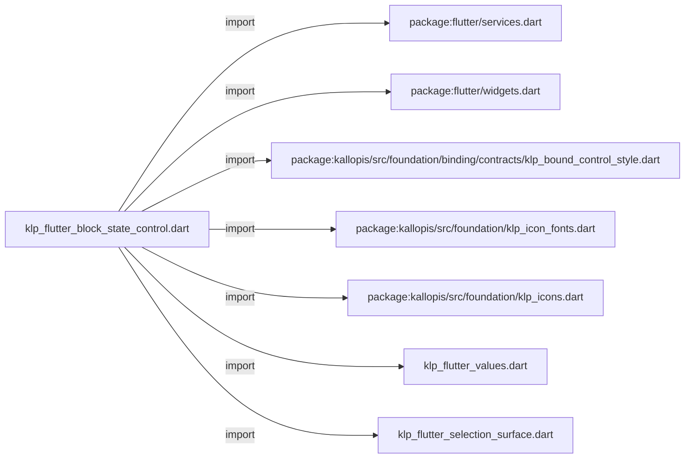
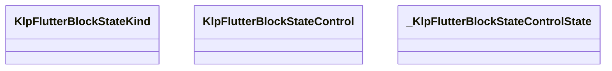
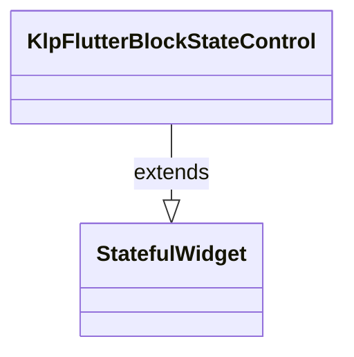
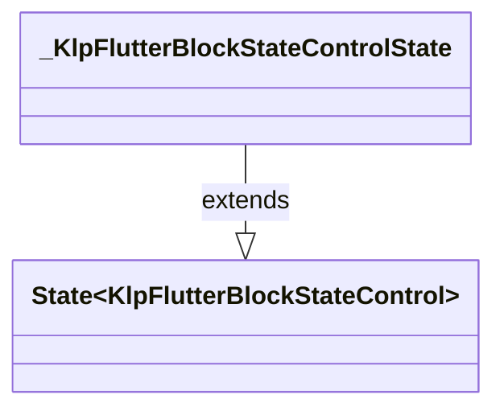

# klp_flutter_block_state_control.dart：直接依賴與宣告架構

[回到目錄](README.md) · [來源檔案](../../../../../../lib/src/rendering/flutter/internal/klp_flutter_block_state_control.dart)

## 範圍

核心是 `lib/src/rendering/flutter/internal/klp_flutter_block_state_control.dart`。主要視角為該檔案明寫的 import／export／part；輔助視角為本檔宣告及 extends／implements／with／on 關係。只展開一層外部邊界。

## 直接依賴圖

## 依賴證據

| 關係 | 原始 directive | 來源 |
|---|---|---|
| import | <code>import &#x27;package:flutter/services.dart&#x27;;</code> | [lib/src/rendering/flutter/internal/klp_flutter_block_state_control.dart:1](../../../../../../lib/src/rendering/flutter/internal/klp_flutter_block_state_control.dart#L1) |
| import | <code>import &#x27;package:flutter/widgets.dart&#x27;;</code> | [lib/src/rendering/flutter/internal/klp_flutter_block_state_control.dart:2](../../../../../../lib/src/rendering/flutter/internal/klp_flutter_block_state_control.dart#L2) |
| import | <code>import &#x27;package:kallopis/src/foundation/binding/contracts/klp_bound_control_style.dart&#x27;;</code> | [lib/src/rendering/flutter/internal/klp_flutter_block_state_control.dart:3](../../../../../../lib/src/rendering/flutter/internal/klp_flutter_block_state_control.dart#L3) |
| import | <code>import &#x27;package:kallopis/src/foundation/klp_icon_fonts.dart&#x27;;</code> | [lib/src/rendering/flutter/internal/klp_flutter_block_state_control.dart:4](../../../../../../lib/src/rendering/flutter/internal/klp_flutter_block_state_control.dart#L4) |
| import | <code>import &#x27;package:kallopis/src/foundation/klp_icons.dart&#x27;;</code> | [lib/src/rendering/flutter/internal/klp_flutter_block_state_control.dart:5](../../../../../../lib/src/rendering/flutter/internal/klp_flutter_block_state_control.dart#L5) |
| import | <code>import &#x27;klp_flutter_values.dart&#x27;;</code> | [lib/src/rendering/flutter/internal/klp_flutter_block_state_control.dart:6](../../../../../../lib/src/rendering/flutter/internal/klp_flutter_block_state_control.dart#L6) |
| import | <code>import &#x27;klp_flutter_selection_surface.dart&#x27;;</code> | [lib/src/rendering/flutter/internal/klp_flutter_block_state_control.dart:7](../../../../../../lib/src/rendering/flutter/internal/klp_flutter_block_state_control.dart#L7) |

## 宣告關係圖

本組節點是本檔宣告；沒有箭頭的宣告未在此圖主張互相依賴。

## 宣告與成員證據

成員包含 public 與 private；簽章取自來源，省略函式本體與欄位初始值。`(inferred)` 表示來源未明寫型別；建構子只顯示參數部分，不含初始化列表。

### KlpFlutterBlockStateKind

EnumDeclaration · public · [lib/src/rendering/flutter/internal/klp_flutter_block_state_control.dart:9](../../../../../../lib/src/rendering/flutter/internal/klp_flutter_block_state_control.dart#L9)

<code>enum KlpFlutterBlockStateKind</code>

| 成員 | 可見性 | 簽章／型別 | 來源註解摘要 | 證據 |
|---|---|---|---|---|
| enum value <code>task</code> | public | <code>task</code> |  | [lib/src/rendering/flutter/internal/klp_flutter_block_state_control.dart:9](../../../../../../lib/src/rendering/flutter/internal/klp_flutter_block_state_control.dart#L9) |
| enum value <code>disclosure</code> | public | <code>disclosure</code> |  | [lib/src/rendering/flutter/internal/klp_flutter_block_state_control.dart:9](../../../../../../lib/src/rendering/flutter/internal/klp_flutter_block_state_control.dart#L9) |

### KlpFlutterBlockStateControl

ClassDeclaration · public · [lib/src/rendering/flutter/internal/klp_flutter_block_state_control.dart:11](../../../../../../lib/src/rendering/flutter/internal/klp_flutter_block_state_control.dart#L11)

<code>final class KlpFlutterBlockStateControl extends StatefulWidget</code>

來源註解摘要：行內區塊狀態控制；命中、圖示與焦點幾何全部由編輯 semantic 推導。

- `extends` → <code>StatefulWidget</code>：[lib/src/rendering/flutter/internal/klp_flutter_block_state_control.dart:12](../../../../../../lib/src/rendering/flutter/internal/klp_flutter_block_state_control.dart#L12)

| 成員 | 可見性 | 簽章／型別 | 來源註解摘要 | 證據 |
|---|---|---|---|---|
| field <code>style</code> | public | <code>final KlpBoundControlStyle style</code> |  | [lib/src/rendering/flutter/internal/klp_flutter_block_state_control.dart:13](../../../../../../lib/src/rendering/flutter/internal/klp_flutter_block_state_control.dart#L13) |
| field <code>kind</code> | public | <code>final KlpFlutterBlockStateKind kind</code> |  | [lib/src/rendering/flutter/internal/klp_flutter_block_state_control.dart:14](../../../../../../lib/src/rendering/flutter/internal/klp_flutter_block_state_control.dart#L14) |
| field <code>label</code> | public | <code>final String label</code> |  | [lib/src/rendering/flutter/internal/klp_flutter_block_state_control.dart:15](../../../../../../lib/src/rendering/flutter/internal/klp_flutter_block_state_control.dart#L15) |
| field <code>active</code> | public | <code>final bool active</code> |  | [lib/src/rendering/flutter/internal/klp_flutter_block_state_control.dart:16](../../../../../../lib/src/rendering/flutter/internal/klp_flutter_block_state_control.dart#L16) |
| field <code>enabled</code> | public | <code>final bool enabled</code> |  | [lib/src/rendering/flutter/internal/klp_flutter_block_state_control.dart:16](../../../../../../lib/src/rendering/flutter/internal/klp_flutter_block_state_control.dart#L16) |
| field <code>action</code> | public | <code>final VoidCallback action</code> |  | [lib/src/rendering/flutter/internal/klp_flutter_block_state_control.dart:17](../../../../../../lib/src/rendering/flutter/internal/klp_flutter_block_state_control.dart#L17) |
| constructor <code>KlpFlutterBlockStateControl</code> | public | <code>const KlpFlutterBlockStateControl({required this.style, required this.kind, required this.label, required this.active, required this.enabled, required this.action, super.key})</code> |  | [lib/src/rendering/flutter/internal/klp_flutter_block_state_control.dart:19](../../../../../../lib/src/rendering/flutter/internal/klp_flutter_block_state_control.dart#L19) |
| method <code>createState</code> | public | <code>State&lt;KlpFlutterBlockStateControl&gt; createState()</code> |  | [lib/src/rendering/flutter/internal/klp_flutter_block_state_control.dart:21](../../../../../../lib/src/rendering/flutter/internal/klp_flutter_block_state_control.dart#L21) |

### _KlpFlutterBlockStateControlState

ClassDeclaration · private · [lib/src/rendering/flutter/internal/klp_flutter_block_state_control.dart:25](../../../../../../lib/src/rendering/flutter/internal/klp_flutter_block_state_control.dart#L25)

<code>final class _KlpFlutterBlockStateControlState extends State&lt;KlpFlutterBlockStateControl&gt;</code>

- `extends` → <code>State&lt;KlpFlutterBlockStateControl&gt;</code>：[lib/src/rendering/flutter/internal/klp_flutter_block_state_control.dart:25](../../../../../../lib/src/rendering/flutter/internal/klp_flutter_block_state_control.dart#L25)

| 成員 | 可見性 | 簽章／型別 | 來源註解摘要 | 證據 |
|---|---|---|---|---|
| field <code>_focused</code> | private | <code>bool _focused</code> |  | [lib/src/rendering/flutter/internal/klp_flutter_block_state_control.dart:26](../../../../../../lib/src/rendering/flutter/internal/klp_flutter_block_state_control.dart#L26) |
| method <code>build</code> | public | <code>Widget build(BuildContext context)</code> |  | [lib/src/rendering/flutter/internal/klp_flutter_block_state_control.dart:28](../../../../../../lib/src/rendering/flutter/internal/klp_flutter_block_state_control.dart#L28) |
| method <code>_task</code> | private | <code>Widget _task()</code> |  | [lib/src/rendering/flutter/internal/klp_flutter_block_state_control.dart:60](../../../../../../lib/src/rendering/flutter/internal/klp_flutter_block_state_control.dart#L60) |
| method <code>_disclosure</code> | private | <code>Widget _disclosure()</code> |  | [lib/src/rendering/flutter/internal/klp_flutter_block_state_control.dart:79](../../../../../../lib/src/rendering/flutter/internal/klp_flutter_block_state_control.dart#L79) |

## 閱讀說明與限制

箭頭只表示來源明寫的靜態關係；import 不等於呼叫。未分析動態呼叫、欄位的實際物件擁有權、狀態轉移或渲染流程；型別未進行語意解析，繼承目標保留原始型別拼寫。public／private 依 Dart 名稱前綴判斷；public 宣告不代表已由 `lib/kallopis.dart` 匯出。

本頁由 `tool/architecture_atlas` 產生；編輯來源或生成工具後重新產生，避免手改本頁。
