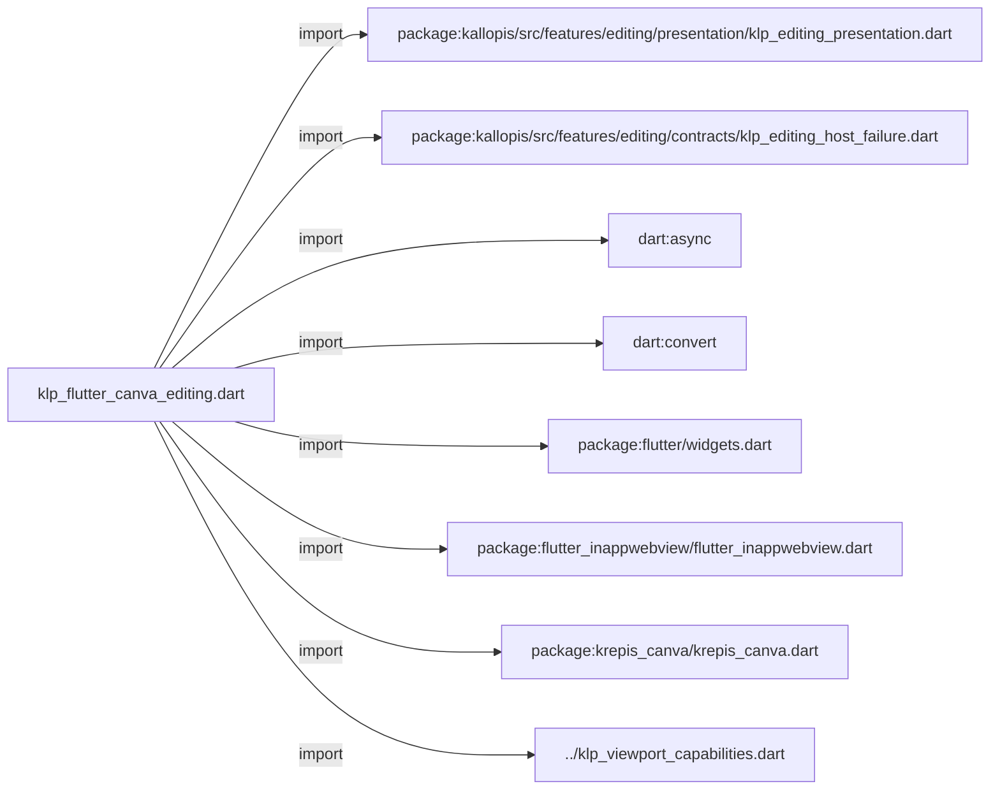
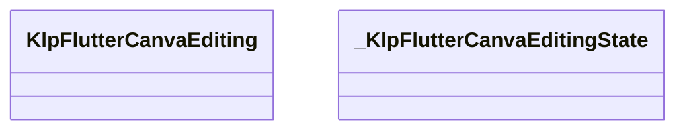
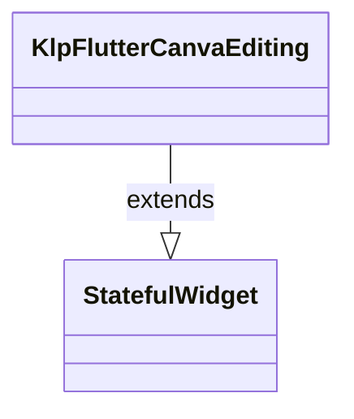
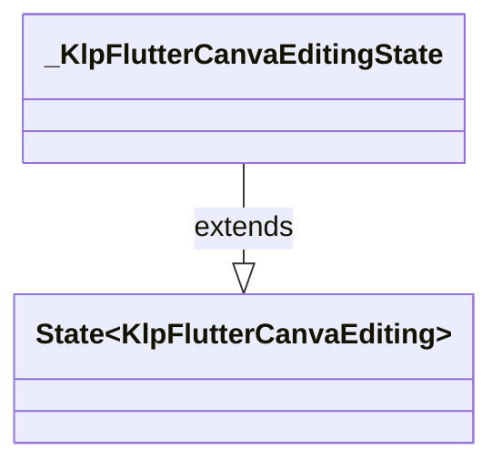

# klp_flutter_canva_editing.dart：直接依賴與宣告架構

[回到目錄](README.md) · [來源檔案](../../../../../../lib/src/rendering/flutter/internal/klp_flutter_canva_editing.dart)

## 範圍

核心是 `lib/src/rendering/flutter/internal/klp_flutter_canva_editing.dart`。主要視角為該檔案明寫的 import／export／part；輔助視角為本檔宣告及 extends／implements／with／on 關係。只展開一層外部邊界。

## 直接依賴圖

## 依賴證據

| 關係 | 原始 directive | 來源 |
|---|---|---|
| import | <code>import &#x27;package:kallopis/src/features/editing/presentation/klp_editing_presentation.dart&#x27;;</code> | [lib/src/rendering/flutter/internal/klp_flutter_canva_editing.dart:1](../../../../../../lib/src/rendering/flutter/internal/klp_flutter_canva_editing.dart#L1) |
| import | <code>import &#x27;package:kallopis/src/features/editing/contracts/klp_editing_host_failure.dart&#x27;;</code> | [lib/src/rendering/flutter/internal/klp_flutter_canva_editing.dart:2](../../../../../../lib/src/rendering/flutter/internal/klp_flutter_canva_editing.dart#L2) |
| import | <code>import &#x27;dart:async&#x27;;</code> | [lib/src/rendering/flutter/internal/klp_flutter_canva_editing.dart:3](../../../../../../lib/src/rendering/flutter/internal/klp_flutter_canva_editing.dart#L3) |
| import | <code>import &#x27;dart:convert&#x27;;</code> | [lib/src/rendering/flutter/internal/klp_flutter_canva_editing.dart:4](../../../../../../lib/src/rendering/flutter/internal/klp_flutter_canva_editing.dart#L4) |
| import | <code>import &#x27;package:flutter/widgets.dart&#x27;;</code> | [lib/src/rendering/flutter/internal/klp_flutter_canva_editing.dart:6](../../../../../../lib/src/rendering/flutter/internal/klp_flutter_canva_editing.dart#L6) |
| import | <code>import &#x27;package:flutter_inappwebview/flutter_inappwebview.dart&#x27;;</code> | [lib/src/rendering/flutter/internal/klp_flutter_canva_editing.dart:7](../../../../../../lib/src/rendering/flutter/internal/klp_flutter_canva_editing.dart#L7) |
| import | <code>import &#x27;package:krepis_canva/krepis_canva.dart&#x27;;</code> | [lib/src/rendering/flutter/internal/klp_flutter_canva_editing.dart:8](../../../../../../lib/src/rendering/flutter/internal/klp_flutter_canva_editing.dart#L8) |
| import | <code>import &#x27;../klp_viewport_capabilities.dart&#x27;;</code> | [lib/src/rendering/flutter/internal/klp_flutter_canva_editing.dart:10](../../../../../../lib/src/rendering/flutter/internal/klp_flutter_canva_editing.dart#L10) |

## 宣告關係圖

本組節點是本檔宣告；沒有箭頭的宣告未在此圖主張互相依賴。

## 宣告與成員證據

成員包含 public 與 private；簽章取自來源，省略函式本體與欄位初始值。`(inferred)` 表示來源未明寫型別；建構子只顯示參數部分，不含初始化列表。

### KlpFlutterCanvaEditing

ClassDeclaration · public · [lib/src/rendering/flutter/internal/klp_flutter_canva_editing.dart:12](../../../../../../lib/src/rendering/flutter/internal/klp_flutter_canva_editing.dart#L12)

<code>final class KlpFlutterCanvaEditing extends StatefulWidget</code>

來源註解摘要：固定載入本地 Excalidraw bundle；bridge 封包仍由 Krepis 驗證。

- `extends` → <code>StatefulWidget</code>：[lib/src/rendering/flutter/internal/klp_flutter_canva_editing.dart:13](../../../../../../lib/src/rendering/flutter/internal/klp_flutter_canva_editing.dart#L13)

| 成員 | 可見性 | 簽章／型別 | 來源註解摘要 | 證據 |
|---|---|---|---|---|
| field <code>content</code> | public | <code>final KlpBoundCanvaEditing content</code> |  | [lib/src/rendering/flutter/internal/klp_flutter_canva_editing.dart:14](../../../../../../lib/src/rendering/flutter/internal/klp_flutter_canva_editing.dart#L14) |
| constructor <code>KlpFlutterCanvaEditing</code> | public | <code>const KlpFlutterCanvaEditing({required this.content, super.key})</code> |  | [lib/src/rendering/flutter/internal/klp_flutter_canva_editing.dart:15](../../../../../../lib/src/rendering/flutter/internal/klp_flutter_canva_editing.dart#L15) |
| method <code>createState</code> | public | <code>State&lt;KlpFlutterCanvaEditing&gt; createState()</code> |  | [lib/src/rendering/flutter/internal/klp_flutter_canva_editing.dart:17](../../../../../../lib/src/rendering/flutter/internal/klp_flutter_canva_editing.dart#L17) |

### _KlpFlutterCanvaEditingState

ClassDeclaration · private · [lib/src/rendering/flutter/internal/klp_flutter_canva_editing.dart:21](../../../../../../lib/src/rendering/flutter/internal/klp_flutter_canva_editing.dart#L21)

<code>final class _KlpFlutterCanvaEditingState extends State&lt;KlpFlutterCanvaEditing&gt;</code>

- `extends` → <code>State&lt;KlpFlutterCanvaEditing&gt;</code>：[lib/src/rendering/flutter/internal/klp_flutter_canva_editing.dart:21](../../../../../../lib/src/rendering/flutter/internal/klp_flutter_canva_editing.dart#L21)

| 成員 | 可見性 | 簽章／型別 | 來源註解摘要 | 證據 |
|---|---|---|---|---|
| field <code>_webView</code> | private | <code>InAppWebViewController? _webView</code> |  | [lib/src/rendering/flutter/internal/klp_flutter_canva_editing.dart:22](../../../../../../lib/src/rendering/flutter/internal/klp_flutter_canva_editing.dart#L22) |
| field <code>_environment</code> | private | <code>Future&lt;WebViewEnvironment?&gt;? _environment</code> |  | [lib/src/rendering/flutter/internal/klp_flutter_canva_editing.dart:23](../../../../../../lib/src/rendering/flutter/internal/klp_flutter_canva_editing.dart#L23) |
| field <code>_session</code> | private | <code>late final KrepisCanvaSessionController _session</code> |  | [lib/src/rendering/flutter/internal/klp_flutter_canva_editing.dart:24](../../../../../../lib/src/rendering/flutter/internal/klp_flutter_canva_editing.dart#L24) |
| field <code>_channel</code> | private | <code>late final KrepisCanvaBridgeChannel _channel</code> |  | [lib/src/rendering/flutter/internal/klp_flutter_canva_editing.dart:25](../../../../../../lib/src/rendering/flutter/internal/klp_flutter_canva_editing.dart#L25) |
| field <code>_failureSink</code> | private | <code>late KlpEditingHostFailureSink _failureSink</code> |  | [lib/src/rendering/flutter/internal/klp_flutter_canva_editing.dart:26](../../../../../../lib/src/rendering/flutter/internal/klp_flutter_canva_editing.dart#L26) |
| field <code>_opening</code> | private | <code>Future&lt;void&gt;? _opening</code> |  | [lib/src/rendering/flutter/internal/klp_flutter_canva_editing.dart:27](../../../../../../lib/src/rendering/flutter/internal/klp_flutter_canva_editing.dart#L27) |
| field <code>_attempted</code> | private | <code>bool _attempted</code> |  | [lib/src/rendering/flutter/internal/klp_flutter_canva_editing.dart:28](../../../../../../lib/src/rendering/flutter/internal/klp_flutter_canva_editing.dart#L28) |
| field <code>_opened</code> | private | <code>bool _opened</code> |  | [lib/src/rendering/flutter/internal/klp_flutter_canva_editing.dart:29](../../../../../../lib/src/rendering/flutter/internal/klp_flutter_canva_editing.dart#L29) |
| field <code>_closed</code> | private | <code>bool _closed</code> |  | [lib/src/rendering/flutter/internal/klp_flutter_canva_editing.dart:30](../../../../../../lib/src/rendering/flutter/internal/klp_flutter_canva_editing.dart#L30) |
| field <code>_ownsSender</code> | private | <code>bool _ownsSender</code> |  | [lib/src/rendering/flutter/internal/klp_flutter_canva_editing.dart:31](../../../../../../lib/src/rendering/flutter/internal/klp_flutter_canva_editing.dart#L31) |
| field <code>_environmentDisposalStarted</code> | private | <code>bool _environmentDisposalStarted</code> |  | [lib/src/rendering/flutter/internal/klp_flutter_canva_editing.dart:32](../../../../../../lib/src/rendering/flutter/internal/klp_flutter_canva_editing.dart#L32) |
| method <code>initState</code> | public | <code>void initState()</code> |  | [lib/src/rendering/flutter/internal/klp_flutter_canva_editing.dart:34](../../../../../../lib/src/rendering/flutter/internal/klp_flutter_canva_editing.dart#L34) |
| method <code>didChangeDependencies</code> | public | <code>void didChangeDependencies()</code> |  | [lib/src/rendering/flutter/internal/klp_flutter_canva_editing.dart:41](../../../../../../lib/src/rendering/flutter/internal/klp_flutter_canva_editing.dart#L41) |
| method <code>_report</code> | private | <code>void _report(KlpEditingHostPhase phase, Object error, StackTrace stack)</code> |  | [lib/src/rendering/flutter/internal/klp_flutter_canva_editing.dart:49](../../../../../../lib/src/rendering/flutter/internal/klp_flutter_canva_editing.dart#L49) |
| method <code>_live</code> | private | <code>bool _live(InAppWebViewController controller)</code> |  | [lib/src/rendering/flutter/internal/klp_flutter_canva_editing.dart:53](../../../../../../lib/src/rendering/flutter/internal/klp_flutter_canva_editing.dart#L53) |
| method <code>_releaseSender</code> | private | <code>void _releaseSender()</code> |  | [lib/src/rendering/flutter/internal/klp_flutter_canva_editing.dart:55](../../../../../../lib/src/rendering/flutter/internal/klp_flutter_canva_editing.dart#L55) |
| method <code>build</code> | public | <code>Widget build(BuildContext context)</code> |  | [lib/src/rendering/flutter/internal/klp_flutter_canva_editing.dart:61](../../../../../../lib/src/rendering/flutter/internal/klp_flutter_canva_editing.dart#L61) |
| method <code>_createEnvironment</code> | private | <code>Future&lt;WebViewEnvironment?&gt; _createEnvironment(bool nativeWindows)</code> |  | [lib/src/rendering/flutter/internal/klp_flutter_canva_editing.dart:88](../../../../../../lib/src/rendering/flutter/internal/klp_flutter_canva_editing.dart#L88) |
| method <code>_createWebView</code> | private | <code>void _createWebView(InAppWebViewController controller)</code> |  | [lib/src/rendering/flutter/internal/klp_flutter_canva_editing.dart:102](../../../../../../lib/src/rendering/flutter/internal/klp_flutter_canva_editing.dart#L102) |
| method <code>_open</code> | private | <code>Future&lt;void&gt; _open()</code> |  | [lib/src/rendering/flutter/internal/klp_flutter_canva_editing.dart:108](../../../../../../lib/src/rendering/flutter/internal/klp_flutter_canva_editing.dart#L108) |
| method <code>_attemptOpen</code> | private | <code>Future&lt;void&gt; _attemptOpen()</code> |  | [lib/src/rendering/flutter/internal/klp_flutter_canva_editing.dart:120](../../../../../../lib/src/rendering/flutter/internal/klp_flutter_canva_editing.dart#L120) |
| method <code>_waitForBridge</code> | private | <code>Future&lt;void&gt; _waitForBridge(InAppWebViewController controller)</code> |  | [lib/src/rendering/flutter/internal/klp_flutter_canva_editing.dart:147](../../../../../../lib/src/rendering/flutter/internal/klp_flutter_canva_editing.dart#L147) |
| method <code>_send</code> | private | <code>Future&lt;void&gt; _send(InAppWebViewController controller, Map&lt;String, Object?&gt; command)</code> |  | [lib/src/rendering/flutter/internal/klp_flutter_canva_editing.dart:159](../../../../../../lib/src/rendering/flutter/internal/klp_flutter_canva_editing.dart#L159) |
| method <code>_receive</code> | private | <code>Future&lt;Object?&gt; _receive(List&lt;dynamic&gt; arguments)</code> |  | [lib/src/rendering/flutter/internal/klp_flutter_canva_editing.dart:164](../../../../../../lib/src/rendering/flutter/internal/klp_flutter_canva_editing.dart#L164) |
| method <code>_disposeEnvironment</code> | private | <code>Future&lt;void&gt; _disposeEnvironment(WebViewEnvironment? value)</code> |  | [lib/src/rendering/flutter/internal/klp_flutter_canva_editing.dart:177](../../../../../../lib/src/rendering/flutter/internal/klp_flutter_canva_editing.dart#L177) |
| method <code>dispose</code> | public | <code>void dispose()</code> |  | [lib/src/rendering/flutter/internal/klp_flutter_canva_editing.dart:184](../../../../../../lib/src/rendering/flutter/internal/klp_flutter_canva_editing.dart#L184) |

## 閱讀說明與限制

箭頭只表示來源明寫的靜態關係；import 不等於呼叫。未分析動態呼叫、欄位的實際物件擁有權、狀態轉移或渲染流程；型別未進行語意解析，繼承目標保留原始型別拼寫。public／private 依 Dart 名稱前綴判斷；public 宣告不代表已由 `lib/kallopis.dart` 匯出。

本頁由 `tool/architecture_atlas` 產生；編輯來源或生成工具後重新產生，避免手改本頁。
