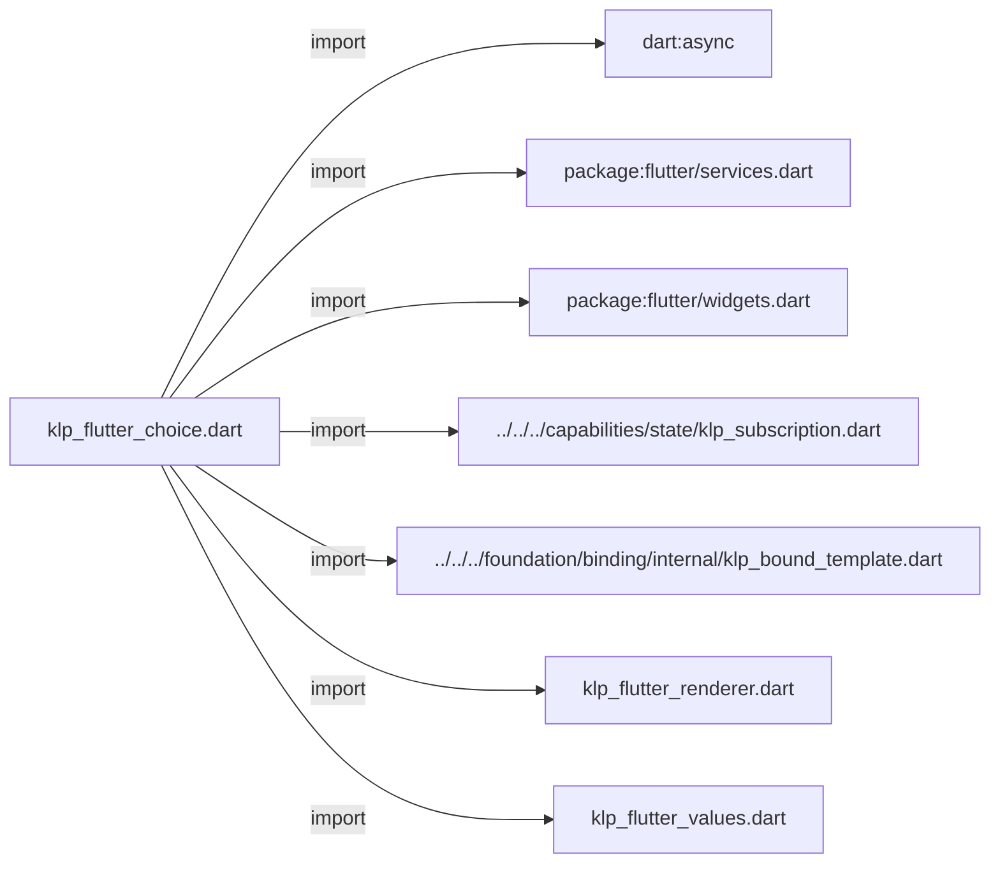
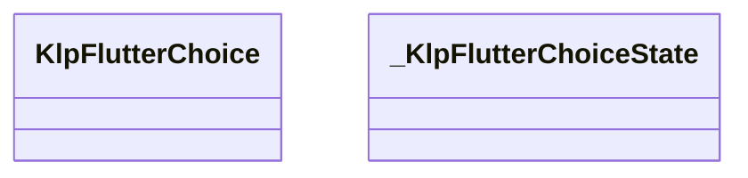
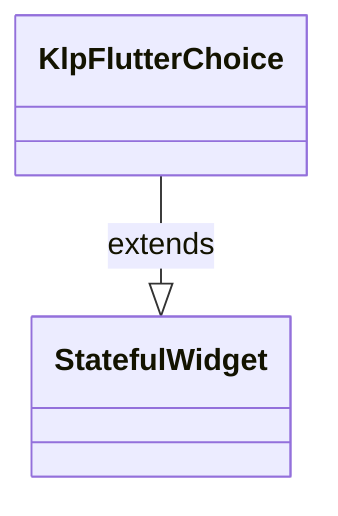
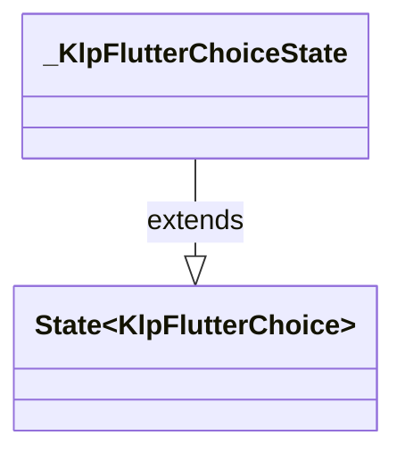

# klp_flutter_choice.dart：直接依賴與宣告架構

[回到目錄](README.md) · [來源檔案](../../../../../../lib/src/rendering/flutter/internal/klp_flutter_choice.dart)

## 範圍

核心是 `lib/src/rendering/flutter/internal/klp_flutter_choice.dart`。主要視角為該檔案明寫的 import／export／part；輔助視角為本檔宣告及 extends／implements／with／on 關係。只展開一層外部邊界。

## 直接依賴圖

## 依賴證據

| 關係 | 原始 directive | 來源 |
|---|---|---|
| import | <code>import &#x27;dart:async&#x27;;</code> | [lib/src/rendering/flutter/internal/klp_flutter_choice.dart:1](../../../../../../lib/src/rendering/flutter/internal/klp_flutter_choice.dart#L1) |
| import | <code>import &#x27;package:flutter/services.dart&#x27;;</code> | [lib/src/rendering/flutter/internal/klp_flutter_choice.dart:3](../../../../../../lib/src/rendering/flutter/internal/klp_flutter_choice.dart#L3) |
| import | <code>import &#x27;package:flutter/widgets.dart&#x27;;</code> | [lib/src/rendering/flutter/internal/klp_flutter_choice.dart:4](../../../../../../lib/src/rendering/flutter/internal/klp_flutter_choice.dart#L4) |
| import | <code>import &#x27;../../../capabilities/state/klp_subscription.dart&#x27;;</code> | [lib/src/rendering/flutter/internal/klp_flutter_choice.dart:6](../../../../../../lib/src/rendering/flutter/internal/klp_flutter_choice.dart#L6) |
| import | <code>import &#x27;../../../foundation/binding/internal/klp_bound_template.dart&#x27;;</code> | [lib/src/rendering/flutter/internal/klp_flutter_choice.dart:7](../../../../../../lib/src/rendering/flutter/internal/klp_flutter_choice.dart#L7) |
| import | <code>import &#x27;klp_flutter_renderer.dart&#x27;;</code> | [lib/src/rendering/flutter/internal/klp_flutter_choice.dart:8](../../../../../../lib/src/rendering/flutter/internal/klp_flutter_choice.dart#L8) |
| import | <code>import &#x27;klp_flutter_values.dart&#x27;;</code> | [lib/src/rendering/flutter/internal/klp_flutter_choice.dart:9](../../../../../../lib/src/rendering/flutter/internal/klp_flutter_choice.dart#L9) |

## 宣告關係圖

本組節點是本檔宣告；沒有箭頭的宣告未在此圖主張互相依賴。

## 宣告與成員證據

成員包含 public 與 private；簽章取自來源，省略函式本體與欄位初始值。`(inferred)` 表示來源未明寫型別；建構子只顯示參數部分，不含初始化列表。

### KlpFlutterChoice

ClassDeclaration · public · [lib/src/rendering/flutter/internal/klp_flutter_choice.dart:11](../../../../../../lib/src/rendering/flutter/internal/klp_flutter_choice.dart#L11)

<code>final class KlpFlutterChoice extends StatefulWidget</code>

來源註解摘要：選擇原語只借用狀態；焦點與訂閱隨 Flutter 放置生命週期管理。

- `extends` → <code>StatefulWidget</code>：[lib/src/rendering/flutter/internal/klp_flutter_choice.dart:12](../../../../../../lib/src/rendering/flutter/internal/klp_flutter_choice.dart#L12)

| 成員 | 可見性 | 簽章／型別 | 來源註解摘要 | 證據 |
|---|---|---|---|---|
| field <code>content</code> | public | <code>final KlpBoundChoice content</code> |  | [lib/src/rendering/flutter/internal/klp_flutter_choice.dart:13](../../../../../../lib/src/rendering/flutter/internal/klp_flutter_choice.dart#L13) |
| constructor <code>KlpFlutterChoice</code> | public | <code>const KlpFlutterChoice({required this.content, super.key})</code> |  | [lib/src/rendering/flutter/internal/klp_flutter_choice.dart:15](../../../../../../lib/src/rendering/flutter/internal/klp_flutter_choice.dart#L15) |
| method <code>createState</code> | public | <code>State&lt;KlpFlutterChoice&gt; createState()</code> |  | [lib/src/rendering/flutter/internal/klp_flutter_choice.dart:17](../../../../../../lib/src/rendering/flutter/internal/klp_flutter_choice.dart#L17) |

### _KlpFlutterChoiceState

ClassDeclaration · private · [lib/src/rendering/flutter/internal/klp_flutter_choice.dart:21](../../../../../../lib/src/rendering/flutter/internal/klp_flutter_choice.dart#L21)

<code>final class _KlpFlutterChoiceState extends State&lt;KlpFlutterChoice&gt;</code>

- `extends` → <code>State&lt;KlpFlutterChoice&gt;</code>：[lib/src/rendering/flutter/internal/klp_flutter_choice.dart:21](../../../../../../lib/src/rendering/flutter/internal/klp_flutter_choice.dart#L21)

| 成員 | 可見性 | 簽章／型別 | 來源註解摘要 | 證據 |
|---|---|---|---|---|
| field <code>_focus</code> | private | <code>final (inferred) _focus</code> |  | [lib/src/rendering/flutter/internal/klp_flutter_choice.dart:22](../../../../../../lib/src/rendering/flutter/internal/klp_flutter_choice.dart#L22) |
| field <code>_subscription</code> | private | <code>late KlpSubscription _subscription</code> |  | [lib/src/rendering/flutter/internal/klp_flutter_choice.dart:23](../../../../../../lib/src/rendering/flutter/internal/klp_flutter_choice.dart#L23) |
| field <code>_selected</code> | private | <code>bool _selected</code> |  | [lib/src/rendering/flutter/internal/klp_flutter_choice.dart:24](../../../../../../lib/src/rendering/flutter/internal/klp_flutter_choice.dart#L24) |
| field <code>_focused</code> | private | <code>bool _focused</code> |  | [lib/src/rendering/flutter/internal/klp_flutter_choice.dart:25](../../../../../../lib/src/rendering/flutter/internal/klp_flutter_choice.dart#L25) |
| method <code>initState</code> | public | <code>void initState()</code> |  | [lib/src/rendering/flutter/internal/klp_flutter_choice.dart:27](../../../../../../lib/src/rendering/flutter/internal/klp_flutter_choice.dart#L27) |
| method <code>didUpdateWidget</code> | public | <code>void didUpdateWidget(KlpFlutterChoice oldWidget)</code> |  | [lib/src/rendering/flutter/internal/klp_flutter_choice.dart:33](../../../../../../lib/src/rendering/flutter/internal/klp_flutter_choice.dart#L33) |
| method <code>_subscribe</code> | private | <code>void _subscribe()</code> |  | [lib/src/rendering/flutter/internal/klp_flutter_choice.dart:43](../../../../../../lib/src/rendering/flutter/internal/klp_flutter_choice.dart#L43) |
| method <code>dispose</code> | public | <code>void dispose()</code> |  | [lib/src/rendering/flutter/internal/klp_flutter_choice.dart:56](../../../../../../lib/src/rendering/flutter/internal/klp_flutter_choice.dart#L56) |
| method <code>_activate</code> | private | <code>void _activate()</code> |  | [lib/src/rendering/flutter/internal/klp_flutter_choice.dart:63](../../../../../../lib/src/rendering/flutter/internal/klp_flutter_choice.dart#L63) |
| method <code>build</code> | public | <code>Widget build(BuildContext context)</code> |  | [lib/src/rendering/flutter/internal/klp_flutter_choice.dart:71](../../../../../../lib/src/rendering/flutter/internal/klp_flutter_choice.dart#L71) |

## 閱讀說明與限制

箭頭只表示來源明寫的靜態關係；import 不等於呼叫。未分析動態呼叫、欄位的實際物件擁有權、狀態轉移或渲染流程；型別未進行語意解析，繼承目標保留原始型別拼寫。public／private 依 Dart 名稱前綴判斷；public 宣告不代表已由 `lib/kallopis.dart` 匯出。

本頁由 `tool/architecture_atlas` 產生；編輯來源或生成工具後重新產生，避免手改本頁。
