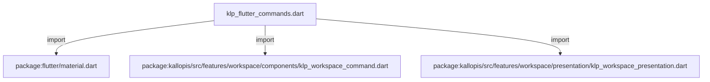
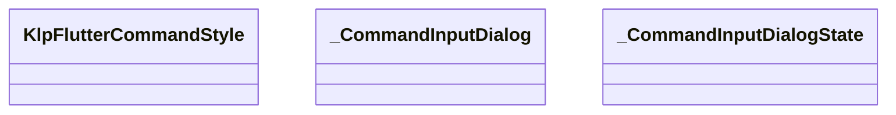
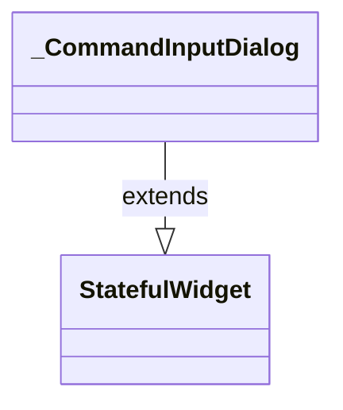
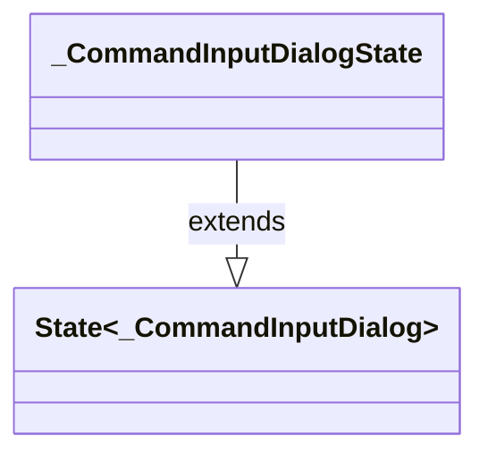

# klp_flutter_commands.dart：直接依賴與宣告架構

[回到目錄](README.md) · [來源檔案](../../../../../../lib/src/rendering/flutter/internal/klp_flutter_commands.dart)

## 範圍

核心是 `lib/src/rendering/flutter/internal/klp_flutter_commands.dart`。主要視角為該檔案明寫的 import／export／part；輔助視角為本檔宣告及 extends／implements／with／on 關係。只展開一層外部邊界。

## 直接依賴圖

## 依賴證據

| 關係 | 原始 directive | 來源 |
|---|---|---|
| import | <code>import &#x27;package:flutter/material.dart&#x27;;</code> | [lib/src/rendering/flutter/internal/klp_flutter_commands.dart:1](../../../../../../lib/src/rendering/flutter/internal/klp_flutter_commands.dart#L1) |
| import | <code>import &#x27;package:kallopis/src/features/workspace/components/klp_workspace_command.dart&#x27;;</code> | [lib/src/rendering/flutter/internal/klp_flutter_commands.dart:2](../../../../../../lib/src/rendering/flutter/internal/klp_flutter_commands.dart#L2) |
| import | <code>import &#x27;package:kallopis/src/features/workspace/presentation/klp_workspace_presentation.dart&#x27;;</code> | [lib/src/rendering/flutter/internal/klp_flutter_commands.dart:3](../../../../../../lib/src/rendering/flutter/internal/klp_flutter_commands.dart#L3) |

## 宣告關係圖

本組節點是本檔宣告；沒有箭頭的宣告未在此圖主張互相依賴。

## 宣告與成員證據

成員包含 public 與 private；簽章取自來源，省略函式本體與欄位初始值。`(inferred)` 表示來源未明寫型別；建構子只顯示參數部分，不含初始化列表。

### KlpFlutterCommandStyle

ClassDeclaration · public · [lib/src/rendering/flutter/internal/klp_flutter_commands.dart:5](../../../../../../lib/src/rendering/flutter/internal/klp_flutter_commands.dart#L5)

<code>final class KlpFlutterCommandStyle</code>

來源註解摘要：命令表面只接已解析的樣式，不另設主題或依功能推導預設值。

| 成員 | 可見性 | 簽章／型別 | 來源註解摘要 | 證據 |
|---|---|---|---|---|
| field <code>surface</code> | public | <code>final Color surface</code> |  | [lib/src/rendering/flutter/internal/klp_flutter_commands.dart:8](../../../../../../lib/src/rendering/flutter/internal/klp_flutter_commands.dart#L8) |
| field <code>foreground</code> | public | <code>final Color foreground</code> |  | [lib/src/rendering/flutter/internal/klp_flutter_commands.dart:8](../../../../../../lib/src/rendering/flutter/internal/klp_flutter_commands.dart#L8) |
| field <code>muted</code> | public | <code>final Color muted</code> |  | [lib/src/rendering/flutter/internal/klp_flutter_commands.dart:8](../../../../../../lib/src/rendering/flutter/internal/klp_flutter_commands.dart#L8) |
| field <code>interaction</code> | public | <code>final Color interaction</code> |  | [lib/src/rendering/flutter/internal/klp_flutter_commands.dart:8](../../../../../../lib/src/rendering/flutter/internal/klp_flutter_commands.dart#L8) |
| field <code>destructive</code> | public | <code>final Color destructive</code> |  | [lib/src/rendering/flutter/internal/klp_flutter_commands.dart:8](../../../../../../lib/src/rendering/flutter/internal/klp_flutter_commands.dart#L8) |
| field <code>text</code> | public | <code>final TextStyle text</code> |  | [lib/src/rendering/flutter/internal/klp_flutter_commands.dart:9](../../../../../../lib/src/rendering/flutter/internal/klp_flutter_commands.dart#L9) |
| field <code>extent</code> | public | <code>final double extent</code> |  | [lib/src/rendering/flutter/internal/klp_flutter_commands.dart:10](../../../../../../lib/src/rendering/flutter/internal/klp_flutter_commands.dart#L10) |
| field <code>inset</code> | public | <code>final double inset</code> |  | [lib/src/rendering/flutter/internal/klp_flutter_commands.dart:10](../../../../../../lib/src/rendering/flutter/internal/klp_flutter_commands.dart#L10) |
| field <code>radius</code> | public | <code>final double radius</code> |  | [lib/src/rendering/flutter/internal/klp_flutter_commands.dart:10](../../../../../../lib/src/rendering/flutter/internal/klp_flutter_commands.dart#L10) |
| constructor <code>KlpFlutterCommandStyle</code> | public | <code>const KlpFlutterCommandStyle({required this.surface, required this.foreground, required this.muted, required this.interaction, required this.destructive, required this.text, required this.extent, required this.inset, required this.radius})</code> |  | [lib/src/rendering/flutter/internal/klp_flutter_commands.dart:12](../../../../../../lib/src/rendering/flutter/internal/klp_flutter_commands.dart#L12) |

### showKlpCommandMenu

FunctionDeclaration · public · [lib/src/rendering/flutter/internal/klp_flutter_commands.dart:15](../../../../../../lib/src/rendering/flutter/internal/klp_flutter_commands.dart#L15)

<code>Future&lt;void&gt; showKlpCommandMenu(BuildContext context, List&lt;KlpBoundWorkspaceCommand&gt; commands, Offset anchor, KlpFlutterCommandStyle style, bool Function() isActive)</code>

來源註解摘要：滑鼠、鍵盤與行內入口共用定位選單；框架限制其在 viewport 內。

### runKlpCommand

FunctionDeclaration · public · [lib/src/rendering/flutter/internal/klp_flutter_commands.dart:41](../../../../../../lib/src/rendering/flutter/internal/klp_flutter_commands.dart#L41)

<code>Future&lt;KlpWorkspaceCommandResult&gt; runKlpCommand(BuildContext context, KlpBoundWorkspaceCommand command, KlpFlutterCommandStyle style, bool Function() isActive)</code>

來源註解摘要：完整確認後才執行一次命令；結果不代替產品提交。

### _CommandInputDialog

ClassDeclaration · private · [lib/src/rendering/flutter/internal/klp_flutter_commands.dart:87](../../../../../../lib/src/rendering/flutter/internal/klp_flutter_commands.dart#L87)

<code>final class _CommandInputDialog extends StatefulWidget</code>

來源註解摘要：Controller 的生命週期跟隨實際對話框，包含退場動畫。

- `extends` → <code>StatefulWidget</code>：[lib/src/rendering/flutter/internal/klp_flutter_commands.dart:88](../../../../../../lib/src/rendering/flutter/internal/klp_flutter_commands.dart#L88)

| 成員 | 可見性 | 簽章／型別 | 來源註解摘要 | 證據 |
|---|---|---|---|---|
| field <code>command</code> | public | <code>final KlpBoundWorkspaceCommand command</code> |  | [lib/src/rendering/flutter/internal/klp_flutter_commands.dart:90](../../../../../../lib/src/rendering/flutter/internal/klp_flutter_commands.dart#L90) |
| field <code>style</code> | public | <code>final KlpFlutterCommandStyle style</code> |  | [lib/src/rendering/flutter/internal/klp_flutter_commands.dart:91](../../../../../../lib/src/rendering/flutter/internal/klp_flutter_commands.dart#L91) |
| constructor <code>_CommandInputDialog</code> | private | <code>const _CommandInputDialog(this.command, this.style)</code> |  | [lib/src/rendering/flutter/internal/klp_flutter_commands.dart:93](../../../../../../lib/src/rendering/flutter/internal/klp_flutter_commands.dart#L93) |
| method <code>createState</code> | public | <code>State&lt;_CommandInputDialog&gt; createState()</code> |  | [lib/src/rendering/flutter/internal/klp_flutter_commands.dart:95](../../../../../../lib/src/rendering/flutter/internal/klp_flutter_commands.dart#L95) |

### _CommandInputDialogState

ClassDeclaration · private · [lib/src/rendering/flutter/internal/klp_flutter_commands.dart:99](../../../../../../lib/src/rendering/flutter/internal/klp_flutter_commands.dart#L99)

<code>final class _CommandInputDialogState extends State&lt;_CommandInputDialog&gt;</code>

- `extends` → <code>State&lt;_CommandInputDialog&gt;</code>：[lib/src/rendering/flutter/internal/klp_flutter_commands.dart:99](../../../../../../lib/src/rendering/flutter/internal/klp_flutter_commands.dart#L99)

| 成員 | 可見性 | 簽章／型別 | 來源註解摘要 | 證據 |
|---|---|---|---|---|
| field <code>_controller</code> | private | <code>late final (inferred) _controller</code> |  | [lib/src/rendering/flutter/internal/klp_flutter_commands.dart:101](../../../../../../lib/src/rendering/flutter/internal/klp_flutter_commands.dart#L101) |
| method <code>dispose</code> | public | <code>void dispose()</code> |  | [lib/src/rendering/flutter/internal/klp_flutter_commands.dart:103](../../../../../../lib/src/rendering/flutter/internal/klp_flutter_commands.dart#L103) |
| method <code>_submit</code> | private | <code>void _submit()</code> |  | [lib/src/rendering/flutter/internal/klp_flutter_commands.dart:109](../../../../../../lib/src/rendering/flutter/internal/klp_flutter_commands.dart#L109) |
| method <code>build</code> | public | <code>Widget build(BuildContext context)</code> |  | [lib/src/rendering/flutter/internal/klp_flutter_commands.dart:114](../../../../../../lib/src/rendering/flutter/internal/klp_flutter_commands.dart#L114) |

## 閱讀說明與限制

箭頭只表示來源明寫的靜態關係；import 不等於呼叫。未分析動態呼叫、欄位的實際物件擁有權、狀態轉移或渲染流程；型別未進行語意解析，繼承目標保留原始型別拼寫。public／private 依 Dart 名稱前綴判斷；public 宣告不代表已由 `lib/kallopis.dart` 匯出。

本頁由 `tool/architecture_atlas` 產生；編輯來源或生成工具後重新產生，避免手改本頁。
