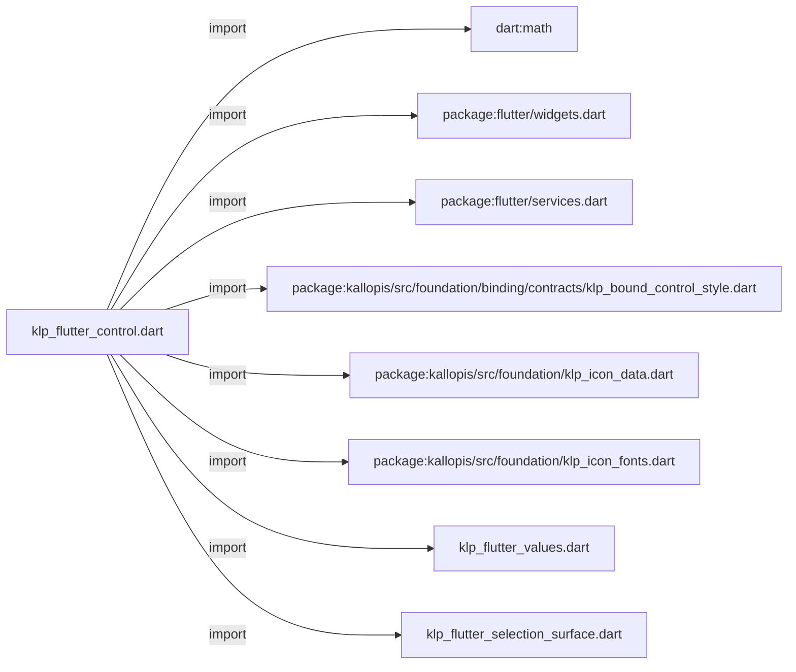
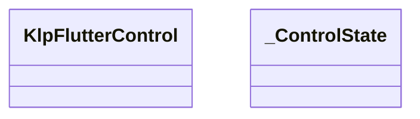
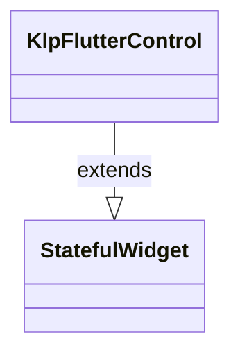
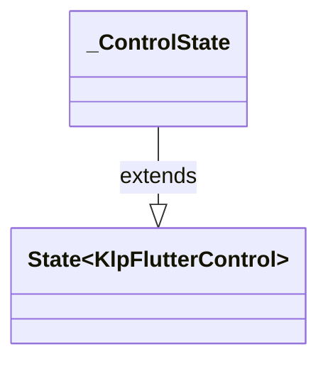

# klp_flutter_control.dart：直接依賴與宣告架構

[回到目錄](README.md) · [來源檔案](../../../../../../lib/src/rendering/flutter/internal/klp_flutter_control.dart)

## 範圍

核心是 `lib/src/rendering/flutter/internal/klp_flutter_control.dart`。主要視角為該檔案明寫的 import／export／part；輔助視角為本檔宣告及 extends／implements／with／on 關係。只展開一層外部邊界。

## 直接依賴圖

## 依賴證據

| 關係 | 原始 directive | 來源 |
|---|---|---|
| import | <code>import &#x27;dart:math&#x27; as math;</code> | [lib/src/rendering/flutter/internal/klp_flutter_control.dart:1](../../../../../../lib/src/rendering/flutter/internal/klp_flutter_control.dart#L1) |
| import | <code>import &#x27;package:flutter/widgets.dart&#x27;;</code> | [lib/src/rendering/flutter/internal/klp_flutter_control.dart:2](../../../../../../lib/src/rendering/flutter/internal/klp_flutter_control.dart#L2) |
| import | <code>import &#x27;package:flutter/services.dart&#x27;;</code> | [lib/src/rendering/flutter/internal/klp_flutter_control.dart:3](../../../../../../lib/src/rendering/flutter/internal/klp_flutter_control.dart#L3) |
| import | <code>import &#x27;package:kallopis/src/foundation/binding/contracts/klp_bound_control_style.dart&#x27;;</code> | [lib/src/rendering/flutter/internal/klp_flutter_control.dart:4](../../../../../../lib/src/rendering/flutter/internal/klp_flutter_control.dart#L4) |
| import | <code>import &#x27;package:kallopis/src/foundation/klp_icon_data.dart&#x27;;</code> | [lib/src/rendering/flutter/internal/klp_flutter_control.dart:5](../../../../../../lib/src/rendering/flutter/internal/klp_flutter_control.dart#L5) |
| import | <code>import &#x27;package:kallopis/src/foundation/klp_icon_fonts.dart&#x27;;</code> | [lib/src/rendering/flutter/internal/klp_flutter_control.dart:6](../../../../../../lib/src/rendering/flutter/internal/klp_flutter_control.dart#L6) |
| import | <code>import &#x27;klp_flutter_values.dart&#x27;;</code> | [lib/src/rendering/flutter/internal/klp_flutter_control.dart:7](../../../../../../lib/src/rendering/flutter/internal/klp_flutter_control.dart#L7) |
| import | <code>import &#x27;klp_flutter_selection_surface.dart&#x27;;</code> | [lib/src/rendering/flutter/internal/klp_flutter_control.dart:8](../../../../../../lib/src/rendering/flutter/internal/klp_flutter_control.dart#L8) |

## 宣告關係圖

本組節點是本檔宣告；沒有箭頭的宣告未在此圖主張互相依賴。

## 宣告與成員證據

成員包含 public 與 private；簽章取自來源，省略函式本體與欄位初始值。`(inferred)` 表示來源未明寫型別；建構子只顯示參數部分，不含初始化列表。

### KlpFlutterControl

ClassDeclaration · public · [lib/src/rendering/flutter/internal/klp_flutter_control.dart:10](../../../../../../lib/src/rendering/flutter/internal/klp_flutter_control.dart#L10)

<code>final class KlpFlutterControl extends StatefulWidget</code>

來源註解摘要：庫內共用控制呈現：可見外框與命中槽分離，產品不接觸此 Widget。

- `extends` → <code>StatefulWidget</code>：[lib/src/rendering/flutter/internal/klp_flutter_control.dart:11](../../../../../../lib/src/rendering/flutter/internal/klp_flutter_control.dart#L11)

| 成員 | 可見性 | 簽章／型別 | 來源註解摘要 | 證據 |
|---|---|---|---|---|
| field <code>style</code> | public | <code>final KlpBoundControlStyle style</code> |  | [lib/src/rendering/flutter/internal/klp_flutter_control.dart:12](../../../../../../lib/src/rendering/flutter/internal/klp_flutter_control.dart#L12) |
| field <code>icon</code> | public | <code>final KlpIconData? icon</code> |  | [lib/src/rendering/flutter/internal/klp_flutter_control.dart:13](../../../../../../lib/src/rendering/flutter/internal/klp_flutter_control.dart#L13) |
| field <code>label</code> | public | <code>final String label</code> |  | [lib/src/rendering/flutter/internal/klp_flutter_control.dart:14](../../../../../../lib/src/rendering/flutter/internal/klp_flutter_control.dart#L14) |
| field <code>hint</code> | public | <code>final String? hint</code> |  | [lib/src/rendering/flutter/internal/klp_flutter_control.dart:15](../../../../../../lib/src/rendering/flutter/internal/klp_flutter_control.dart#L15) |
| field <code>caption</code> | public | <code>final String? caption</code> |  | [lib/src/rendering/flutter/internal/klp_flutter_control.dart:16](../../../../../../lib/src/rendering/flutter/internal/klp_flutter_control.dart#L16) |
| field <code>quarterTurns</code> | public | <code>final int quarterTurns</code> |  | [lib/src/rendering/flutter/internal/klp_flutter_control.dart:17](../../../../../../lib/src/rendering/flutter/internal/klp_flutter_control.dart#L17) |
| field <code>selected</code> | public | <code>final bool selected</code> |  | [lib/src/rendering/flutter/internal/klp_flutter_control.dart:18](../../../../../../lib/src/rendering/flutter/internal/klp_flutter_control.dart#L18) |
| field <code>touch</code> | public | <code>final bool touch</code> |  | [lib/src/rendering/flutter/internal/klp_flutter_control.dart:18](../../../../../../lib/src/rendering/flutter/internal/klp_flutter_control.dart#L18) |
| field <code>enabled</code> | public | <code>final bool enabled</code> |  | [lib/src/rendering/flutter/internal/klp_flutter_control.dart:18](../../../../../../lib/src/rendering/flutter/internal/klp_flutter_control.dart#L18) |
| field <code>action</code> | public | <code>final VoidCallback action</code> |  | [lib/src/rendering/flutter/internal/klp_flutter_control.dart:19](../../../../../../lib/src/rendering/flutter/internal/klp_flutter_control.dart#L19) |
| field <code>onKeyEvent</code> | public | <code>final FocusOnKeyEventCallback? onKeyEvent</code> |  | [lib/src/rendering/flutter/internal/klp_flutter_control.dart:20](../../../../../../lib/src/rendering/flutter/internal/klp_flutter_control.dart#L20) |
| constructor <code>KlpFlutterControl</code> | public | <code>const KlpFlutterControl({required this.style, required this.icon, required this.label, required this.selected, required this.touch, required this.action, this.caption, this.hint, this.quarterTurns = 0, this.enabled = true, this.onKeyEvent, super.key})</code> |  | [lib/src/rendering/flutter/internal/klp_flutter_control.dart:21](../../../../../../lib/src/rendering/flutter/internal/klp_flutter_control.dart#L21) |
| method <code>createState</code> | public | <code>State&lt;KlpFlutterControl&gt; createState()</code> |  | [lib/src/rendering/flutter/internal/klp_flutter_control.dart:22](../../../../../../lib/src/rendering/flutter/internal/klp_flutter_control.dart#L22) |

### _ControlState

ClassDeclaration · private · [lib/src/rendering/flutter/internal/klp_flutter_control.dart:26](../../../../../../lib/src/rendering/flutter/internal/klp_flutter_control.dart#L26)

<code>class _ControlState extends State&lt;KlpFlutterControl&gt;</code>

- `extends` → <code>State&lt;KlpFlutterControl&gt;</code>：[lib/src/rendering/flutter/internal/klp_flutter_control.dart:26](../../../../../../lib/src/rendering/flutter/internal/klp_flutter_control.dart#L26)

| 成員 | 可見性 | 簽章／型別 | 來源註解摘要 | 證據 |
|---|---|---|---|---|
| field <code>_focus</code> | private | <code>bool _focus</code> |  | [lib/src/rendering/flutter/internal/klp_flutter_control.dart:27](../../../../../../lib/src/rendering/flutter/internal/klp_flutter_control.dart#L27) |
| field <code>_keyFocus</code> | private | <code>late final FocusNode _keyFocus</code> |  | [lib/src/rendering/flutter/internal/klp_flutter_control.dart:28](../../../../../../lib/src/rendering/flutter/internal/klp_flutter_control.dart#L28) |
| method <code>dispose</code> | public | <code>void dispose()</code> |  | [lib/src/rendering/flutter/internal/klp_flutter_control.dart:30](../../../../../../lib/src/rendering/flutter/internal/klp_flutter_control.dart#L30) |
| method <code>_activate</code> | private | <code>void _activate()</code> |  | [lib/src/rendering/flutter/internal/klp_flutter_control.dart:36](../../../../../../lib/src/rendering/flutter/internal/klp_flutter_control.dart#L36) |
| method <code>_handleKeyEvent</code> | private | <code>KeyEventResult _handleKeyEvent(FocusNode node, KeyEvent event)</code> |  | [lib/src/rendering/flutter/internal/klp_flutter_control.dart:42](../../../../../../lib/src/rendering/flutter/internal/klp_flutter_control.dart#L42) |
| method <code>build</code> | public | <code>Widget build(BuildContext context)</code> |  | [lib/src/rendering/flutter/internal/klp_flutter_control.dart:51](../../../../../../lib/src/rendering/flutter/internal/klp_flutter_control.dart#L51) |

## 閱讀說明與限制

箭頭只表示來源明寫的靜態關係；import 不等於呼叫。未分析動態呼叫、欄位的實際物件擁有權、狀態轉移或渲染流程；型別未進行語意解析，繼承目標保留原始型別拼寫。public／private 依 Dart 名稱前綴判斷；public 宣告不代表已由 `lib/kallopis.dart` 匯出。

本頁由 `tool/architecture_atlas` 產生；編輯來源或生成工具後重新產生，避免手改本頁。
