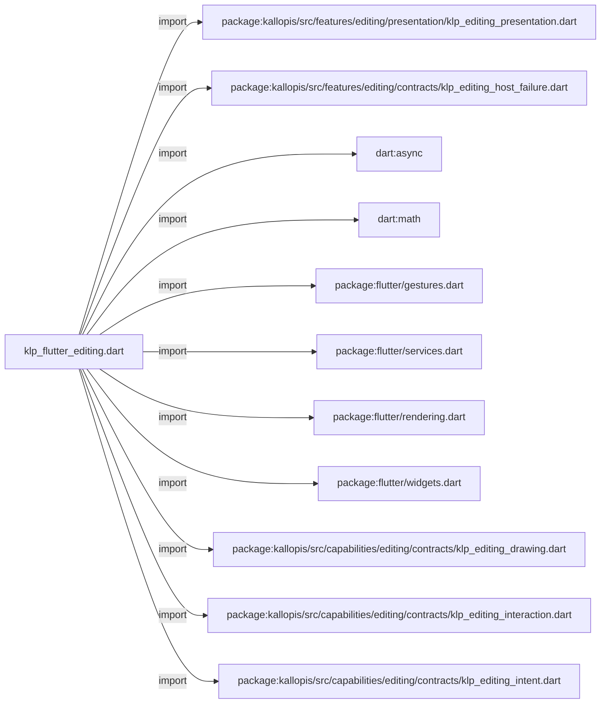
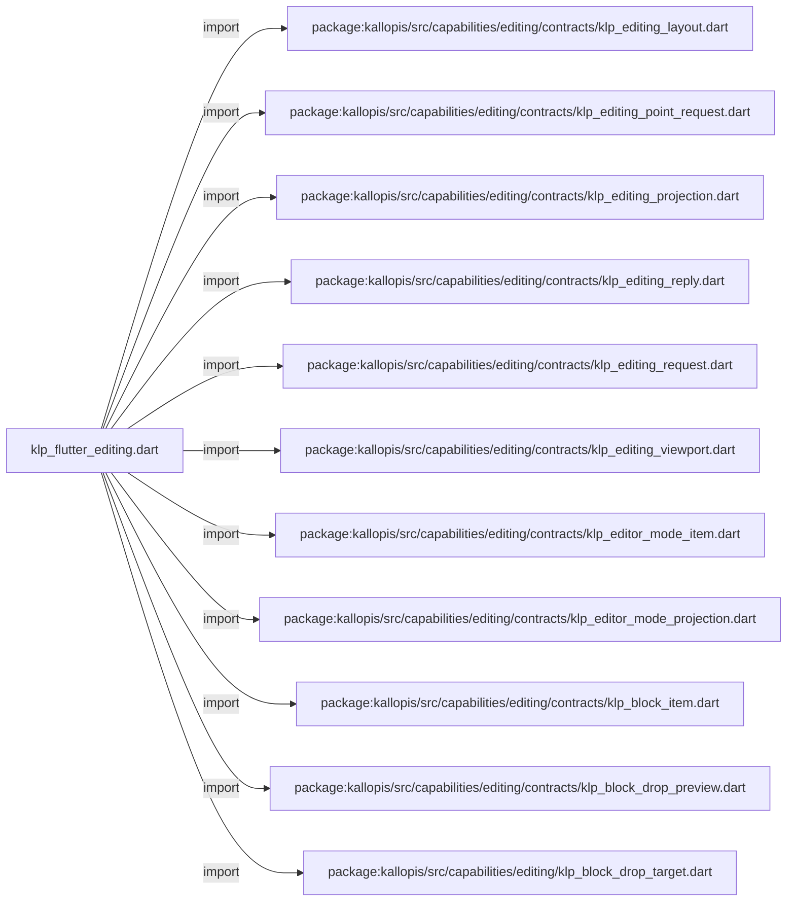
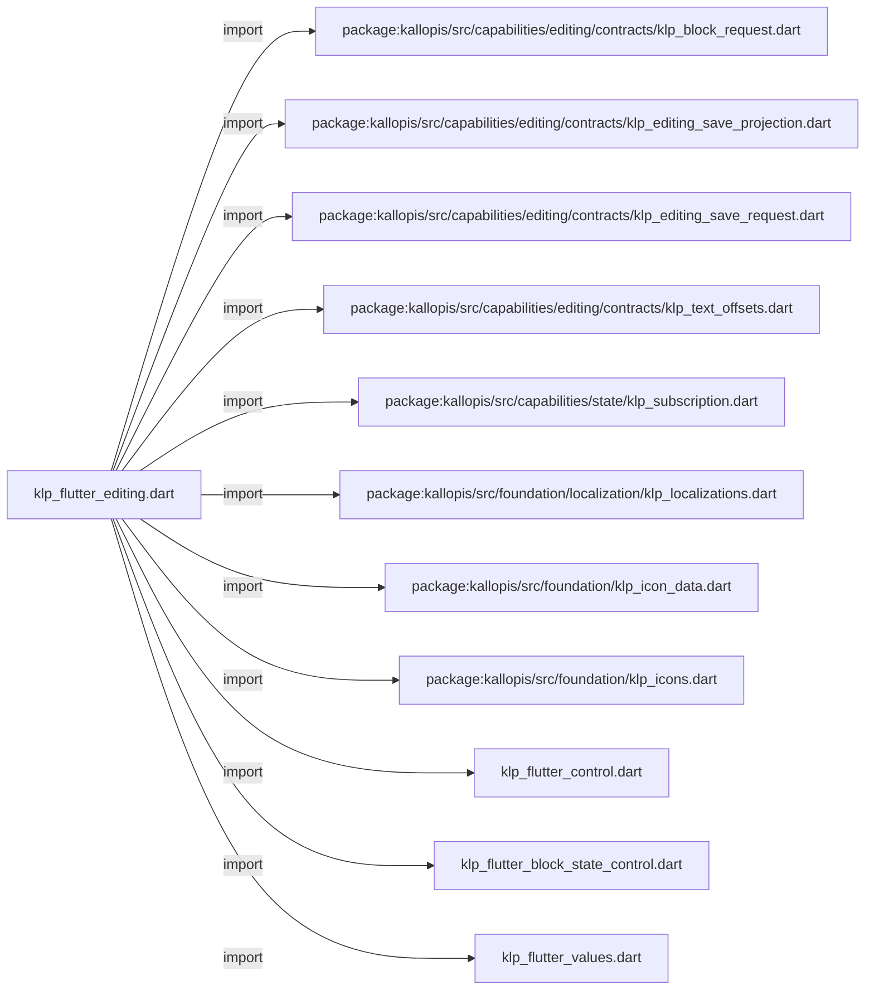
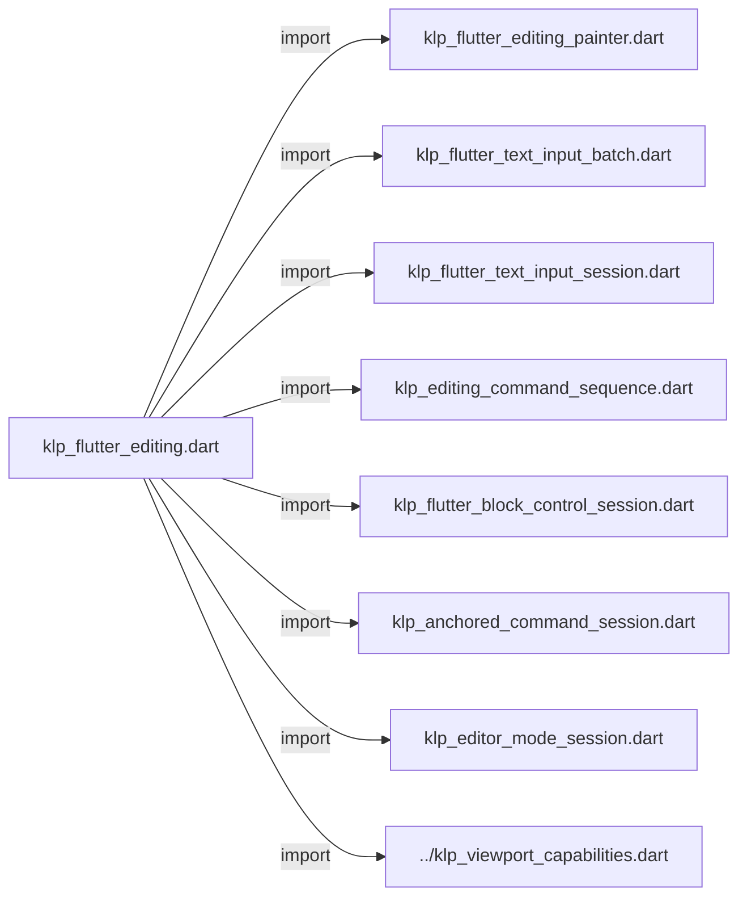
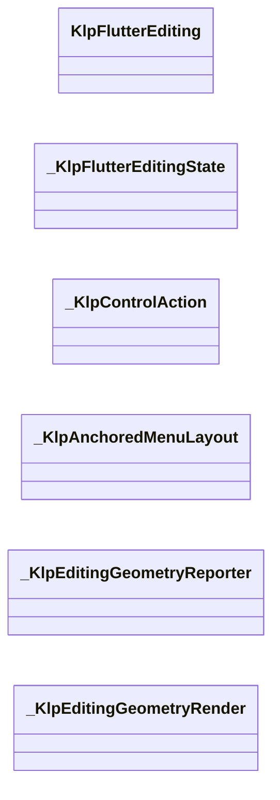
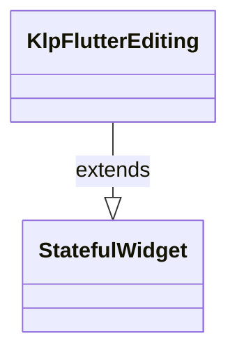
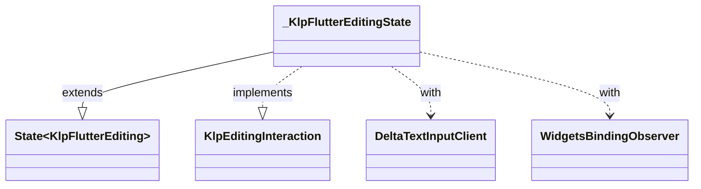
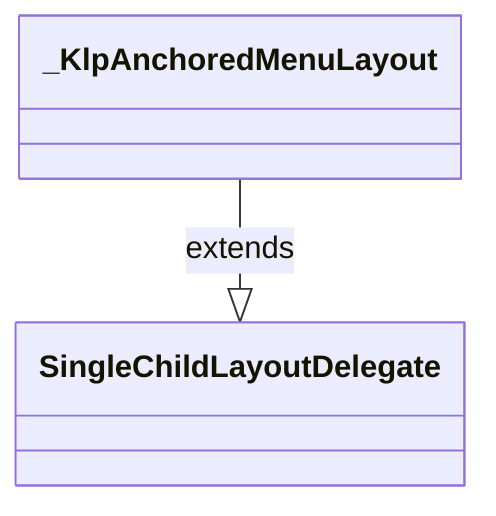
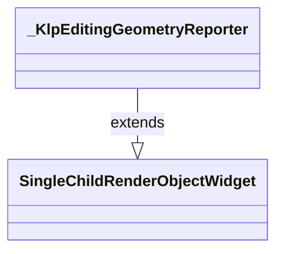
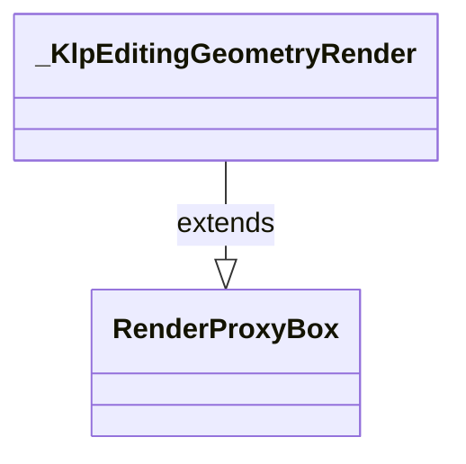

# klp_flutter_editing.dart：直接依賴與宣告架構

[回到目錄](README.md) · [來源檔案](../../../../../../lib/src/rendering/flutter/internal/klp_flutter_editing.dart)

## 範圍

核心是 `lib/src/rendering/flutter/internal/klp_flutter_editing.dart`。主要視角為該檔案明寫的 import／export／part；輔助視角為本檔宣告及 extends／implements／with／on 關係。只展開一層外部邊界。

## 直接依賴圖

## 依賴證據

| 關係 | 原始 directive | 來源 |
|---|---|---|
| import | <code>import &#x27;package:kallopis/src/features/editing/presentation/klp_editing_presentation.dart&#x27;;</code> | [lib/src/rendering/flutter/internal/klp_flutter_editing.dart:1](../../../../../../lib/src/rendering/flutter/internal/klp_flutter_editing.dart#L1) |
| import | <code>import &#x27;package:kallopis/src/features/editing/contracts/klp_editing_host_failure.dart&#x27;;</code> | [lib/src/rendering/flutter/internal/klp_flutter_editing.dart:2](../../../../../../lib/src/rendering/flutter/internal/klp_flutter_editing.dart#L2) |
| import | <code>import &#x27;dart:async&#x27;;</code> | [lib/src/rendering/flutter/internal/klp_flutter_editing.dart:3](../../../../../../lib/src/rendering/flutter/internal/klp_flutter_editing.dart#L3) |
| import | <code>import &#x27;dart:math&#x27; as math;</code> | [lib/src/rendering/flutter/internal/klp_flutter_editing.dart:4](../../../../../../lib/src/rendering/flutter/internal/klp_flutter_editing.dart#L4) |
| import | <code>import &#x27;package:flutter/gestures.dart&#x27;;</code> | [lib/src/rendering/flutter/internal/klp_flutter_editing.dart:5](../../../../../../lib/src/rendering/flutter/internal/klp_flutter_editing.dart#L5) |
| import | <code>import &#x27;package:flutter/services.dart&#x27;;</code> | [lib/src/rendering/flutter/internal/klp_flutter_editing.dart:6](../../../../../../lib/src/rendering/flutter/internal/klp_flutter_editing.dart#L6) |
| import | <code>import &#x27;package:flutter/rendering.dart&#x27;;</code> | [lib/src/rendering/flutter/internal/klp_flutter_editing.dart:7](../../../../../../lib/src/rendering/flutter/internal/klp_flutter_editing.dart#L7) |
| import | <code>import &#x27;package:flutter/widgets.dart&#x27;;</code> | [lib/src/rendering/flutter/internal/klp_flutter_editing.dart:8](../../../../../../lib/src/rendering/flutter/internal/klp_flutter_editing.dart#L8) |
| import | <code>import &#x27;package:kallopis/src/capabilities/editing/contracts/klp_editing_drawing.dart&#x27;;</code> | [lib/src/rendering/flutter/internal/klp_flutter_editing.dart:10](../../../../../../lib/src/rendering/flutter/internal/klp_flutter_editing.dart#L10) |
| import | <code>import &#x27;package:kallopis/src/capabilities/editing/contracts/klp_editing_interaction.dart&#x27;;</code> | [lib/src/rendering/flutter/internal/klp_flutter_editing.dart:11](../../../../../../lib/src/rendering/flutter/internal/klp_flutter_editing.dart#L11) |
| import | <code>import &#x27;package:kallopis/src/capabilities/editing/contracts/klp_editing_intent.dart&#x27;;</code> | [lib/src/rendering/flutter/internal/klp_flutter_editing.dart:12](../../../../../../lib/src/rendering/flutter/internal/klp_flutter_editing.dart#L12) |
| import | <code>import &#x27;package:kallopis/src/capabilities/editing/contracts/klp_editing_layout.dart&#x27;;</code> | [lib/src/rendering/flutter/internal/klp_flutter_editing.dart:13](../../../../../../lib/src/rendering/flutter/internal/klp_flutter_editing.dart#L13) |
| import | <code>import &#x27;package:kallopis/src/capabilities/editing/contracts/klp_editing_point_request.dart&#x27;;</code> | [lib/src/rendering/flutter/internal/klp_flutter_editing.dart:14](../../../../../../lib/src/rendering/flutter/internal/klp_flutter_editing.dart#L14) |
| import | <code>import &#x27;package:kallopis/src/capabilities/editing/contracts/klp_editing_projection.dart&#x27;;</code> | [lib/src/rendering/flutter/internal/klp_flutter_editing.dart:15](../../../../../../lib/src/rendering/flutter/internal/klp_flutter_editing.dart#L15) |
| import | <code>import &#x27;package:kallopis/src/capabilities/editing/contracts/klp_editing_reply.dart&#x27;;</code> | [lib/src/rendering/flutter/internal/klp_flutter_editing.dart:16](../../../../../../lib/src/rendering/flutter/internal/klp_flutter_editing.dart#L16) |
| import | <code>import &#x27;package:kallopis/src/capabilities/editing/contracts/klp_editing_request.dart&#x27;;</code> | [lib/src/rendering/flutter/internal/klp_flutter_editing.dart:17](../../../../../../lib/src/rendering/flutter/internal/klp_flutter_editing.dart#L17) |
| import | <code>import &#x27;package:kallopis/src/capabilities/editing/contracts/klp_editing_viewport.dart&#x27;;</code> | [lib/src/rendering/flutter/internal/klp_flutter_editing.dart:18](../../../../../../lib/src/rendering/flutter/internal/klp_flutter_editing.dart#L18) |
| import | <code>import &#x27;package:kallopis/src/capabilities/editing/contracts/klp_editor_mode_item.dart&#x27;;</code> | [lib/src/rendering/flutter/internal/klp_flutter_editing.dart:19](../../../../../../lib/src/rendering/flutter/internal/klp_flutter_editing.dart#L19) |
| import | <code>import &#x27;package:kallopis/src/capabilities/editing/contracts/klp_editor_mode_projection.dart&#x27;;</code> | [lib/src/rendering/flutter/internal/klp_flutter_editing.dart:20](../../../../../../lib/src/rendering/flutter/internal/klp_flutter_editing.dart#L20) |
| import | <code>import &#x27;package:kallopis/src/capabilities/editing/contracts/klp_block_item.dart&#x27;;</code> | [lib/src/rendering/flutter/internal/klp_flutter_editing.dart:21](../../../../../../lib/src/rendering/flutter/internal/klp_flutter_editing.dart#L21) |
| import | <code>import &#x27;package:kallopis/src/capabilities/editing/contracts/klp_block_drop_preview.dart&#x27;;</code> | [lib/src/rendering/flutter/internal/klp_flutter_editing.dart:22](../../../../../../lib/src/rendering/flutter/internal/klp_flutter_editing.dart#L22) |
| import | <code>import &#x27;package:kallopis/src/capabilities/editing/klp_block_drop_target.dart&#x27;;</code> | [lib/src/rendering/flutter/internal/klp_flutter_editing.dart:23](../../../../../../lib/src/rendering/flutter/internal/klp_flutter_editing.dart#L23) |
| import | <code>import &#x27;package:kallopis/src/capabilities/editing/contracts/klp_block_request.dart&#x27;;</code> | [lib/src/rendering/flutter/internal/klp_flutter_editing.dart:24](../../../../../../lib/src/rendering/flutter/internal/klp_flutter_editing.dart#L24) |
| import | <code>import &#x27;package:kallopis/src/capabilities/editing/contracts/klp_editing_save_projection.dart&#x27;;</code> | [lib/src/rendering/flutter/internal/klp_flutter_editing.dart:25](../../../../../../lib/src/rendering/flutter/internal/klp_flutter_editing.dart#L25) |
| import | <code>import &#x27;package:kallopis/src/capabilities/editing/contracts/klp_editing_save_request.dart&#x27;;</code> | [lib/src/rendering/flutter/internal/klp_flutter_editing.dart:26](../../../../../../lib/src/rendering/flutter/internal/klp_flutter_editing.dart#L26) |
| import | <code>import &#x27;package:kallopis/src/capabilities/editing/contracts/klp_text_offsets.dart&#x27;;</code> | [lib/src/rendering/flutter/internal/klp_flutter_editing.dart:27](../../../../../../lib/src/rendering/flutter/internal/klp_flutter_editing.dart#L27) |
| import | <code>import &#x27;package:kallopis/src/capabilities/state/klp_subscription.dart&#x27;;</code> | [lib/src/rendering/flutter/internal/klp_flutter_editing.dart:28](../../../../../../lib/src/rendering/flutter/internal/klp_flutter_editing.dart#L28) |
| import | <code>import &#x27;package:kallopis/src/foundation/localization/klp_localizations.dart&#x27;;</code> | [lib/src/rendering/flutter/internal/klp_flutter_editing.dart:29](../../../../../../lib/src/rendering/flutter/internal/klp_flutter_editing.dart#L29) |
| import | <code>import &#x27;package:kallopis/src/foundation/klp_icon_data.dart&#x27;;</code> | [lib/src/rendering/flutter/internal/klp_flutter_editing.dart:30](../../../../../../lib/src/rendering/flutter/internal/klp_flutter_editing.dart#L30) |
| import | <code>import &#x27;package:kallopis/src/foundation/klp_icons.dart&#x27;;</code> | [lib/src/rendering/flutter/internal/klp_flutter_editing.dart:31](../../../../../../lib/src/rendering/flutter/internal/klp_flutter_editing.dart#L31) |
| import | <code>import &#x27;klp_flutter_control.dart&#x27;;</code> | [lib/src/rendering/flutter/internal/klp_flutter_editing.dart:32](../../../../../../lib/src/rendering/flutter/internal/klp_flutter_editing.dart#L32) |
| import | <code>import &#x27;klp_flutter_block_state_control.dart&#x27;;</code> | [lib/src/rendering/flutter/internal/klp_flutter_editing.dart:33](../../../../../../lib/src/rendering/flutter/internal/klp_flutter_editing.dart#L33) |
| import | <code>import &#x27;klp_flutter_values.dart&#x27;;</code> | [lib/src/rendering/flutter/internal/klp_flutter_editing.dart:34](../../../../../../lib/src/rendering/flutter/internal/klp_flutter_editing.dart#L34) |
| import | <code>import &#x27;klp_flutter_editing_painter.dart&#x27;;</code> | [lib/src/rendering/flutter/internal/klp_flutter_editing.dart:35](../../../../../../lib/src/rendering/flutter/internal/klp_flutter_editing.dart#L35) |
| import | <code>import &#x27;klp_flutter_text_input_batch.dart&#x27;;</code> | [lib/src/rendering/flutter/internal/klp_flutter_editing.dart:36](../../../../../../lib/src/rendering/flutter/internal/klp_flutter_editing.dart#L36) |
| import | <code>import &#x27;klp_flutter_text_input_session.dart&#x27;;</code> | [lib/src/rendering/flutter/internal/klp_flutter_editing.dart:37](../../../../../../lib/src/rendering/flutter/internal/klp_flutter_editing.dart#L37) |
| import | <code>import &#x27;klp_editing_command_sequence.dart&#x27;;</code> | [lib/src/rendering/flutter/internal/klp_flutter_editing.dart:38](../../../../../../lib/src/rendering/flutter/internal/klp_flutter_editing.dart#L38) |
| import | <code>import &#x27;klp_flutter_block_control_session.dart&#x27;;</code> | [lib/src/rendering/flutter/internal/klp_flutter_editing.dart:39](../../../../../../lib/src/rendering/flutter/internal/klp_flutter_editing.dart#L39) |
| import | <code>import &#x27;klp_anchored_command_session.dart&#x27;;</code> | [lib/src/rendering/flutter/internal/klp_flutter_editing.dart:40](../../../../../../lib/src/rendering/flutter/internal/klp_flutter_editing.dart#L40) |
| import | <code>import &#x27;klp_editor_mode_session.dart&#x27;;</code> | [lib/src/rendering/flutter/internal/klp_flutter_editing.dart:41](../../../../../../lib/src/rendering/flutter/internal/klp_flutter_editing.dart#L41) |
| import | <code>import &#x27;../klp_viewport_capabilities.dart&#x27;;</code> | [lib/src/rendering/flutter/internal/klp_flutter_editing.dart:42](../../../../../../lib/src/rendering/flutter/internal/klp_flutter_editing.dart#L42) |

## 宣告關係圖

本組節點是本檔宣告；沒有箭頭的宣告未在此圖主張互相依賴。

## 宣告與成員證據

成員包含 public 與 private；簽章取自來源，省略函式本體與欄位初始值。`(inferred)` 表示來源未明寫型別；建構子只顯示參數部分，不含初始化列表。

### KlpFlutterEditing

ClassDeclaration · public · [lib/src/rendering/flutter/internal/klp_flutter_editing.dart:44](../../../../../../lib/src/rendering/flutter/internal/klp_flutter_editing.dart#L44)

<code>final class KlpFlutterEditing extends StatefulWidget</code>

來源註解摘要：監看權威繪圖；可編輯來源才在庫內取得焦點、平台輸入與 viewport 排版。

- `extends` → <code>StatefulWidget</code>：[lib/src/rendering/flutter/internal/klp_flutter_editing.dart:45](../../../../../../lib/src/rendering/flutter/internal/klp_flutter_editing.dart#L45)

| 成員 | 可見性 | 簽章／型別 | 來源註解摘要 | 證據 |
|---|---|---|---|---|
| field <code>content</code> | public | <code>final KlpBoundEditing content</code> |  | [lib/src/rendering/flutter/internal/klp_flutter_editing.dart:46](../../../../../../lib/src/rendering/flutter/internal/klp_flutter_editing.dart#L46) |
| constructor <code>KlpFlutterEditing</code> | public | <code>const KlpFlutterEditing({required this.content, super.key})</code> |  | [lib/src/rendering/flutter/internal/klp_flutter_editing.dart:48](../../../../../../lib/src/rendering/flutter/internal/klp_flutter_editing.dart#L48) |
| method <code>createState</code> | public | <code>State&lt;KlpFlutterEditing&gt; createState()</code> |  | [lib/src/rendering/flutter/internal/klp_flutter_editing.dart:50](../../../../../../lib/src/rendering/flutter/internal/klp_flutter_editing.dart#L50) |

### _KlpFlutterEditingState

ClassDeclaration · private · [lib/src/rendering/flutter/internal/klp_flutter_editing.dart:54](../../../../../../lib/src/rendering/flutter/internal/klp_flutter_editing.dart#L54)

<code>final class _KlpFlutterEditingState extends State&lt;KlpFlutterEditing&gt; with DeltaTextInputClient, WidgetsBindingObserver implements KlpEditingInteraction</code>

- `extends` → <code>State&lt;KlpFlutterEditing&gt;</code>：[lib/src/rendering/flutter/internal/klp_flutter_editing.dart:54](../../../../../../lib/src/rendering/flutter/internal/klp_flutter_editing.dart#L54)
- `implements` → <code>KlpEditingInteraction</code>：[lib/src/rendering/flutter/internal/klp_flutter_editing.dart:54](../../../../../../lib/src/rendering/flutter/internal/klp_flutter_editing.dart#L54)
- `with` → <code>DeltaTextInputClient</code>：[lib/src/rendering/flutter/internal/klp_flutter_editing.dart:54](../../../../../../lib/src/rendering/flutter/internal/klp_flutter_editing.dart#L54)
- `with` → <code>WidgetsBindingObserver</code>：[lib/src/rendering/flutter/internal/klp_flutter_editing.dart:54](../../../../../../lib/src/rendering/flutter/internal/klp_flutter_editing.dart#L54)

| 成員 | 可見性 | 簽章／型別 | 來源註解摘要 | 證據 |
|---|---|---|---|---|
| field <code>_focus</code> | private | <code>final FocusNode _focus</code> |  | [lib/src/rendering/flutter/internal/klp_flutter_editing.dart:55](../../../../../../lib/src/rendering/flutter/internal/klp_flutter_editing.dart#L55) |
| field <code>_surface</code> | private | <code>final GlobalKey _surface</code> |  | [lib/src/rendering/flutter/internal/klp_flutter_editing.dart:56](../../../../../../lib/src/rendering/flutter/internal/klp_flutter_editing.dart#L56) |
| field <code>_drawing</code> | private | <code>late KlpEditingDrawing _drawing</code> |  | [lib/src/rendering/flutter/internal/klp_flutter_editing.dart:57](../../../../../../lib/src/rendering/flutter/internal/klp_flutter_editing.dart#L57) |
| field <code>_subscription</code> | private | <code>late KlpSubscription _subscription</code> |  | [lib/src/rendering/flutter/internal/klp_flutter_editing.dart:58](../../../../../../lib/src/rendering/flutter/internal/klp_flutter_editing.dart#L58) |
| field <code>_interactionBinding</code> | private | <code>KlpEditingInteractionBinding? _interactionBinding</code> |  | [lib/src/rendering/flutter/internal/klp_flutter_editing.dart:59](../../../../../../lib/src/rendering/flutter/internal/klp_flutter_editing.dart#L59) |
| field <code>_input</code> | private | <code>KlpFlutterTextInputSession? _input</code> |  | [lib/src/rendering/flutter/internal/klp_flutter_editing.dart:60](../../../../../../lib/src/rendering/flutter/internal/klp_flutter_editing.dart#L60) |
| field <code>_batch</code> | private | <code>KlpFlutterTextInputBatch? _batch</code> |  | [lib/src/rendering/flutter/internal/klp_flutter_editing.dart:61](../../../../../../lib/src/rendering/flutter/internal/klp_flutter_editing.dart#L61) |
| field <code>_blockControls</code> | private | <code>KlpFlutterBlockControlSession? _blockControls</code> |  | [lib/src/rendering/flutter/internal/klp_flutter_editing.dart:62](../../../../../../lib/src/rendering/flutter/internal/klp_flutter_editing.dart#L62) |
| field <code>_anchoredCommands</code> | private | <code>KlpAnchoredCommandSession? _anchoredCommands</code> |  | [lib/src/rendering/flutter/internal/klp_flutter_editing.dart:63](../../../../../../lib/src/rendering/flutter/internal/klp_flutter_editing.dart#L63) |
| field <code>_modeToolbar</code> | private | <code>KlpEditorModeSession? _modeToolbar</code> |  | [lib/src/rendering/flutter/internal/klp_flutter_editing.dart:64](../../../../../../lib/src/rendering/flutter/internal/klp_flutter_editing.dart#L64) |
| field <code>_saveSubscription</code> | private | <code>KlpSubscription? _saveSubscription</code> |  | [lib/src/rendering/flutter/internal/klp_flutter_editing.dart:65](../../../../../../lib/src/rendering/flutter/internal/klp_flutter_editing.dart#L65) |
| field <code>_saveProjection</code> | private | <code>KlpEditingSaveProjection? _saveProjection</code> |  | [lib/src/rendering/flutter/internal/klp_flutter_editing.dart:66](../../../../../../lib/src/rendering/flutter/internal/klp_flutter_editing.dart#L66) |
| field <code>_connection</code> | private | <code>TextInputConnection? _connection</code> |  | [lib/src/rendering/flutter/internal/klp_flutter_editing.dart:67](../../../../../../lib/src/rendering/flutter/internal/klp_flutter_editing.dart#L67) |
| field <code>_value</code> | private | <code>TextEditingValue _value</code> |  | [lib/src/rendering/flutter/internal/klp_flutter_editing.dart:68](../../../../../../lib/src/rendering/flutter/internal/klp_flutter_editing.dart#L68) |
| field <code>_requestedLayout</code> | private | <code>KlpEditingLayout? _requestedLayout</code> |  | [lib/src/rendering/flutter/internal/klp_flutter_editing.dart:69](../../../../../../lib/src/rendering/flutter/internal/klp_flutter_editing.dart#L69) |
| field <code>_pendingLayout</code> | private | <code>KlpEditingLayout? _pendingLayout</code> |  | [lib/src/rendering/flutter/internal/klp_flutter_editing.dart:70](../../../../../../lib/src/rendering/flutter/internal/klp_flutter_editing.dart#L70) |
| field <code>_interruption</code> | private | <code>Future&lt;void&gt;? _interruption</code> |  | [lib/src/rendering/flutter/internal/klp_flutter_editing.dart:71](../../../../../../lib/src/rendering/flutter/internal/klp_flutter_editing.dart#L71) |
| field <code>_detachment</code> | private | <code>Future&lt;void&gt;? _detachment</code> |  | [lib/src/rendering/flutter/internal/klp_flutter_editing.dart:72](../../../../../../lib/src/rendering/flutter/internal/klp_flutter_editing.dart#L72) |
| field <code>_onEditingHostFailure</code> | private | <code>late KlpEditingHostFailureSink _onEditingHostFailure</code> |  | [lib/src/rendering/flutter/internal/klp_flutter_editing.dart:73](../../../../../../lib/src/rendering/flutter/internal/klp_flutter_editing.dart#L73) |
| field <code>_layoutScheduled</code> | private | <code>bool _layoutScheduled</code> |  | [lib/src/rendering/flutter/internal/klp_flutter_editing.dart:74](../../../../../../lib/src/rendering/flutter/internal/klp_flutter_editing.dart#L74) |
| field <code>_inputBusy</code> | private | <code>bool _inputBusy</code> |  | [lib/src/rendering/flutter/internal/klp_flutter_editing.dart:75](../../../../../../lib/src/rendering/flutter/internal/klp_flutter_editing.dart#L75) |
| field <code>_controlBusy</code> | private | <code>bool _controlBusy</code> |  | [lib/src/rendering/flutter/internal/klp_flutter_editing.dart:76](../../../../../../lib/src/rendering/flutter/internal/klp_flutter_editing.dart#L76) |
| field <code>_moreOpen</code> | private | <code>bool _moreOpen</code> |  | [lib/src/rendering/flutter/internal/klp_flutter_editing.dart:77](../../../../../../lib/src/rendering/flutter/internal/klp_flutter_editing.dart#L77) |
| field <code>_blockToolsOpen</code> | private | <code>bool _blockToolsOpen</code> |  | [lib/src/rendering/flutter/internal/klp_flutter_editing.dart:78](../../../../../../lib/src/rendering/flutter/internal/klp_flutter_editing.dart#L78) |
| field <code>_blockKindsOpen</code> | private | <code>bool _blockKindsOpen</code> |  | [lib/src/rendering/flutter/internal/klp_flutter_editing.dart:79](../../../../../../lib/src/rendering/flutter/internal/klp_flutter_editing.dart#L79) |
| field <code>_hoverBlockId</code> | private | <code>String? _hoverBlockId</code> |  | [lib/src/rendering/flutter/internal/klp_flutter_editing.dart:80](../../../../../../lib/src/rendering/flutter/internal/klp_flutter_editing.dart#L80) |
| field <code>_dragBlockId</code> | private | <code>String? _dragBlockId</code> |  | [lib/src/rendering/flutter/internal/klp_flutter_editing.dart:81](../../../../../../lib/src/rendering/flutter/internal/klp_flutter_editing.dart#L81) |
| field <code>_dragPointer</code> | private | <code>Offset? _dragPointer</code> |  | [lib/src/rendering/flutter/internal/klp_flutter_editing.dart:82](../../../../../../lib/src/rendering/flutter/internal/klp_flutter_editing.dart#L82) |
| field <code>_dragGrabOffsetY</code> | private | <code>double _dragGrabOffsetY</code> |  | [lib/src/rendering/flutter/internal/klp_flutter_editing.dart:83](../../../../../../lib/src/rendering/flutter/internal/klp_flutter_editing.dart#L83) |
| field <code>_keyboardDrop</code> | private | <code>bool _keyboardDrop</code> |  | [lib/src/rendering/flutter/internal/klp_flutter_editing.dart:84](../../../../../../lib/src/rendering/flutter/internal/klp_flutter_editing.dart#L84) |
| field <code>_dragAutoScrollTimer</code> | private | <code>Timer? _dragAutoScrollTimer</code> |  | [lib/src/rendering/flutter/internal/klp_flutter_editing.dart:85](../../../../../../lib/src/rendering/flutter/internal/klp_flutter_editing.dart#L85) |
| field <code>_dragAutoScrollDelta</code> | private | <code>double _dragAutoScrollDelta</code> |  | [lib/src/rendering/flutter/internal/klp_flutter_editing.dart:86](../../../../../../lib/src/rendering/flutter/internal/klp_flutter_editing.dart#L86) |
| field <code>_dragAutoScrollBusy</code> | private | <code>bool _dragAutoScrollBusy</code> |  | [lib/src/rendering/flutter/internal/klp_flutter_editing.dart:87](../../../../../../lib/src/rendering/flutter/internal/klp_flutter_editing.dart#L87) |
| field <code>_overflowActions</code> | private | <code>List&lt;_KlpControlAction&gt; _overflowActions</code> |  | [lib/src/rendering/flutter/internal/klp_flutter_editing.dart:88](../../../../../../lib/src/rendering/flutter/internal/klp_flutter_editing.dart#L88) |
| field <code>_moreReturnFocus</code> | private | <code>FocusNode? _moreReturnFocus</code> |  | [lib/src/rendering/flutter/internal/klp_flutter_editing.dart:89](../../../../../../lib/src/rendering/flutter/internal/klp_flutter_editing.dart#L89) |
| field <code>_operationSettled</code> | private | <code>Completer&lt;void&gt;? _operationSettled</code> |  | [lib/src/rendering/flutter/internal/klp_flutter_editing.dart:90](../../../../../../lib/src/rendering/flutter/internal/klp_flutter_editing.dart#L90) |
| field <code>_disposed</code> | private | <code>bool _disposed</code> |  | [lib/src/rendering/flutter/internal/klp_flutter_editing.dart:91](../../../../../../lib/src/rendering/flutter/internal/klp_flutter_editing.dart#L91) |
| field <code>_active</code> | private | <code>bool _active</code> |  | [lib/src/rendering/flutter/internal/klp_flutter_editing.dart:92](../../../../../../lib/src/rendering/flutter/internal/klp_flutter_editing.dart#L92) |
| field <code>_generation</code> | private | <code>int _generation</code> |  | [lib/src/rendering/flutter/internal/klp_flutter_editing.dart:93](../../../../../../lib/src/rendering/flutter/internal/klp_flutter_editing.dart#L93) |
| method <code>initState</code> | public | <code>void initState()</code> |  | [lib/src/rendering/flutter/internal/klp_flutter_editing.dart:95](../../../../../../lib/src/rendering/flutter/internal/klp_flutter_editing.dart#L95) |
| method <code>didChangeDependencies</code> | public | <code>void didChangeDependencies()</code> |  | [lib/src/rendering/flutter/internal/klp_flutter_editing.dart:108](../../../../../../lib/src/rendering/flutter/internal/klp_flutter_editing.dart#L108) |
| method <code>activate</code> | public | <code>void activate()</code> |  | [lib/src/rendering/flutter/internal/klp_flutter_editing.dart:119](../../../../../../lib/src/rendering/flutter/internal/klp_flutter_editing.dart#L119) |
| method <code>deactivate</code> | public | <code>void deactivate()</code> |  | [lib/src/rendering/flutter/internal/klp_flutter_editing.dart:125](../../../../../../lib/src/rendering/flutter/internal/klp_flutter_editing.dart#L125) |
| method <code>didUpdateWidget</code> | public | <code>void didUpdateWidget(KlpFlutterEditing oldWidget)</code> |  | [lib/src/rendering/flutter/internal/klp_flutter_editing.dart:132](../../../../../../lib/src/rendering/flutter/internal/klp_flutter_editing.dart#L132) |
| method <code>_replaceInteraction</code> | private | <code>Future&lt;void&gt; _replaceInteraction(int generation)</code> |  | [lib/src/rendering/flutter/internal/klp_flutter_editing.dart:175](../../../../../../lib/src/rendering/flutter/internal/klp_flutter_editing.dart#L175) |
| method <code>_detachInteraction</code> | private | <code>Future&lt;void&gt; _detachInteraction()</code> |  | [lib/src/rendering/flutter/internal/klp_flutter_editing.dart:194](../../../../../../lib/src/rendering/flutter/internal/klp_flutter_editing.dart#L194) |
| method <code>_detachCaptured</code> | private | <code>Future&lt;void&gt; _detachCaptured(KlpFlutterTextInputSession? input, KlpEditingInteractionBinding? binding)</code> |  | [lib/src/rendering/flutter/internal/klp_flutter_editing.dart:196](../../../../../../lib/src/rendering/flutter/internal/klp_flutter_editing.dart#L196) |
| method <code>_observeInterruption</code> | private | <code>Future&lt;void&gt; _observeInterruption(Future&lt;void&gt; pending)</code> |  | [lib/src/rendering/flutter/internal/klp_flutter_editing.dart:221](../../../../../../lib/src/rendering/flutter/internal/klp_flutter_editing.dart#L221) |
| method <code>_reportTextFailure</code> | private | <code>void _reportTextFailure(KlpEditingHostPhase phase, Object error, StackTrace stack)</code> |  | [lib/src/rendering/flutter/internal/klp_flutter_editing.dart:227](../../../../../../lib/src/rendering/flutter/internal/klp_flutter_editing.dart#L227) |
| method <code>_subscribe</code> | private | <code>void _subscribe()</code> |  | [lib/src/rendering/flutter/internal/klp_flutter_editing.dart:231](../../../../../../lib/src/rendering/flutter/internal/klp_flutter_editing.dart#L231) |
| method <code>_bindInteraction</code> | private | <code>void _bindInteraction()</code> |  | [lib/src/rendering/flutter/internal/klp_flutter_editing.dart:241](../../../../../../lib/src/rendering/flutter/internal/klp_flutter_editing.dart#L241) |
| method <code>_bindBlockControls</code> | private | <code>void _bindBlockControls()</code> |  | [lib/src/rendering/flutter/internal/klp_flutter_editing.dart:246](../../../../../../lib/src/rendering/flutter/internal/klp_flutter_editing.dart#L246) |
| method <code>_bindAnchoredCommands</code> | private | <code>void _bindAnchoredCommands()</code> |  | [lib/src/rendering/flutter/internal/klp_flutter_editing.dart:251](../../../../../../lib/src/rendering/flutter/internal/klp_flutter_editing.dart#L251) |
| method <code>_bindModeToolbar</code> | private | <code>void _bindModeToolbar()</code> |  | [lib/src/rendering/flutter/internal/klp_flutter_editing.dart:256](../../../../../../lib/src/rendering/flutter/internal/klp_flutter_editing.dart#L256) |
| method <code>_bindSave</code> | private | <code>void _bindSave()</code> |  | [lib/src/rendering/flutter/internal/klp_flutter_editing.dart:264](../../../../../../lib/src/rendering/flutter/internal/klp_flutter_editing.dart#L264) |
| getter <code>_acceptsTextInput</code> | private | <code>bool get _acceptsTextInput</code> |  | [lib/src/rendering/flutter/internal/klp_flutter_editing.dart:273](../../../../../../lib/src/rendering/flutter/internal/klp_flutter_editing.dart#L273) |
| method <code>build</code> | public | <code>Widget build(BuildContext context)</code> |  | [lib/src/rendering/flutter/internal/klp_flutter_editing.dart:280](../../../../../../lib/src/rendering/flutter/internal/klp_flutter_editing.dart#L280) |
| method <code>_buildToolbar</code> | private | <code>Widget _buildToolbar(BuildContext context, double width)</code> |  | [lib/src/rendering/flutter/internal/klp_flutter_editing.dart:335](../../../../../../lib/src/rendering/flutter/internal/klp_flutter_editing.dart#L335) |
| method <code>_control</code> | private | <code>Widget _control(_KlpControlAction action)</code> |  | [lib/src/rendering/flutter/internal/klp_flutter_editing.dart:372](../../../../../../lib/src/rendering/flutter/internal/klp_flutter_editing.dart#L372) |
| method <code>_saveStatus</code> | private | <code>String _saveStatus(KlpLocalizations labels)</code> |  | [lib/src/rendering/flutter/internal/klp_flutter_editing.dart:383](../../../../../../lib/src/rendering/flutter/internal/klp_flutter_editing.dart#L383) |
| method <code>_save</code> | private | <code>Future&lt;void&gt; _save()</code> |  | [lib/src/rendering/flutter/internal/klp_flutter_editing.dart:394](../../../../../../lib/src/rendering/flutter/internal/klp_flutter_editing.dart#L394) |
| method <code>_runControl</code> | private | <code>Future&lt;void&gt; _runControl(FutureOr&lt;Object?&gt; Function() operation)</code> |  | [lib/src/rendering/flutter/internal/klp_flutter_editing.dart:408](../../../../../../lib/src/rendering/flutter/internal/klp_flutter_editing.dart#L408) |
| method <code>_buildBlockControls</code> | private | <code>Widget? _buildBlockControls(BuildContext context, KlpEditingViewport viewport)</code> |  | [lib/src/rendering/flutter/internal/klp_flutter_editing.dart:418](../../../../../../lib/src/rendering/flutter/internal/klp_flutter_editing.dart#L418) |
| method <code>_buildBlockStateControl</code> | private | <code>Widget _buildBlockStateControl(KlpBlockItem block, KlpFlutterBlockControlSession session, KlpLocalizations labels, KlpEditingViewport viewport)</code> |  | [lib/src/rendering/flutter/internal/klp_flutter_editing.dart:443](../../../../../../lib/src/rendering/flutter/internal/klp_flutter_editing.dart#L443) |
| method <code>_blockStateVisible</code> | private | <code>bool _blockStateVisible(KlpBlockItem block, KlpEditingViewport viewport)</code> |  | [lib/src/rendering/flutter/internal/klp_flutter_editing.dart:465](../../../../../../lib/src/rendering/flutter/internal/klp_flutter_editing.dart#L465) |
| method <code>_buildBlockTools</code> | private | <code>Widget _buildBlockTools(KlpBlockItem block, KlpFlutterBlockControlSession session, KlpLocalizations labels, KlpEditingViewport viewport)</code> |  | [lib/src/rendering/flutter/internal/klp_flutter_editing.dart:467](../../../../../../lib/src/rendering/flutter/internal/klp_flutter_editing.dart#L467) |
| method <code>_beginBlockDrag</code> | private | <code>void _beginBlockDrag(KlpBlockItem block, KlpFlutterBlockControlSession session, DragStartDetails details)</code> |  | [lib/src/rendering/flutter/internal/klp_flutter_editing.dart:509](../../../../../../lib/src/rendering/flutter/internal/klp_flutter_editing.dart#L509) |
| method <code>_updateBlockDrag</code> | private | <code>void _updateBlockDrag(KlpBlockItem source, KlpFlutterBlockControlSession session, KlpEditingViewport viewport, DragUpdateDetails details)</code> |  | [lib/src/rendering/flutter/internal/klp_flutter_editing.dart:526](../../../../../../lib/src/rendering/flutter/internal/klp_flutter_editing.dart#L526) |
| method <code>_previewPointerDrop</code> | private | <code>void _previewPointerDrop(String sourceId, KlpFlutterBlockControlSession session, Offset pointer, KlpEditingViewport viewport)</code> |  | [lib/src/rendering/flutter/internal/klp_flutter_editing.dart:539](../../../../../../lib/src/rendering/flutter/internal/klp_flutter_editing.dart#L539) |
| method <code>_updateDragAutoScroll</code> | private | <code>void _updateDragAutoScroll(Offset pointer, KlpEditingViewport viewport, KlpFlutterBlockControlSession session)</code> |  | [lib/src/rendering/flutter/internal/klp_flutter_editing.dart:551](../../../../../../lib/src/rendering/flutter/internal/klp_flutter_editing.dart#L551) |
| method <code>_tickDragAutoScroll</code> | private | <code>Future&lt;void&gt; _tickDragAutoScroll(KlpFlutterBlockControlSession session)</code> |  | [lib/src/rendering/flutter/internal/klp_flutter_editing.dart:564](../../../../../../lib/src/rendering/flutter/internal/klp_flutter_editing.dart#L564) |
| method <code>_stopDragAutoScroll</code> | private | <code>void _stopDragAutoScroll()</code> |  | [lib/src/rendering/flutter/internal/klp_flutter_editing.dart:585](../../../../../../lib/src/rendering/flutter/internal/klp_flutter_editing.dart#L585) |
| method <code>_finishBlockDrag</code> | private | <code>void _finishBlockDrag(KlpFlutterBlockControlSession session)</code> |  | [lib/src/rendering/flutter/internal/klp_flutter_editing.dart:591](../../../../../../lib/src/rendering/flutter/internal/klp_flutter_editing.dart#L591) |
| method <code>_cancelBlockDrag</code> | private | <code>void _cancelBlockDrag(KlpFlutterBlockControlSession session)</code> |  | [lib/src/rendering/flutter/internal/klp_flutter_editing.dart:604](../../../../../../lib/src/rendering/flutter/internal/klp_flutter_editing.dart#L604) |
| method <code>_handleBlockGripKey</code> | private | <code>KeyEventResult _handleBlockGripKey(KeyEvent event, KlpBlockItem block, KlpFlutterBlockControlSession session)</code> |  | [lib/src/rendering/flutter/internal/klp_flutter_editing.dart:610](../../../../../../lib/src/rendering/flutter/internal/klp_flutter_editing.dart#L610) |
| method <code>_beginKeyboardBlockDrag</code> | private | <code>void _beginKeyboardBlockDrag(KlpBlockItem block, KlpFlutterBlockControlSession session)</code> |  | [lib/src/rendering/flutter/internal/klp_flutter_editing.dart:645](../../../../../../lib/src/rendering/flutter/internal/klp_flutter_editing.dart#L645) |
| method <code>_stepKeyboardBlockDrag</code> | private | <code>void _stepKeyboardBlockDrag(KlpBlockItem source, KlpFlutterBlockControlSession session, int direction)</code> |  | [lib/src/rendering/flutter/internal/klp_flutter_editing.dart:667](../../../../../../lib/src/rendering/flutter/internal/klp_flutter_editing.dart#L667) |
| method <code>_extendBlockSelection</code> | private | <code>void _extendBlockSelection(KlpFlutterBlockControlSession session, int direction)</code> |  | [lib/src/rendering/flutter/internal/klp_flutter_editing.dart:697](../../../../../../lib/src/rendering/flutter/internal/klp_flutter_editing.dart#L697) |
| method <code>_handleBlockControlKey</code> | private | <code>KeyEventResult _handleBlockControlKey(KeyEvent event, KlpFlutterBlockControlSession session)</code> |  | [lib/src/rendering/flutter/internal/klp_flutter_editing.dart:707](../../../../../../lib/src/rendering/flutter/internal/klp_flutter_editing.dart#L707) |
| method <code>_discardBlockDrag</code> | private | <code>void _discardBlockDrag()</code> |  | [lib/src/rendering/flutter/internal/klp_flutter_editing.dart:713](../../../../../../lib/src/rendering/flutter/internal/klp_flutter_editing.dart#L713) |
| method <code>_clearBlockDragState</code> | private | <code>void _clearBlockDragState()</code> |  | [lib/src/rendering/flutter/internal/klp_flutter_editing.dart:722](../../../../../../lib/src/rendering/flutter/internal/klp_flutter_editing.dart#L722) |
| method <code>_editorLocal</code> | private | <code>Offset _editorLocal(Offset global)</code> |  | [lib/src/rendering/flutter/internal/klp_flutter_editing.dart:732](../../../../../../lib/src/rendering/flutter/internal/klp_flutter_editing.dart#L732) |
| method <code>_buildDropIndicator</code> | private | <code>Widget _buildDropIndicator(List&lt;KlpBlockItem&gt; blocks, KlpBlockDropPreview preview, KlpEditingViewport viewport)</code> |  | [lib/src/rendering/flutter/internal/klp_flutter_editing.dart:738](../../../../../../lib/src/rendering/flutter/internal/klp_flutter_editing.dart#L738) |
| method <code>_buildDropGhost</code> | private | <code>Widget? _buildDropGhost(List&lt;KlpBlockItem&gt; blocks, KlpEditingViewport viewport)</code> |  | [lib/src/rendering/flutter/internal/klp_flutter_editing.dart:748](../../../../../../lib/src/rendering/flutter/internal/klp_flutter_editing.dart#L748) |
| method <code>_activateBlock</code> | private | <code>void _activateBlock(KlpBlockItem block)</code> |  | [lib/src/rendering/flutter/internal/klp_flutter_editing.dart:777](../../../../../../lib/src/rendering/flutter/internal/klp_flutter_editing.dart#L777) |
| method <code>_updateHoveredBlock</code> | private | <code>void _updateHoveredBlock(PointerHoverEvent event)</code> |  | [lib/src/rendering/flutter/internal/klp_flutter_editing.dart:799](../../../../../../lib/src/rendering/flutter/internal/klp_flutter_editing.dart#L799) |
| method <code>_clearHoveredBlock</code> | private | <code>void _clearHoveredBlock()</code> |  | [lib/src/rendering/flutter/internal/klp_flutter_editing.dart:813](../../../../../../lib/src/rendering/flutter/internal/klp_flutter_editing.dart#L813) |
| method <code>_buildBlockKindMenu</code> | private | <code>Widget _buildBlockKindMenu(KlpLocalizations labels, KlpBlockItem block)</code> |  | [lib/src/rendering/flutter/internal/klp_flutter_editing.dart:818](../../../../../../lib/src/rendering/flutter/internal/klp_flutter_editing.dart#L818) |
| method <code>_isListBlock</code> | private | <code>bool _isListBlock(KlpBlockItem block)</code> |  | [lib/src/rendering/flutter/internal/klp_flutter_editing.dart:833](../../../../../../lib/src/rendering/flutter/internal/klp_flutter_editing.dart#L833) |
| getter <code>_listSelectionSupported</code> | private | <code>bool get _listSelectionSupported</code> |  | [lib/src/rendering/flutter/internal/klp_flutter_editing.dart:834](../../../../../../lib/src/rendering/flutter/internal/klp_flutter_editing.dart#L834) |
| method <code>_listMenuAction</code> | private | <code>Widget _listMenuAction(String label, Future&lt;KlpEditingReply&gt; Function() action, {bool enabled = true})</code> |  | [lib/src/rendering/flutter/internal/klp_flutter_editing.dart:836](../../../../../../lib/src/rendering/flutter/internal/klp_flutter_editing.dart#L836) |
| method <code>_blockKindLabel</code> | private | <code>String _blockKindLabel(KlpLocalizations labels, KlpBlockTextKind kind)</code> |  | [lib/src/rendering/flutter/internal/klp_flutter_editing.dart:845](../../../../../../lib/src/rendering/flutter/internal/klp_flutter_editing.dart#L845) |
| method <code>_toggleMore</code> | private | <code>void _toggleMore()</code> |  | [lib/src/rendering/flutter/internal/klp_flutter_editing.dart:852](../../../../../../lib/src/rendering/flutter/internal/klp_flutter_editing.dart#L852) |
| method <code>_openMore</code> | private | <code>Future&lt;void&gt; _openMore()</code> |  | [lib/src/rendering/flutter/internal/klp_flutter_editing.dart:860](../../../../../../lib/src/rendering/flutter/internal/klp_flutter_editing.dart#L860) |
| method <code>_closeMore</code> | private | <code>void _closeMore()</code> |  | [lib/src/rendering/flutter/internal/klp_flutter_editing.dart:873](../../../../../../lib/src/rendering/flutter/internal/klp_flutter_editing.dart#L873) |
| method <code>_discardMore</code> | private | <code>void _discardMore()</code> |  | [lib/src/rendering/flutter/internal/klp_flutter_editing.dart:886](../../../../../../lib/src/rendering/flutter/internal/klp_flutter_editing.dart#L886) |
| method <code>_moreAnchor</code> | private | <code>Rect _moreAnchor(KlpEditingViewport viewport)</code> |  | [lib/src/rendering/flutter/internal/klp_flutter_editing.dart:891](../../../../../../lib/src/rendering/flutter/internal/klp_flutter_editing.dart#L891) |
| method <code>_buildMoreMenu</code> | private | <code>Widget _buildMoreMenu(BuildContext context, double maximumWidth)</code> |  | [lib/src/rendering/flutter/internal/klp_flutter_editing.dart:898](../../../../../../lib/src/rendering/flutter/internal/klp_flutter_editing.dart#L898) |
| method <code>_menuSurface</code> | private | <code>Widget _menuSurface(List&lt;Widget&gt; children)</code> |  | [lib/src/rendering/flutter/internal/klp_flutter_editing.dart:918](../../../../../../lib/src/rendering/flutter/internal/klp_flutter_editing.dart#L918) |
| method <code>_handleMoreKey</code> | private | <code>KeyEventResult _handleMoreKey(KeyEvent event)</code> |  | [lib/src/rendering/flutter/internal/klp_flutter_editing.dart:923](../../../../../../lib/src/rendering/flutter/internal/klp_flutter_editing.dart#L923) |
| method <code>_confirmCommand</code> | private | <code>Future&lt;void&gt; _confirmCommand(String id)</code> |  | [lib/src/rendering/flutter/internal/klp_flutter_editing.dart:944](../../../../../../lib/src/rendering/flutter/internal/klp_flutter_editing.dart#L944) |
| method <code>_confirmHighlighted</code> | private | <code>Future&lt;void&gt; _confirmHighlighted()</code> |  | [lib/src/rendering/flutter/internal/klp_flutter_editing.dart:951](../../../../../../lib/src/rendering/flutter/internal/klp_flutter_editing.dart#L951) |
| method <code>_handlePointerSignal</code> | private | <code>void _handlePointerSignal(PointerSignalEvent event, KlpEditingViewport viewport)</code> |  | [lib/src/rendering/flutter/internal/klp_flutter_editing.dart:958](../../../../../../lib/src/rendering/flutter/internal/klp_flutter_editing.dart#L958) |
| method <code>_navigateViewport</code> | private | <code>Future&lt;void&gt; _navigateViewport(KlpEditorModeSession toolbar, double deltaY)</code> |  | [lib/src/rendering/flutter/internal/klp_flutter_editing.dart:965](../../../../../../lib/src/rendering/flutter/internal/klp_flutter_editing.dart#L965) |
| method <code>_scheduleLayout</code> | private | <code>void _scheduleLayout(KlpEditingLayout requested)</code> |  | [lib/src/rendering/flutter/internal/klp_flutter_editing.dart:970](../../../../../../lib/src/rendering/flutter/internal/klp_flutter_editing.dart#L970) |
| method <code>_selectPoint</code> | private | <code>Future&lt;void&gt; _selectPoint(TapDownDetails details)</code> |  | [lib/src/rendering/flutter/internal/klp_flutter_editing.dart:994](../../../../../../lib/src/rendering/flutter/internal/klp_flutter_editing.dart#L994) |
| method <code>_handleFocus</code> | private | <code>void _handleFocus()</code> |  | [lib/src/rendering/flutter/internal/klp_flutter_editing.dart:1045](../../../../../../lib/src/rendering/flutter/internal/klp_flutter_editing.dart#L1045) |
| method <code>_resumeAndAttach</code> | private | <code>Future&lt;void&gt; _resumeAndAttach()</code> |  | [lib/src/rendering/flutter/internal/klp_flutter_editing.dart:1056](../../../../../../lib/src/rendering/flutter/internal/klp_flutter_editing.dart#L1056) |
| method <code>interrupt</code> | public | <code>Future&lt;void&gt; interrupt()</code> |  | [lib/src/rendering/flutter/internal/klp_flutter_editing.dart:1098](../../../../../../lib/src/rendering/flutter/internal/klp_flutter_editing.dart#L1098) |
| method <code>_interrupt</code> | private | <code>Future&lt;void&gt; _interrupt()</code> |  | [lib/src/rendering/flutter/internal/klp_flutter_editing.dart:1101](../../../../../../lib/src/rendering/flutter/internal/klp_flutter_editing.dart#L1101) |
| method <code>_isCurrentInput</code> | private | <code>bool _isCurrentInput(int generation, KlpFlutterTextInputSession? input)</code> |  | [lib/src/rendering/flutter/internal/klp_flutter_editing.dart:1130](../../../../../../lib/src/rendering/flutter/internal/klp_flutter_editing.dart#L1130) |
| method <code>_finishInputOperation</code> | private | <code>void _finishInputOperation(Completer&lt;void&gt; settled, int generation)</code> |  | [lib/src/rendering/flutter/internal/klp_flutter_editing.dart:1132](../../../../../../lib/src/rendering/flutter/internal/klp_flutter_editing.dart#L1132) |
| method <code>updateEditingValueWithDeltas</code> | public | <code>void updateEditingValueWithDeltas(List&lt;TextEditingDelta&gt; deltas)</code> |  | [lib/src/rendering/flutter/internal/klp_flutter_editing.dart:1148](../../../../../../lib/src/rendering/flutter/internal/klp_flutter_editing.dart#L1148) |
| method <code>_applyDeltas</code> | private | <code>Future&lt;void&gt; _applyDeltas(List&lt;TextEditingDelta&gt; deltas, int generation)</code> |  | [lib/src/rendering/flutter/internal/klp_flutter_editing.dart:1161](../../../../../../lib/src/rendering/flutter/internal/klp_flutter_editing.dart#L1161) |
| method <code>_syncInput</code> | private | <code>void _syncInput(KlpEditingProjection projection, {bool published = false})</code> |  | [lib/src/rendering/flutter/internal/klp_flutter_editing.dart:1182](../../../../../../lib/src/rendering/flutter/internal/klp_flutter_editing.dart#L1182) |
| method <code>_resynchronize</code> | private | <code>void _resynchronize(KlpEditingProjection projection)</code> |  | [lib/src/rendering/flutter/internal/klp_flutter_editing.dart:1193](../../../../../../lib/src/rendering/flutter/internal/klp_flutter_editing.dart#L1193) |
| method <code>_handleTextKey</code> | private | <code>KeyEventResult _handleTextKey(FocusNode node, KeyEvent event)</code> |  | [lib/src/rendering/flutter/internal/klp_flutter_editing.dart:1199](../../../../../../lib/src/rendering/flutter/internal/klp_flutter_editing.dart#L1199) |
| method <code>_submitEditingCommand</code> | private | <code>Future&lt;void&gt; _submitEditingCommand(KlpEditingCommand command)</code> |  | [lib/src/rendering/flutter/internal/klp_flutter_editing.dart:1218](../../../../../../lib/src/rendering/flutter/internal/klp_flutter_editing.dart#L1218) |
| method <code>_editingValue</code> | private | <code>TextEditingValue _editingValue(KlpEditingProjection projection)</code> |  | [lib/src/rendering/flutter/internal/klp_flutter_editing.dart:1244](../../../../../../lib/src/rendering/flutter/internal/klp_flutter_editing.dart#L1244) |
| method <code>_updateGeometry</code> | private | <code>void _updateGeometry(Layer layer)</code> |  | [lib/src/rendering/flutter/internal/klp_flutter_editing.dart:1259](../../../../../../lib/src/rendering/flutter/internal/klp_flutter_editing.dart#L1259) |
| getter <code>currentTextEditingValue</code> | public | <code>TextEditingValue get currentTextEditingValue</code> |  | [lib/src/rendering/flutter/internal/klp_flutter_editing.dart:1279](../../../../../../lib/src/rendering/flutter/internal/klp_flutter_editing.dart#L1279) |
| getter <code>currentAutofillScope</code> | public | <code>AutofillScope? get currentAutofillScope</code> |  | [lib/src/rendering/flutter/internal/klp_flutter_editing.dart:1281](../../../../../../lib/src/rendering/flutter/internal/klp_flutter_editing.dart#L1281) |
| method <code>updateEditingValue</code> | public | <code>void updateEditingValue(TextEditingValue value)</code> |  | [lib/src/rendering/flutter/internal/klp_flutter_editing.dart:1283](../../../../../../lib/src/rendering/flutter/internal/klp_flutter_editing.dart#L1283) |
| method <code>performAction</code> | public | <code>void performAction(TextInputAction action)</code> |  | [lib/src/rendering/flutter/internal/klp_flutter_editing.dart:1285](../../../../../../lib/src/rendering/flutter/internal/klp_flutter_editing.dart#L1285) |
| method <code>performPrivateCommand</code> | public | <code>void performPrivateCommand(String action, Map&lt;String, dynamic&gt; data)</code> |  | [lib/src/rendering/flutter/internal/klp_flutter_editing.dart:1289](../../../../../../lib/src/rendering/flutter/internal/klp_flutter_editing.dart#L1289) |
| method <code>showAutocorrectionPromptRect</code> | public | <code>void showAutocorrectionPromptRect(int start, int end)</code> |  | [lib/src/rendering/flutter/internal/klp_flutter_editing.dart:1291](../../../../../../lib/src/rendering/flutter/internal/klp_flutter_editing.dart#L1291) |
| method <code>updateFloatingCursor</code> | public | <code>void updateFloatingCursor(RawFloatingCursorPoint point)</code> |  | [lib/src/rendering/flutter/internal/klp_flutter_editing.dart:1293](../../../../../../lib/src/rendering/flutter/internal/klp_flutter_editing.dart#L1293) |
| method <code>didChangeInputControl</code> | public | <code>void didChangeInputControl(TextInputControl? oldControl, TextInputControl? newControl)</code> |  | [lib/src/rendering/flutter/internal/klp_flutter_editing.dart:1295](../../../../../../lib/src/rendering/flutter/internal/klp_flutter_editing.dart#L1295) |
| method <code>insertContent</code> | public | <code>void insertContent(KeyboardInsertedContent content)</code> |  | [lib/src/rendering/flutter/internal/klp_flutter_editing.dart:1297](../../../../../../lib/src/rendering/flutter/internal/klp_flutter_editing.dart#L1297) |
| method <code>insertTextPlaceholder</code> | public | <code>void insertTextPlaceholder(Size size)</code> |  | [lib/src/rendering/flutter/internal/klp_flutter_editing.dart:1299](../../../../../../lib/src/rendering/flutter/internal/klp_flutter_editing.dart#L1299) |
| method <code>onFocusReceived</code> | public | <code>bool onFocusReceived()</code> |  | [lib/src/rendering/flutter/internal/klp_flutter_editing.dart:1301](../../../../../../lib/src/rendering/flutter/internal/klp_flutter_editing.dart#L1301) |
| method <code>performSelector</code> | public | <code>void performSelector(String selectorName)</code> |  | [lib/src/rendering/flutter/internal/klp_flutter_editing.dart:1303](../../../../../../lib/src/rendering/flutter/internal/klp_flutter_editing.dart#L1303) |
| method <code>removeTextPlaceholder</code> | public | <code>void removeTextPlaceholder()</code> |  | [lib/src/rendering/flutter/internal/klp_flutter_editing.dart:1305](../../../../../../lib/src/rendering/flutter/internal/klp_flutter_editing.dart#L1305) |
| method <code>showToolbar</code> | public | <code>void showToolbar()</code> |  | [lib/src/rendering/flutter/internal/klp_flutter_editing.dart:1307](../../../../../../lib/src/rendering/flutter/internal/klp_flutter_editing.dart#L1307) |
| method <code>connectionClosed</code> | public | <code>void connectionClosed()</code> |  | [lib/src/rendering/flutter/internal/klp_flutter_editing.dart:1310](../../../../../../lib/src/rendering/flutter/internal/klp_flutter_editing.dart#L1310) |
| method <code>didChangeAppLifecycleState</code> | public | <code>void didChangeAppLifecycleState(AppLifecycleState state)</code> |  | [lib/src/rendering/flutter/internal/klp_flutter_editing.dart:1319](../../../../../../lib/src/rendering/flutter/internal/klp_flutter_editing.dart#L1319) |
| method <code>dispose</code> | public | <code>void dispose()</code> |  | [lib/src/rendering/flutter/internal/klp_flutter_editing.dart:1329](../../../../../../lib/src/rendering/flutter/internal/klp_flutter_editing.dart#L1329) |

### _KlpControlAction

ClassDeclaration · private · [lib/src/rendering/flutter/internal/klp_flutter_editing.dart:1347](../../../../../../lib/src/rendering/flutter/internal/klp_flutter_editing.dart#L1347)

<code>final class _KlpControlAction</code>

| 成員 | 可見性 | 簽章／型別 | 來源註解摘要 | 證據 |
|---|---|---|---|---|
| field <code>label</code> | public | <code>final String label</code> |  | [lib/src/rendering/flutter/internal/klp_flutter_editing.dart:1348](../../../../../../lib/src/rendering/flutter/internal/klp_flutter_editing.dart#L1348) |
| field <code>icon</code> | public | <code>final KlpIconData? icon</code> |  | [lib/src/rendering/flutter/internal/klp_flutter_editing.dart:1349](../../../../../../lib/src/rendering/flutter/internal/klp_flutter_editing.dart#L1349) |
| field <code>selected</code> | public | <code>final bool selected</code> |  | [lib/src/rendering/flutter/internal/klp_flutter_editing.dart:1350](../../../../../../lib/src/rendering/flutter/internal/klp_flutter_editing.dart#L1350) |
| field <code>enabled</code> | public | <code>final bool enabled</code> |  | [lib/src/rendering/flutter/internal/klp_flutter_editing.dart:1351](../../../../../../lib/src/rendering/flutter/internal/klp_flutter_editing.dart#L1351) |
| field <code>quarterTurns</code> | public | <code>final int quarterTurns</code> |  | [lib/src/rendering/flutter/internal/klp_flutter_editing.dart:1352](../../../../../../lib/src/rendering/flutter/internal/klp_flutter_editing.dart#L1352) |
| field <code>action</code> | public | <code>final VoidCallback action</code> |  | [lib/src/rendering/flutter/internal/klp_flutter_editing.dart:1353](../../../../../../lib/src/rendering/flutter/internal/klp_flutter_editing.dart#L1353) |
| constructor <code>_KlpControlAction</code> | private | <code>const _KlpControlAction({required this.label, required this.icon, required this.enabled, required this.action, this.selected = false, this.quarterTurns = 0})</code> |  | [lib/src/rendering/flutter/internal/klp_flutter_editing.dart:1355](../../../../../../lib/src/rendering/flutter/internal/klp_flutter_editing.dart#L1355) |

### _KlpAnchoredMenuLayout

ClassDeclaration · private · [lib/src/rendering/flutter/internal/klp_flutter_editing.dart:1358](../../../../../../lib/src/rendering/flutter/internal/klp_flutter_editing.dart#L1358)

<code>final class _KlpAnchoredMenuLayout extends SingleChildLayoutDelegate</code>

- `extends` → <code>SingleChildLayoutDelegate</code>：[lib/src/rendering/flutter/internal/klp_flutter_editing.dart:1358](../../../../../../lib/src/rendering/flutter/internal/klp_flutter_editing.dart#L1358)

| 成員 | 可見性 | 簽章／型別 | 來源註解摘要 | 證據 |
|---|---|---|---|---|
| field <code>anchor</code> | public | <code>final Rect anchor</code> |  | [lib/src/rendering/flutter/internal/klp_flutter_editing.dart:1359](../../../../../../lib/src/rendering/flutter/internal/klp_flutter_editing.dart#L1359) |
| field <code>gap</code> | public | <code>final double gap</code> |  | [lib/src/rendering/flutter/internal/klp_flutter_editing.dart:1360](../../../../../../lib/src/rendering/flutter/internal/klp_flutter_editing.dart#L1360) |
| constructor <code>_KlpAnchoredMenuLayout</code> | private | <code>const _KlpAnchoredMenuLayout(this.anchor, this.gap)</code> |  | [lib/src/rendering/flutter/internal/klp_flutter_editing.dart:1362](../../../../../../lib/src/rendering/flutter/internal/klp_flutter_editing.dart#L1362) |
| method <code>getConstraintsForChild</code> | public | <code>BoxConstraints getConstraintsForChild(BoxConstraints constraints)</code> |  | [lib/src/rendering/flutter/internal/klp_flutter_editing.dart:1364](../../../../../../lib/src/rendering/flutter/internal/klp_flutter_editing.dart#L1364) |
| method <code>getPositionForChild</code> | public | <code>Offset getPositionForChild(Size size, Size childSize)</code> |  | [lib/src/rendering/flutter/internal/klp_flutter_editing.dart:1367](../../../../../../lib/src/rendering/flutter/internal/klp_flutter_editing.dart#L1367) |
| method <code>shouldRelayout</code> | public | <code>bool shouldRelayout(covariant _KlpAnchoredMenuLayout oldDelegate)</code> |  | [lib/src/rendering/flutter/internal/klp_flutter_editing.dart:1378](../../../../../../lib/src/rendering/flutter/internal/klp_flutter_editing.dart#L1378) |

### _KlpEditingGeometryReporter

ClassDeclaration · private · [lib/src/rendering/flutter/internal/klp_flutter_editing.dart:1383](../../../../../../lib/src/rendering/flutter/internal/klp_flutter_editing.dart#L1383)

<code>final class _KlpEditingGeometryReporter extends SingleChildRenderObjectWidget</code>

- `extends` → <code>SingleChildRenderObjectWidget</code>：[lib/src/rendering/flutter/internal/klp_flutter_editing.dart:1383](../../../../../../lib/src/rendering/flutter/internal/klp_flutter_editing.dart#L1383)

| 成員 | 可見性 | 簽章／型別 | 來源註解摘要 | 證據 |
|---|---|---|---|---|
| field <code>onComposite</code> | public | <code>final CompositionCallback onComposite</code> |  | [lib/src/rendering/flutter/internal/klp_flutter_editing.dart:1384](../../../../../../lib/src/rendering/flutter/internal/klp_flutter_editing.dart#L1384) |
| constructor <code>_KlpEditingGeometryReporter</code> | private | <code>const _KlpEditingGeometryReporter({required this.onComposite, required super.child, super.key})</code> |  | [lib/src/rendering/flutter/internal/klp_flutter_editing.dart:1386](../../../../../../lib/src/rendering/flutter/internal/klp_flutter_editing.dart#L1386) |
| method <code>createRenderObject</code> | public | <code>RenderObject createRenderObject(BuildContext context)</code> |  | [lib/src/rendering/flutter/internal/klp_flutter_editing.dart:1388](../../../../../../lib/src/rendering/flutter/internal/klp_flutter_editing.dart#L1388) |
| method <code>updateRenderObject</code> | public | <code>void updateRenderObject(BuildContext context, covariant _KlpEditingGeometryRender renderObject)</code> |  | [lib/src/rendering/flutter/internal/klp_flutter_editing.dart:1391](../../../../../../lib/src/rendering/flutter/internal/klp_flutter_editing.dart#L1391) |

### _KlpEditingGeometryRender

ClassDeclaration · private · [lib/src/rendering/flutter/internal/klp_flutter_editing.dart:1397](../../../../../../lib/src/rendering/flutter/internal/klp_flutter_editing.dart#L1397)

<code>final class _KlpEditingGeometryRender extends RenderProxyBox</code>

- `extends` → <code>RenderProxyBox</code>：[lib/src/rendering/flutter/internal/klp_flutter_editing.dart:1397](../../../../../../lib/src/rendering/flutter/internal/klp_flutter_editing.dart#L1397)

| 成員 | 可見性 | 簽章／型別 | 來源註解摘要 | 證據 |
|---|---|---|---|---|
| field <code>_onComposite</code> | private | <code>CompositionCallback _onComposite</code> |  | [lib/src/rendering/flutter/internal/klp_flutter_editing.dart:1398](../../../../../../lib/src/rendering/flutter/internal/klp_flutter_editing.dart#L1398) |
| field <code>_cancelCallback</code> | private | <code>VoidCallback? _cancelCallback</code> |  | [lib/src/rendering/flutter/internal/klp_flutter_editing.dart:1399](../../../../../../lib/src/rendering/flutter/internal/klp_flutter_editing.dart#L1399) |
| constructor <code>_KlpEditingGeometryRender</code> | private | <code>_KlpEditingGeometryRender(this._onComposite)</code> |  | [lib/src/rendering/flutter/internal/klp_flutter_editing.dart:1401](../../../../../../lib/src/rendering/flutter/internal/klp_flutter_editing.dart#L1401) |
| setter <code>onComposite</code> | public | <code>set onComposite(CompositionCallback value)</code> |  | [lib/src/rendering/flutter/internal/klp_flutter_editing.dart:1403](../../../../../../lib/src/rendering/flutter/internal/klp_flutter_editing.dart#L1403) |
| method <code>paint</code> | public | <code>void paint(PaintingContext context, Offset offset)</code> |  | [lib/src/rendering/flutter/internal/klp_flutter_editing.dart:1411](../../../../../../lib/src/rendering/flutter/internal/klp_flutter_editing.dart#L1411) |
| method <code>dispose</code> | public | <code>void dispose()</code> |  | [lib/src/rendering/flutter/internal/klp_flutter_editing.dart:1417](../../../../../../lib/src/rendering/flutter/internal/klp_flutter_editing.dart#L1417) |

## 閱讀說明與限制

箭頭只表示來源明寫的靜態關係；import 不等於呼叫。未分析動態呼叫、欄位的實際物件擁有權、狀態轉移或渲染流程；型別未進行語意解析，繼承目標保留原始型別拼寫。public／private 依 Dart 名稱前綴判斷；public 宣告不代表已由 `lib/kallopis.dart` 匯出。

本頁由 `tool/architecture_atlas` 產生；編輯來源或生成工具後重新產生，避免手改本頁。
