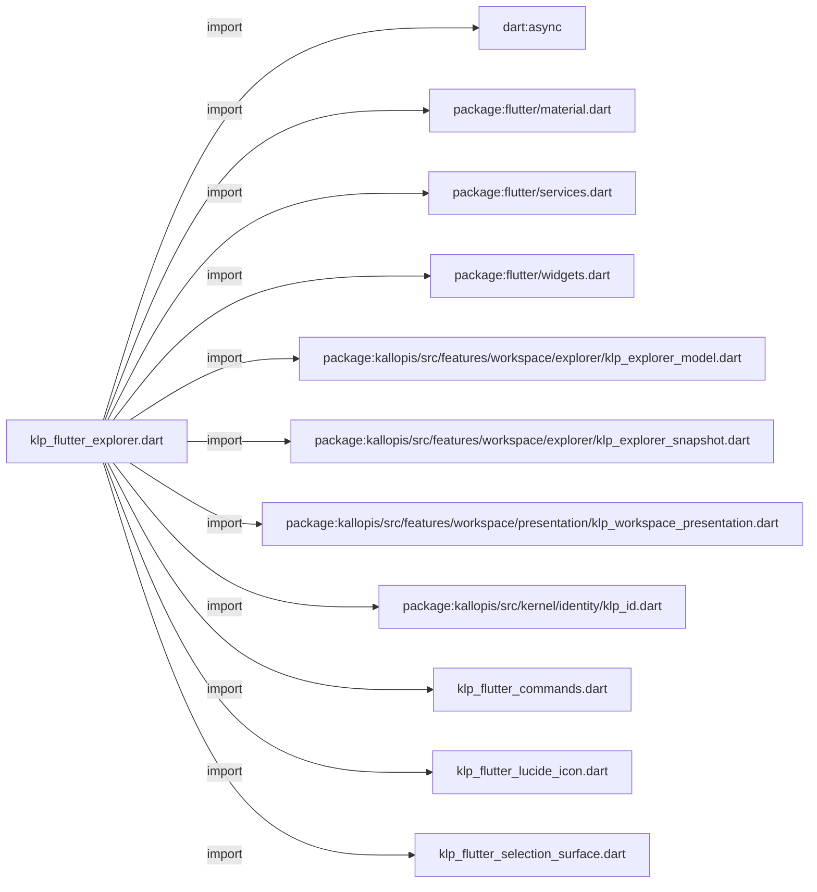
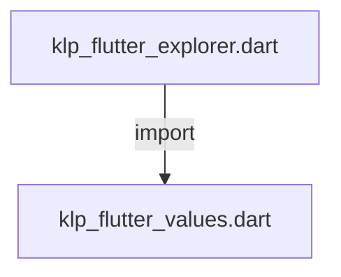
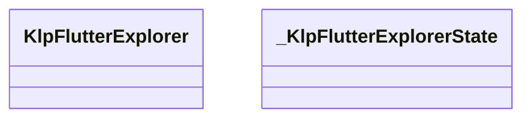
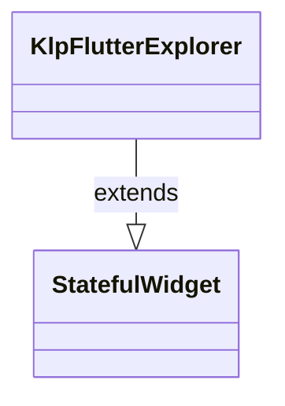
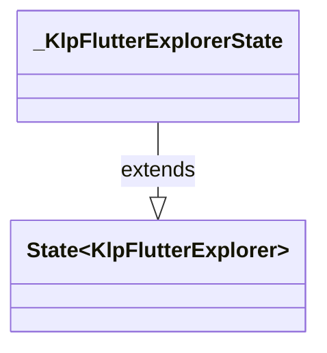

# klp_flutter_explorer.dart：直接依賴與宣告架構

[回到目錄](README.md) · [來源檔案](../../../../../../lib/src/rendering/flutter/internal/klp_flutter_explorer.dart)

## 範圍

核心是 `lib/src/rendering/flutter/internal/klp_flutter_explorer.dart`。主要視角為該檔案明寫的 import／export／part；輔助視角為本檔宣告及 extends／implements／with／on 關係。只展開一層外部邊界。

## 直接依賴圖

## 依賴證據

| 關係 | 原始 directive | 來源 |
|---|---|---|
| import | <code>import &#x27;dart:async&#x27;;</code> | [lib/src/rendering/flutter/internal/klp_flutter_explorer.dart:1](../../../../../../lib/src/rendering/flutter/internal/klp_flutter_explorer.dart#L1) |
| import | <code>import &#x27;package:flutter/material.dart&#x27; show DefaultMaterialLocalizations;</code> | [lib/src/rendering/flutter/internal/klp_flutter_explorer.dart:2](../../../../../../lib/src/rendering/flutter/internal/klp_flutter_explorer.dart#L2) |
| import | <code>import &#x27;package:flutter/services.dart&#x27;;</code> | [lib/src/rendering/flutter/internal/klp_flutter_explorer.dart:3](../../../../../../lib/src/rendering/flutter/internal/klp_flutter_explorer.dart#L3) |
| import | <code>import &#x27;package:flutter/widgets.dart&#x27;;</code> | [lib/src/rendering/flutter/internal/klp_flutter_explorer.dart:4](../../../../../../lib/src/rendering/flutter/internal/klp_flutter_explorer.dart#L4) |
| import | <code>import &#x27;package:kallopis/src/features/workspace/explorer/klp_explorer_model.dart&#x27;;</code> | [lib/src/rendering/flutter/internal/klp_flutter_explorer.dart:5](../../../../../../lib/src/rendering/flutter/internal/klp_flutter_explorer.dart#L5) |
| import | <code>import &#x27;package:kallopis/src/features/workspace/explorer/klp_explorer_snapshot.dart&#x27;;</code> | [lib/src/rendering/flutter/internal/klp_flutter_explorer.dart:6](../../../../../../lib/src/rendering/flutter/internal/klp_flutter_explorer.dart#L6) |
| import | <code>import &#x27;package:kallopis/src/features/workspace/presentation/klp_workspace_presentation.dart&#x27;;</code> | [lib/src/rendering/flutter/internal/klp_flutter_explorer.dart:7](../../../../../../lib/src/rendering/flutter/internal/klp_flutter_explorer.dart#L7) |
| import | <code>import &#x27;package:kallopis/src/kernel/identity/klp_id.dart&#x27;;</code> | [lib/src/rendering/flutter/internal/klp_flutter_explorer.dart:8](../../../../../../lib/src/rendering/flutter/internal/klp_flutter_explorer.dart#L8) |
| import | <code>import &#x27;klp_flutter_commands.dart&#x27;;</code> | [lib/src/rendering/flutter/internal/klp_flutter_explorer.dart:9](../../../../../../lib/src/rendering/flutter/internal/klp_flutter_explorer.dart#L9) |
| import | <code>import &#x27;klp_flutter_lucide_icon.dart&#x27;;</code> | [lib/src/rendering/flutter/internal/klp_flutter_explorer.dart:10](../../../../../../lib/src/rendering/flutter/internal/klp_flutter_explorer.dart#L10) |
| import | <code>import &#x27;klp_flutter_selection_surface.dart&#x27;;</code> | [lib/src/rendering/flutter/internal/klp_flutter_explorer.dart:11](../../../../../../lib/src/rendering/flutter/internal/klp_flutter_explorer.dart#L11) |
| import | <code>import &#x27;klp_flutter_values.dart&#x27;;</code> | [lib/src/rendering/flutter/internal/klp_flutter_explorer.dart:12](../../../../../../lib/src/rendering/flutter/internal/klp_flutter_explorer.dart#L12) |

## 宣告關係圖

本組節點是本檔宣告；沒有箭頭的宣告未在此圖主張互相依賴。

## 宣告與成員證據

成員包含 public 與 private；簽章取自來源，省略函式本體與欄位初始值。`(inferred)` 表示來源未明寫型別；建構子只顯示參數部分，不含初始化列表。

### KlpFlutterExplorer

ClassDeclaration · public · [lib/src/rendering/flutter/internal/klp_flutter_explorer.dart:14](../../../../../../lib/src/rendering/flutter/internal/klp_flutter_explorer.dart#L14)

<code>final class KlpFlutterExplorer extends StatefulWidget</code>

來源註解摘要：依已驗證的可見順序呈現；不猜產品種類、不保存另一份選取樹。

- `extends` → <code>StatefulWidget</code>：[lib/src/rendering/flutter/internal/klp_flutter_explorer.dart:15](../../../../../../lib/src/rendering/flutter/internal/klp_flutter_explorer.dart#L15)

| 成員 | 可見性 | 簽章／型別 | 來源註解摘要 | 證據 |
|---|---|---|---|---|
| field <code>content</code> | public | <code>final KlpBoundExplorer content</code> |  | [lib/src/rendering/flutter/internal/klp_flutter_explorer.dart:17](../../../../../../lib/src/rendering/flutter/internal/klp_flutter_explorer.dart#L17) |
| constructor <code>KlpFlutterExplorer</code> | public | <code>const KlpFlutterExplorer({required this.content, super.key})</code> |  | [lib/src/rendering/flutter/internal/klp_flutter_explorer.dart:19](../../../../../../lib/src/rendering/flutter/internal/klp_flutter_explorer.dart#L19) |
| method <code>createState</code> | public | <code>State&lt;KlpFlutterExplorer&gt; createState()</code> |  | [lib/src/rendering/flutter/internal/klp_flutter_explorer.dart:21](../../../../../../lib/src/rendering/flutter/internal/klp_flutter_explorer.dart#L21) |

### _KlpFlutterExplorerState

ClassDeclaration · private · [lib/src/rendering/flutter/internal/klp_flutter_explorer.dart:25](../../../../../../lib/src/rendering/flutter/internal/klp_flutter_explorer.dart#L25)

<code>final class _KlpFlutterExplorerState extends State&lt;KlpFlutterExplorer&gt;</code>

- `extends` → <code>State&lt;KlpFlutterExplorer&gt;</code>：[lib/src/rendering/flutter/internal/klp_flutter_explorer.dart:25](../../../../../../lib/src/rendering/flutter/internal/klp_flutter_explorer.dart#L25)

| 成員 | 可見性 | 簽章／型別 | 來源註解摘要 | 證據 |
|---|---|---|---|---|
| field <code>_focus</code> | private | <code>final (inferred) _focus</code> |  | [lib/src/rendering/flutter/internal/klp_flutter_explorer.dart:27](../../../../../../lib/src/rendering/flutter/internal/klp_flutter_explorer.dart#L27) |
| getter <code>content</code> | public | <code>KlpBoundExplorer get content</code> |  | [lib/src/rendering/flutter/internal/klp_flutter_explorer.dart:28](../../../../../../lib/src/rendering/flutter/internal/klp_flutter_explorer.dart#L28) |
| method <code>didUpdateWidget</code> | public | <code>void didUpdateWidget(KlpFlutterExplorer oldWidget)</code> |  | [lib/src/rendering/flutter/internal/klp_flutter_explorer.dart:30](../../../../../../lib/src/rendering/flutter/internal/klp_flutter_explorer.dart#L30) |
| method <code>dispose</code> | public | <code>void dispose()</code> |  | [lib/src/rendering/flutter/internal/klp_flutter_explorer.dart:40](../../../../../../lib/src/rendering/flutter/internal/klp_flutter_explorer.dart#L40) |
| getter <code>_text</code> | private | <code>TextStyle get _text</code> |  | [lib/src/rendering/flutter/internal/klp_flutter_explorer.dart:46](../../../../../../lib/src/rendering/flutter/internal/klp_flutter_explorer.dart#L46) |
| getter <code>_commandStyle</code> | private | <code>KlpFlutterCommandStyle get _commandStyle</code> |  | [lib/src/rendering/flutter/internal/klp_flutter_explorer.dart:52](../../../../../../lib/src/rendering/flutter/internal/klp_flutter_explorer.dart#L52) |
| method <code>_primary</code> | private | <code>void _primary(KlpExplorerItemSnapshot item)</code> |  | [lib/src/rendering/flutter/internal/klp_flutter_explorer.dart:56](../../../../../../lib/src/rendering/flutter/internal/klp_flutter_explorer.dart#L56) |
| method <code>_toggle</code> | private | <code>void _toggle(KlpExplorerItemSnapshot item)</code> |  | [lib/src/rendering/flutter/internal/klp_flutter_explorer.dart:64](../../../../../../lib/src/rendering/flutter/internal/klp_flutter_explorer.dart#L64) |
| method <code>_click</code> | private | <code>void _click(KlpExplorerItemSnapshot item)</code> |  | [lib/src/rendering/flutter/internal/klp_flutter_explorer.dart:68](../../../../../../lib/src/rendering/flutter/internal/klp_flutter_explorer.dart#L68) |
| method <code>_anchor</code> | private | <code>Offset _anchor(BuildContext context)</code> |  | [lib/src/rendering/flutter/internal/klp_flutter_explorer.dart:97](../../../../../../lib/src/rendering/flutter/internal/klp_flutter_explorer.dart#L97) |
| method <code>_menu</code> | private | <code>void _menu(BuildContext context, KlpExplorerItemSnapshot item, Offset anchor)</code> |  | [lib/src/rendering/flutter/internal/klp_flutter_explorer.dart:102](../../../../../../lib/src/rendering/flutter/internal/klp_flutter_explorer.dart#L102) |
| method <code>_key</code> | private | <code>KeyEventResult _key(BuildContext context, KlpExplorerItemSnapshot item, KeyEvent event)</code> |  | [lib/src/rendering/flutter/internal/klp_flutter_explorer.dart:107](../../../../../../lib/src/rendering/flutter/internal/klp_flutter_explorer.dart#L107) |
| method <code>build</code> | public | <code>Widget build(BuildContext context)</code> |  | [lib/src/rendering/flutter/internal/klp_flutter_explorer.dart:139](../../../../../../lib/src/rendering/flutter/internal/klp_flutter_explorer.dart#L139) |
| method <code>_row</code> | private | <code>Widget _row(BuildContext context, KlpExplorerItemSnapshot item)</code> |  | [lib/src/rendering/flutter/internal/klp_flutter_explorer.dart:148](../../../../../../lib/src/rendering/flutter/internal/klp_flutter_explorer.dart#L148) |
| method <code>_drag</code> | private | <code>Widget _drag(BuildContext context, KlpExplorerItemSnapshot item, Widget row)</code> |  | [lib/src/rendering/flutter/internal/klp_flutter_explorer.dart:191](../../../../../../lib/src/rendering/flutter/internal/klp_flutter_explorer.dart#L191) |

## 閱讀說明與限制

箭頭只表示來源明寫的靜態關係；import 不等於呼叫。未分析動態呼叫、欄位的實際物件擁有權、狀態轉移或渲染流程；型別未進行語意解析，繼承目標保留原始型別拼寫。public／private 依 Dart 名稱前綴判斷；public 宣告不代表已由 `lib/kallopis.dart` 匯出。

本頁由 `tool/architecture_atlas` 產生；編輯來源或生成工具後重新產生，避免手改本頁。
