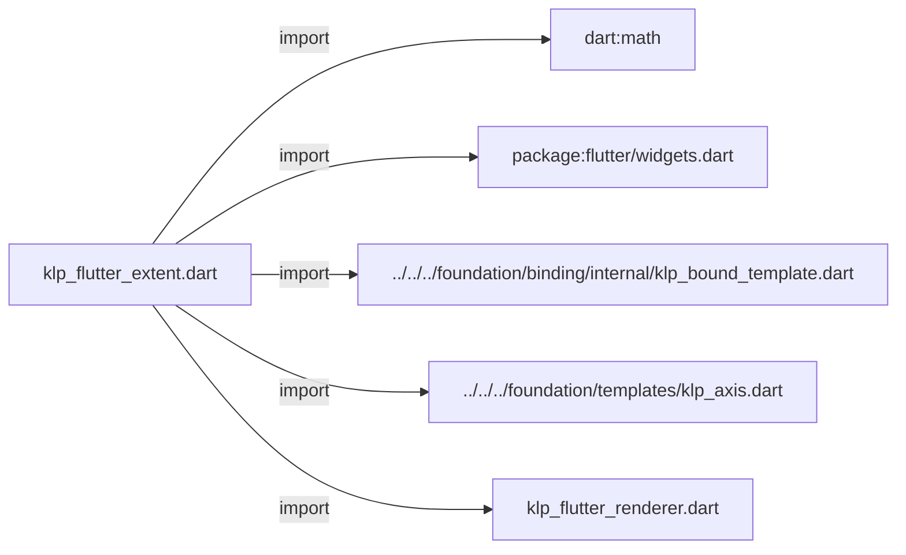
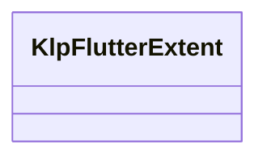
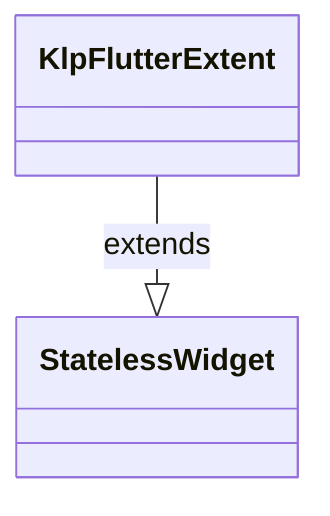

# klp_flutter_extent.dart：直接依賴與宣告架構

[回到目錄](README.md) · [來源檔案](../../../../../../lib/src/rendering/flutter/internal/klp_flutter_extent.dart)

## 範圍

核心是 `lib/src/rendering/flutter/internal/klp_flutter_extent.dart`。主要視角為該檔案明寫的 import／export／part；輔助視角為本檔宣告及 extends／implements／with／on 關係。只展開一層外部邊界。

## 直接依賴圖

## 依賴證據

| 關係 | 原始 directive | 來源 |
|---|---|---|
| import | <code>import &#x27;dart:math&#x27; as math;</code> | [lib/src/rendering/flutter/internal/klp_flutter_extent.dart:1](../../../../../../lib/src/rendering/flutter/internal/klp_flutter_extent.dart#L1) |
| import | <code>import &#x27;package:flutter/widgets.dart&#x27;;</code> | [lib/src/rendering/flutter/internal/klp_flutter_extent.dart:3](../../../../../../lib/src/rendering/flutter/internal/klp_flutter_extent.dart#L3) |
| import | <code>import &#x27;../../../foundation/binding/internal/klp_bound_template.dart&#x27;;</code> | [lib/src/rendering/flutter/internal/klp_flutter_extent.dart:5](../../../../../../lib/src/rendering/flutter/internal/klp_flutter_extent.dart#L5) |
| import | <code>import &#x27;../../../foundation/templates/klp_axis.dart&#x27;;</code> | [lib/src/rendering/flutter/internal/klp_flutter_extent.dart:6](../../../../../../lib/src/rendering/flutter/internal/klp_flutter_extent.dart#L6) |
| import | <code>import &#x27;klp_flutter_renderer.dart&#x27;;</code> | [lib/src/rendering/flutter/internal/klp_flutter_extent.dart:7](../../../../../../lib/src/rendering/flutter/internal/klp_flutter_extent.dart#L7) |

## 宣告關係圖

本組節點是本檔宣告；沒有箭頭的宣告未在此圖主張互相依賴。

## 宣告與成員證據

成員包含 public 與 private；簽章取自來源，省略函式本體與欄位初始值。`(inferred)` 表示來源未明寫型別；建構子只顯示參數部分，不含初始化列表。

### KlpFlutterExtent

ClassDeclaration · public · [lib/src/rendering/flutter/internal/klp_flutter_extent.dart:9](../../../../../../lib/src/rendering/flutter/internal/klp_flutter_extent.dart#L9)

<code>final class KlpFlutterExtent extends StatelessWidget</code>

來源註解摘要：以方向起點承接父層配置，再限制子內容的指定方向尺寸。

- `extends` → <code>StatelessWidget</code>：[lib/src/rendering/flutter/internal/klp_flutter_extent.dart:10](../../../../../../lib/src/rendering/flutter/internal/klp_flutter_extent.dart#L10)

| 成員 | 可見性 | 簽章／型別 | 來源註解摘要 | 證據 |
|---|---|---|---|---|
| field <code>content</code> | public | <code>final KlpBoundExtent content</code> |  | [lib/src/rendering/flutter/internal/klp_flutter_extent.dart:11](../../../../../../lib/src/rendering/flutter/internal/klp_flutter_extent.dart#L11) |
| constructor <code>KlpFlutterExtent</code> | public | <code>const KlpFlutterExtent({required this.content, super.key})</code> |  | [lib/src/rendering/flutter/internal/klp_flutter_extent.dart:13](../../../../../../lib/src/rendering/flutter/internal/klp_flutter_extent.dart#L13) |
| method <code>build</code> | public | <code>Widget build(BuildContext context)</code> |  | [lib/src/rendering/flutter/internal/klp_flutter_extent.dart:15](../../../../../../lib/src/rendering/flutter/internal/klp_flutter_extent.dart#L15) |
| method <code>_layout</code> | private | <code>Widget _layout(BuildContext context, BoxConstraints constraints)</code> |  | [lib/src/rendering/flutter/internal/klp_flutter_extent.dart:18](../../../../../../lib/src/rendering/flutter/internal/klp_flutter_extent.dart#L18) |

## 閱讀說明與限制

箭頭只表示來源明寫的靜態關係；import 不等於呼叫。未分析動態呼叫、欄位的實際物件擁有權、狀態轉移或渲染流程；型別未進行語意解析，繼承目標保留原始型別拼寫。public／private 依 Dart 名稱前綴判斷；public 宣告不代表已由 `lib/kallopis.dart` 匯出。

本頁由 `tool/architecture_atlas` 產生；編輯來源或生成工具後重新產生，避免手改本頁。
