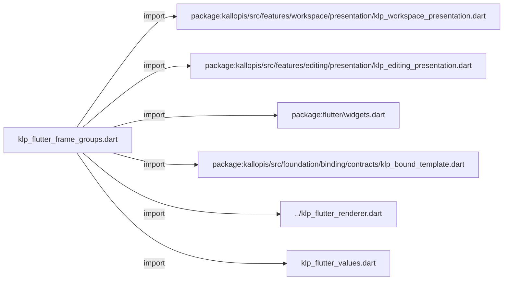
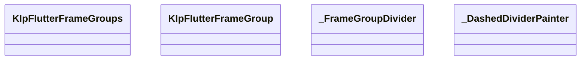
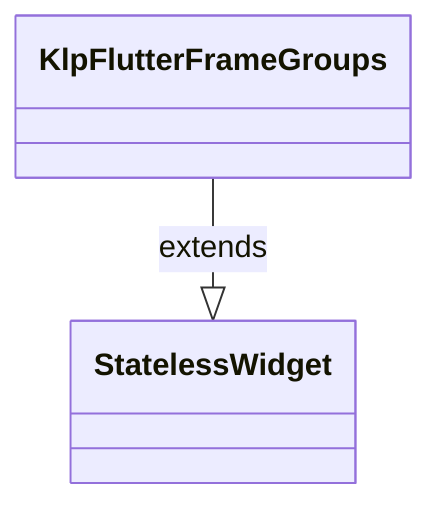
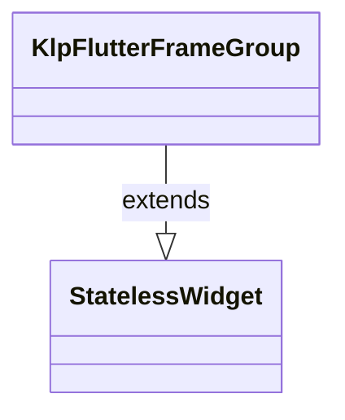
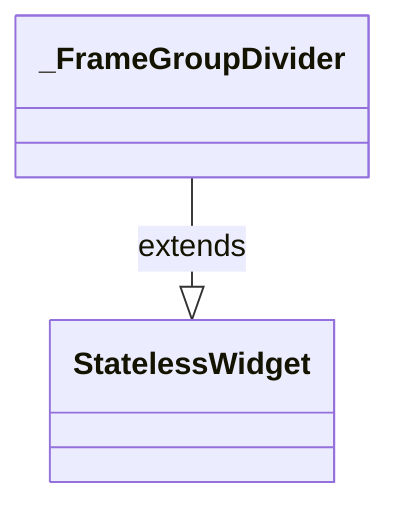
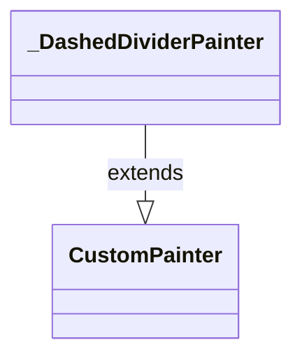

# klp_flutter_frame_groups.dart：直接依賴與宣告架構

[回到目錄](README.md) · [來源檔案](../../../../../../lib/src/rendering/flutter/internal/klp_flutter_frame_groups.dart)

## 範圍

核心是 `lib/src/rendering/flutter/internal/klp_flutter_frame_groups.dart`。主要視角為該檔案明寫的 import／export／part；輔助視角為本檔宣告及 extends／implements／with／on 關係。只展開一層外部邊界。

## 直接依賴圖

## 依賴證據

| 關係 | 原始 directive | 來源 |
|---|---|---|
| import | <code>import &#x27;package:kallopis/src/features/workspace/presentation/klp_workspace_presentation.dart&#x27;;</code> | [lib/src/rendering/flutter/internal/klp_flutter_frame_groups.dart:1](../../../../../../lib/src/rendering/flutter/internal/klp_flutter_frame_groups.dart#L1) |
| import | <code>import &#x27;package:kallopis/src/features/editing/presentation/klp_editing_presentation.dart&#x27;;</code> | [lib/src/rendering/flutter/internal/klp_flutter_frame_groups.dart:2](../../../../../../lib/src/rendering/flutter/internal/klp_flutter_frame_groups.dart#L2) |
| import | <code>import &#x27;package:flutter/widgets.dart&#x27;;</code> | [lib/src/rendering/flutter/internal/klp_flutter_frame_groups.dart:3](../../../../../../lib/src/rendering/flutter/internal/klp_flutter_frame_groups.dart#L3) |
| import | <code>import &#x27;package:kallopis/src/foundation/binding/contracts/klp_bound_template.dart&#x27;;</code> | [lib/src/rendering/flutter/internal/klp_flutter_frame_groups.dart:5](../../../../../../lib/src/rendering/flutter/internal/klp_flutter_frame_groups.dart#L5) |
| import | <code>import &#x27;../klp_flutter_renderer.dart&#x27;;</code> | [lib/src/rendering/flutter/internal/klp_flutter_frame_groups.dart:7](../../../../../../lib/src/rendering/flutter/internal/klp_flutter_frame_groups.dart#L7) |
| import | <code>import &#x27;klp_flutter_values.dart&#x27;;</code> | [lib/src/rendering/flutter/internal/klp_flutter_frame_groups.dart:8](../../../../../../lib/src/rendering/flutter/internal/klp_flutter_frame_groups.dart#L8) |

## 宣告關係圖

本組節點是本檔宣告；沒有箭頭的宣告未在此圖主張互相依賴。

## 宣告與成員證據

成員包含 public 與 private；簽章取自來源，省略函式本體與欄位初始值。`(inferred)` 表示來源未明寫型別；建構子只顯示參數部分，不含初始化列表。

### KlpFlutterFrameGroups

ClassDeclaration · public · [lib/src/rendering/flutter/internal/klp_flutter_frame_groups.dart:10](../../../../../../lib/src/rendering/flutter/internal/klp_flutter_frame_groups.dart#L10)

<code>final class KlpFlutterFrameGroups extends StatelessWidget</code>

來源註解摘要：封閉呈現 Frame 內容群組；Frame 本身仍不擁有 padding。

- `extends` → <code>StatelessWidget</code>：[lib/src/rendering/flutter/internal/klp_flutter_frame_groups.dart:11](../../../../../../lib/src/rendering/flutter/internal/klp_flutter_frame_groups.dart#L11)

| 成員 | 可見性 | 簽章／型別 | 來源註解摘要 | 證據 |
|---|---|---|---|---|
| field <code>content</code> | public | <code>final KlpBoundFrameGroups content</code> |  | [lib/src/rendering/flutter/internal/klp_flutter_frame_groups.dart:13](../../../../../../lib/src/rendering/flutter/internal/klp_flutter_frame_groups.dart#L13) |
| constructor <code>KlpFlutterFrameGroups</code> | public | <code>const KlpFlutterFrameGroups({required this.content, super.key})</code> |  | [lib/src/rendering/flutter/internal/klp_flutter_frame_groups.dart:15](../../../../../../lib/src/rendering/flutter/internal/klp_flutter_frame_groups.dart#L15) |
| method <code>build</code> | public | <code>Widget build(BuildContext context)</code> |  | [lib/src/rendering/flutter/internal/klp_flutter_frame_groups.dart:17](../../../../../../lib/src/rendering/flutter/internal/klp_flutter_frame_groups.dart#L17) |
| method <code>_containsExpandingContent</code> | private | <code>bool _containsExpandingContent(KlpBoundTemplate value)</code> |  | [lib/src/rendering/flutter/internal/klp_flutter_frame_groups.dart:33](../../../../../../lib/src/rendering/flutter/internal/klp_flutter_frame_groups.dart#L33) |
| method <code>_isExpandingContent</code> | private | <code>bool _isExpandingContent(KlpBoundTemplate value)</code> |  | [lib/src/rendering/flutter/internal/klp_flutter_frame_groups.dart:39](../../../../../../lib/src/rendering/flutter/internal/klp_flutter_frame_groups.dart#L39) |

### KlpFlutterFrameGroup

ClassDeclaration · public · [lib/src/rendering/flutter/internal/klp_flutter_frame_groups.dart:47](../../../../../../lib/src/rendering/flutter/internal/klp_flutter_frame_groups.dart#L47)

<code>final class KlpFlutterFrameGroup extends StatelessWidget</code>

來源註解摘要：封閉呈現單一群組的前置分隔線與水平內容內距。

- `extends` → <code>StatelessWidget</code>：[lib/src/rendering/flutter/internal/klp_flutter_frame_groups.dart:48](../../../../../../lib/src/rendering/flutter/internal/klp_flutter_frame_groups.dart#L48)

| 成員 | 可見性 | 簽章／型別 | 來源註解摘要 | 證據 |
|---|---|---|---|---|
| field <code>content</code> | public | <code>final KlpBoundFrameGroup content</code> |  | [lib/src/rendering/flutter/internal/klp_flutter_frame_groups.dart:50](../../../../../../lib/src/rendering/flutter/internal/klp_flutter_frame_groups.dart#L50) |
| constructor <code>KlpFlutterFrameGroup</code> | public | <code>const KlpFlutterFrameGroup({required this.content, super.key})</code> |  | [lib/src/rendering/flutter/internal/klp_flutter_frame_groups.dart:52](../../../../../../lib/src/rendering/flutter/internal/klp_flutter_frame_groups.dart#L52) |
| method <code>build</code> | public | <code>Widget build(BuildContext context)</code> |  | [lib/src/rendering/flutter/internal/klp_flutter_frame_groups.dart:54](../../../../../../lib/src/rendering/flutter/internal/klp_flutter_frame_groups.dart#L54) |
| method <code>_isExpandingContent</code> | private | <code>bool _isExpandingContent(KlpBoundTemplate value)</code> |  | [lib/src/rendering/flutter/internal/klp_flutter_frame_groups.dart:75](../../../../../../lib/src/rendering/flutter/internal/klp_flutter_frame_groups.dart#L75) |

### _FrameGroupDivider

ClassDeclaration · private · [lib/src/rendering/flutter/internal/klp_flutter_frame_groups.dart:83](../../../../../../lib/src/rendering/flutter/internal/klp_flutter_frame_groups.dart#L83)

<code>final class _FrameGroupDivider extends StatelessWidget</code>

- `extends` → <code>StatelessWidget</code>：[lib/src/rendering/flutter/internal/klp_flutter_frame_groups.dart:83](../../../../../../lib/src/rendering/flutter/internal/klp_flutter_frame_groups.dart#L83)

| 成員 | 可見性 | 簽章／型別 | 來源註解摘要 | 證據 |
|---|---|---|---|---|
| field <code>content</code> | public | <code>final KlpBoundFrameGroup content</code> |  | [lib/src/rendering/flutter/internal/klp_flutter_frame_groups.dart:85](../../../../../../lib/src/rendering/flutter/internal/klp_flutter_frame_groups.dart#L85) |
| constructor <code>_FrameGroupDivider</code> | private | <code>const _FrameGroupDivider({required this.content})</code> |  | [lib/src/rendering/flutter/internal/klp_flutter_frame_groups.dart:87](../../../../../../lib/src/rendering/flutter/internal/klp_flutter_frame_groups.dart#L87) |
| method <code>build</code> | public | <code>Widget build(BuildContext context)</code> |  | [lib/src/rendering/flutter/internal/klp_flutter_frame_groups.dart:89](../../../../../../lib/src/rendering/flutter/internal/klp_flutter_frame_groups.dart#L89) |

### _DashedDividerPainter

ClassDeclaration · private · [lib/src/rendering/flutter/internal/klp_flutter_frame_groups.dart:100](../../../../../../lib/src/rendering/flutter/internal/klp_flutter_frame_groups.dart#L100)

<code>final class _DashedDividerPainter extends CustomPainter</code>

- `extends` → <code>CustomPainter</code>：[lib/src/rendering/flutter/internal/klp_flutter_frame_groups.dart:100](../../../../../../lib/src/rendering/flutter/internal/klp_flutter_frame_groups.dart#L100)

| 成員 | 可見性 | 簽章／型別 | 來源註解摘要 | 證據 |
|---|---|---|---|---|
| field <code>color</code> | public | <code>final Color color</code> |  | [lib/src/rendering/flutter/internal/klp_flutter_frame_groups.dart:102](../../../../../../lib/src/rendering/flutter/internal/klp_flutter_frame_groups.dart#L102) |
| field <code>stroke</code> | public | <code>final double stroke</code> |  | [lib/src/rendering/flutter/internal/klp_flutter_frame_groups.dart:103](../../../../../../lib/src/rendering/flutter/internal/klp_flutter_frame_groups.dart#L103) |
| constructor <code>_DashedDividerPainter</code> | private | <code>const _DashedDividerPainter(this.color, this.stroke)</code> |  | [lib/src/rendering/flutter/internal/klp_flutter_frame_groups.dart:105](../../../../../../lib/src/rendering/flutter/internal/klp_flutter_frame_groups.dart#L105) |
| method <code>paint</code> | public | <code>void paint(Canvas canvas, Size size)</code> |  | [lib/src/rendering/flutter/internal/klp_flutter_frame_groups.dart:107](../../../../../../lib/src/rendering/flutter/internal/klp_flutter_frame_groups.dart#L107) |
| method <code>shouldRepaint</code> | public | <code>bool shouldRepaint(_DashedDividerPainter oldDelegate)</code> |  | [lib/src/rendering/flutter/internal/klp_flutter_frame_groups.dart:118](../../../../../../lib/src/rendering/flutter/internal/klp_flutter_frame_groups.dart#L118) |

## 閱讀說明與限制

箭頭只表示來源明寫的靜態關係；import 不等於呼叫。未分析動態呼叫、欄位的實際物件擁有權、狀態轉移或渲染流程；型別未進行語意解析，繼承目標保留原始型別拼寫。public／private 依 Dart 名稱前綴判斷；public 宣告不代表已由 `lib/kallopis.dart` 匯出。

本頁由 `tool/architecture_atlas` 產生；編輯來源或生成工具後重新產生，避免手改本頁。
