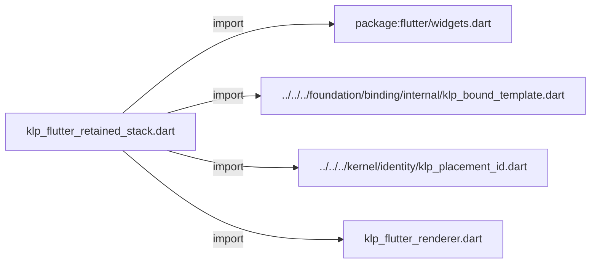
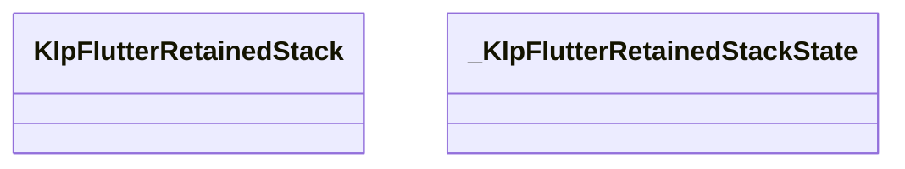
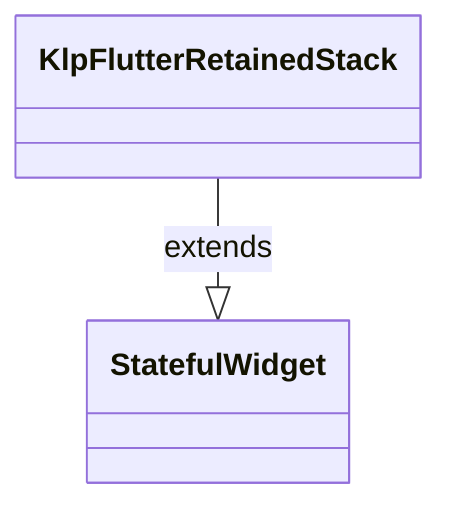
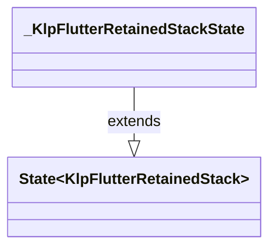

# klp_flutter_retained_stack.dart：直接依賴與宣告架構

[回到目錄](README.md) · [來源檔案](../../../../../../lib/src/rendering/flutter/internal/klp_flutter_retained_stack.dart)

## 範圍

核心是 `lib/src/rendering/flutter/internal/klp_flutter_retained_stack.dart`。主要視角為該檔案明寫的 import／export／part；輔助視角為本檔宣告及 extends／implements／with／on 關係。只展開一層外部邊界。

## 直接依賴圖

## 依賴證據

| 關係 | 原始 directive | 來源 |
|---|---|---|
| import | <code>import &#x27;package:flutter/widgets.dart&#x27;;</code> | [lib/src/rendering/flutter/internal/klp_flutter_retained_stack.dart:1](../../../../../../lib/src/rendering/flutter/internal/klp_flutter_retained_stack.dart#L1) |
| import | <code>import &#x27;../../../foundation/binding/internal/klp_bound_template.dart&#x27;;</code> | [lib/src/rendering/flutter/internal/klp_flutter_retained_stack.dart:3](../../../../../../lib/src/rendering/flutter/internal/klp_flutter_retained_stack.dart#L3) |
| import | <code>import &#x27;../../../kernel/identity/klp_placement_id.dart&#x27;;</code> | [lib/src/rendering/flutter/internal/klp_flutter_retained_stack.dart:4](../../../../../../lib/src/rendering/flutter/internal/klp_flutter_retained_stack.dart#L4) |
| import | <code>import &#x27;klp_flutter_renderer.dart&#x27;;</code> | [lib/src/rendering/flutter/internal/klp_flutter_retained_stack.dart:5](../../../../../../lib/src/rendering/flutter/internal/klp_flutter_retained_stack.dart#L5) |

## 宣告關係圖

本組節點是本檔宣告；沒有箭頭的宣告未在此圖主張互相依賴。

## 宣告與成員證據

成員包含 public 與 private；簽章取自來源，省略函式本體與欄位初始值。`(inferred)` 表示來源未明寫型別；建構子只顯示參數部分，不含初始化列表。

### KlpFlutterRetainedStack

ClassDeclaration · public · [lib/src/rendering/flutter/internal/klp_flutter_retained_stack.dart:7](../../../../../../lib/src/rendering/flutter/internal/klp_flutter_retained_stack.dart#L7)

<code>final class KlpFlutterRetainedStack extends StatefulWidget</code>

來源註解摘要：同一頁保留相同元素與焦點範圍；只有目前頁參與互動。

- `extends` → <code>StatefulWidget</code>：[lib/src/rendering/flutter/internal/klp_flutter_retained_stack.dart:8](../../../../../../lib/src/rendering/flutter/internal/klp_flutter_retained_stack.dart#L8)

| 成員 | 可見性 | 簽章／型別 | 來源註解摘要 | 證據 |
|---|---|---|---|---|
| field <code>content</code> | public | <code>final KlpBoundRetainedStack content</code> |  | [lib/src/rendering/flutter/internal/klp_flutter_retained_stack.dart:9](../../../../../../lib/src/rendering/flutter/internal/klp_flutter_retained_stack.dart#L9) |
| constructor <code>KlpFlutterRetainedStack</code> | public | <code>const KlpFlutterRetainedStack({required this.content, super.key})</code> |  | [lib/src/rendering/flutter/internal/klp_flutter_retained_stack.dart:11](../../../../../../lib/src/rendering/flutter/internal/klp_flutter_retained_stack.dart#L11) |
| method <code>createState</code> | public | <code>State&lt;KlpFlutterRetainedStack&gt; createState()</code> |  | [lib/src/rendering/flutter/internal/klp_flutter_retained_stack.dart:13](../../../../../../lib/src/rendering/flutter/internal/klp_flutter_retained_stack.dart#L13) |

### _KlpFlutterRetainedStackState

ClassDeclaration · private · [lib/src/rendering/flutter/internal/klp_flutter_retained_stack.dart:18](../../../../../../lib/src/rendering/flutter/internal/klp_flutter_retained_stack.dart#L18)

<code>final class _KlpFlutterRetainedStackState extends State&lt;KlpFlutterRetainedStack&gt;</code>

- `extends` → <code>State&lt;KlpFlutterRetainedStack&gt;</code>：[lib/src/rendering/flutter/internal/klp_flutter_retained_stack.dart:19](../../../../../../lib/src/rendering/flutter/internal/klp_flutter_retained_stack.dart#L19)

| 成員 | 可見性 | 簽章／型別 | 來源註解摘要 | 證據 |
|---|---|---|---|---|
| field <code>_scopes</code> | private | <code>final Map&lt;KlpPlacementId, FocusScopeNode&gt; _scopes</code> |  | [lib/src/rendering/flutter/internal/klp_flutter_retained_stack.dart:20](../../../../../../lib/src/rendering/flutter/internal/klp_flutter_retained_stack.dart#L20) |
| field <code>_remembered</code> | private | <code>final Map&lt;KlpPlacementId, FocusNode&gt; _remembered</code> |  | [lib/src/rendering/flutter/internal/klp_flutter_retained_stack.dart:21](../../../../../../lib/src/rendering/flutter/internal/klp_flutter_retained_stack.dart#L21) |
| field <code>_generation</code> | private | <code>int _generation</code> |  | [lib/src/rendering/flutter/internal/klp_flutter_retained_stack.dart:22](../../../../../../lib/src/rendering/flutter/internal/klp_flutter_retained_stack.dart#L22) |
| method <code>initState</code> | public | <code>void initState()</code> |  | [lib/src/rendering/flutter/internal/klp_flutter_retained_stack.dart:24](../../../../../../lib/src/rendering/flutter/internal/klp_flutter_retained_stack.dart#L24) |
| method <code>didUpdateWidget</code> | public | <code>void didUpdateWidget(KlpFlutterRetainedStack oldWidget)</code> |  | [lib/src/rendering/flutter/internal/klp_flutter_retained_stack.dart:30](../../../../../../lib/src/rendering/flutter/internal/klp_flutter_retained_stack.dart#L30) |
| method <code>_updateScopes</code> | private | <code>void _updateScopes(bool changed)</code> |  | [lib/src/rendering/flutter/internal/klp_flutter_retained_stack.dart:36](../../../../../../lib/src/rendering/flutter/internal/klp_flutter_retained_stack.dart#L36) |
| method <code>dispose</code> | public | <code>void dispose()</code> |  | [lib/src/rendering/flutter/internal/klp_flutter_retained_stack.dart:88](../../../../../../lib/src/rendering/flutter/internal/klp_flutter_retained_stack.dart#L88) |
| method <code>build</code> | public | <code>Widget build(BuildContext context)</code> |  | [lib/src/rendering/flutter/internal/klp_flutter_retained_stack.dart:99](../../../../../../lib/src/rendering/flutter/internal/klp_flutter_retained_stack.dart#L99) |
| method <code>_page</code> | private | <code>Widget _page(KlpBoundPlacement page)</code> |  | [lib/src/rendering/flutter/internal/klp_flutter_retained_stack.dart:108](../../../../../../lib/src/rendering/flutter/internal/klp_flutter_retained_stack.dart#L108) |

## 閱讀說明與限制

箭頭只表示來源明寫的靜態關係；import 不等於呼叫。未分析動態呼叫、欄位的實際物件擁有權、狀態轉移或渲染流程；型別未進行語意解析，繼承目標保留原始型別拼寫。public／private 依 Dart 名稱前綴判斷；public 宣告不代表已由 `lib/kallopis.dart` 匯出。

本頁由 `tool/architecture_atlas` 產生；編輯來源或生成工具後重新產生，避免手改本頁。
