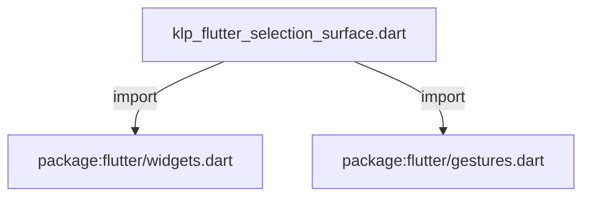
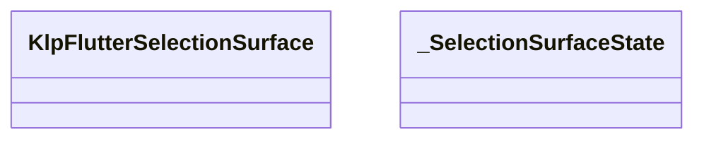
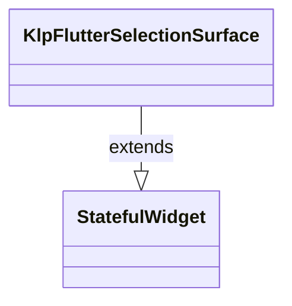
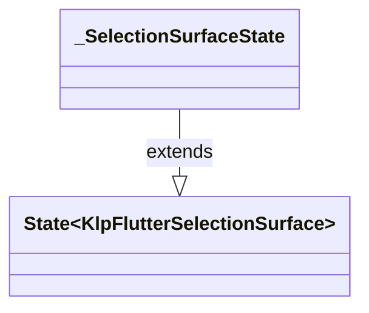

# klp_flutter_selection_surface.dart：直接依賴與宣告架構

[回到目錄](README.md) · [來源檔案](../../../../../../lib/src/rendering/flutter/internal/klp_flutter_selection_surface.dart)

## 範圍

核心是 `lib/src/rendering/flutter/internal/klp_flutter_selection_surface.dart`。主要視角為該檔案明寫的 import／export／part；輔助視角為本檔宣告及 extends／implements／with／on 關係。只展開一層外部邊界。

## 直接依賴圖

## 依賴證據

| 關係 | 原始 directive | 來源 |
|---|---|---|
| import | <code>import &#x27;package:flutter/widgets.dart&#x27;;</code> | [lib/src/rendering/flutter/internal/klp_flutter_selection_surface.dart:1](../../../../../../lib/src/rendering/flutter/internal/klp_flutter_selection_surface.dart#L1) |
| import | <code>import &#x27;package:flutter/gestures.dart&#x27; show kPrimaryButton;</code> | [lib/src/rendering/flutter/internal/klp_flutter_selection_surface.dart:2](../../../../../../lib/src/rendering/flutter/internal/klp_flutter_selection_surface.dart#L2) |

## 宣告關係圖

本組節點是本檔宣告；沒有箭頭的宣告未在此圖主張互相依賴。

## 宣告與成員證據

成員包含 public 與 private；簽章取自來源，省略函式本體與欄位初始值。`(inferred)` 表示來源未明寫型別；建構子只顯示參數部分，不含初始化列表。

### KlpFlutterSelectionSurface

ClassDeclaration · public · [lib/src/rendering/flutter/internal/klp_flutter_selection_surface.dart:4](../../../../../../lib/src/rendering/flutter/internal/klp_flutter_selection_surface.dart#L4)

<code>final class KlpFlutterSelectionSurface extends StatefulWidget</code>

來源註解摘要：所有互動狀態共用底色，不改動子元件的文字、圖示或邊框。

- `extends` → <code>StatefulWidget</code>：[lib/src/rendering/flutter/internal/klp_flutter_selection_surface.dart:5](../../../../../../lib/src/rendering/flutter/internal/klp_flutter_selection_surface.dart#L5)

| 成員 | 可見性 | 簽章／型別 | 來源註解摘要 | 證據 |
|---|---|---|---|---|
| field <code>color</code> | public | <code>final Color color</code> |  | [lib/src/rendering/flutter/internal/klp_flutter_selection_surface.dart:6](../../../../../../lib/src/rendering/flutter/internal/klp_flutter_selection_surface.dart#L6) |
| field <code>backgroundColor</code> | public | <code>final Color? backgroundColor</code> |  | [lib/src/rendering/flutter/internal/klp_flutter_selection_surface.dart:7](../../../../../../lib/src/rendering/flutter/internal/klp_flutter_selection_surface.dart#L7) |
| field <code>radius</code> | public | <code>final double radius</code> |  | [lib/src/rendering/flutter/internal/klp_flutter_selection_surface.dart:8](../../../../../../lib/src/rendering/flutter/internal/klp_flutter_selection_surface.dart#L8) |
| field <code>selected</code> | public | <code>final bool selected</code> |  | [lib/src/rendering/flutter/internal/klp_flutter_selection_surface.dart:9](../../../../../../lib/src/rendering/flutter/internal/klp_flutter_selection_surface.dart#L9) |
| field <code>enabled</code> | public | <code>final bool enabled</code> |  | [lib/src/rendering/flutter/internal/klp_flutter_selection_surface.dart:9](../../../../../../lib/src/rendering/flutter/internal/klp_flutter_selection_surface.dart#L9) |
| field <code>focused</code> | public | <code>final bool focused</code> |  | [lib/src/rendering/flutter/internal/klp_flutter_selection_surface.dart:9](../../../../../../lib/src/rendering/flutter/internal/klp_flutter_selection_surface.dart#L9) |
| field <code>highlightFocus</code> | public | <code>final bool highlightFocus</code> |  | [lib/src/rendering/flutter/internal/klp_flutter_selection_surface.dart:9](../../../../../../lib/src/rendering/flutter/internal/klp_flutter_selection_surface.dart#L9) |
| field <code>trackFocus</code> | public | <code>final bool trackFocus</code> |  | [lib/src/rendering/flutter/internal/klp_flutter_selection_surface.dart:9](../../../../../../lib/src/rendering/flutter/internal/klp_flutter_selection_surface.dart#L9) |
| field <code>child</code> | public | <code>final Widget child</code> |  | [lib/src/rendering/flutter/internal/klp_flutter_selection_surface.dart:10](../../../../../../lib/src/rendering/flutter/internal/klp_flutter_selection_surface.dart#L10) |
| constructor <code>KlpFlutterSelectionSurface</code> | public | <code>const KlpFlutterSelectionSurface({required this.color, required this.radius, required this.selected, required this.enabled, required this.child, this.backgroundColor, this.focused = false, this.highlightFocus = true, this.trackFocus = true, super.key})</code> |  | [lib/src/rendering/flutter/internal/klp_flutter_selection_surface.dart:11](../../../../../../lib/src/rendering/flutter/internal/klp_flutter_selection_surface.dart#L11) |
| method <code>createState</code> | public | <code>State&lt;KlpFlutterSelectionSurface&gt; createState()</code> |  | [lib/src/rendering/flutter/internal/klp_flutter_selection_surface.dart:12](../../../../../../lib/src/rendering/flutter/internal/klp_flutter_selection_surface.dart#L12) |

### _SelectionSurfaceState

ClassDeclaration · private · [lib/src/rendering/flutter/internal/klp_flutter_selection_surface.dart:16](../../../../../../lib/src/rendering/flutter/internal/klp_flutter_selection_surface.dart#L16)

<code>final class _SelectionSurfaceState extends State&lt;KlpFlutterSelectionSurface&gt;</code>

- `extends` → <code>State&lt;KlpFlutterSelectionSurface&gt;</code>：[lib/src/rendering/flutter/internal/klp_flutter_selection_surface.dart:16](../../../../../../lib/src/rendering/flutter/internal/klp_flutter_selection_surface.dart#L16)

| 成員 | 可見性 | 簽章／型別 | 來源註解摘要 | 證據 |
|---|---|---|---|---|
| field <code>_hovered</code> | private | <code>bool _hovered</code> |  | [lib/src/rendering/flutter/internal/klp_flutter_selection_surface.dart:17](../../../../../../lib/src/rendering/flutter/internal/klp_flutter_selection_surface.dart#L17) |
| field <code>_focused</code> | private | <code>bool _focused</code> |  | [lib/src/rendering/flutter/internal/klp_flutter_selection_surface.dart:17](../../../../../../lib/src/rendering/flutter/internal/klp_flutter_selection_surface.dart#L17) |
| field <code>_pressed</code> | private | <code>final (inferred) _pressed</code> |  | [lib/src/rendering/flutter/internal/klp_flutter_selection_surface.dart:18](../../../../../../lib/src/rendering/flutter/internal/klp_flutter_selection_surface.dart#L18) |
| method <code>build</code> | public | <code>Widget build(BuildContext context)</code> |  | [lib/src/rendering/flutter/internal/klp_flutter_selection_surface.dart:19](../../../../../../lib/src/rendering/flutter/internal/klp_flutter_selection_surface.dart#L19) |

## 閱讀說明與限制

箭頭只表示來源明寫的靜態關係；import 不等於呼叫。未分析動態呼叫、欄位的實際物件擁有權、狀態轉移或渲染流程；型別未進行語意解析，繼承目標保留原始型別拼寫。public／private 依 Dart 名稱前綴判斷；public 宣告不代表已由 `lib/kallopis.dart` 匯出。

本頁由 `tool/architecture_atlas` 產生；編輯來源或生成工具後重新產生，避免手改本頁。
