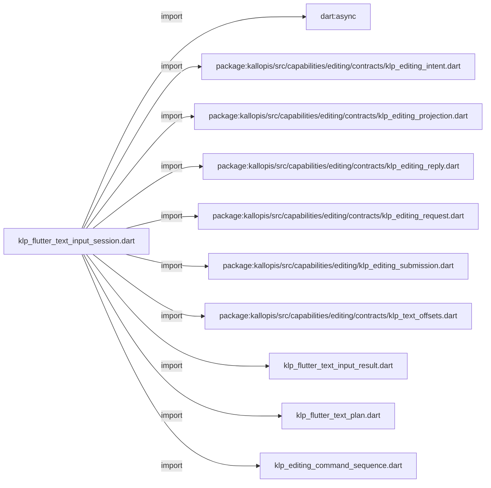
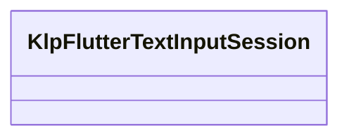

# klp_flutter_text_input_session.dart：直接依賴與宣告架構

[回到目錄](README.md) · [來源檔案](../../../../../../lib/src/rendering/flutter/internal/klp_flutter_text_input_session.dart)

## 範圍

核心是 `lib/src/rendering/flutter/internal/klp_flutter_text_input_session.dart`。主要視角為該檔案明寫的 import／export／part；輔助視角為本檔宣告及 extends／implements／with／on 關係。只展開一層外部邊界。

## 直接依賴圖

## 依賴證據

| 關係 | 原始 directive | 來源 |
|---|---|---|
| import | <code>import &#x27;dart:async&#x27;;</code> | [lib/src/rendering/flutter/internal/klp_flutter_text_input_session.dart:1](../../../../../../lib/src/rendering/flutter/internal/klp_flutter_text_input_session.dart#L1) |
| import | <code>import &#x27;package:kallopis/src/capabilities/editing/contracts/klp_editing_intent.dart&#x27;;</code> | [lib/src/rendering/flutter/internal/klp_flutter_text_input_session.dart:3](../../../../../../lib/src/rendering/flutter/internal/klp_flutter_text_input_session.dart#L3) |
| import | <code>import &#x27;package:kallopis/src/capabilities/editing/contracts/klp_editing_projection.dart&#x27;;</code> | [lib/src/rendering/flutter/internal/klp_flutter_text_input_session.dart:4](../../../../../../lib/src/rendering/flutter/internal/klp_flutter_text_input_session.dart#L4) |
| import | <code>import &#x27;package:kallopis/src/capabilities/editing/contracts/klp_editing_reply.dart&#x27;;</code> | [lib/src/rendering/flutter/internal/klp_flutter_text_input_session.dart:5](../../../../../../lib/src/rendering/flutter/internal/klp_flutter_text_input_session.dart#L5) |
| import | <code>import &#x27;package:kallopis/src/capabilities/editing/contracts/klp_editing_request.dart&#x27;;</code> | [lib/src/rendering/flutter/internal/klp_flutter_text_input_session.dart:6](../../../../../../lib/src/rendering/flutter/internal/klp_flutter_text_input_session.dart#L6) |
| import | <code>import &#x27;package:kallopis/src/capabilities/editing/klp_editing_submission.dart&#x27;;</code> | [lib/src/rendering/flutter/internal/klp_flutter_text_input_session.dart:7](../../../../../../lib/src/rendering/flutter/internal/klp_flutter_text_input_session.dart#L7) |
| import | <code>import &#x27;package:kallopis/src/capabilities/editing/contracts/klp_text_offsets.dart&#x27;;</code> | [lib/src/rendering/flutter/internal/klp_flutter_text_input_session.dart:8](../../../../../../lib/src/rendering/flutter/internal/klp_flutter_text_input_session.dart#L8) |
| import | <code>import &#x27;klp_flutter_text_input_result.dart&#x27;;</code> | [lib/src/rendering/flutter/internal/klp_flutter_text_input_session.dart:9](../../../../../../lib/src/rendering/flutter/internal/klp_flutter_text_input_session.dart#L9) |
| import | <code>import &#x27;klp_flutter_text_plan.dart&#x27;;</code> | [lib/src/rendering/flutter/internal/klp_flutter_text_input_session.dart:10](../../../../../../lib/src/rendering/flutter/internal/klp_flutter_text_input_session.dart#L10) |
| import | <code>import &#x27;klp_editing_command_sequence.dart&#x27;;</code> | [lib/src/rendering/flutter/internal/klp_flutter_text_input_session.dart:11](../../../../../../lib/src/rendering/flutter/internal/klp_flutter_text_input_session.dart#L11) |

## 宣告關係圖

本組節點是本檔宣告；沒有箭頭的宣告未在此圖主張互相依賴。

## 宣告與成員證據

成員包含 public 與 private；簽章取自來源，省略函式本體與欄位初始值。`(inferred)` 表示來源未明寫型別；建構子只顯示參數部分，不含初始化列表。

### KlpFlutterTextInputSession

ClassDeclaration · public · [lib/src/rendering/flutter/internal/klp_flutter_text_input_session.dart:13](../../../../../../lib/src/rendering/flutter/internal/klp_flutter_text_input_session.dart#L13)

<code>final class KlpFlutterTextInputSession</code>

來源註解摘要：同一平台事件依序提交，收到權威回覆後才決定是否送出後續選取。

| 成員 | 可見性 | 簽章／型別 | 來源註解摘要 | 證據 |
|---|---|---|---|---|
| field <code>_submission</code> | private | <code>final KlpEditingSubmission _submission</code> |  | [lib/src/rendering/flutter/internal/klp_flutter_text_input_session.dart:16](../../../../../../lib/src/rendering/flutter/internal/klp_flutter_text_input_session.dart#L16) |
| field <code>_sequence</code> | private | <code>final KlpEditingCommandSequence _sequence</code> |  | [lib/src/rendering/flutter/internal/klp_flutter_text_input_session.dart:17](../../../../../../lib/src/rendering/flutter/internal/klp_flutter_text_input_session.dart#L17) |
| field <code>_busy</code> | private | <code>bool _busy</code> |  | [lib/src/rendering/flutter/internal/klp_flutter_text_input_session.dart:18](../../../../../../lib/src/rendering/flutter/internal/klp_flutter_text_input_session.dart#L18) |
| field <code>_closed</code> | private | <code>bool _closed</code> |  | [lib/src/rendering/flutter/internal/klp_flutter_text_input_session.dart:19](../../../../../../lib/src/rendering/flutter/internal/klp_flutter_text_input_session.dart#L19) |
| field <code>_requiresResync</code> | private | <code>bool _requiresResync</code> |  | [lib/src/rendering/flutter/internal/klp_flutter_text_input_session.dart:20](../../../../../../lib/src/rendering/flutter/internal/klp_flutter_text_input_session.dart#L20) |
| field <code>_interrupted</code> | private | <code>bool _interrupted</code> |  | [lib/src/rendering/flutter/internal/klp_flutter_text_input_session.dart:21](../../../../../../lib/src/rendering/flutter/internal/klp_flutter_text_input_session.dart#L21) |
| field <code>_interruptionSucceeded</code> | private | <code>bool _interruptionSucceeded</code> |  | [lib/src/rendering/flutter/internal/klp_flutter_text_input_session.dart:22](../../../../../../lib/src/rendering/flutter/internal/klp_flutter_text_input_session.dart#L22) |
| field <code>_interrupting</code> | private | <code>bool _interrupting</code> |  | [lib/src/rendering/flutter/internal/klp_flutter_text_input_session.dart:23](../../../../../../lib/src/rendering/flutter/internal/klp_flutter_text_input_session.dart#L23) |
| field <code>_settled</code> | private | <code>Completer&lt;void&gt;? _settled</code> |  | [lib/src/rendering/flutter/internal/klp_flutter_text_input_session.dart:24](../../../../../../lib/src/rendering/flutter/internal/klp_flutter_text_input_session.dart#L24) |
| field <code>_interruption</code> | private | <code>Future&lt;KlpFlutterTextInputResult&gt;? _interruption</code> |  | [lib/src/rendering/flutter/internal/klp_flutter_text_input_session.dart:25](../../../../../../lib/src/rendering/flutter/internal/klp_flutter_text_input_session.dart#L25) |
| constructor <code>KlpFlutterTextInputSession</code> | public | <code>KlpFlutterTextInputSession(KlpEditingProjection initial, FutureOr&lt;KlpEditingReply&gt; Function(KlpEditingRequest) submit, {KlpEditingCommandSequence? sequence})</code> |  | [lib/src/rendering/flutter/internal/klp_flutter_text_input_session.dart:27](../../../../../../lib/src/rendering/flutter/internal/klp_flutter_text_input_session.dart#L27) |
| getter <code>projection</code> | public | <code>KlpEditingProjection get projection</code> |  | [lib/src/rendering/flutter/internal/klp_flutter_text_input_session.dart:31](../../../../../../lib/src/rendering/flutter/internal/klp_flutter_text_input_session.dart#L31) |
| getter <code>requiresResync</code> | public | <code>bool get requiresResync</code> |  | [lib/src/rendering/flutter/internal/klp_flutter_text_input_session.dart:32](../../../../../../lib/src/rendering/flutter/internal/klp_flutter_text_input_session.dart#L32) |
| method <code>submit</code> | public | <code>Future&lt;KlpFlutterTextInputResult&gt; submit(KlpFlutterTextPlan plan)</code> |  | [lib/src/rendering/flutter/internal/klp_flutter_text_input_session.dart:34](../../../../../../lib/src/rendering/flutter/internal/klp_flutter_text_input_session.dart#L34) |
| method <code>interrupt</code> | public | <code>Future&lt;KlpFlutterTextInputResult&gt; interrupt()</code> | 失焦、切頁與切模式共用：先停止新輸入，等在途命令確認後取消剩餘組字。 | [lib/src/rendering/flutter/internal/klp_flutter_text_input_session.dart:87](../../../../../../lib/src/rendering/flutter/internal/klp_flutter_text_input_session.dart#L87) |
| method <code>_interruptAfterPending</code> | private | <code>Future&lt;KlpFlutterTextInputResult&gt; _interruptAfterPending()</code> |  | [lib/src/rendering/flutter/internal/klp_flutter_text_input_session.dart:98](../../../../../../lib/src/rendering/flutter/internal/klp_flutter_text_input_session.dart#L98) |
| method <code>resume</code> | public | <code>void resume()</code> | 平台重新取得焦點前，必須已確認前次中斷完成並同步目前投影。 | [lib/src/rendering/flutter/internal/klp_flutter_text_input_session.dart:125](../../../../../../lib/src/rendering/flutter/internal/klp_flutter_text_input_session.dart#L125) |
| method <code>resynchronize</code> | public | <code>void resynchronize(KlpEditingProjection next)</code> |  | [lib/src/rendering/flutter/internal/klp_flutter_text_input_session.dart:134](../../../../../../lib/src/rendering/flutter/internal/klp_flutter_text_input_session.dart#L134) |
| method <code>close</code> | public | <code>void close()</code> |  | [lib/src/rendering/flutter/internal/klp_flutter_text_input_session.dart:143](../../../../../../lib/src/rendering/flutter/internal/klp_flutter_text_input_session.dart#L143) |
| method <code>_send</code> | private | <code>Future&lt;KlpEditingReply&gt; _send(KlpEditingIntent intent)</code> |  | [lib/src/rendering/flutter/internal/klp_flutter_text_input_session.dart:148](../../../../../../lib/src/rendering/flutter/internal/klp_flutter_text_input_session.dart#L148) |
| method <code>_matchesText</code> | private | <code>bool _matchesText(KlpFlutterTextPlan plan)</code> |  | [lib/src/rendering/flutter/internal/klp_flutter_text_input_session.dart:157](../../../../../../lib/src/rendering/flutter/internal/klp_flutter_text_input_session.dart#L157) |
| method <code>_matchesStep</code> | private | <code>bool _matchesStep(KlpFlutterTextPlan plan, KlpEditingIntent intent)</code> |  | [lib/src/rendering/flutter/internal/klp_flutter_text_input_session.dart:162](../../../../../../lib/src/rendering/flutter/internal/klp_flutter_text_input_session.dart#L162) |

## 閱讀說明與限制

箭頭只表示來源明寫的靜態關係；import 不等於呼叫。未分析動態呼叫、欄位的實際物件擁有權、狀態轉移或渲染流程；型別未進行語意解析，繼承目標保留原始型別拼寫。public／private 依 Dart 名稱前綴判斷；public 宣告不代表已由 `lib/kallopis.dart` 匯出。

本頁由 `tool/architecture_atlas` 產生；編輯來源或生成工具後重新產生，避免手改本頁。
