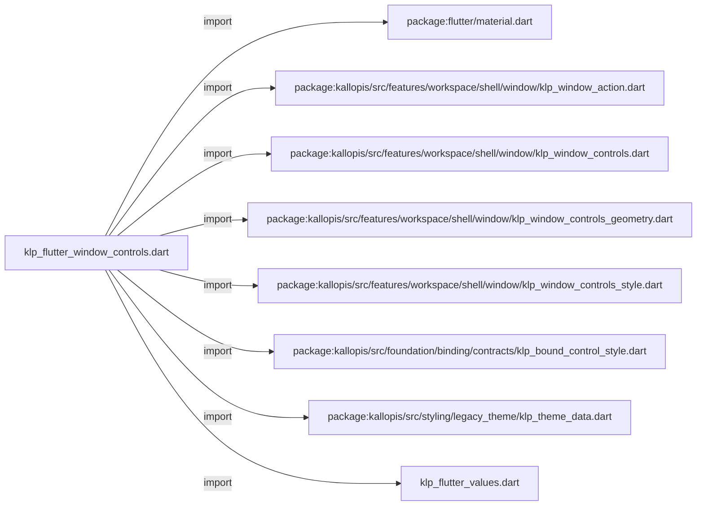
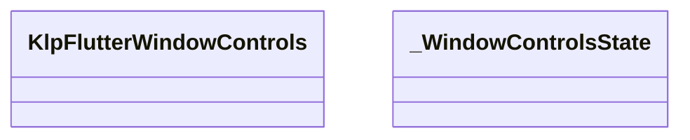
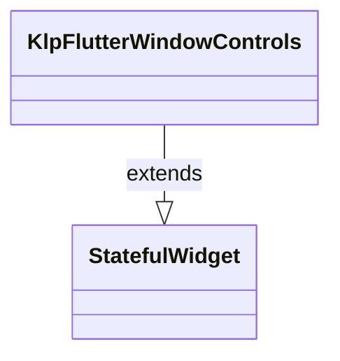
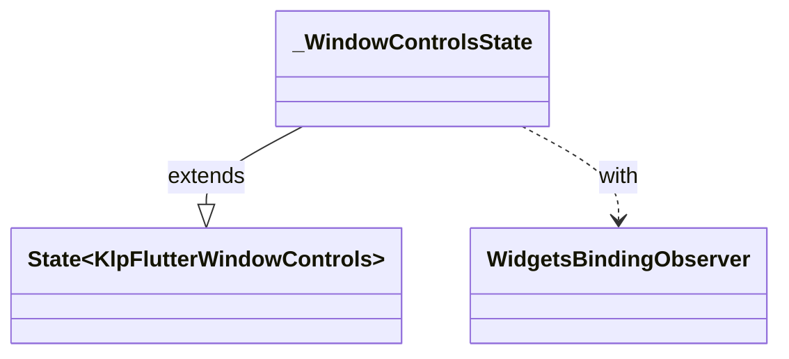

# klp_flutter_window_controls.dart：直接依賴與宣告架構

[回到目錄](README.md) · [來源檔案](../../../../../../lib/src/rendering/flutter/internal/klp_flutter_window_controls.dart)

## 範圍

核心是 `lib/src/rendering/flutter/internal/klp_flutter_window_controls.dart`。主要視角為該檔案明寫的 import／export／part；輔助視角為本檔宣告及 extends／implements／with／on 關係。只展開一層外部邊界。

## 直接依賴圖

## 依賴證據

| 關係 | 原始 directive | 來源 |
|---|---|---|
| import | <code>import &#x27;package:flutter/material.dart&#x27;;</code> | [lib/src/rendering/flutter/internal/klp_flutter_window_controls.dart:1](../../../../../../lib/src/rendering/flutter/internal/klp_flutter_window_controls.dart#L1) |
| import | <code>import &#x27;package:kallopis/src/features/workspace/shell/window/klp_window_action.dart&#x27;;</code> | [lib/src/rendering/flutter/internal/klp_flutter_window_controls.dart:2](../../../../../../lib/src/rendering/flutter/internal/klp_flutter_window_controls.dart#L2) |
| import | <code>import &#x27;package:kallopis/src/features/workspace/shell/window/klp_window_controls.dart&#x27;;</code> | [lib/src/rendering/flutter/internal/klp_flutter_window_controls.dart:3](../../../../../../lib/src/rendering/flutter/internal/klp_flutter_window_controls.dart#L3) |
| import | <code>import &#x27;package:kallopis/src/features/workspace/shell/window/klp_window_controls_geometry.dart&#x27;;</code> | [lib/src/rendering/flutter/internal/klp_flutter_window_controls.dart:4](../../../../../../lib/src/rendering/flutter/internal/klp_flutter_window_controls.dart#L4) |
| import | <code>import &#x27;package:kallopis/src/features/workspace/shell/window/klp_window_controls_style.dart&#x27;;</code> | [lib/src/rendering/flutter/internal/klp_flutter_window_controls.dart:5](../../../../../../lib/src/rendering/flutter/internal/klp_flutter_window_controls.dart#L5) |
| import | <code>import &#x27;package:kallopis/src/foundation/binding/contracts/klp_bound_control_style.dart&#x27;;</code> | [lib/src/rendering/flutter/internal/klp_flutter_window_controls.dart:6](../../../../../../lib/src/rendering/flutter/internal/klp_flutter_window_controls.dart#L6) |
| import | <code>import &#x27;package:kallopis/src/styling/legacy_theme/klp_theme_data.dart&#x27;;</code> | [lib/src/rendering/flutter/internal/klp_flutter_window_controls.dart:7](../../../../../../lib/src/rendering/flutter/internal/klp_flutter_window_controls.dart#L7) |
| import | <code>import &#x27;klp_flutter_values.dart&#x27;;</code> | [lib/src/rendering/flutter/internal/klp_flutter_window_controls.dart:8](../../../../../../lib/src/rendering/flutter/internal/klp_flutter_window_controls.dart#L8) |

## 宣告關係圖

本組節點是本檔宣告；沒有箭頭的宣告未在此圖主張互相依賴。

## 宣告與成員證據

成員包含 public 與 private；簽章取自來源，省略函式本體與欄位初始值。`(inferred)` 表示來源未明寫型別；建構子只顯示參數部分，不含初始化列表。

### KlpFlutterWindowControls

ClassDeclaration · public · [lib/src/rendering/flutter/internal/klp_flutter_window_controls.dart:10](../../../../../../lib/src/rendering/flutter/internal/klp_flutter_window_controls.dart#L10)

<code>final class KlpFlutterWindowControls extends StatefulWidget</code>

來源註解摘要：原生 Windows 視窗操作，沿用 runner 通道並同步最大化狀態。

- `extends` → <code>StatefulWidget</code>：[lib/src/rendering/flutter/internal/klp_flutter_window_controls.dart:11](../../../../../../lib/src/rendering/flutter/internal/klp_flutter_window_controls.dart#L11)

| 成員 | 可見性 | 簽章／型別 | 來源註解摘要 | 證據 |
|---|---|---|---|---|
| field <code>style</code> | public | <code>final KlpBoundControlStyle style</code> |  | [lib/src/rendering/flutter/internal/klp_flutter_window_controls.dart:12](../../../../../../lib/src/rendering/flutter/internal/klp_flutter_window_controls.dart#L12) |
| constructor <code>KlpFlutterWindowControls</code> | public | <code>const KlpFlutterWindowControls({required this.style, super.key})</code> |  | [lib/src/rendering/flutter/internal/klp_flutter_window_controls.dart:13](../../../../../../lib/src/rendering/flutter/internal/klp_flutter_window_controls.dart#L13) |
| method <code>createState</code> | public | <code>State&lt;KlpFlutterWindowControls&gt; createState()</code> |  | [lib/src/rendering/flutter/internal/klp_flutter_window_controls.dart:14](../../../../../../lib/src/rendering/flutter/internal/klp_flutter_window_controls.dart#L14) |

### _WindowControlsState

ClassDeclaration · private · [lib/src/rendering/flutter/internal/klp_flutter_window_controls.dart:18](../../../../../../lib/src/rendering/flutter/internal/klp_flutter_window_controls.dart#L18)

<code>class _WindowControlsState extends State&lt;KlpFlutterWindowControls&gt; with WidgetsBindingObserver</code>

- `extends` → <code>State&lt;KlpFlutterWindowControls&gt;</code>：[lib/src/rendering/flutter/internal/klp_flutter_window_controls.dart:18](../../../../../../lib/src/rendering/flutter/internal/klp_flutter_window_controls.dart#L18)
- `with` → <code>WidgetsBindingObserver</code>：[lib/src/rendering/flutter/internal/klp_flutter_window_controls.dart:18](../../../../../../lib/src/rendering/flutter/internal/klp_flutter_window_controls.dart#L18)

| 成員 | 可見性 | 簽章／型別 | 來源註解摘要 | 證據 |
|---|---|---|---|---|
| field <code>_maximized</code> | private | <code>bool _maximized</code> |  | [lib/src/rendering/flutter/internal/klp_flutter_window_controls.dart:19](../../../../../../lib/src/rendering/flutter/internal/klp_flutter_window_controls.dart#L19) |
| field <code>_generation</code> | private | <code>int _generation</code> |  | [lib/src/rendering/flutter/internal/klp_flutter_window_controls.dart:20](../../../../../../lib/src/rendering/flutter/internal/klp_flutter_window_controls.dart#L20) |
| method <code>initState</code> | public | <code>void initState()</code> |  | [lib/src/rendering/flutter/internal/klp_flutter_window_controls.dart:21](../../../../../../lib/src/rendering/flutter/internal/klp_flutter_window_controls.dart#L21) |
| method <code>_refresh</code> | private | <code>Future&lt;void&gt; _refresh()</code> |  | [lib/src/rendering/flutter/internal/klp_flutter_window_controls.dart:27](../../../../../../lib/src/rendering/flutter/internal/klp_flutter_window_controls.dart#L27) |
| method <code>_toggle</code> | private | <code>Future&lt;void&gt; _toggle()</code> |  | [lib/src/rendering/flutter/internal/klp_flutter_window_controls.dart:32](../../../../../../lib/src/rendering/flutter/internal/klp_flutter_window_controls.dart#L32) |
| method <code>didChangeMetrics</code> | public | <code>void didChangeMetrics()</code> |  | [lib/src/rendering/flutter/internal/klp_flutter_window_controls.dart:36](../../../../../../lib/src/rendering/flutter/internal/klp_flutter_window_controls.dart#L36) |
| method <code>didChangeAppLifecycleState</code> | public | <code>void didChangeAppLifecycleState(AppLifecycleState state)</code> |  | [lib/src/rendering/flutter/internal/klp_flutter_window_controls.dart:38](../../../../../../lib/src/rendering/flutter/internal/klp_flutter_window_controls.dart#L38) |
| method <code>dispose</code> | public | <code>void dispose()</code> |  | [lib/src/rendering/flutter/internal/klp_flutter_window_controls.dart:42](../../../../../../lib/src/rendering/flutter/internal/klp_flutter_window_controls.dart#L42) |
| method <code>build</code> | public | <code>Widget build(BuildContext context)</code> |  | [lib/src/rendering/flutter/internal/klp_flutter_window_controls.dart:48](../../../../../../lib/src/rendering/flutter/internal/klp_flutter_window_controls.dart#L48) |

## 閱讀說明與限制

箭頭只表示來源明寫的靜態關係；import 不等於呼叫。未分析動態呼叫、欄位的實際物件擁有權、狀態轉移或渲染流程；型別未進行語意解析，繼承目標保留原始型別拼寫。public／private 依 Dart 名稱前綴判斷；public 宣告不代表已由 `lib/kallopis.dart` 匯出。

本頁由 `tool/architecture_atlas` 產生；編輯來源或生成工具後重新產生，避免手改本頁。
