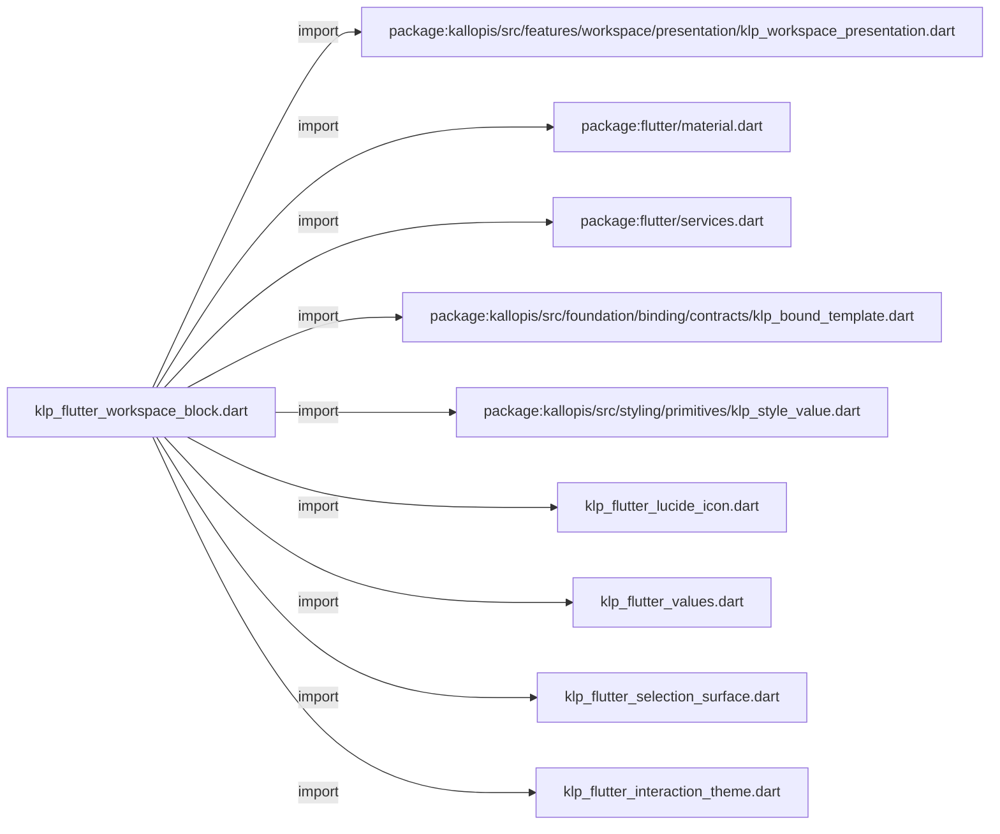
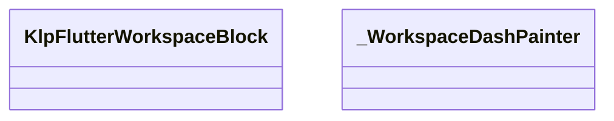
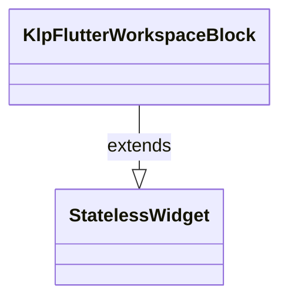
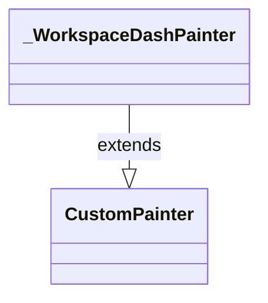

# klp_flutter_workspace_block.dart：直接依賴與宣告架構

[回到目錄](README.md) · [來源檔案](../../../../../../lib/src/rendering/flutter/internal/klp_flutter_workspace_block.dart)

## 範圍

核心是 `lib/src/rendering/flutter/internal/klp_flutter_workspace_block.dart`。主要視角為該檔案明寫的 import／export／part；輔助視角為本檔宣告及 extends／implements／with／on 關係。只展開一層外部邊界。

## 直接依賴圖

## 依賴證據

| 關係 | 原始 directive | 來源 |
|---|---|---|
| import | <code>import &#x27;package:kallopis/src/features/workspace/presentation/klp_workspace_presentation.dart&#x27;;</code> | [lib/src/rendering/flutter/internal/klp_flutter_workspace_block.dart:1](../../../../../../lib/src/rendering/flutter/internal/klp_flutter_workspace_block.dart#L1) |
| import | <code>import &#x27;package:flutter/material.dart&#x27;;</code> | [lib/src/rendering/flutter/internal/klp_flutter_workspace_block.dart:2](../../../../../../lib/src/rendering/flutter/internal/klp_flutter_workspace_block.dart#L2) |
| import | <code>import &#x27;package:flutter/services.dart&#x27;;</code> | [lib/src/rendering/flutter/internal/klp_flutter_workspace_block.dart:3](../../../../../../lib/src/rendering/flutter/internal/klp_flutter_workspace_block.dart#L3) |
| import | <code>import &#x27;package:kallopis/src/foundation/binding/contracts/klp_bound_template.dart&#x27;;</code> | [lib/src/rendering/flutter/internal/klp_flutter_workspace_block.dart:4](../../../../../../lib/src/rendering/flutter/internal/klp_flutter_workspace_block.dart#L4) |
| import | <code>import &#x27;package:kallopis/src/styling/primitives/klp_style_value.dart&#x27;;</code> | [lib/src/rendering/flutter/internal/klp_flutter_workspace_block.dart:5](../../../../../../lib/src/rendering/flutter/internal/klp_flutter_workspace_block.dart#L5) |
| import | <code>import &#x27;klp_flutter_lucide_icon.dart&#x27;;</code> | [lib/src/rendering/flutter/internal/klp_flutter_workspace_block.dart:6](../../../../../../lib/src/rendering/flutter/internal/klp_flutter_workspace_block.dart#L6) |
| import | <code>import &#x27;klp_flutter_values.dart&#x27;;</code> | [lib/src/rendering/flutter/internal/klp_flutter_workspace_block.dart:7](../../../../../../lib/src/rendering/flutter/internal/klp_flutter_workspace_block.dart#L7) |
| import | <code>import &#x27;klp_flutter_selection_surface.dart&#x27;;</code> | [lib/src/rendering/flutter/internal/klp_flutter_workspace_block.dart:8](../../../../../../lib/src/rendering/flutter/internal/klp_flutter_workspace_block.dart#L8) |
| import | <code>import &#x27;klp_flutter_interaction_theme.dart&#x27;;</code> | [lib/src/rendering/flutter/internal/klp_flutter_workspace_block.dart:9](../../../../../../lib/src/rendering/flutter/internal/klp_flutter_workspace_block.dart#L9) |

## 宣告關係圖

本組節點是本檔宣告；沒有箭頭的宣告未在此圖主張互相依賴。

## 宣告與成員證據

成員包含 public 與 private；簽章取自來源，省略函式本體與欄位初始值。`(inferred)` 表示來源未明寫型別；建構子只顯示參數部分，不含初始化列表。

### KlpFlutterWorkspaceBlock

ClassDeclaration · public · [lib/src/rendering/flutter/internal/klp_flutter_workspace_block.dart:11](../../../../../../lib/src/rendering/flutter/internal/klp_flutter_workspace_block.dart#L11)

<code>final class KlpFlutterWorkspaceBlock extends StatelessWidget</code>

- `extends` → <code>StatelessWidget</code>：[lib/src/rendering/flutter/internal/klp_flutter_workspace_block.dart:11](../../../../../../lib/src/rendering/flutter/internal/klp_flutter_workspace_block.dart#L11)

| 成員 | 可見性 | 簽章／型別 | 來源註解摘要 | 證據 |
|---|---|---|---|---|
| field <code>content</code> | public | <code>final KlpBoundWorkspaceBlock content</code> |  | [lib/src/rendering/flutter/internal/klp_flutter_workspace_block.dart:12](../../../../../../lib/src/rendering/flutter/internal/klp_flutter_workspace_block.dart#L12) |
| constructor <code>KlpFlutterWorkspaceBlock</code> | public | <code>const KlpFlutterWorkspaceBlock({required this.content, super.key})</code> |  | [lib/src/rendering/flutter/internal/klp_flutter_workspace_block.dart:13](../../../../../../lib/src/rendering/flutter/internal/klp_flutter_workspace_block.dart#L13) |
| method <code>build</code> | public | <code>Widget build(BuildContext context)</code> |  | [lib/src/rendering/flutter/internal/klp_flutter_workspace_block.dart:15](../../../../../../lib/src/rendering/flutter/internal/klp_flutter_workspace_block.dart#L15) |
| method <code>_interactionTheme</code> | private | <code>Widget _interactionTheme(Widget child)</code> |  | [lib/src/rendering/flutter/internal/klp_flutter_workspace_block.dart:34](../../../../../../lib/src/rendering/flutter/internal/klp_flutter_workspace_block.dart#L34) |
| method <code>_toolbar</code> | private | <code>Widget _toolbar()</code> | 圖示工具列的外殼與命中區分離，名稱保留於提示與輔助語意。 | [lib/src/rendering/flutter/internal/klp_flutter_workspace_block.dart:36](../../../../../../lib/src/rendering/flutter/internal/klp_flutter_workspace_block.dart#L36) |
| method <code>_identity</code> | private | <code>Widget _identity(BuildContext context)</code> |  | [lib/src/rendering/flutter/internal/klp_flutter_workspace_block.dart:50](../../../../../../lib/src/rendering/flutter/internal/klp_flutter_workspace_block.dart#L50) |
| method <code>_commandButton</code> | private | <code>Widget _commandButton(BuildContext context)</code> |  | [lib/src/rendering/flutter/internal/klp_flutter_workspace_block.dart:58](../../../../../../lib/src/rendering/flutter/internal/klp_flutter_workspace_block.dart#L58) |
| method <code>_runCommand</code> | private | <code>Future&lt;void&gt; _runCommand(BuildContext context, KlpBoundWorkspaceCommand command)</code> |  | [lib/src/rendering/flutter/internal/klp_flutter_workspace_block.dart:66](../../../../../../lib/src/rendering/flutter/internal/klp_flutter_workspace_block.dart#L66) |
| method <code>_action</code> | private | <code>Widget _action()</code> |  | [lib/src/rendering/flutter/internal/klp_flutter_workspace_block.dart:81](../../../../../../lib/src/rendering/flutter/internal/klp_flutter_workspace_block.dart#L81) |
| method <code>_paper</code> | private | <code>Widget _paper()</code> |  | [lib/src/rendering/flutter/internal/klp_flutter_workspace_block.dart:87](../../../../../../lib/src/rendering/flutter/internal/klp_flutter_workspace_block.dart#L87) |
| method <code>_sticky</code> | private | <code>Widget _sticky()</code> |  | [lib/src/rendering/flutter/internal/klp_flutter_workspace_block.dart:99](../../../../../../lib/src/rendering/flutter/internal/klp_flutter_workspace_block.dart#L99) |
| method <code>_search</code> | private | <code>Widget _search()</code> |  | [lib/src/rendering/flutter/internal/klp_flutter_workspace_block.dart:107](../../../../../../lib/src/rendering/flutter/internal/klp_flutter_workspace_block.dart#L107) |
| method <code>_dialog</code> | private | <code>Widget _dialog(BuildContext context)</code> |  | [lib/src/rendering/flutter/internal/klp_flutter_workspace_block.dart:116](../../../../../../lib/src/rendering/flutter/internal/klp_flutter_workspace_block.dart#L116) |
| method <code>_settings</code> | private | <code>Widget _settings()</code> |  | [lib/src/rendering/flutter/internal/klp_flutter_workspace_block.dart:131](../../../../../../lib/src/rendering/flutter/internal/klp_flutter_workspace_block.dart#L131) |
| method <code>_collection</code> | private | <code>Widget _collection()</code> |  | [lib/src/rendering/flutter/internal/klp_flutter_workspace_block.dart:138](../../../../../../lib/src/rendering/flutter/internal/klp_flutter_workspace_block.dart#L138) |
| method <code>_collectionItem</code> | private | <code>Widget _collectionItem(KlpBoundWorkspaceItem item)</code> |  | [lib/src/rendering/flutter/internal/klp_flutter_workspace_block.dart:140](../../../../../../lib/src/rendering/flutter/internal/klp_flutter_workspace_block.dart#L140) |
| method <code>_item</code> | private | <code>Widget _item(KlpBoundWorkspaceItem item)</code> |  | [lib/src/rendering/flutter/internal/klp_flutter_workspace_block.dart:154](../../../../../../lib/src/rendering/flutter/internal/klp_flutter_workspace_block.dart#L154) |
| method <code>_iconAction</code> | private | <code>Widget _iconAction(String label, String symbol, void Function()? action)</code> |  | [lib/src/rendering/flutter/internal/klp_flutter_workspace_block.dart:160](../../../../../../lib/src/rendering/flutter/internal/klp_flutter_workspace_block.dart#L160) |
| method <code>_workspaceContent</code> | private | <code>Widget _workspaceContent(KlpBoundTemplate template)</code> |  | [lib/src/rendering/flutter/internal/klp_flutter_workspace_block.dart:162](../../../../../../lib/src/rendering/flutter/internal/klp_flutter_workspace_block.dart#L162) |
| method <code>_contentBlock</code> | private | <code>Widget _contentBlock(KlpBoundWorkspaceContentBlock block)</code> |  | [lib/src/rendering/flutter/internal/klp_flutter_workspace_block.dart:169](../../../../../../lib/src/rendering/flutter/internal/klp_flutter_workspace_block.dart#L169) |
| method <code>_checklistRow</code> | private | <code>Widget _checklistRow(String label, bool checked, ValueChanged&lt;bool&gt;? onChanged, {Widget? text})</code> |  | [lib/src/rendering/flutter/internal/klp_flutter_workspace_block.dart:195](../../../../../../lib/src/rendering/flutter/internal/klp_flutter_workspace_block.dart#L195) |
| method <code>_icon</code> | private | <code>Widget _icon(int value, {KlpColor? color})</code> |  | [lib/src/rendering/flutter/internal/klp_flutter_workspace_block.dart:209](../../../../../../lib/src/rendering/flutter/internal/klp_flutter_workspace_block.dart#L209) |
| method <code>_iconData</code> | private | <code>String _iconData(int value)</code> |  | [lib/src/rendering/flutter/internal/klp_flutter_workspace_block.dart:210](../../../../../../lib/src/rendering/flutter/internal/klp_flutter_workspace_block.dart#L210) |
| method <code>_interactive</code> | private | <code>Widget _interactive(String label, void Function()? action, Widget child, {bool? checked, bool? selected})</code> |  | [lib/src/rendering/flutter/internal/klp_flutter_workspace_block.dart:212](../../../../../../lib/src/rendering/flutter/internal/klp_flutter_workspace_block.dart#L212) |
| method <code>_style</code> | private | <code>TextStyle _style({KlpColor? color, double? size, FontWeight? weight, double? height})</code> |  | [lib/src/rendering/flutter/internal/klp_flutter_workspace_block.dart:222](../../../../../../lib/src/rendering/flutter/internal/klp_flutter_workspace_block.dart#L222) |
| method <code>_brandStyle</code> | private | <code>TextStyle _brandStyle(double size)</code> |  | [lib/src/rendering/flutter/internal/klp_flutter_workspace_block.dart:223](../../../../../../lib/src/rendering/flutter/internal/klp_flutter_workspace_block.dart#L223) |

### _WorkspaceDashPainter

ClassDeclaration · private · [lib/src/rendering/flutter/internal/klp_flutter_workspace_block.dart:226](../../../../../../lib/src/rendering/flutter/internal/klp_flutter_workspace_block.dart#L226)

<code>final class _WorkspaceDashPainter extends CustomPainter</code>

- `extends` → <code>CustomPainter</code>：[lib/src/rendering/flutter/internal/klp_flutter_workspace_block.dart:226](../../../../../../lib/src/rendering/flutter/internal/klp_flutter_workspace_block.dart#L226)

| 成員 | 可見性 | 簽章／型別 | 來源註解摘要 | 證據 |
|---|---|---|---|---|
| field <code>color</code> | public | <code>final Color color</code> |  | [lib/src/rendering/flutter/internal/klp_flutter_workspace_block.dart:227](../../../../../../lib/src/rendering/flutter/internal/klp_flutter_workspace_block.dart#L227) |
| field <code>stroke</code> | public | <code>final double stroke</code> |  | [lib/src/rendering/flutter/internal/klp_flutter_workspace_block.dart:228](../../../../../../lib/src/rendering/flutter/internal/klp_flutter_workspace_block.dart#L228) |
| constructor <code>_WorkspaceDashPainter</code> | private | <code>const _WorkspaceDashPainter(this.color, this.stroke)</code> |  | [lib/src/rendering/flutter/internal/klp_flutter_workspace_block.dart:229](../../../../../../lib/src/rendering/flutter/internal/klp_flutter_workspace_block.dart#L229) |
| method <code>paint</code> | public | <code>void paint(Canvas canvas, Size size)</code> |  | [lib/src/rendering/flutter/internal/klp_flutter_workspace_block.dart:230](../../../../../../lib/src/rendering/flutter/internal/klp_flutter_workspace_block.dart#L230) |
| method <code>shouldRepaint</code> | public | <code>bool shouldRepaint(_WorkspaceDashPainter oldDelegate)</code> |  | [lib/src/rendering/flutter/internal/klp_flutter_workspace_block.dart:239](../../../../../../lib/src/rendering/flutter/internal/klp_flutter_workspace_block.dart#L239) |

## 閱讀說明與限制

箭頭只表示來源明寫的靜態關係；import 不等於呼叫。未分析動態呼叫、欄位的實際物件擁有權、狀態轉移或渲染流程；型別未進行語意解析，繼承目標保留原始型別拼寫。public／private 依 Dart 名稱前綴判斷；public 宣告不代表已由 `lib/kallopis.dart` 匯出。

本頁由 `tool/architecture_atlas` 產生；編輯來源或生成工具後重新產生，避免手改本頁。
