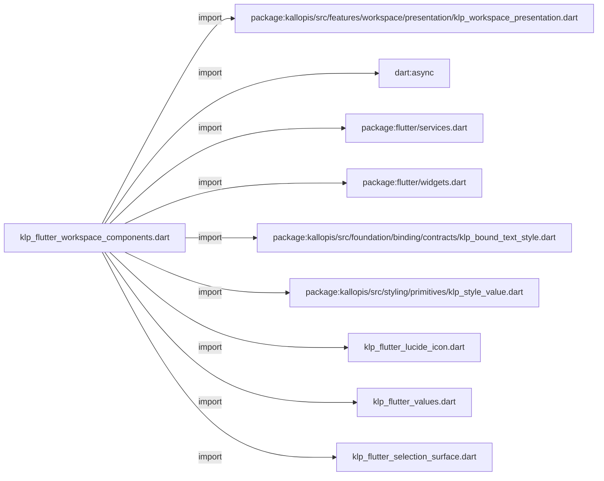
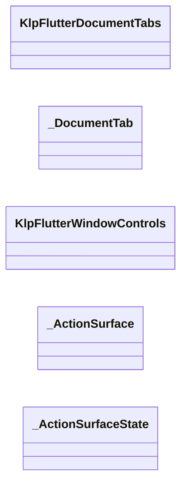
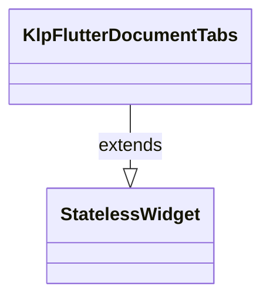
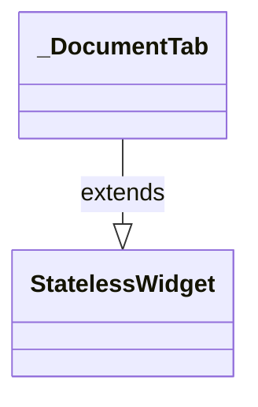
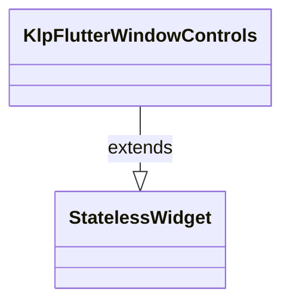
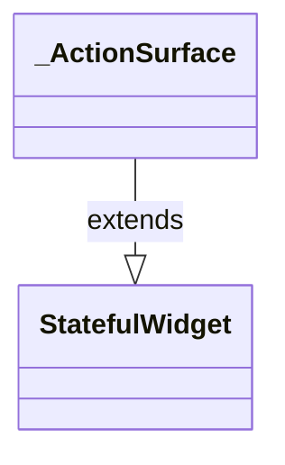
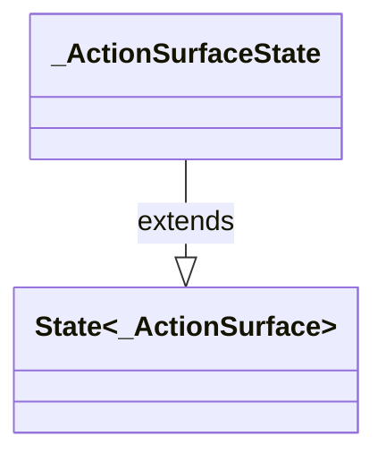

# klp_flutter_workspace_components.dart：直接依賴與宣告架構

[回到目錄](README.md) · [來源檔案](../../../../../../lib/src/rendering/flutter/internal/klp_flutter_workspace_components.dart)

## 範圍

核心是 `lib/src/rendering/flutter/internal/klp_flutter_workspace_components.dart`。主要視角為該檔案明寫的 import／export／part；輔助視角為本檔宣告及 extends／implements／with／on 關係。只展開一層外部邊界。

## 直接依賴圖

## 依賴證據

| 關係 | 原始 directive | 來源 |
|---|---|---|
| import | <code>import &#x27;package:kallopis/src/features/workspace/presentation/klp_workspace_presentation.dart&#x27;;</code> | [lib/src/rendering/flutter/internal/klp_flutter_workspace_components.dart:1](../../../../../../lib/src/rendering/flutter/internal/klp_flutter_workspace_components.dart#L1) |
| import | <code>import &#x27;dart:async&#x27;;</code> | [lib/src/rendering/flutter/internal/klp_flutter_workspace_components.dart:2](../../../../../../lib/src/rendering/flutter/internal/klp_flutter_workspace_components.dart#L2) |
| import | <code>import &#x27;package:flutter/services.dart&#x27;;</code> | [lib/src/rendering/flutter/internal/klp_flutter_workspace_components.dart:3](../../../../../../lib/src/rendering/flutter/internal/klp_flutter_workspace_components.dart#L3) |
| import | <code>import &#x27;package:flutter/widgets.dart&#x27;;</code> | [lib/src/rendering/flutter/internal/klp_flutter_workspace_components.dart:4](../../../../../../lib/src/rendering/flutter/internal/klp_flutter_workspace_components.dart#L4) |
| import | <code>import &#x27;package:kallopis/src/foundation/binding/contracts/klp_bound_text_style.dart&#x27;;</code> | [lib/src/rendering/flutter/internal/klp_flutter_workspace_components.dart:5](../../../../../../lib/src/rendering/flutter/internal/klp_flutter_workspace_components.dart#L5) |
| import | <code>import &#x27;package:kallopis/src/styling/primitives/klp_style_value.dart&#x27;;</code> | [lib/src/rendering/flutter/internal/klp_flutter_workspace_components.dart:6](../../../../../../lib/src/rendering/flutter/internal/klp_flutter_workspace_components.dart#L6) |
| import | <code>import &#x27;klp_flutter_lucide_icon.dart&#x27;;</code> | [lib/src/rendering/flutter/internal/klp_flutter_workspace_components.dart:7](../../../../../../lib/src/rendering/flutter/internal/klp_flutter_workspace_components.dart#L7) |
| import | <code>import &#x27;klp_flutter_values.dart&#x27;;</code> | [lib/src/rendering/flutter/internal/klp_flutter_workspace_components.dart:8](../../../../../../lib/src/rendering/flutter/internal/klp_flutter_workspace_components.dart#L8) |
| import | <code>import &#x27;klp_flutter_selection_surface.dart&#x27;;</code> | [lib/src/rendering/flutter/internal/klp_flutter_workspace_components.dart:9](../../../../../../lib/src/rendering/flutter/internal/klp_flutter_workspace_components.dart#L9) |

## 宣告關係圖

本組節點是本檔宣告；沒有箭頭的宣告未在此圖主張互相依賴。

## 宣告與成員證據

成員包含 public 與 private；簽章取自來源，省略函式本體與欄位初始值。`(inferred)` 表示來源未明寫型別；建構子只顯示參數部分，不含初始化列表。

### KlpFlutterDocumentTabs

ClassDeclaration · public · [lib/src/rendering/flutter/internal/klp_flutter_workspace_components.dart:11](../../../../../../lib/src/rendering/flutter/internal/klp_flutter_workspace_components.dart#L11)

<code>final class KlpFlutterDocumentTabs extends StatelessWidget</code>

- `extends` → <code>StatelessWidget</code>：[lib/src/rendering/flutter/internal/klp_flutter_workspace_components.dart:11](../../../../../../lib/src/rendering/flutter/internal/klp_flutter_workspace_components.dart#L11)

| 成員 | 可見性 | 簽章／型別 | 來源註解摘要 | 證據 |
|---|---|---|---|---|
| field <code>content</code> | public | <code>final KlpBoundDocumentTabs content</code> |  | [lib/src/rendering/flutter/internal/klp_flutter_workspace_components.dart:12](../../../../../../lib/src/rendering/flutter/internal/klp_flutter_workspace_components.dart#L12) |
| constructor <code>KlpFlutterDocumentTabs</code> | public | <code>const KlpFlutterDocumentTabs({required this.content, super.key})</code> |  | [lib/src/rendering/flutter/internal/klp_flutter_workspace_components.dart:13](../../../../../../lib/src/rendering/flutter/internal/klp_flutter_workspace_components.dart#L13) |
| method <code>build</code> | public | <code>Widget build(BuildContext context)</code> |  | [lib/src/rendering/flutter/internal/klp_flutter_workspace_components.dart:14](../../../../../../lib/src/rendering/flutter/internal/klp_flutter_workspace_components.dart#L14) |

### _DocumentTab

ClassDeclaration · private · [lib/src/rendering/flutter/internal/klp_flutter_workspace_components.dart:21](../../../../../../lib/src/rendering/flutter/internal/klp_flutter_workspace_components.dart#L21)

<code>final class _DocumentTab extends StatelessWidget</code>

- `extends` → <code>StatelessWidget</code>：[lib/src/rendering/flutter/internal/klp_flutter_workspace_components.dart:21](../../../../../../lib/src/rendering/flutter/internal/klp_flutter_workspace_components.dart#L21)

| 成員 | 可見性 | 簽章／型別 | 來源註解摘要 | 證據 |
|---|---|---|---|---|
| field <code>content</code> | public | <code>final KlpBoundDocumentTabs content</code> |  | [lib/src/rendering/flutter/internal/klp_flutter_workspace_components.dart:22](../../../../../../lib/src/rendering/flutter/internal/klp_flutter_workspace_components.dart#L22) |
| field <code>tab</code> | public | <code>final KlpBoundDocumentTabData tab</code> |  | [lib/src/rendering/flutter/internal/klp_flutter_workspace_components.dart:23](../../../../../../lib/src/rendering/flutter/internal/klp_flutter_workspace_components.dart#L23) |
| constructor <code>_DocumentTab</code> | private | <code>const _DocumentTab({required this.content, required this.tab})</code> |  | [lib/src/rendering/flutter/internal/klp_flutter_workspace_components.dart:24](../../../../../../lib/src/rendering/flutter/internal/klp_flutter_workspace_components.dart#L24) |
| method <code>build</code> | public | <code>Widget build(BuildContext context)</code> |  | [lib/src/rendering/flutter/internal/klp_flutter_workspace_components.dart:25](../../../../../../lib/src/rendering/flutter/internal/klp_flutter_workspace_components.dart#L25) |

### KlpFlutterWindowControls

ClassDeclaration · public · [lib/src/rendering/flutter/internal/klp_flutter_workspace_components.dart:39](../../../../../../lib/src/rendering/flutter/internal/klp_flutter_workspace_components.dart#L39)

<code>final class KlpFlutterWindowControls extends StatelessWidget</code>

- `extends` → <code>StatelessWidget</code>：[lib/src/rendering/flutter/internal/klp_flutter_workspace_components.dart:39](../../../../../../lib/src/rendering/flutter/internal/klp_flutter_workspace_components.dart#L39)

| 成員 | 可見性 | 簽章／型別 | 來源註解摘要 | 證據 |
|---|---|---|---|---|
| field <code>content</code> | public | <code>final KlpBoundWindowControls content</code> |  | [lib/src/rendering/flutter/internal/klp_flutter_workspace_components.dart:40](../../../../../../lib/src/rendering/flutter/internal/klp_flutter_workspace_components.dart#L40) |
| constructor <code>KlpFlutterWindowControls</code> | public | <code>const KlpFlutterWindowControls({required this.content, super.key})</code> |  | [lib/src/rendering/flutter/internal/klp_flutter_workspace_components.dart:41](../../../../../../lib/src/rendering/flutter/internal/klp_flutter_workspace_components.dart#L41) |
| method <code>build</code> | public | <code>Widget build(BuildContext context)</code> |  | [lib/src/rendering/flutter/internal/klp_flutter_workspace_components.dart:42](../../../../../../lib/src/rendering/flutter/internal/klp_flutter_workspace_components.dart#L42) |
| method <code>_control</code> | private | <code>Widget _control(String label, String icon, void Function()? callback)</code> |  | [lib/src/rendering/flutter/internal/klp_flutter_workspace_components.dart:53](../../../../../../lib/src/rendering/flutter/internal/klp_flutter_workspace_components.dart#L53) |

### _ActionSurface

ClassDeclaration · private · [lib/src/rendering/flutter/internal/klp_flutter_workspace_components.dart:56](../../../../../../lib/src/rendering/flutter/internal/klp_flutter_workspace_components.dart#L56)

<code>final class _ActionSurface extends StatefulWidget</code>

- `extends` → <code>StatefulWidget</code>：[lib/src/rendering/flutter/internal/klp_flutter_workspace_components.dart:56](../../../../../../lib/src/rendering/flutter/internal/klp_flutter_workspace_components.dart#L56)

| 成員 | 可見性 | 簽章／型別 | 來源註解摘要 | 證據 |
|---|---|---|---|---|
| field <code>label</code> | public | <code>final String label</code> |  | [lib/src/rendering/flutter/internal/klp_flutter_workspace_components.dart:57](../../../../../../lib/src/rendering/flutter/internal/klp_flutter_workspace_components.dart#L57) |
| field <code>selected</code> | public | <code>final bool selected</code> |  | [lib/src/rendering/flutter/internal/klp_flutter_workspace_components.dart:58](../../../../../../lib/src/rendering/flutter/internal/klp_flutter_workspace_components.dart#L58) |
| field <code>onActivate</code> | public | <code>final void Function()? onActivate</code> |  | [lib/src/rendering/flutter/internal/klp_flutter_workspace_components.dart:59](../../../../../../lib/src/rendering/flutter/internal/klp_flutter_workspace_components.dart#L59) |
| field <code>interactionColor</code> | public | <code>final KlpColor interactionColor</code> |  | [lib/src/rendering/flutter/internal/klp_flutter_workspace_components.dart:60](../../../../../../lib/src/rendering/flutter/internal/klp_flutter_workspace_components.dart#L60) |
| field <code>radius</code> | public | <code>final double radius</code> |  | [lib/src/rendering/flutter/internal/klp_flutter_workspace_components.dart:61](../../../../../../lib/src/rendering/flutter/internal/klp_flutter_workspace_components.dart#L61) |
| field <code>child</code> | public | <code>final Widget child</code> |  | [lib/src/rendering/flutter/internal/klp_flutter_workspace_components.dart:62](../../../../../../lib/src/rendering/flutter/internal/klp_flutter_workspace_components.dart#L62) |
| constructor <code>_ActionSurface</code> | private | <code>const _ActionSurface({required this.label, required this.onActivate, required this.interactionColor, required this.radius, required this.child, this.selected = false})</code> |  | [lib/src/rendering/flutter/internal/klp_flutter_workspace_components.dart:63](../../../../../../lib/src/rendering/flutter/internal/klp_flutter_workspace_components.dart#L63) |
| method <code>createState</code> | public | <code>State&lt;_ActionSurface&gt; createState()</code> |  | [lib/src/rendering/flutter/internal/klp_flutter_workspace_components.dart:64](../../../../../../lib/src/rendering/flutter/internal/klp_flutter_workspace_components.dart#L64) |

### _ActionSurfaceState

ClassDeclaration · private · [lib/src/rendering/flutter/internal/klp_flutter_workspace_components.dart:68](../../../../../../lib/src/rendering/flutter/internal/klp_flutter_workspace_components.dart#L68)

<code>final class _ActionSurfaceState extends State&lt;_ActionSurface&gt;</code>

- `extends` → <code>State&lt;_ActionSurface&gt;</code>：[lib/src/rendering/flutter/internal/klp_flutter_workspace_components.dart:68](../../../../../../lib/src/rendering/flutter/internal/klp_flutter_workspace_components.dart#L68)

| 成員 | 可見性 | 簽章／型別 | 來源註解摘要 | 證據 |
|---|---|---|---|---|
| field <code>_focusNode</code> | private | <code>final (inferred) _focusNode</code> |  | [lib/src/rendering/flutter/internal/klp_flutter_workspace_components.dart:69](../../../../../../lib/src/rendering/flutter/internal/klp_flutter_workspace_components.dart#L69) |
| method <code>_activate</code> | private | <code>void _activate()</code> |  | [lib/src/rendering/flutter/internal/klp_flutter_workspace_components.dart:70](../../../../../../lib/src/rendering/flutter/internal/klp_flutter_workspace_components.dart#L70) |
| method <code>dispose</code> | public | <code>void dispose()</code> |  | [lib/src/rendering/flutter/internal/klp_flutter_workspace_components.dart:75](../../../../../../lib/src/rendering/flutter/internal/klp_flutter_workspace_components.dart#L75) |
| method <code>build</code> | public | <code>Widget build(BuildContext context)</code> |  | [lib/src/rendering/flutter/internal/klp_flutter_workspace_components.dart:80](../../../../../../lib/src/rendering/flutter/internal/klp_flutter_workspace_components.dart#L80) |

### _tabsTextStyle

FunctionDeclaration · private · [lib/src/rendering/flutter/internal/klp_flutter_workspace_components.dart:96](../../../../../../lib/src/rendering/flutter/internal/klp_flutter_workspace_components.dart#L96)

<code>TextStyle _tabsTextStyle(KlpBoundDocumentTabs content, KlpColor color)</code>

### _resolvedTextStyle

FunctionDeclaration · private · [lib/src/rendering/flutter/internal/klp_flutter_workspace_components.dart:97](../../../../../../lib/src/rendering/flutter/internal/klp_flutter_workspace_components.dart#L97)

<code>TextStyle _resolvedTextStyle(KlpBoundTextStyle style, KlpColor color)</code>

## 閱讀說明與限制

箭頭只表示來源明寫的靜態關係；import 不等於呼叫。未分析動態呼叫、欄位的實際物件擁有權、狀態轉移或渲染流程；型別未進行語意解析，繼承目標保留原始型別拼寫。public／private 依 Dart 名稱前綴判斷；public 宣告不代表已由 `lib/kallopis.dart` 匯出。

本頁由 `tool/architecture_atlas` 產生；編輯來源或生成工具後重新產生，避免手改本頁。
