# klp_flutter_workspace_components.dart：直接依賴與宣告架構

[回到目錄](README.md) · [來源檔案](../../../../../../lib/src/rendering/flutter/internal/klp_flutter_workspace_components.dart)

## 範圍

核心是 `lib/src/rendering/flutter/internal/klp_flutter_workspace_components.dart`。主要視角為該檔案明寫的 import／export／part；輔助視角為本檔宣告及 extends／implements／with／on 關係。只展開一層外部邊界。

## 直接依賴圖

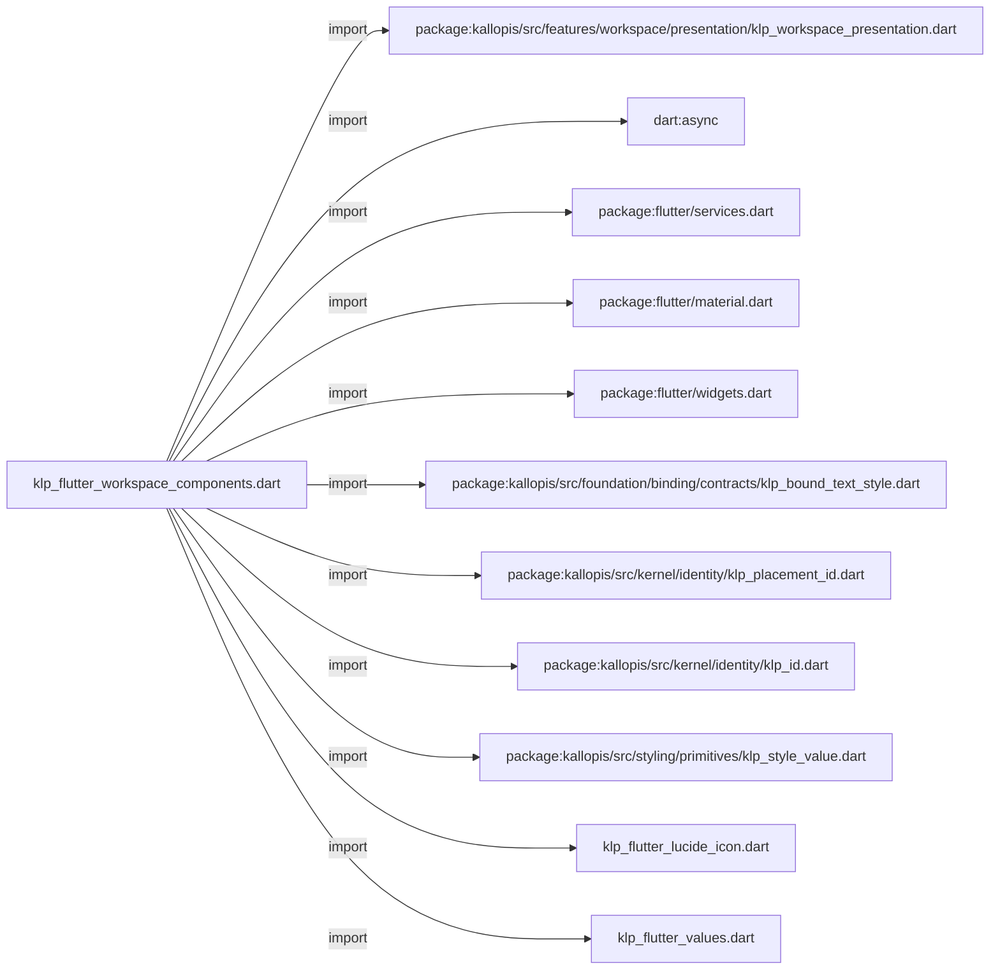

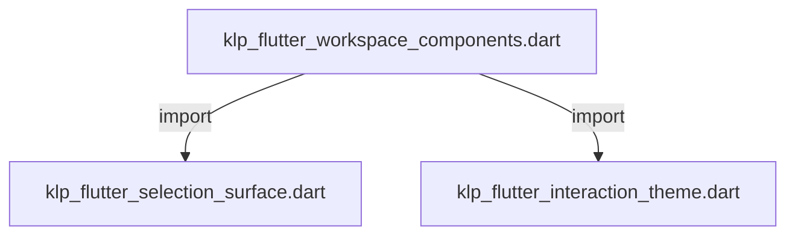

## 依賴證據

| 關係 | 原始 directive | 來源 |
|---|---|---|
| import | <code>import &#x27;package:kallopis/src/features/workspace/presentation/klp_workspace_presentation.dart&#x27;;</code> | [lib/src/rendering/flutter/internal/klp_flutter_workspace_components.dart:1](../../../../../../lib/src/rendering/flutter/internal/klp_flutter_workspace_components.dart#L1) |
| import | <code>import &#x27;dart:async&#x27;;</code> | [lib/src/rendering/flutter/internal/klp_flutter_workspace_components.dart:2](../../../../../../lib/src/rendering/flutter/internal/klp_flutter_workspace_components.dart#L2) |
| import | <code>import &#x27;package:flutter/services.dart&#x27;;</code> | [lib/src/rendering/flutter/internal/klp_flutter_workspace_components.dart:3](../../../../../../lib/src/rendering/flutter/internal/klp_flutter_workspace_components.dart#L3) |
| import | <code>import &#x27;package:flutter/material.dart&#x27; show AlertDialog, DefaultMaterialLocalizations, Material, MaterialType, TextButton, TextField, showDialog;</code> | [lib/src/rendering/flutter/internal/klp_flutter_workspace_components.dart:4](../../../../../../lib/src/rendering/flutter/internal/klp_flutter_workspace_components.dart#L4) |
| import | <code>import &#x27;package:flutter/widgets.dart&#x27;;</code> | [lib/src/rendering/flutter/internal/klp_flutter_workspace_components.dart:5](../../../../../../lib/src/rendering/flutter/internal/klp_flutter_workspace_components.dart#L5) |
| import | <code>import &#x27;package:kallopis/src/foundation/binding/contracts/klp_bound_text_style.dart&#x27;;</code> | [lib/src/rendering/flutter/internal/klp_flutter_workspace_components.dart:6](../../../../../../lib/src/rendering/flutter/internal/klp_flutter_workspace_components.dart#L6) |
| import | <code>import &#x27;package:kallopis/src/kernel/identity/klp_placement_id.dart&#x27;;</code> | [lib/src/rendering/flutter/internal/klp_flutter_workspace_components.dart:7](../../../../../../lib/src/rendering/flutter/internal/klp_flutter_workspace_components.dart#L7) |
| import | <code>import &#x27;package:kallopis/src/kernel/identity/klp_id.dart&#x27;;</code> | [lib/src/rendering/flutter/internal/klp_flutter_workspace_components.dart:8](../../../../../../lib/src/rendering/flutter/internal/klp_flutter_workspace_components.dart#L8) |
| import | <code>import &#x27;package:kallopis/src/styling/primitives/klp_style_value.dart&#x27;;</code> | [lib/src/rendering/flutter/internal/klp_flutter_workspace_components.dart:9](../../../../../../lib/src/rendering/flutter/internal/klp_flutter_workspace_components.dart#L9) |
| import | <code>import &#x27;klp_flutter_lucide_icon.dart&#x27;;</code> | [lib/src/rendering/flutter/internal/klp_flutter_workspace_components.dart:10](../../../../../../lib/src/rendering/flutter/internal/klp_flutter_workspace_components.dart#L10) |
| import | <code>import &#x27;klp_flutter_values.dart&#x27;;</code> | [lib/src/rendering/flutter/internal/klp_flutter_workspace_components.dart:11](../../../../../../lib/src/rendering/flutter/internal/klp_flutter_workspace_components.dart#L11) |
| import | <code>import &#x27;klp_flutter_selection_surface.dart&#x27;;</code> | [lib/src/rendering/flutter/internal/klp_flutter_workspace_components.dart:12](../../../../../../lib/src/rendering/flutter/internal/klp_flutter_workspace_components.dart#L12) |
| import | <code>import &#x27;klp_flutter_interaction_theme.dart&#x27;;</code> | [lib/src/rendering/flutter/internal/klp_flutter_workspace_components.dart:13](../../../../../../lib/src/rendering/flutter/internal/klp_flutter_workspace_components.dart#L13) |

## 宣告關係圖

本組節點是本檔宣告；沒有箭頭的宣告未在此圖主張互相依賴。

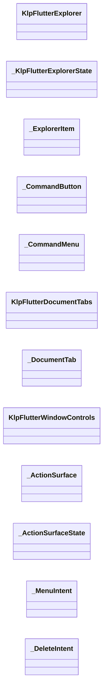

本組節點是本檔宣告；沒有箭頭的宣告未在此圖主張互相依賴。

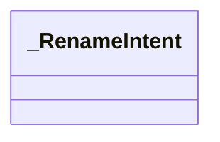

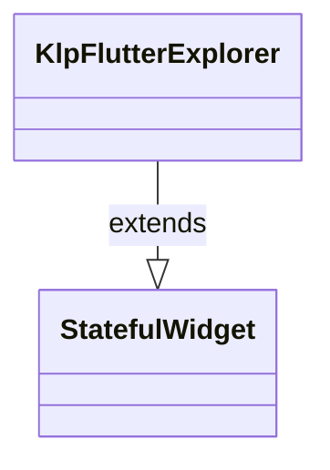

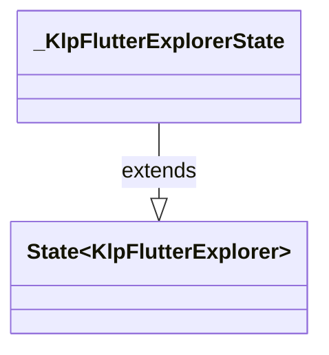

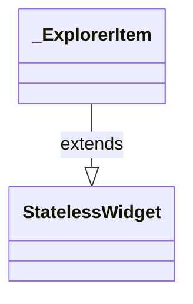

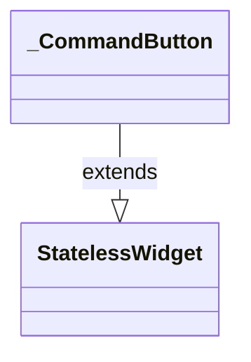

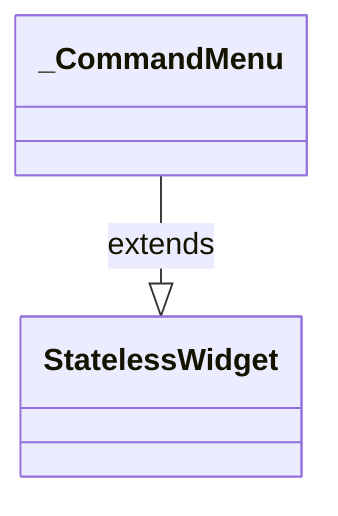

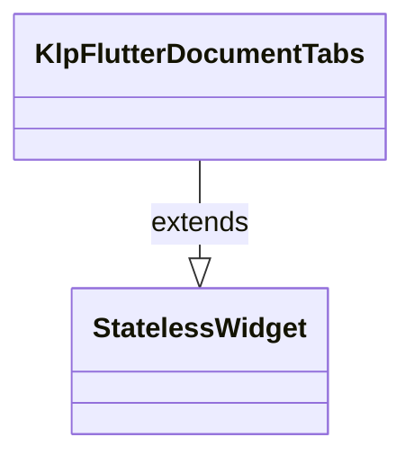

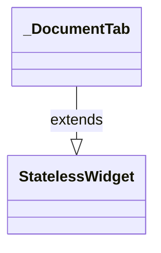

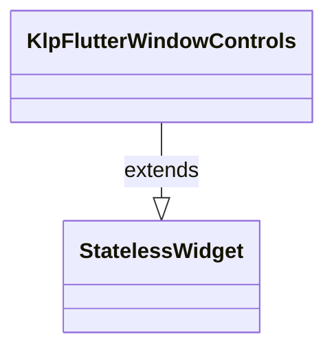

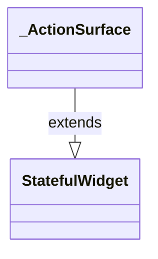

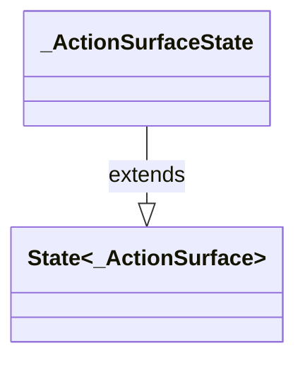

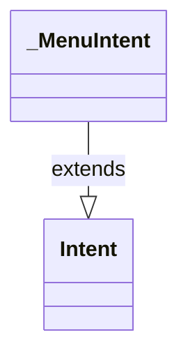

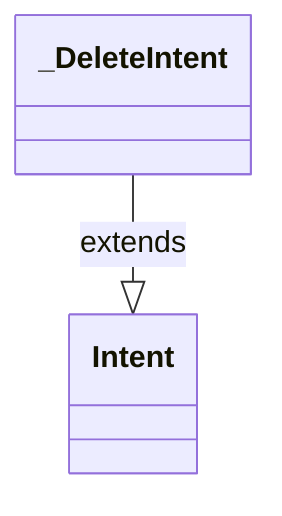

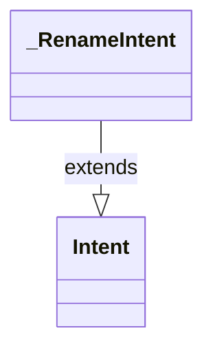

## 宣告與成員證據

成員包含 public 與 private；簽章取自來源，省略函式本體與欄位初始值。`(inferred)` 表示來源未明寫型別；建構子只顯示參數部分，不含初始化列表。

### KlpFlutterExplorer

ClassDeclaration · public · [lib/src/rendering/flutter/internal/klp_flutter_workspace_components.dart:15](../../../../../../lib/src/rendering/flutter/internal/klp_flutter_workspace_components.dart#L15)

<code>final class KlpFlutterExplorer extends StatefulWidget</code>

- `extends` → <code>StatefulWidget</code>：[lib/src/rendering/flutter/internal/klp_flutter_workspace_components.dart:15](../../../../../../lib/src/rendering/flutter/internal/klp_flutter_workspace_components.dart#L15)

| 成員 | 可見性 | 簽章／型別 | 來源註解摘要 | 證據 |
|---|---|---|---|---|
| field <code>content</code> | public | <code>final KlpBoundExplorer content</code> |  | [lib/src/rendering/flutter/internal/klp_flutter_workspace_components.dart:16](../../../../../../lib/src/rendering/flutter/internal/klp_flutter_workspace_components.dart#L16) |
| constructor <code>KlpFlutterExplorer</code> | public | <code>const KlpFlutterExplorer({required this.content, super.key})</code> |  | [lib/src/rendering/flutter/internal/klp_flutter_workspace_components.dart:17](../../../../../../lib/src/rendering/flutter/internal/klp_flutter_workspace_components.dart#L17) |
| method <code>createState</code> | public | <code>State&lt;KlpFlutterExplorer&gt; createState()</code> |  | [lib/src/rendering/flutter/internal/klp_flutter_workspace_components.dart:18](../../../../../../lib/src/rendering/flutter/internal/klp_flutter_workspace_components.dart#L18) |

### _KlpFlutterExplorerState

ClassDeclaration · private · [lib/src/rendering/flutter/internal/klp_flutter_workspace_components.dart:22](../../../../../../lib/src/rendering/flutter/internal/klp_flutter_workspace_components.dart#L22)

<code>final class _KlpFlutterExplorerState extends State&lt;KlpFlutterExplorer&gt;</code>

- `extends` → <code>State&lt;KlpFlutterExplorer&gt;</code>：[lib/src/rendering/flutter/internal/klp_flutter_workspace_components.dart:22](../../../../../../lib/src/rendering/flutter/internal/klp_flutter_workspace_components.dart#L22)

| 成員 | 可見性 | 簽章／型別 | 來源註解摘要 | 證據 |
|---|---|---|---|---|
| getter <code>content</code> | public | <code>KlpBoundExplorer get content</code> |  | [lib/src/rendering/flutter/internal/klp_flutter_workspace_components.dart:23](../../../../../../lib/src/rendering/flutter/internal/klp_flutter_workspace_components.dart#L23) |
| field <code>_menuEntry</code> | private | <code>OverlayEntry? _menuEntry</code> |  | [lib/src/rendering/flutter/internal/klp_flutter_workspace_components.dart:24](../../../../../../lib/src/rendering/flutter/internal/klp_flutter_workspace_components.dart#L24) |
| field <code>_menuFocus</code> | private | <code>final (inferred) _menuFocus</code> |  | [lib/src/rendering/flutter/internal/klp_flutter_workspace_components.dart:25](../../../../../../lib/src/rendering/flutter/internal/klp_flutter_workspace_components.dart#L25) |
| field <code>_anchor</code> | private | <code>KlpPlacementId? _anchor</code> |  | [lib/src/rendering/flutter/internal/klp_flutter_workspace_components.dart:26](../../../../../../lib/src/rendering/flutter/internal/klp_flutter_workspace_components.dart#L26) |
| method <code>_openMenu</code> | private | <code>void _openMenu(List&lt;KlpBoundWorkspaceCommand&gt; commands)</code> |  | [lib/src/rendering/flutter/internal/klp_flutter_workspace_components.dart:27](../../../../../../lib/src/rendering/flutter/internal/klp_flutter_workspace_components.dart#L27) |
| method <code>dispose</code> | public | <code>void dispose()</code> |  | [lib/src/rendering/flutter/internal/klp_flutter_workspace_components.dart:42](../../../../../../lib/src/rendering/flutter/internal/klp_flutter_workspace_components.dart#L42) |
| method <code>_select</code> | private | <code>void _select(KlpBoundExplorerItemData item)</code> |  | [lib/src/rendering/flutter/internal/klp_flutter_workspace_components.dart:48](../../../../../../lib/src/rendering/flutter/internal/klp_flutter_workspace_components.dart#L48) |
| method <code>_selectable</code> | private | <code>List&lt;KlpPlacementId&gt; _selectable(List&lt;KlpBoundExplorerItemData&gt; items)</code> |  | [lib/src/rendering/flutter/internal/klp_flutter_workspace_components.dart:63](../../../../../../lib/src/rendering/flutter/internal/klp_flutter_workspace_components.dart#L63) |
| method <code>_selected</code> | private | <code>Set&lt;KlpPlacementId&gt; _selected(List&lt;KlpBoundExplorerItemData&gt; items)</code> |  | [lib/src/rendering/flutter/internal/klp_flutter_workspace_components.dart:64](../../../../../../lib/src/rendering/flutter/internal/klp_flutter_workspace_components.dart#L64) |
| method <code>build</code> | public | <code>Widget build(BuildContext context)</code> |  | [lib/src/rendering/flutter/internal/klp_flutter_workspace_components.dart:72](../../../../../../lib/src/rendering/flutter/internal/klp_flutter_workspace_components.dart#L72) |

### _ExplorerItem

ClassDeclaration · private · [lib/src/rendering/flutter/internal/klp_flutter_workspace_components.dart:84](../../../../../../lib/src/rendering/flutter/internal/klp_flutter_workspace_components.dart#L84)

<code>final class _ExplorerItem extends StatelessWidget</code>

來源註解摘要：分類、展開槽、圖示、標題及徽章共用一條列布局，階層資料只讀取 bound tree。

- `extends` → <code>StatelessWidget</code>：[lib/src/rendering/flutter/internal/klp_flutter_workspace_components.dart:85](../../../../../../lib/src/rendering/flutter/internal/klp_flutter_workspace_components.dart#L85)

| 成員 | 可見性 | 簽章／型別 | 來源註解摘要 | 證據 |
|---|---|---|---|---|
| field <code>content</code> | public | <code>final KlpBoundExplorer content</code> |  | [lib/src/rendering/flutter/internal/klp_flutter_workspace_components.dart:86](../../../../../../lib/src/rendering/flutter/internal/klp_flutter_workspace_components.dart#L86) |
| field <code>item</code> | public | <code>final KlpBoundExplorerItemData item</code> |  | [lib/src/rendering/flutter/internal/klp_flutter_workspace_components.dart:87](../../../../../../lib/src/rendering/flutter/internal/klp_flutter_workspace_components.dart#L87) |
| field <code>depth</code> | public | <code>final int depth</code> |  | [lib/src/rendering/flutter/internal/klp_flutter_workspace_components.dart:88](../../../../../../lib/src/rendering/flutter/internal/klp_flutter_workspace_components.dart#L88) |
| field <code>onSelect</code> | public | <code>final void Function(KlpBoundExplorerItemData) onSelect</code> |  | [lib/src/rendering/flutter/internal/klp_flutter_workspace_components.dart:89](../../../../../../lib/src/rendering/flutter/internal/klp_flutter_workspace_components.dart#L89) |
| field <code>onMenu</code> | public | <code>final void Function(List&lt;KlpBoundWorkspaceCommand&gt;) onMenu</code> |  | [lib/src/rendering/flutter/internal/klp_flutter_workspace_components.dart:90](../../../../../../lib/src/rendering/flutter/internal/klp_flutter_workspace_components.dart#L90) |
| constructor <code>_ExplorerItem</code> | private | <code>const _ExplorerItem({required this.content, required this.item, required this.depth, required this.onSelect, required this.onMenu})</code> |  | [lib/src/rendering/flutter/internal/klp_flutter_workspace_components.dart:91](../../../../../../lib/src/rendering/flutter/internal/klp_flutter_workspace_components.dart#L91) |
| method <code>build</code> | public | <code>Widget build(BuildContext context)</code> |  | [lib/src/rendering/flutter/internal/klp_flutter_workspace_components.dart:92](../../../../../../lib/src/rendering/flutter/internal/klp_flutter_workspace_components.dart#L92) |
| method <code>_dragSurface</code> | private | <code>Widget _dragSurface(Widget row)</code> |  | [lib/src/rendering/flutter/internal/klp_flutter_workspace_components.dart:134](../../../../../../lib/src/rendering/flutter/internal/klp_flutter_workspace_components.dart#L134) |

### _selectedBound

FunctionDeclaration · private · [lib/src/rendering/flutter/internal/klp_flutter_workspace_components.dart:159](../../../../../../lib/src/rendering/flutter/internal/klp_flutter_workspace_components.dart#L159)

<code>Set&lt;KlpId&gt; _selectedBound(List&lt;KlpBoundExplorerItemData&gt; items)</code>

### _CommandButton

ClassDeclaration · private · [lib/src/rendering/flutter/internal/klp_flutter_workspace_components.dart:168](../../../../../../lib/src/rendering/flutter/internal/klp_flutter_workspace_components.dart#L168)

<code>final class _CommandButton extends StatelessWidget</code>

- `extends` → <code>StatelessWidget</code>：[lib/src/rendering/flutter/internal/klp_flutter_workspace_components.dart:168](../../../../../../lib/src/rendering/flutter/internal/klp_flutter_workspace_components.dart#L168)

| 成員 | 可見性 | 簽章／型別 | 來源註解摘要 | 證據 |
|---|---|---|---|---|
| field <code>commands</code> | public | <code>final List&lt;KlpBoundWorkspaceCommand&gt; commands</code> |  | [lib/src/rendering/flutter/internal/klp_flutter_workspace_components.dart:169](../../../../../../lib/src/rendering/flutter/internal/klp_flutter_workspace_components.dart#L169) |
| field <code>content</code> | public | <code>final KlpBoundExplorer content</code> |  | [lib/src/rendering/flutter/internal/klp_flutter_workspace_components.dart:170](../../../../../../lib/src/rendering/flutter/internal/klp_flutter_workspace_components.dart#L170) |
| field <code>onMenu</code> | public | <code>final void Function(List&lt;KlpBoundWorkspaceCommand&gt;) onMenu</code> |  | [lib/src/rendering/flutter/internal/klp_flutter_workspace_components.dart:171](../../../../../../lib/src/rendering/flutter/internal/klp_flutter_workspace_components.dart#L171) |
| constructor <code>_CommandButton</code> | private | <code>const _CommandButton({required this.commands, required this.content, required this.onMenu})</code> |  | [lib/src/rendering/flutter/internal/klp_flutter_workspace_components.dart:172](../../../../../../lib/src/rendering/flutter/internal/klp_flutter_workspace_components.dart#L172) |
| method <code>build</code> | public | <code>Widget build(BuildContext context)</code> |  | [lib/src/rendering/flutter/internal/klp_flutter_workspace_components.dart:173](../../../../../../lib/src/rendering/flutter/internal/klp_flutter_workspace_components.dart#L173) |

### _CommandMenu

ClassDeclaration · private · [lib/src/rendering/flutter/internal/klp_flutter_workspace_components.dart:177](../../../../../../lib/src/rendering/flutter/internal/klp_flutter_workspace_components.dart#L177)

<code>final class _CommandMenu extends StatelessWidget</code>

- `extends` → <code>StatelessWidget</code>：[lib/src/rendering/flutter/internal/klp_flutter_workspace_components.dart:177](../../../../../../lib/src/rendering/flutter/internal/klp_flutter_workspace_components.dart#L177)

| 成員 | 可見性 | 簽章／型別 | 來源註解摘要 | 證據 |
|---|---|---|---|---|
| field <code>commands</code> | public | <code>final List&lt;KlpBoundWorkspaceCommand&gt; commands</code> |  | [lib/src/rendering/flutter/internal/klp_flutter_workspace_components.dart:178](../../../../../../lib/src/rendering/flutter/internal/klp_flutter_workspace_components.dart#L178) |
| field <code>content</code> | public | <code>final KlpBoundExplorer content</code> |  | [lib/src/rendering/flutter/internal/klp_flutter_workspace_components.dart:179](../../../../../../lib/src/rendering/flutter/internal/klp_flutter_workspace_components.dart#L179) |
| field <code>onDismiss</code> | public | <code>final VoidCallback onDismiss</code> |  | [lib/src/rendering/flutter/internal/klp_flutter_workspace_components.dart:180](../../../../../../lib/src/rendering/flutter/internal/klp_flutter_workspace_components.dart#L180) |
| field <code>context</code> | public | <code>final BuildContext context</code> |  | [lib/src/rendering/flutter/internal/klp_flutter_workspace_components.dart:181](../../../../../../lib/src/rendering/flutter/internal/klp_flutter_workspace_components.dart#L181) |
| constructor <code>_CommandMenu</code> | private | <code>const _CommandMenu({required this.commands, required this.content, required this.onDismiss, required this.context})</code> |  | [lib/src/rendering/flutter/internal/klp_flutter_workspace_components.dart:182](../../../../../../lib/src/rendering/flutter/internal/klp_flutter_workspace_components.dart#L182) |
| method <code>build</code> | public | <code>Widget build(BuildContext _)</code> |  | [lib/src/rendering/flutter/internal/klp_flutter_workspace_components.dart:183](../../../../../../lib/src/rendering/flutter/internal/klp_flutter_workspace_components.dart#L183) |

### _runCommand

FunctionDeclaration · private · [lib/src/rendering/flutter/internal/klp_flutter_workspace_components.dart:191](../../../../../../lib/src/rendering/flutter/internal/klp_flutter_workspace_components.dart#L191)

<code>Future&lt;void&gt; _runCommand(BuildContext context, KlpBoundWorkspaceCommand command, KlpBoundExplorer content)</code>

### KlpFlutterDocumentTabs

ClassDeclaration · public · [lib/src/rendering/flutter/internal/klp_flutter_workspace_components.dart:212](../../../../../../lib/src/rendering/flutter/internal/klp_flutter_workspace_components.dart#L212)

<code>final class KlpFlutterDocumentTabs extends StatelessWidget</code>

- `extends` → <code>StatelessWidget</code>：[lib/src/rendering/flutter/internal/klp_flutter_workspace_components.dart:212](../../../../../../lib/src/rendering/flutter/internal/klp_flutter_workspace_components.dart#L212)

| 成員 | 可見性 | 簽章／型別 | 來源註解摘要 | 證據 |
|---|---|---|---|---|
| field <code>content</code> | public | <code>final KlpBoundDocumentTabs content</code> |  | [lib/src/rendering/flutter/internal/klp_flutter_workspace_components.dart:213](../../../../../../lib/src/rendering/flutter/internal/klp_flutter_workspace_components.dart#L213) |
| constructor <code>KlpFlutterDocumentTabs</code> | public | <code>const KlpFlutterDocumentTabs({required this.content, super.key})</code> |  | [lib/src/rendering/flutter/internal/klp_flutter_workspace_components.dart:214](../../../../../../lib/src/rendering/flutter/internal/klp_flutter_workspace_components.dart#L214) |
| method <code>build</code> | public | <code>Widget build(BuildContext context)</code> |  | [lib/src/rendering/flutter/internal/klp_flutter_workspace_components.dart:215](../../../../../../lib/src/rendering/flutter/internal/klp_flutter_workspace_components.dart#L215) |

### _DocumentTab

ClassDeclaration · private · [lib/src/rendering/flutter/internal/klp_flutter_workspace_components.dart:222](../../../../../../lib/src/rendering/flutter/internal/klp_flutter_workspace_components.dart#L222)

<code>final class _DocumentTab extends StatelessWidget</code>

- `extends` → <code>StatelessWidget</code>：[lib/src/rendering/flutter/internal/klp_flutter_workspace_components.dart:222](../../../../../../lib/src/rendering/flutter/internal/klp_flutter_workspace_components.dart#L222)

| 成員 | 可見性 | 簽章／型別 | 來源註解摘要 | 證據 |
|---|---|---|---|---|
| field <code>content</code> | public | <code>final KlpBoundDocumentTabs content</code> |  | [lib/src/rendering/flutter/internal/klp_flutter_workspace_components.dart:223](../../../../../../lib/src/rendering/flutter/internal/klp_flutter_workspace_components.dart#L223) |
| field <code>tab</code> | public | <code>final KlpBoundDocumentTabData tab</code> |  | [lib/src/rendering/flutter/internal/klp_flutter_workspace_components.dart:224](../../../../../../lib/src/rendering/flutter/internal/klp_flutter_workspace_components.dart#L224) |
| constructor <code>_DocumentTab</code> | private | <code>const _DocumentTab({required this.content, required this.tab})</code> |  | [lib/src/rendering/flutter/internal/klp_flutter_workspace_components.dart:225](../../../../../../lib/src/rendering/flutter/internal/klp_flutter_workspace_components.dart#L225) |
| method <code>build</code> | public | <code>Widget build(BuildContext context)</code> |  | [lib/src/rendering/flutter/internal/klp_flutter_workspace_components.dart:226](../../../../../../lib/src/rendering/flutter/internal/klp_flutter_workspace_components.dart#L226) |

### KlpFlutterWindowControls

ClassDeclaration · public · [lib/src/rendering/flutter/internal/klp_flutter_workspace_components.dart:240](../../../../../../lib/src/rendering/flutter/internal/klp_flutter_workspace_components.dart#L240)

<code>final class KlpFlutterWindowControls extends StatelessWidget</code>

- `extends` → <code>StatelessWidget</code>：[lib/src/rendering/flutter/internal/klp_flutter_workspace_components.dart:240](../../../../../../lib/src/rendering/flutter/internal/klp_flutter_workspace_components.dart#L240)

| 成員 | 可見性 | 簽章／型別 | 來源註解摘要 | 證據 |
|---|---|---|---|---|
| field <code>content</code> | public | <code>final KlpBoundWindowControls content</code> |  | [lib/src/rendering/flutter/internal/klp_flutter_workspace_components.dart:241](../../../../../../lib/src/rendering/flutter/internal/klp_flutter_workspace_components.dart#L241) |
| constructor <code>KlpFlutterWindowControls</code> | public | <code>const KlpFlutterWindowControls({required this.content, super.key})</code> |  | [lib/src/rendering/flutter/internal/klp_flutter_workspace_components.dart:242](../../../../../../lib/src/rendering/flutter/internal/klp_flutter_workspace_components.dart#L242) |
| method <code>build</code> | public | <code>Widget build(BuildContext context)</code> |  | [lib/src/rendering/flutter/internal/klp_flutter_workspace_components.dart:243](../../../../../../lib/src/rendering/flutter/internal/klp_flutter_workspace_components.dart#L243) |
| method <code>_control</code> | private | <code>Widget _control(String label, String icon, void Function()? callback)</code> |  | [lib/src/rendering/flutter/internal/klp_flutter_workspace_components.dart:254](../../../../../../lib/src/rendering/flutter/internal/klp_flutter_workspace_components.dart#L254) |

### _ActionSurface

ClassDeclaration · private · [lib/src/rendering/flutter/internal/klp_flutter_workspace_components.dart:257](../../../../../../lib/src/rendering/flutter/internal/klp_flutter_workspace_components.dart#L257)

<code>final class _ActionSurface extends StatefulWidget</code>

- `extends` → <code>StatefulWidget</code>：[lib/src/rendering/flutter/internal/klp_flutter_workspace_components.dart:257](../../../../../../lib/src/rendering/flutter/internal/klp_flutter_workspace_components.dart#L257)

| 成員 | 可見性 | 簽章／型別 | 來源註解摘要 | 證據 |
|---|---|---|---|---|
| field <code>label</code> | public | <code>final String label</code> |  | [lib/src/rendering/flutter/internal/klp_flutter_workspace_components.dart:258](../../../../../../lib/src/rendering/flutter/internal/klp_flutter_workspace_components.dart#L258) |
| field <code>selected</code> | public | <code>final bool selected</code> |  | [lib/src/rendering/flutter/internal/klp_flutter_workspace_components.dart:259](../../../../../../lib/src/rendering/flutter/internal/klp_flutter_workspace_components.dart#L259) |
| field <code>decorate</code> | public | <code>final bool decorate</code> |  | [lib/src/rendering/flutter/internal/klp_flutter_workspace_components.dart:260](../../../../../../lib/src/rendering/flutter/internal/klp_flutter_workspace_components.dart#L260) |
| field <code>onActivate</code> | public | <code>final void Function()? onActivate</code> |  | [lib/src/rendering/flutter/internal/klp_flutter_workspace_components.dart:261](../../../../../../lib/src/rendering/flutter/internal/klp_flutter_workspace_components.dart#L261) |
| field <code>onContextMenu</code> | public | <code>final void Function(Offset)? onContextMenu</code> |  | [lib/src/rendering/flutter/internal/klp_flutter_workspace_components.dart:262](../../../../../../lib/src/rendering/flutter/internal/klp_flutter_workspace_components.dart#L262) |
| field <code>onDelete</code> | public | <code>final void Function()? onDelete</code> |  | [lib/src/rendering/flutter/internal/klp_flutter_workspace_components.dart:263](../../../../../../lib/src/rendering/flutter/internal/klp_flutter_workspace_components.dart#L263) |
| field <code>onRename</code> | public | <code>final void Function()? onRename</code> |  | [lib/src/rendering/flutter/internal/klp_flutter_workspace_components.dart:264](../../../../../../lib/src/rendering/flutter/internal/klp_flutter_workspace_components.dart#L264) |
| field <code>interactionColor</code> | public | <code>final KlpColor interactionColor</code> |  | [lib/src/rendering/flutter/internal/klp_flutter_workspace_components.dart:265](../../../../../../lib/src/rendering/flutter/internal/klp_flutter_workspace_components.dart#L265) |
| field <code>radius</code> | public | <code>final double radius</code> |  | [lib/src/rendering/flutter/internal/klp_flutter_workspace_components.dart:266](../../../../../../lib/src/rendering/flutter/internal/klp_flutter_workspace_components.dart#L266) |
| field <code>child</code> | public | <code>final Widget child</code> |  | [lib/src/rendering/flutter/internal/klp_flutter_workspace_components.dart:267](../../../../../../lib/src/rendering/flutter/internal/klp_flutter_workspace_components.dart#L267) |
| constructor <code>_ActionSurface</code> | private | <code>const _ActionSurface({required this.label, required this.onActivate, required this.interactionColor, required this.radius, required this.child, this.onContextMenu, this.onDelete, this.onRename, this.selected = false, this.decorate = true})</code> |  | [lib/src/rendering/flutter/internal/klp_flutter_workspace_components.dart:268](../../../../../../lib/src/rendering/flutter/internal/klp_flutter_workspace_components.dart#L268) |
| method <code>createState</code> | public | <code>State&lt;_ActionSurface&gt; createState()</code> |  | [lib/src/rendering/flutter/internal/klp_flutter_workspace_components.dart:269](../../../../../../lib/src/rendering/flutter/internal/klp_flutter_workspace_components.dart#L269) |

### _ActionSurfaceState

ClassDeclaration · private · [lib/src/rendering/flutter/internal/klp_flutter_workspace_components.dart:273](../../../../../../lib/src/rendering/flutter/internal/klp_flutter_workspace_components.dart#L273)

<code>final class _ActionSurfaceState extends State&lt;_ActionSurface&gt;</code>

- `extends` → <code>State&lt;_ActionSurface&gt;</code>：[lib/src/rendering/flutter/internal/klp_flutter_workspace_components.dart:273](../../../../../../lib/src/rendering/flutter/internal/klp_flutter_workspace_components.dart#L273)

| 成員 | 可見性 | 簽章／型別 | 來源註解摘要 | 證據 |
|---|---|---|---|---|
| field <code>_focusNode</code> | private | <code>final (inferred) _focusNode</code> |  | [lib/src/rendering/flutter/internal/klp_flutter_workspace_components.dart:274](../../../../../../lib/src/rendering/flutter/internal/klp_flutter_workspace_components.dart#L274) |
| method <code>_activate</code> | private | <code>void _activate()</code> |  | [lib/src/rendering/flutter/internal/klp_flutter_workspace_components.dart:275](../../../../../../lib/src/rendering/flutter/internal/klp_flutter_workspace_components.dart#L275) |
| method <code>dispose</code> | public | <code>void dispose()</code> |  | [lib/src/rendering/flutter/internal/klp_flutter_workspace_components.dart:280](../../../../../../lib/src/rendering/flutter/internal/klp_flutter_workspace_components.dart#L280) |
| method <code>build</code> | public | <code>Widget build(BuildContext context)</code> |  | [lib/src/rendering/flutter/internal/klp_flutter_workspace_components.dart:285](../../../../../../lib/src/rendering/flutter/internal/klp_flutter_workspace_components.dart#L285) |

### _MenuIntent

ClassDeclaration · private · [lib/src/rendering/flutter/internal/klp_flutter_workspace_components.dart:300](../../../../../../lib/src/rendering/flutter/internal/klp_flutter_workspace_components.dart#L300)

<code>final class _MenuIntent extends Intent</code>

- `extends` → <code>Intent</code>：[lib/src/rendering/flutter/internal/klp_flutter_workspace_components.dart:300](../../../../../../lib/src/rendering/flutter/internal/klp_flutter_workspace_components.dart#L300)

| 成員 | 可見性 | 簽章／型別 | 來源註解摘要 | 證據 |
|---|---|---|---|---|
| constructor <code>_MenuIntent</code> | private | <code>const _MenuIntent()</code> |  | [lib/src/rendering/flutter/internal/klp_flutter_workspace_components.dart:300](../../../../../../lib/src/rendering/flutter/internal/klp_flutter_workspace_components.dart#L300) |

### _DeleteIntent

ClassDeclaration · private · [lib/src/rendering/flutter/internal/klp_flutter_workspace_components.dart:301](../../../../../../lib/src/rendering/flutter/internal/klp_flutter_workspace_components.dart#L301)

<code>final class _DeleteIntent extends Intent</code>

- `extends` → <code>Intent</code>：[lib/src/rendering/flutter/internal/klp_flutter_workspace_components.dart:301](../../../../../../lib/src/rendering/flutter/internal/klp_flutter_workspace_components.dart#L301)

| 成員 | 可見性 | 簽章／型別 | 來源註解摘要 | 證據 |
|---|---|---|---|---|
| constructor <code>_DeleteIntent</code> | private | <code>const _DeleteIntent()</code> |  | [lib/src/rendering/flutter/internal/klp_flutter_workspace_components.dart:301](../../../../../../lib/src/rendering/flutter/internal/klp_flutter_workspace_components.dart#L301) |

### _RenameIntent

ClassDeclaration · private · [lib/src/rendering/flutter/internal/klp_flutter_workspace_components.dart:302](../../../../../../lib/src/rendering/flutter/internal/klp_flutter_workspace_components.dart#L302)

<code>final class _RenameIntent extends Intent</code>

- `extends` → <code>Intent</code>：[lib/src/rendering/flutter/internal/klp_flutter_workspace_components.dart:302](../../../../../../lib/src/rendering/flutter/internal/klp_flutter_workspace_components.dart#L302)

| 成員 | 可見性 | 簽章／型別 | 來源註解摘要 | 證據 |
|---|---|---|---|---|
| constructor <code>_RenameIntent</code> | private | <code>const _RenameIntent()</code> |  | [lib/src/rendering/flutter/internal/klp_flutter_workspace_components.dart:302](../../../../../../lib/src/rendering/flutter/internal/klp_flutter_workspace_components.dart#L302) |

### _textStyle

FunctionDeclaration · private · [lib/src/rendering/flutter/internal/klp_flutter_workspace_components.dart:304](../../../../../../lib/src/rendering/flutter/internal/klp_flutter_workspace_components.dart#L304)

<code>TextStyle _textStyle(KlpBoundExplorer content, KlpColor color)</code>

### _tabsTextStyle

FunctionDeclaration · private · [lib/src/rendering/flutter/internal/klp_flutter_workspace_components.dart:305](../../../../../../lib/src/rendering/flutter/internal/klp_flutter_workspace_components.dart#L305)

<code>TextStyle _tabsTextStyle(KlpBoundDocumentTabs content, KlpColor color)</code>

### _resolvedTextStyle

FunctionDeclaration · private · [lib/src/rendering/flutter/internal/klp_flutter_workspace_components.dart:306](../../../../../../lib/src/rendering/flutter/internal/klp_flutter_workspace_components.dart#L306)

<code>TextStyle _resolvedTextStyle(KlpBoundTextStyle style, KlpColor color)</code>

## 閱讀說明與限制

箭頭只表示來源明寫的靜態關係；import 不等於呼叫。未分析動態呼叫、欄位的實際物件擁有權、狀態轉移或渲染流程；型別未進行語意解析，繼承目標保留原始型別拼寫。public／private 依 Dart 名稱前綴判斷；public 宣告不代表已由 `lib/kallopis.dart` 匯出。

本頁由 `tool/architecture_atlas` 產生；編輯來源或生成工具後重新產生，避免手改本頁。
