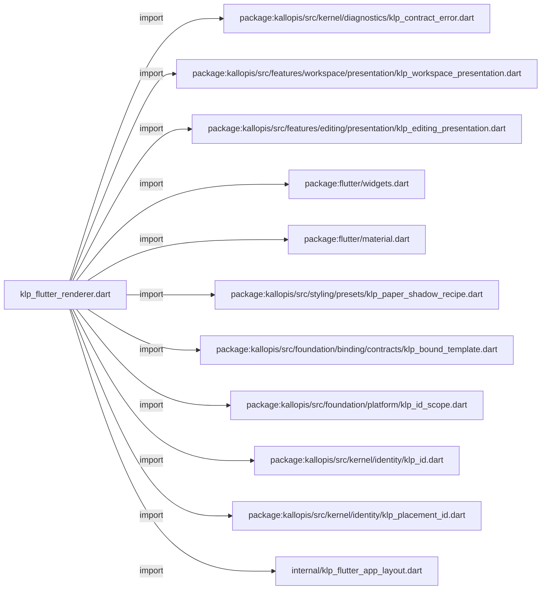
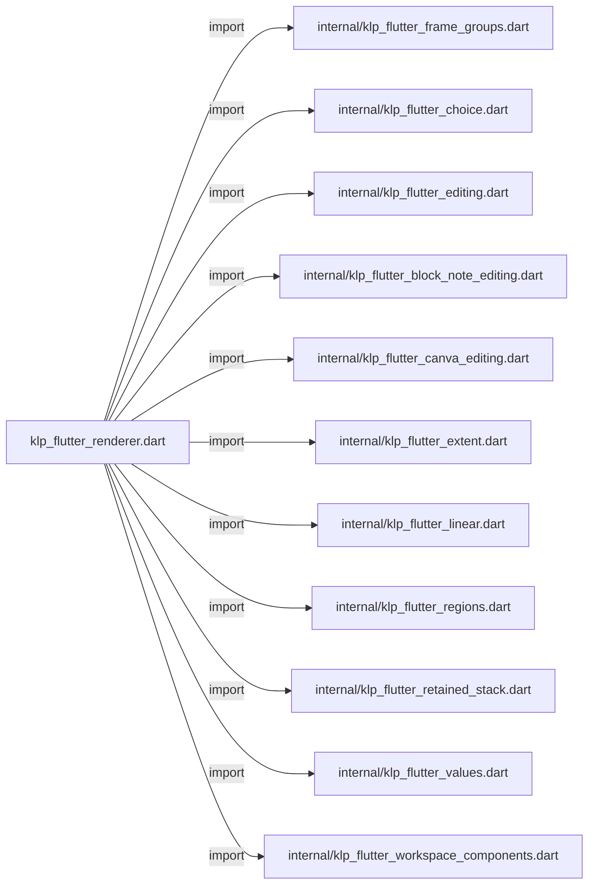
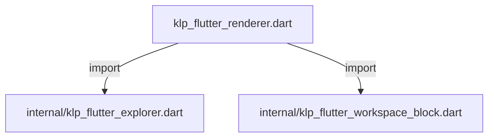
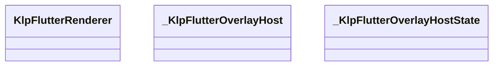
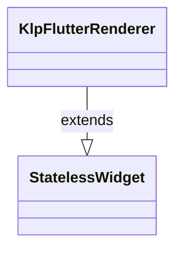
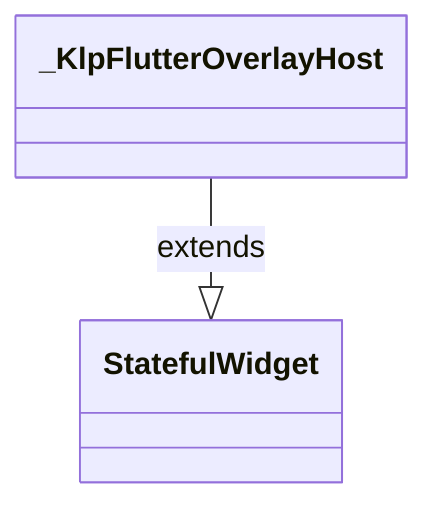
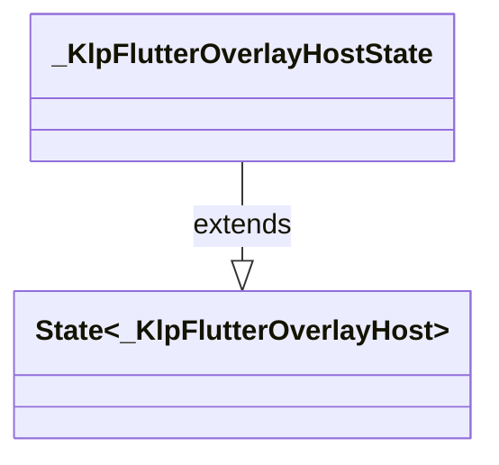

# klp_flutter_renderer.dart：直接依賴與宣告架構

[回到目錄](README.md) · [來源檔案](../../../../../lib/src/rendering/flutter/klp_flutter_renderer.dart)

## 範圍

核心是 `lib/src/rendering/flutter/klp_flutter_renderer.dart`。主要視角為該檔案明寫的 import／export／part；輔助視角為本檔宣告及 extends／implements／with／on 關係。只展開一層外部邊界。

## 直接依賴圖

## 依賴證據

| 關係 | 原始 directive | 來源 |
|---|---|---|
| import | <code>import &#x27;package:kallopis/src/kernel/diagnostics/klp_contract_error.dart&#x27;;</code> | [lib/src/rendering/flutter/klp_flutter_renderer.dart:1](../../../../../lib/src/rendering/flutter/klp_flutter_renderer.dart#L1) |
| import | <code>import &#x27;package:kallopis/src/features/workspace/presentation/klp_workspace_presentation.dart&#x27;;</code> | [lib/src/rendering/flutter/klp_flutter_renderer.dart:2](../../../../../lib/src/rendering/flutter/klp_flutter_renderer.dart#L2) |
| import | <code>import &#x27;package:kallopis/src/features/editing/presentation/klp_editing_presentation.dart&#x27;;</code> | [lib/src/rendering/flutter/klp_flutter_renderer.dart:3](../../../../../lib/src/rendering/flutter/klp_flutter_renderer.dart#L3) |
| import | <code>import &#x27;package:flutter/widgets.dart&#x27;;</code> | [lib/src/rendering/flutter/klp_flutter_renderer.dart:4](../../../../../lib/src/rendering/flutter/klp_flutter_renderer.dart#L4) |
| import | <code>import &#x27;package:flutter/material.dart&#x27; show DefaultMaterialLocalizations, PageRouteBuilder;</code> | [lib/src/rendering/flutter/klp_flutter_renderer.dart:5](../../../../../lib/src/rendering/flutter/klp_flutter_renderer.dart#L5) |
| import | <code>import &#x27;package:kallopis/src/styling/presets/klp_paper_shadow_recipe.dart&#x27;;</code> | [lib/src/rendering/flutter/klp_flutter_renderer.dart:6](../../../../../lib/src/rendering/flutter/klp_flutter_renderer.dart#L6) |
| import | <code>import &#x27;package:kallopis/src/foundation/binding/contracts/klp_bound_template.dart&#x27;;</code> | [lib/src/rendering/flutter/klp_flutter_renderer.dart:8](../../../../../lib/src/rendering/flutter/klp_flutter_renderer.dart#L8) |
| import | <code>import &#x27;package:kallopis/src/foundation/platform/klp_id_scope.dart&#x27;;</code> | [lib/src/rendering/flutter/klp_flutter_renderer.dart:9](../../../../../lib/src/rendering/flutter/klp_flutter_renderer.dart#L9) |
| import | <code>import &#x27;package:kallopis/src/kernel/identity/klp_id.dart&#x27;;</code> | [lib/src/rendering/flutter/klp_flutter_renderer.dart:10](../../../../../lib/src/rendering/flutter/klp_flutter_renderer.dart#L10) |
| import | <code>import &#x27;package:kallopis/src/kernel/identity/klp_placement_id.dart&#x27;;</code> | [lib/src/rendering/flutter/klp_flutter_renderer.dart:11](../../../../../lib/src/rendering/flutter/klp_flutter_renderer.dart#L11) |
| import | <code>import &#x27;internal/klp_flutter_app_layout.dart&#x27;;</code> | [lib/src/rendering/flutter/klp_flutter_renderer.dart:12](../../../../../lib/src/rendering/flutter/klp_flutter_renderer.dart#L12) |
| import | <code>import &#x27;internal/klp_flutter_frame_groups.dart&#x27;;</code> | [lib/src/rendering/flutter/klp_flutter_renderer.dart:13](../../../../../lib/src/rendering/flutter/klp_flutter_renderer.dart#L13) |
| import | <code>import &#x27;internal/klp_flutter_choice.dart&#x27;;</code> | [lib/src/rendering/flutter/klp_flutter_renderer.dart:14](../../../../../lib/src/rendering/flutter/klp_flutter_renderer.dart#L14) |
| import | <code>import &#x27;internal/klp_flutter_editing.dart&#x27;;</code> | [lib/src/rendering/flutter/klp_flutter_renderer.dart:15](../../../../../lib/src/rendering/flutter/klp_flutter_renderer.dart#L15) |
| import | <code>import &#x27;internal/klp_flutter_block_note_editing.dart&#x27;;</code> | [lib/src/rendering/flutter/klp_flutter_renderer.dart:16](../../../../../lib/src/rendering/flutter/klp_flutter_renderer.dart#L16) |
| import | <code>import &#x27;internal/klp_flutter_canva_editing.dart&#x27;;</code> | [lib/src/rendering/flutter/klp_flutter_renderer.dart:17](../../../../../lib/src/rendering/flutter/klp_flutter_renderer.dart#L17) |
| import | <code>import &#x27;internal/klp_flutter_extent.dart&#x27;;</code> | [lib/src/rendering/flutter/klp_flutter_renderer.dart:18](../../../../../lib/src/rendering/flutter/klp_flutter_renderer.dart#L18) |
| import | <code>import &#x27;internal/klp_flutter_linear.dart&#x27;;</code> | [lib/src/rendering/flutter/klp_flutter_renderer.dart:19](../../../../../lib/src/rendering/flutter/klp_flutter_renderer.dart#L19) |
| import | <code>import &#x27;internal/klp_flutter_regions.dart&#x27;;</code> | [lib/src/rendering/flutter/klp_flutter_renderer.dart:20](../../../../../lib/src/rendering/flutter/klp_flutter_renderer.dart#L20) |
| import | <code>import &#x27;internal/klp_flutter_retained_stack.dart&#x27;;</code> | [lib/src/rendering/flutter/klp_flutter_renderer.dart:21](../../../../../lib/src/rendering/flutter/klp_flutter_renderer.dart#L21) |
| import | <code>import &#x27;internal/klp_flutter_values.dart&#x27;;</code> | [lib/src/rendering/flutter/klp_flutter_renderer.dart:22](../../../../../lib/src/rendering/flutter/klp_flutter_renderer.dart#L22) |
| import | <code>import &#x27;internal/klp_flutter_workspace_components.dart&#x27;;</code> | [lib/src/rendering/flutter/klp_flutter_renderer.dart:23](../../../../../lib/src/rendering/flutter/klp_flutter_renderer.dart#L23) |
| import | <code>import &#x27;internal/klp_flutter_explorer.dart&#x27;;</code> | [lib/src/rendering/flutter/klp_flutter_renderer.dart:24](../../../../../lib/src/rendering/flutter/klp_flutter_renderer.dart#L24) |
| import | <code>import &#x27;internal/klp_flutter_workspace_block.dart&#x27;;</code> | [lib/src/rendering/flutter/klp_flutter_renderer.dart:25](../../../../../lib/src/rendering/flutter/klp_flutter_renderer.dart#L25) |

## 宣告關係圖

本組節點是本檔宣告；沒有箭頭的宣告未在此圖主張互相依賴。

## 宣告與成員證據

成員包含 public 與 private；簽章取自來源，省略函式本體與欄位初始值。`(inferred)` 表示來源未明寫型別；建構子只顯示參數部分，不含初始化列表。

### KlpFlutterRenderer

ClassDeclaration · public · [lib/src/rendering/flutter/klp_flutter_renderer.dart:27](../../../../../lib/src/rendering/flutter/klp_flutter_renderer.dart#L27)

<code>final class KlpFlutterRenderer extends StatelessWidget</code>

來源註解摘要：唯一封閉的 Flutter 呈現分派；不接受消費端 Widget 或 builder。

- `extends` → <code>StatelessWidget</code>：[lib/src/rendering/flutter/klp_flutter_renderer.dart:28](../../../../../lib/src/rendering/flutter/klp_flutter_renderer.dart#L28)

| 成員 | 可見性 | 簽章／型別 | 來源註解摘要 | 證據 |
|---|---|---|---|---|
| field <code>content</code> | public | <code>final KlpBoundTemplate content</code> |  | [lib/src/rendering/flutter/klp_flutter_renderer.dart:29](../../../../../lib/src/rendering/flutter/klp_flutter_renderer.dart#L29) |
| constructor <code>KlpFlutterRenderer</code> | public | <code>KlpFlutterRenderer({required this.content, Key? key})</code> |  | [lib/src/rendering/flutter/klp_flutter_renderer.dart:31](../../../../../lib/src/rendering/flutter/klp_flutter_renderer.dart#L31) |
| method <code>_placementKey</code> | private | <code>static Key? _placementKey(KlpBoundTemplate content)</code> |  | [lib/src/rendering/flutter/klp_flutter_renderer.dart:34](../../../../../lib/src/rendering/flutter/klp_flutter_renderer.dart#L34) |
| method <code>build</code> | public | <code>Widget build(BuildContext context)</code> |  | [lib/src/rendering/flutter/klp_flutter_renderer.dart:40](../../../../../lib/src/rendering/flutter/klp_flutter_renderer.dart#L40) |
| method <code>_surface</code> | private | <code>Widget _surface(KlpBoundSurface value)</code> |  | [lib/src/rendering/flutter/klp_flutter_renderer.dart:87](../../../../../lib/src/rendering/flutter/klp_flutter_renderer.dart#L87) |
| method <code>_scopeId</code> | private | <code>KlpId _scopeId(KlpPlacementId placement)</code> |  | [lib/src/rendering/flutter/klp_flutter_renderer.dart:119](../../../../../lib/src/rendering/flutter/klp_flutter_renderer.dart#L119) |

### _KlpFlutterOverlayHost

ClassDeclaration · private · [lib/src/rendering/flutter/klp_flutter_renderer.dart:128](../../../../../lib/src/rendering/flutter/klp_flutter_renderer.dart#L128)

<code>final class _KlpFlutterOverlayHost extends StatefulWidget</code>

來源註解摘要：由完整畫面持有浮層，讓選單、對話框與拖曳回饋不受局部元件邊界裁切。

- `extends` → <code>StatefulWidget</code>：[lib/src/rendering/flutter/klp_flutter_renderer.dart:129](../../../../../lib/src/rendering/flutter/klp_flutter_renderer.dart#L129)

| 成員 | 可見性 | 簽章／型別 | 來源註解摘要 | 證據 |
|---|---|---|---|---|
| field <code>child</code> | public | <code>final Widget child</code> |  | [lib/src/rendering/flutter/klp_flutter_renderer.dart:130](../../../../../lib/src/rendering/flutter/klp_flutter_renderer.dart#L130) |
| constructor <code>_KlpFlutterOverlayHost</code> | private | <code>const _KlpFlutterOverlayHost({required this.child})</code> |  | [lib/src/rendering/flutter/klp_flutter_renderer.dart:131](../../../../../lib/src/rendering/flutter/klp_flutter_renderer.dart#L131) |
| method <code>createState</code> | public | <code>State&lt;_KlpFlutterOverlayHost&gt; createState()</code> |  | [lib/src/rendering/flutter/klp_flutter_renderer.dart:132](../../../../../lib/src/rendering/flutter/klp_flutter_renderer.dart#L132) |

### _KlpFlutterOverlayHostState

ClassDeclaration · private · [lib/src/rendering/flutter/klp_flutter_renderer.dart:136](../../../../../lib/src/rendering/flutter/klp_flutter_renderer.dart#L136)

<code>final class _KlpFlutterOverlayHostState extends State&lt;_KlpFlutterOverlayHost&gt;</code>

- `extends` → <code>State&lt;_KlpFlutterOverlayHost&gt;</code>：[lib/src/rendering/flutter/klp_flutter_renderer.dart:136](../../../../../lib/src/rendering/flutter/klp_flutter_renderer.dart#L136)

| 成員 | 可見性 | 簽章／型別 | 來源註解摘要 | 證據 |
|---|---|---|---|---|
| field <code>_content</code> | private | <code>late final (inferred) _content</code> |  | [lib/src/rendering/flutter/klp_flutter_renderer.dart:137](../../../../../lib/src/rendering/flutter/klp_flutter_renderer.dart#L137) |
| method <code>didUpdateWidget</code> | public | <code>void didUpdateWidget(_KlpFlutterOverlayHost oldWidget)</code> |  | [lib/src/rendering/flutter/klp_flutter_renderer.dart:138](../../../../../lib/src/rendering/flutter/klp_flutter_renderer.dart#L138) |
| method <code>dispose</code> | public | <code>void dispose()</code> |  | [lib/src/rendering/flutter/klp_flutter_renderer.dart:143](../../../../../lib/src/rendering/flutter/klp_flutter_renderer.dart#L143) |
| method <code>build</code> | public | <code>Widget build(BuildContext context)</code> |  | [lib/src/rendering/flutter/klp_flutter_renderer.dart:148](../../../../../lib/src/rendering/flutter/klp_flutter_renderer.dart#L148) |

## 閱讀說明與限制

箭頭只表示來源明寫的靜態關係；import 不等於呼叫。未分析動態呼叫、欄位的實際物件擁有權、狀態轉移或渲染流程；型別未進行語意解析，繼承目標保留原始型別拼寫。public／private 依 Dart 名稱前綴判斷；public 宣告不代表已由 `lib/kallopis.dart` 匯出。

本頁由 `tool/architecture_atlas` 產生；編輯來源或生成工具後重新產生，避免手改本頁。
