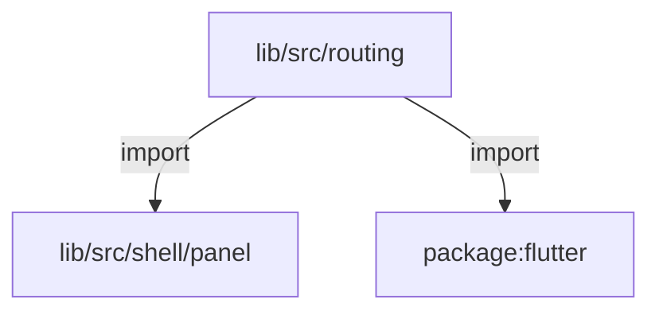
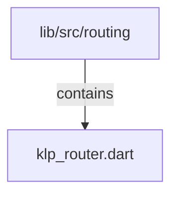

# lib/src/routing：架構分析入口

[上一層](../README.md)

## 範圍

閱讀 `lib/src/routing` 的直接子目錄與 Dart 檔案。結構圖表示實際檔案包含關係；依賴圖表示本層檔案明寫的 directives。每個檔案頁另列直接依賴、宣告、欄位、方法、建構子及行號證據。

## 模組閱讀重點

## 分析入口

`routing/` 的單一檔案定義 KlpRoute、KlpRouter、scope 與 outlet。Router 維護路由 id 表與歷史，透過 ChangeNotifier 通知子樹；Outlet 直接呼叫目前 route 的 builder。此處不是 Flutter Navigator 的轉場配置，也沒有內建產品目的地。

| 想查的問題 | 符號與來源 |
| --- | --- |
| 目的地包含什麼？ | KlpRoute — `lib/src/routing/klp_router.dart:8` |
| go／返回／重置如何更新？ | KlpRouter.go／goBack／reset — `lib/src/routing/klp_router.dart:111`、`lib/src/routing/klp_router.dart:119`、`lib/src/routing/klp_router.dart:127` |
| 子樹如何取得 router？ | KlpRouterScope.of — `lib/src/routing/klp_router.dart:161` |
| 實際頁面如何建構？ | KlpRouterOutlet.build — `lib/src/routing/klp_router.dart:185` |

重要關係：

- `KlpRouter.go` → history 更新與 `notifyListeners`：未知 id 拋錯，同一 id 不重複入列（`lib/src/routing/klp_router.dart:111`）。
- `KlpRouterScope` → `InheritedNotifier<KlpRouter>`：以 notifier 將變更提供給相依子樹（`lib/src/routing/klp_router.dart:154`）。
- `KlpRouterOutlet.build` → `router.current.builder(context)`：直接呼叫目的地 builder（`lib/src/routing/klp_router.dart:186`）。

此目錄無巢狀子目錄；import 圖只有型別依賴，不能代替 go → 通知 → 重建的行為閱讀。

## 本層直接依賴圖

箭頭以本層 Dart 檔案明寫的 directive 彙總到目標所在目錄或外部套件邊界；不遞迴將子目錄依賴算入本層。相同目標的不同 directive 類型分開計數。

| 目標邊界 | 關係 | directive 數 | 第一筆來源證據 |
|---|---|---|---|
| <code>lib/src/shell/panel</code> | import | 1 | [lib/src/routing/klp_router.dart:3](../../../../lib/src/routing/klp_router.dart#L3) |
| <code>package:flutter</code> | import | 1 | [lib/src/routing/klp_router.dart:1](../../../../lib/src/routing/klp_router.dart#L1) |

## 目錄結構圖

## 子目錄

| 目錄 | 導航 | 來源證據 |
|---|---|---|
| 無 | 目前沒有下一層目錄 | — |

## 本層檔案

| 檔案 | 宣告 | 細節 | 來源證據 |
|---|---|---|---|
| `klp_router.dart` | KlpPanelLayoutBuilder, KlpRoute, KlpRouteNotFound, KlpRouter, KlpRouterScope, KlpRouterOutlet, KlpRouterContext | [架構與 API](klp_router.md) | [lib/src/routing/klp_router.dart:1](../../../../lib/src/routing/klp_router.dart#L1) |

## 閱讀說明

箭頭只表示來源明寫的靜態關係；import 不等於呼叫。未分析動態呼叫、欄位的實際物件擁有權、狀態轉移或渲染流程；型別未進行語意解析，繼承目標保留原始型別拼寫。public／private 依 Dart 名稱前綴判斷；public 宣告不代表已由 `lib/kallopis.dart` 匯出。

本頁的目錄與檔案由來源清冊產生；`manifest.json` 位於本圖集根目錄，可核對 SHA-256 與覆蓋數。人工模組摘要存於 `tool/architecture_atlas/briefs/`，重新生成時保留。
