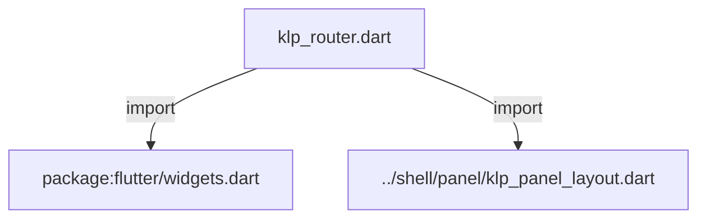
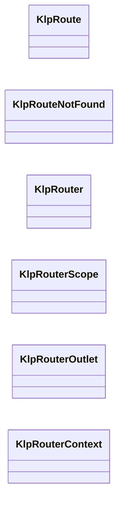
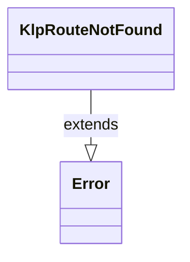
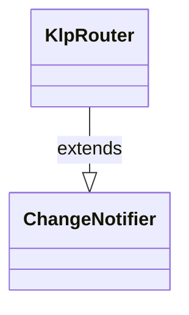
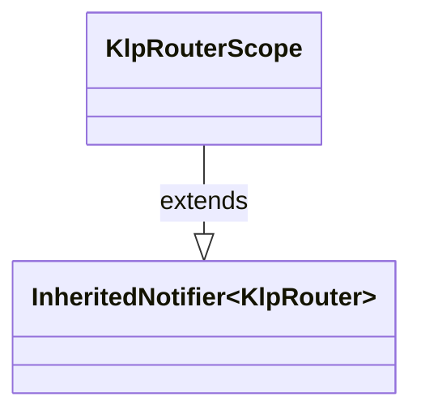
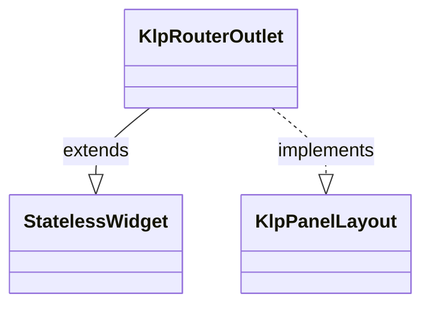
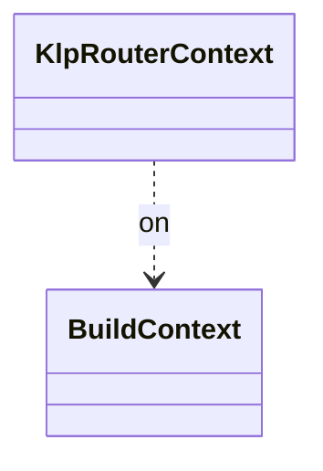

# klp_router.dart：直接依賴與宣告架構

[回到目錄](README.md) · [來源檔案](../../../../lib/src/routing/klp_router.dart)

## 範圍

核心是 `lib/src/routing/klp_router.dart`。主要視角為該檔案明寫的 import／export／part；輔助視角為本檔宣告及 extends／implements／with／on 關係。只展開一層外部邊界。

## 直接依賴圖



## 依賴證據

| 關係 | 原始 directive | 來源 |
|---|---|---|
| import | <code>import &#x27;package:flutter/widgets.dart&#x27;;</code> | [lib/src/routing/klp_router.dart:1](../../../../lib/src/routing/klp_router.dart#L1) |
| import | <code>import &#x27;../shell/panel/klp_panel_layout.dart&#x27;;</code> | [lib/src/routing/klp_router.dart:3](../../../../lib/src/routing/klp_router.dart#L3) |

## 宣告關係圖

本組節點是本檔宣告；沒有箭頭的宣告未在此圖主張互相依賴。














## 宣告與成員證據

成員包含 public 與 private；簽章取自來源，省略函式本體與欄位初始值。`(inferred)` 表示來源未明寫型別；建構子只顯示參數部分，不含初始化列表。

### KlpPanelLayoutBuilder

GenericTypeAlias · public · [lib/src/routing/klp_router.dart:5](../../../../lib/src/routing/klp_router.dart#L5)

<code>typedef KlpPanelLayoutBuilder = KlpPanelLayout Function(BuildContext context);</code>


### KlpRoute

ClassDeclaration · public · [lib/src/routing/klp_router.dart:7](../../../../lib/src/routing/klp_router.dart#L7)

<code>class KlpRoute</code>

來源註解摘要：一個可被切換到的目的地。 Kallopis **不知道**有哪些目的地存在，也不解讀 [data]——目的地是產品的決定， 這裡只保存產品給的東西並在切換時把它交還。


| 成員 | 可見性 | 簽章／型別 | 來源註解摘要 | 證據 |
|---|---|---|---|---|
| constructor <code>KlpRoute</code> | public | <code>const KlpRoute({required this.id, required this.builder, this.data})</code> |  | [lib/src/routing/klp_router.dart:13](../../../../lib/src/routing/klp_router.dart#L13) |
| field <code>id</code> | public | <code>final String id</code> | 產品自訂的識別字串。庫不規定格式，也不預設任何值。 | [lib/src/routing/klp_router.dart:16](../../../../lib/src/routing/klp_router.dart#L16) |
| field <code>builder</code> | public | <code>final KlpPanelLayoutBuilder builder</code> |  | [lib/src/routing/klp_router.dart:18](../../../../lib/src/routing/klp_router.dart#L18) |
| field <code>data</code> | public | <code>final Object? data</code> | 產品要附掛的任意資料（顯示名稱、圖示、權限旗標……）。 型別是 `Object?` 而不是某個具名結構，因為一旦庫定義了「路由該有標題和圖示」， 它就開始替產品決定導覽長什麼樣——那屬於產品外殼，不屬於視覺層。 | [lib/src/routing/klp_router.dart:24](../../../../lib/src/routing/klp_router.dart#L24) |
| method <code>==</code> | public | <code>bool operator ==(Object other)</code> |  | [lib/src/routing/klp_router.dart:26](../../../../lib/src/routing/klp_router.dart#L26) |
| getter <code>hashCode</code> | public | <code>int get hashCode</code> |  | [lib/src/routing/klp_router.dart:34](../../../../lib/src/routing/klp_router.dart#L34) |

### KlpRouteNotFound

ClassDeclaration · public · [lib/src/routing/klp_router.dart:38](../../../../lib/src/routing/klp_router.dart#L38)

<code>class KlpRouteNotFound extends Error</code>

來源註解摘要：找不到目的地時拋出。 刻意拋錯而不是回退到某個預設頁：切換到不存在的目的地是**程式錯誤**， 靜默停在原地會讓它一路活到使用者手上，而且沒有任何徵兆。

- `extends` → <code>Error</code>：[lib/src/routing/klp_router.dart:42](../../../../lib/src/routing/klp_router.dart#L42)

| 成員 | 可見性 | 簽章／型別 | 來源註解摘要 | 證據 |
|---|---|---|---|---|
| constructor <code>KlpRouteNotFound</code> | public | <code>KlpRouteNotFound(this.id, this.known)</code> |  | [lib/src/routing/klp_router.dart:43](../../../../lib/src/routing/klp_router.dart#L43) |
| field <code>id</code> | public | <code>final String id</code> |  | [lib/src/routing/klp_router.dart:45](../../../../lib/src/routing/klp_router.dart#L45) |
| field <code>known</code> | public | <code>final Iterable&lt;String&gt; known</code> |  | [lib/src/routing/klp_router.dart:46](../../../../lib/src/routing/klp_router.dart#L46) |
| method <code>toString</code> | public | <code>String toString()</code> |  | [lib/src/routing/klp_router.dart:48](../../../../lib/src/routing/klp_router.dart#L48) |

### KlpRouter

ClassDeclaration · public · [lib/src/routing/klp_router.dart:54](../../../../lib/src/routing/klp_router.dart#L54)

<code>class KlpRouter extends ChangeNotifier</code>

來源註解摘要：目的地的登記簿與切換器。**只負責分發。** 它不知道有哪些頁、不預設入口、不決定階層、不解析網址、不做深層連結—— 那些都是產品外殼的決定，屬於 Kallopis 的拒絕清單。這裡提供的是**機制**： 產品註冊自己的目的地，然後要求切換。 ```dart final router = KlpRouter( routes: [ KlpRoute( id: &#x27;notes&#x27;, builder: (_) =&gt; KlpPanelFrame(content: const NotesPage()), ), KlpRoute( id: &#x27;search&#x27;, builder: (_) =&gt; KlpPanelFrame(content: const SearchPage()), ), ], initialId: &#x27;notes&#x27;, ); KlpRouterScope( router: router, child: const KlpRouterOutlet(), ) ```

- `extends` → <code>ChangeNotifier</code>：[lib/src/routing/klp_router.dart:80](../../../../lib/src/routing/klp_router.dart#L80)

| 成員 | 可見性 | 簽章／型別 | 來源註解摘要 | 證據 |
|---|---|---|---|---|
| constructor <code>KlpRouter</code> | public | <code>KlpRouter({required List&lt;KlpRoute&gt; routes, required String initialId})</code> | [initialId] 必填且必須已註冊——沒有「未定義的目前位置」這種狀態。 | [lib/src/routing/klp_router.dart:81](../../../../lib/src/routing/klp_router.dart#L81) |
| field <code>_routes</code> | private | <code>final Map&lt;String, KlpRoute&gt; _routes</code> |  | [lib/src/routing/klp_router.dart:93](../../../../lib/src/routing/klp_router.dart#L93) |
| field <code>_history</code> | private | <code>late List&lt;String&gt; _history</code> |  | [lib/src/routing/klp_router.dart:94](../../../../lib/src/routing/klp_router.dart#L94) |
| method <code>_duplicateIds</code> | private | <code>static Iterable&lt;String&gt; _duplicateIds(List&lt;KlpRoute&gt; routes)</code> |  | [lib/src/routing/klp_router.dart:96](../../../../lib/src/routing/klp_router.dart#L96) |
| getter <code>current</code> | public | <code>KlpRoute get current</code> | 目前所在的目的地。永遠有值。 | [lib/src/routing/klp_router.dart:101](../../../../lib/src/routing/klp_router.dart#L101) |
| getter <code>currentId</code> | public | <code>String get currentId</code> |  | [lib/src/routing/klp_router.dart:104](../../../../lib/src/routing/klp_router.dart#L104) |
| getter <code>ids</code> | public | <code>Iterable&lt;String&gt; get ids</code> | 已註冊的 id，依註冊順序。產品要畫導覽列時讀這個。 | [lib/src/routing/klp_router.dart:106](../../../../lib/src/routing/klp_router.dart#L106) |
| getter <code>routes</code> | public | <code>Iterable&lt;KlpRoute&gt; get routes</code> |  | [lib/src/routing/klp_router.dart:109](../../../../lib/src/routing/klp_router.dart#L109) |
| method <code>contains</code> | public | <code>bool contains(String id)</code> |  | [lib/src/routing/klp_router.dart:111](../../../../lib/src/routing/klp_router.dart#L111) |
| method <code>find</code> | public | <code>KlpRoute? find(String id)</code> |  | [lib/src/routing/klp_router.dart:113](../../../../lib/src/routing/klp_router.dart#L113) |
| getter <code>canGoBack</code> | public | <code>bool get canGoBack</code> | 回上一步是否可行。 | [lib/src/routing/klp_router.dart:115](../../../../lib/src/routing/klp_router.dart#L115) |
| method <code>go</code> | public | <code>void go(String id)</code> | 切換到 [id]。未註冊時拋 [KlpRouteNotFound]。 切到目前所在的目的地是 no-op，不會在歷史裡堆出重複項。 | [lib/src/routing/klp_router.dart:118](../../../../lib/src/routing/klp_router.dart#L118) |
| method <code>goBack</code> | public | <code>bool goBack()</code> | 回上一步。已在起點時是 no-op，回傳 `false` 讓呼叫端知道沒有動。 | [lib/src/routing/klp_router.dart:128](../../../../lib/src/routing/klp_router.dart#L128) |
| method <code>reset</code> | public | <code>void reset(String id)</code> | 切換並清空歷史。用於「回到起點」這類語意。 | [lib/src/routing/klp_router.dart:136](../../../../lib/src/routing/klp_router.dart#L136) |
| method <code>register</code> | public | <code>void register(KlpRoute route)</code> | 動態註冊。**已存在的 id 會拋錯而不是覆蓋**——覆蓋是靜默的行為改變。 | [lib/src/routing/klp_router.dart:143](../../../../lib/src/routing/klp_router.dart#L143) |
| method <code>unregister</code> | public | <code>void unregister(String id)</code> | 移除註冊。不能移除目前所在或仍在歷史中的目的地。 | [lib/src/routing/klp_router.dart:152](../../../../lib/src/routing/klp_router.dart#L152) |

### KlpRouterScope

ClassDeclaration · public · [lib/src/routing/klp_router.dart:163](../../../../lib/src/routing/klp_router.dart#L163)

<code>class KlpRouterScope extends InheritedNotifier&lt;KlpRouter&gt;</code>

來源註解摘要：把 [KlpRouter] 供給子樹。

- `extends` → <code>InheritedNotifier&lt;KlpRouter&gt;</code>：[lib/src/routing/klp_router.dart:164](../../../../lib/src/routing/klp_router.dart#L164)

| 成員 | 可見性 | 簽章／型別 | 來源註解摘要 | 證據 |
|---|---|---|---|---|
| constructor <code>KlpRouterScope</code> | public | <code>const KlpRouterScope({ super.key, required KlpRouter router, required super.child, })</code> |  | [lib/src/routing/klp_router.dart:165](../../../../lib/src/routing/klp_router.dart#L165) |
| method <code>of</code> | public | <code>static KlpRouter of(BuildContext context)</code> |  | [lib/src/routing/klp_router.dart:171](../../../../lib/src/routing/klp_router.dart#L171) |
| method <code>maybeOf</code> | public | <code>static KlpRouter? maybeOf(BuildContext context)</code> | 沒有 scope 時回傳 `null` 而不是拋錯，供「有 router 才顯示」的場合使用。 | [lib/src/routing/klp_router.dart:182](../../../../lib/src/routing/klp_router.dart#L182) |

### KlpRouterOutlet

ClassDeclaration · public · [lib/src/routing/klp_router.dart:187](../../../../lib/src/routing/klp_router.dart#L187)

<code>class KlpRouterOutlet extends StatelessWidget implements KlpPanelLayout</code>

來源註解摘要：渲染目前的目的地。 它只做一件事：呼叫 `router.current.builder`。**不做轉場動畫**——轉場屬於產品外殼 的決定（有些頁該滑入，有些該直接換），庫替它決定就等於替所有產品決定。

- `extends` → <code>StatelessWidget</code>：[lib/src/routing/klp_router.dart:191](../../../../lib/src/routing/klp_router.dart#L191)
- `implements` → <code>KlpPanelLayout</code>：[lib/src/routing/klp_router.dart:191](../../../../lib/src/routing/klp_router.dart#L191)

| 成員 | 可見性 | 簽章／型別 | 來源註解摘要 | 證據 |
|---|---|---|---|---|
| constructor <code>KlpRouterOutlet</code> | public | <code>const KlpRouterOutlet({super.key})</code> |  | [lib/src/routing/klp_router.dart:192](../../../../lib/src/routing/klp_router.dart#L192) |
| method <code>build</code> | public | <code>Widget build(BuildContext context)</code> |  | [lib/src/routing/klp_router.dart:194](../../../../lib/src/routing/klp_router.dart#L194) |
| method <code>buildPanelLayout</code> | public | <code>Widget buildPanelLayout(BuildContext context)</code> |  | [lib/src/routing/klp_router.dart:198](../../../../lib/src/routing/klp_router.dart#L198) |

### KlpRouterContext

ExtensionDeclaration · public · [lib/src/routing/klp_router.dart:202](../../../../lib/src/routing/klp_router.dart#L202)

<code>extension KlpRouterContext on BuildContext</code>

- `on` → <code>BuildContext</code>：[lib/src/routing/klp_router.dart:202](../../../../lib/src/routing/klp_router.dart#L202)

| 成員 | 可見性 | 簽章／型別 | 來源註解摘要 | 證據 |
|---|---|---|---|---|
| getter <code>klpRouter</code> | public | <code>KlpRouter get klpRouter</code> |  | [lib/src/routing/klp_router.dart:203](../../../../lib/src/routing/klp_router.dart#L203) |

## 閱讀說明與限制

箭頭只表示來源明寫的靜態關係；import 不等於呼叫。未分析動態呼叫、欄位的實際物件擁有權、狀態轉移或渲染流程；型別未進行語意解析，繼承目標保留原始型別拼寫。public／private 依 Dart 名稱前綴判斷；public 宣告不代表已由 `lib/kallopis.dart` 匯出。

本頁由 `tool/architecture_atlas` 產生；編輯來源或生成工具後重新產生，避免手改本頁。
