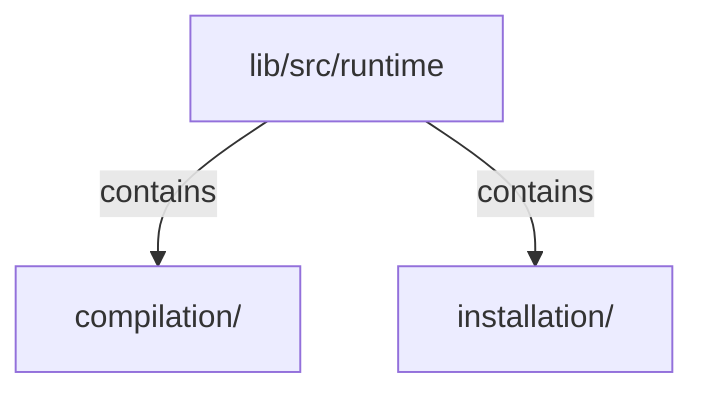

# lib/src/runtime：架構分析入口

[上一層](../README.md)

## 範圍

閱讀 `lib/src/runtime` 的直接子目錄與 Dart 檔案。結構圖表示實際檔案包含關係；依賴圖表示本層檔案明寫的 directives。每個檔案頁另列直接依賴、宣告、欄位、方法、建構子及行號證據。

## 模組閱讀重點

## 分析入口

`installation/internal/klp_installation.dart` 是未公開的放置資源交易核心。registry 完整驗證並產生快照後才建立資源；建立失敗清理新資源並保留舊樹；提交後重用相同位置及定義的資源，再反序清理移除位置。

`klp_default_placement.dart` 擁有一份結構 state 及借用它的 controller；`klp_placement_resource.dart` 約束更新與釋放。`klp_installation_exception.dart` 保存多筆錯誤及交易是否已提交，避免一個清理失敗中斷其餘清理。

`compilation/internal/klp_tree_runtime.dart` 已接通註冊、單次樹擷取、資料投影、資源安裝及呈現快照提交。`KlpNodeAdapter`／`KlpPreparedNode` 是本庫內部擴充介面；先驗證整棵自訂模板樹，再完成所有 prepare，之後才建立或更新資源，最後由子到父產生封閉 bound 模板並加上 `KlpBoundPlacement` 識別。自訂複合元件的已驗證範圍由 prepared 模板嵌入完成子呈現；此核心不依元件型別增加特判，也不引用 application、rail 或 Flutter。

`klp_runtime_frame.dart` 保存已提交內容及操作 lease；提交時撤銷舊畫面的操作資格。準備或建立失敗保留舊畫面；提交後通知錯誤仍發布新畫面並回報。若內部 materialize 違約，清除畫面並回報已提交錯誤，避免舊畫面繼續引用已更動資源。

capture/context、prepared、bound 與 installation 的 map 都以 `KlpPlacementId` 為鍵，不另存 local-id 索引。`klp_scope_boundary_adapter.dart` 將本庫內部作用域節點接入同一資源交易；不同 scope 的同名元件資源分開，重排不改識別，移除只釋放該 scope。Rail 的內部選取也使用完整識別，但 consumer callback 仍收到 local id。

`klp_prepared_activation_policy.dart` 只供內部 prepared 節點限制後代操作。runtime 由父到子建立 lease，再由子到父完成呈現；隱藏 scope 的後代不能因取得目前 frame 的 callback 而繞過停用。限制沿父鏈相交，子層不能重新開啟被祖先停用的操作。

目前由 application session 將 router 的 retained screens、rail、自訂葉元件與巢狀複合元件接入同一 runtime 交易；navigation 的候選堆疊不直接操作個別畫面資源。實際整合驗證見 [重構進度](../../restructure-progress.md)，交易契約見 [導覽交易樣板](../../navigation-transaction-prototype.md)。完整能力相依自動安裝、平台策略及其他功能仍待遷移；相同位置的資源重用不代表任意跨父容器移動時焦點必然保留。此目錄未從公開入口匯出，消費端不能直接建立 runtime 或 installation。

## 本層直接依賴圖

箭頭以本層 Dart 檔案明寫的 directive 彙總到目標所在目錄或外部套件邊界；不遞迴將子目錄依賴算入本層。相同目標的不同 directive 類型分開計數。

本層檔案未宣告跨目錄依賴；子目錄依賴請循下一層入口閱讀。

| 目標邊界 | 關係 | directive 數 | 第一筆來源證據 |
|---|---|---|---|
| 無 | — | 0 | 來源清單見本層檔案 |

## 目錄結構圖

## 子目錄

| 目錄 | 導航 | 來源證據 |
|---|---|---|
| `compilation/` | [架構入口](compilation/README.md) | [來源目錄](../../../../lib/src/runtime/compilation) |
| `installation/` | [架構入口](installation/README.md) | [來源目錄](../../../../lib/src/runtime/installation) |

## 本層檔案

| 檔案 | 宣告 | 細節 | 來源證據 |
|---|---|---|---|
| 無 | 本層沒有 Dart 檔案 | — | — |

## 閱讀說明

箭頭只表示來源明寫的靜態關係；import 不等於呼叫。未分析動態呼叫、欄位的實際物件擁有權、狀態轉移或渲染流程；型別未進行語意解析，繼承目標保留原始型別拼寫。public／private 依 Dart 名稱前綴判斷；public 宣告不代表已由 `lib/kallopis.dart` 匯出。

本頁的目錄與檔案由來源清冊產生；`manifest.json` 位於本圖集根目錄，可核對 SHA-256 與覆蓋數。人工模組摘要存於 `tool/architecture_atlas/briefs/`，重新生成時保留。
