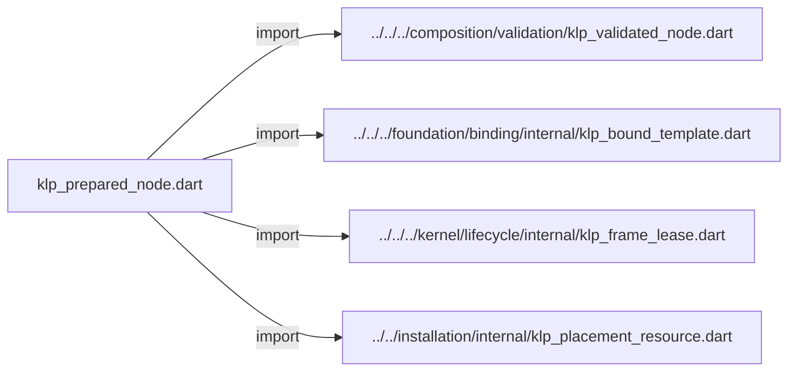

# klp_prepared_node.dart：直接依賴與宣告架構

[回到目錄](README.md) · [來源檔案](../../../../../../lib/src/runtime/compilation/internal/klp_prepared_node.dart)

## 範圍

核心是 `lib/src/runtime/compilation/internal/klp_prepared_node.dart`。主要視角為該檔案明寫的 import／export／part；輔助視角為本檔宣告及 extends／implements／with／on 關係。只展開一層外部邊界。

## 直接依賴圖

## 依賴證據

| 關係 | 原始 directive | 來源 |
|---|---|---|
| import | <code>import &#x27;../../../composition/validation/klp_validated_node.dart&#x27;;</code> | [lib/src/runtime/compilation/internal/klp_prepared_node.dart:1](../../../../../../lib/src/runtime/compilation/internal/klp_prepared_node.dart#L1) |
| import | <code>import &#x27;../../../foundation/binding/internal/klp_bound_template.dart&#x27;;</code> | [lib/src/runtime/compilation/internal/klp_prepared_node.dart:2](../../../../../../lib/src/runtime/compilation/internal/klp_prepared_node.dart#L2) |
| import | <code>import &#x27;../../../kernel/lifecycle/internal/klp_frame_lease.dart&#x27;;</code> | [lib/src/runtime/compilation/internal/klp_prepared_node.dart:3](../../../../../../lib/src/runtime/compilation/internal/klp_prepared_node.dart#L3) |
| import | <code>import &#x27;../../installation/internal/klp_placement_resource.dart&#x27;;</code> | [lib/src/runtime/compilation/internal/klp_prepared_node.dart:4](../../../../../../lib/src/runtime/compilation/internal/klp_prepared_node.dart#L4) |

## 宣告關係圖

本組節點是本檔宣告；沒有箭頭的宣告未在此圖主張互相依賴。

## 宣告與成員證據

成員包含 public 與 private；簽章取自來源，省略函式本體與欄位初始值。`(inferred)` 表示來源未明寫型別；建構子只顯示參數部分，不含初始化列表。

### KlpPreparedNode

ClassDeclaration · public · [lib/src/runtime/compilation/internal/klp_prepared_node.dart:6](../../../../../../lib/src/runtime/compilation/internal/klp_prepared_node.dart#L6)

<code>abstract interface class KlpPreparedNode</code>

來源註解摘要：本庫 adapter 已完成資料及風格檢查後的安裝描述，非外部擴充介面。

| 成員 | 可見性 | 簽章／型別 | 來源註解摘要 | 證據 |
|---|---|---|---|---|
| method <code>createResource</code> | public | <code>KlpPlacementResource createResource(KlpValidatedNode node)</code> |  | [lib/src/runtime/compilation/internal/klp_prepared_node.dart:9](../../../../../../lib/src/runtime/compilation/internal/klp_prepared_node.dart#L9) |
| method <code>materialize</code> | public | <code>KlpBoundTemplate materialize(KlpPlacementResource resource, List&lt;KlpBoundTemplate&gt; children, KlpFrameLease lease)</code> |  | [lib/src/runtime/compilation/internal/klp_prepared_node.dart:10](../../../../../../lib/src/runtime/compilation/internal/klp_prepared_node.dart#L10) |

## 閱讀說明與限制

箭頭只表示來源明寫的靜態關係；import 不等於呼叫。未分析動態呼叫、欄位的實際物件擁有權、狀態轉移或渲染流程；型別未進行語意解析，繼承目標保留原始型別拼寫。public／private 依 Dart 名稱前綴判斷；public 宣告不代表已由 `lib/kallopis.dart` 匯出。

本頁由 `tool/architecture_atlas` 產生；編輯來源或生成工具後重新產生，避免手改本頁。
