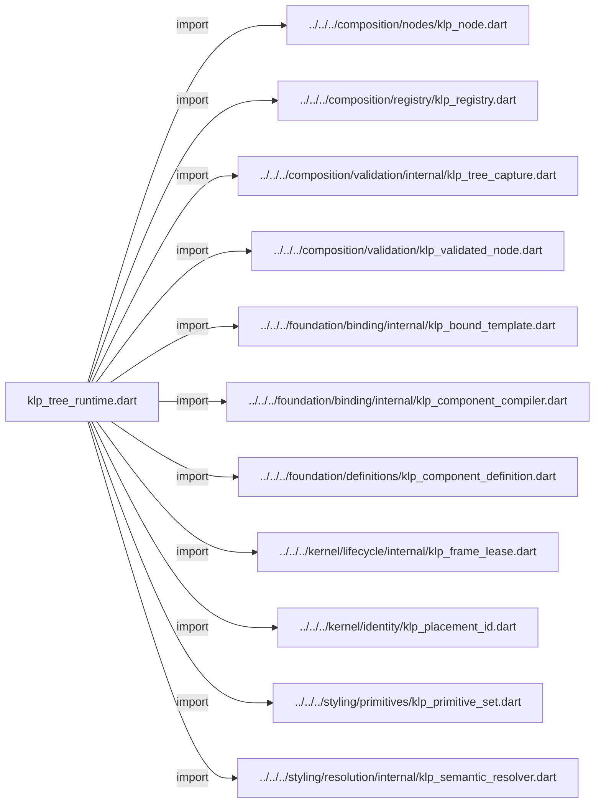
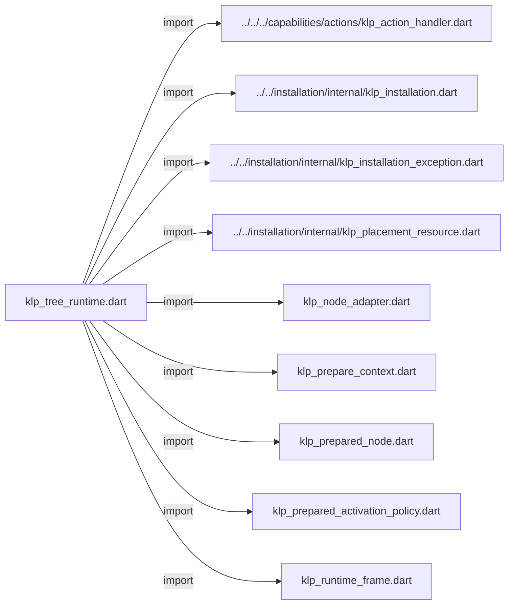

# klp_tree_runtime.dart：直接依賴與宣告架構

[回到目錄](README.md) · [來源檔案](../../../../../../lib/src/runtime/compilation/internal/klp_tree_runtime.dart)

## 範圍

核心是 `lib/src/runtime/compilation/internal/klp_tree_runtime.dart`。主要視角為該檔案明寫的 import／export／part；輔助視角為本檔宣告及 extends／implements／with／on 關係。只展開一層外部邊界。

## 直接依賴圖

## 依賴證據

| 關係 | 原始 directive | 來源 |
|---|---|---|
| import | <code>import &#x27;../../../composition/nodes/klp_node.dart&#x27;;</code> | [lib/src/runtime/compilation/internal/klp_tree_runtime.dart:1](../../../../../../lib/src/runtime/compilation/internal/klp_tree_runtime.dart#L1) |
| import | <code>import &#x27;../../../composition/registry/klp_registry.dart&#x27;;</code> | [lib/src/runtime/compilation/internal/klp_tree_runtime.dart:2](../../../../../../lib/src/runtime/compilation/internal/klp_tree_runtime.dart#L2) |
| import | <code>import &#x27;../../../composition/validation/internal/klp_tree_capture.dart&#x27;;</code> | [lib/src/runtime/compilation/internal/klp_tree_runtime.dart:3](../../../../../../lib/src/runtime/compilation/internal/klp_tree_runtime.dart#L3) |
| import | <code>import &#x27;../../../composition/validation/klp_validated_node.dart&#x27;;</code> | [lib/src/runtime/compilation/internal/klp_tree_runtime.dart:4](../../../../../../lib/src/runtime/compilation/internal/klp_tree_runtime.dart#L4) |
| import | <code>import &#x27;../../../foundation/binding/internal/klp_bound_template.dart&#x27;;</code> | [lib/src/runtime/compilation/internal/klp_tree_runtime.dart:5](../../../../../../lib/src/runtime/compilation/internal/klp_tree_runtime.dart#L5) |
| import | <code>import &#x27;../../../foundation/binding/internal/klp_component_compiler.dart&#x27;;</code> | [lib/src/runtime/compilation/internal/klp_tree_runtime.dart:6](../../../../../../lib/src/runtime/compilation/internal/klp_tree_runtime.dart#L6) |
| import | <code>import &#x27;../../../foundation/definitions/klp_component_definition.dart&#x27;;</code> | [lib/src/runtime/compilation/internal/klp_tree_runtime.dart:7](../../../../../../lib/src/runtime/compilation/internal/klp_tree_runtime.dart#L7) |
| import | <code>import &#x27;../../../kernel/lifecycle/internal/klp_frame_lease.dart&#x27;;</code> | [lib/src/runtime/compilation/internal/klp_tree_runtime.dart:8](../../../../../../lib/src/runtime/compilation/internal/klp_tree_runtime.dart#L8) |
| import | <code>import &#x27;../../../kernel/identity/klp_placement_id.dart&#x27;;</code> | [lib/src/runtime/compilation/internal/klp_tree_runtime.dart:9](../../../../../../lib/src/runtime/compilation/internal/klp_tree_runtime.dart#L9) |
| import | <code>import &#x27;../../../styling/primitives/klp_primitive_set.dart&#x27;;</code> | [lib/src/runtime/compilation/internal/klp_tree_runtime.dart:10](../../../../../../lib/src/runtime/compilation/internal/klp_tree_runtime.dart#L10) |
| import | <code>import &#x27;../../../styling/resolution/internal/klp_semantic_resolver.dart&#x27;;</code> | [lib/src/runtime/compilation/internal/klp_tree_runtime.dart:11](../../../../../../lib/src/runtime/compilation/internal/klp_tree_runtime.dart#L11) |
| import | <code>import &#x27;../../../capabilities/actions/klp_action_handler.dart&#x27;;</code> | [lib/src/runtime/compilation/internal/klp_tree_runtime.dart:12](../../../../../../lib/src/runtime/compilation/internal/klp_tree_runtime.dart#L12) |
| import | <code>import &#x27;../../installation/internal/klp_installation.dart&#x27;;</code> | [lib/src/runtime/compilation/internal/klp_tree_runtime.dart:13](../../../../../../lib/src/runtime/compilation/internal/klp_tree_runtime.dart#L13) |
| import | <code>import &#x27;../../installation/internal/klp_installation_exception.dart&#x27;;</code> | [lib/src/runtime/compilation/internal/klp_tree_runtime.dart:14](../../../../../../lib/src/runtime/compilation/internal/klp_tree_runtime.dart#L14) |
| import | <code>import &#x27;../../installation/internal/klp_placement_resource.dart&#x27;;</code> | [lib/src/runtime/compilation/internal/klp_tree_runtime.dart:15](../../../../../../lib/src/runtime/compilation/internal/klp_tree_runtime.dart#L15) |
| import | <code>import &#x27;klp_node_adapter.dart&#x27;;</code> | [lib/src/runtime/compilation/internal/klp_tree_runtime.dart:16](../../../../../../lib/src/runtime/compilation/internal/klp_tree_runtime.dart#L16) |
| import | <code>import &#x27;klp_prepare_context.dart&#x27;;</code> | [lib/src/runtime/compilation/internal/klp_tree_runtime.dart:17](../../../../../../lib/src/runtime/compilation/internal/klp_tree_runtime.dart#L17) |
| import | <code>import &#x27;klp_prepared_node.dart&#x27;;</code> | [lib/src/runtime/compilation/internal/klp_tree_runtime.dart:18](../../../../../../lib/src/runtime/compilation/internal/klp_tree_runtime.dart#L18) |
| import | <code>import &#x27;klp_prepared_activation_policy.dart&#x27;;</code> | [lib/src/runtime/compilation/internal/klp_tree_runtime.dart:19](../../../../../../lib/src/runtime/compilation/internal/klp_tree_runtime.dart#L19) |
| import | <code>import &#x27;klp_runtime_frame.dart&#x27;;</code> | [lib/src/runtime/compilation/internal/klp_tree_runtime.dart:20](../../../../../../lib/src/runtime/compilation/internal/klp_tree_runtime.dart#L20) |

## 宣告關係圖

本組節點是本檔宣告；沒有箭頭的宣告未在此圖主張互相依賴。

## 宣告與成員證據

成員包含 public 與 private；簽章取自來源，省略函式本體與欄位初始值。`(inferred)` 表示來源未明寫型別；建構子只顯示參數部分，不含初始化列表。

### KlpTreeRuntime

ClassDeclaration · public · [lib/src/runtime/compilation/internal/klp_tree_runtime.dart:22](../../../../../../lib/src/runtime/compilation/internal/klp_tree_runtime.dart#L22)

<code>final class KlpTreeRuntime</code>

來源註解摘要：唯一樹更新流程：驗證、投影、安裝、提交畫面，不認識任何功能型別。

| 成員 | 可見性 | 簽章／型別 | 來源註解摘要 | 證據 |
|---|---|---|---|---|
| field <code>_installation</code> | private | <code>KlpInstallation? _installation</code> |  | [lib/src/runtime/compilation/internal/klp_tree_runtime.dart:25](../../../../../../lib/src/runtime/compilation/internal/klp_tree_runtime.dart#L25) |
| field <code>_pending</code> | private | <code>Map&lt;KlpPlacementId, KlpPreparedNode&gt; _pending</code> |  | [lib/src/runtime/compilation/internal/klp_tree_runtime.dart:26](../../../../../../lib/src/runtime/compilation/internal/klp_tree_runtime.dart#L26) |
| field <code>_frame</code> | private | <code>KlpRuntimeFrame? _frame</code> |  | [lib/src/runtime/compilation/internal/klp_tree_runtime.dart:27](../../../../../../lib/src/runtime/compilation/internal/klp_tree_runtime.dart#L27) |
| field <code>_busy</code> | private | <code>bool _busy</code> |  | [lib/src/runtime/compilation/internal/klp_tree_runtime.dart:28](../../../../../../lib/src/runtime/compilation/internal/klp_tree_runtime.dart#L28) |
| field <code>_disposed</code> | private | <code>bool _disposed</code> |  | [lib/src/runtime/compilation/internal/klp_tree_runtime.dart:29](../../../../../../lib/src/runtime/compilation/internal/klp_tree_runtime.dart#L29) |
| getter <code>frame</code> | public | <code>KlpRuntimeFrame? get frame</code> |  | [lib/src/runtime/compilation/internal/klp_tree_runtime.dart:31](../../../../../../lib/src/runtime/compilation/internal/klp_tree_runtime.dart#L31) |
| getter <code>isDisposed</code> | public | <code>bool get isDisposed</code> |  | [lib/src/runtime/compilation/internal/klp_tree_runtime.dart:32](../../../../../../lib/src/runtime/compilation/internal/klp_tree_runtime.dart#L32) |
| getter <code>resources</code> | public | <code>Map&lt;KlpPlacementId, KlpPlacementResource&gt; get resources</code> |  | [lib/src/runtime/compilation/internal/klp_tree_runtime.dart:33](../../../../../../lib/src/runtime/compilation/internal/klp_tree_runtime.dart#L33) |
| method <code>update</code> | public | <code>void update({ required KlpNode root, required Iterable&lt;KlpNodeAdapter&gt; adapters, required Iterable&lt;KlpComponentDefinition&lt;KlpNode&gt;&gt; components, required KlpPrimitiveSet primitives, KlpActionHandler? actionHandler, })</code> |  | [lib/src/runtime/compilation/internal/klp_tree_runtime.dart:35](../../../../../../lib/src/runtime/compilation/internal/klp_tree_runtime.dart#L35) |
| method <code>dispose</code> | public | <code>void dispose()</code> |  | [lib/src/runtime/compilation/internal/klp_tree_runtime.dart:121](../../../../../../lib/src/runtime/compilation/internal/klp_tree_runtime.dart#L121) |
| method <code>_create</code> | private | <code>KlpPlacementResource _create(KlpValidatedNode node)</code> |  | [lib/src/runtime/compilation/internal/klp_tree_runtime.dart:136](../../../../../../lib/src/runtime/compilation/internal/klp_tree_runtime.dart#L136) |
| method <code>_enter</code> | private | <code>void _enter()</code> |  | [lib/src/runtime/compilation/internal/klp_tree_runtime.dart:138](../../../../../../lib/src/runtime/compilation/internal/klp_tree_runtime.dart#L138) |

## 閱讀說明與限制

箭頭只表示來源明寫的靜態關係；import 不等於呼叫。未分析動態呼叫、欄位的實際物件擁有權、狀態轉移或渲染流程；型別未進行語意解析，繼承目標保留原始型別拼寫。public／private 依 Dart 名稱前綴判斷；public 宣告不代表已由 `lib/kallopis.dart` 匯出。

本頁由 `tool/architecture_atlas` 產生；編輯來源或生成工具後重新產生，避免手改本頁。
