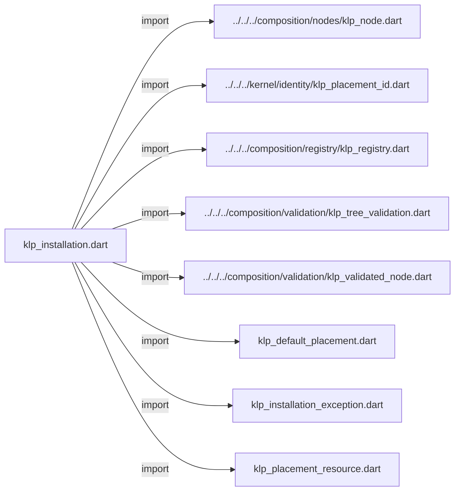

# klp_installation.dart：直接依賴與宣告架構

[回到目錄](README.md) · [來源檔案](../../../../../../lib/src/runtime/installation/internal/klp_installation.dart)

## 範圍

核心是 `lib/src/runtime/installation/internal/klp_installation.dart`。主要視角為該檔案明寫的 import／export／part；輔助視角為本檔宣告及 extends／implements／with／on 關係。只展開一層外部邊界。

## 直接依賴圖

## 依賴證據

| 關係 | 原始 directive | 來源 |
|---|---|---|
| import | <code>import &#x27;../../../composition/nodes/klp_node.dart&#x27;;</code> | [lib/src/runtime/installation/internal/klp_installation.dart:1](../../../../../../lib/src/runtime/installation/internal/klp_installation.dart#L1) |
| import | <code>import &#x27;../../../kernel/identity/klp_placement_id.dart&#x27;;</code> | [lib/src/runtime/installation/internal/klp_installation.dart:2](../../../../../../lib/src/runtime/installation/internal/klp_installation.dart#L2) |
| import | <code>import &#x27;../../../composition/registry/klp_registry.dart&#x27;;</code> | [lib/src/runtime/installation/internal/klp_installation.dart:3](../../../../../../lib/src/runtime/installation/internal/klp_installation.dart#L3) |
| import | <code>import &#x27;../../../composition/validation/klp_tree_validation.dart&#x27;;</code> | [lib/src/runtime/installation/internal/klp_installation.dart:4](../../../../../../lib/src/runtime/installation/internal/klp_installation.dart#L4) |
| import | <code>import &#x27;../../../composition/validation/klp_validated_node.dart&#x27;;</code> | [lib/src/runtime/installation/internal/klp_installation.dart:5](../../../../../../lib/src/runtime/installation/internal/klp_installation.dart#L5) |
| import | <code>import &#x27;klp_default_placement.dart&#x27;;</code> | [lib/src/runtime/installation/internal/klp_installation.dart:6](../../../../../../lib/src/runtime/installation/internal/klp_installation.dart#L6) |
| import | <code>import &#x27;klp_installation_exception.dart&#x27;;</code> | [lib/src/runtime/installation/internal/klp_installation.dart:7](../../../../../../lib/src/runtime/installation/internal/klp_installation.dart#L7) |
| import | <code>import &#x27;klp_placement_resource.dart&#x27;;</code> | [lib/src/runtime/installation/internal/klp_installation.dart:8](../../../../../../lib/src/runtime/installation/internal/klp_installation.dart#L8) |

## 宣告關係圖

本組節點是本檔宣告；沒有箭頭的宣告未在此圖主張互相依賴。

## 宣告與成員證據

成員包含 public 與 private；簽章取自來源，省略函式本體與欄位初始值。`(inferred)` 表示來源未明寫型別；建構子只顯示參數部分，不含初始化列表。

### KlpInstallation

ClassDeclaration · public · [lib/src/runtime/installation/internal/klp_installation.dart:10](../../../../../../lib/src/runtime/installation/internal/klp_installation.dart#L10)

<code>final class KlpInstallation</code>

來源註解摘要：安裝交易的內部核心，管理放置資源並將呈現交由上層 runtime 處理。

| 成員 | 可見性 | 簽章／型別 | 來源註解摘要 | 證據 |
|---|---|---|---|---|
| field <code>registry</code> | public | <code>final KlpRegistry registry</code> |  | [lib/src/runtime/installation/internal/klp_installation.dart:13](../../../../../../lib/src/runtime/installation/internal/klp_installation.dart#L13) |
| field <code>_create</code> | private | <code>final KlpPlacementResource Function(KlpValidatedNode) _create</code> |  | [lib/src/runtime/installation/internal/klp_installation.dart:14](../../../../../../lib/src/runtime/installation/internal/klp_installation.dart#L14) |
| field <code>_resources</code> | private | <code>Map&lt;KlpPlacementId, KlpPlacementResource&gt; _resources</code> |  | [lib/src/runtime/installation/internal/klp_installation.dart:15](../../../../../../lib/src/runtime/installation/internal/klp_installation.dart#L15) |
| field <code>_tree</code> | private | <code>KlpTreeValidation? _tree</code> |  | [lib/src/runtime/installation/internal/klp_installation.dart:16](../../../../../../lib/src/runtime/installation/internal/klp_installation.dart#L16) |
| field <code>_busy</code> | private | <code>bool _busy</code> |  | [lib/src/runtime/installation/internal/klp_installation.dart:17](../../../../../../lib/src/runtime/installation/internal/klp_installation.dart#L17) |
| field <code>_disposed</code> | private | <code>bool _disposed</code> |  | [lib/src/runtime/installation/internal/klp_installation.dart:18](../../../../../../lib/src/runtime/installation/internal/klp_installation.dart#L18) |
| constructor <code>KlpInstallation</code> | public | <code>KlpInstallation(this.registry, {KlpPlacementResource Function(KlpValidatedNode)? create})</code> |  | [lib/src/runtime/installation/internal/klp_installation.dart:20](../../../../../../lib/src/runtime/installation/internal/klp_installation.dart#L20) |
| getter <code>tree</code> | public | <code>KlpTreeValidation? get tree</code> |  | [lib/src/runtime/installation/internal/klp_installation.dart:22](../../../../../../lib/src/runtime/installation/internal/klp_installation.dart#L22) |
| getter <code>isDisposed</code> | public | <code>bool get isDisposed</code> |  | [lib/src/runtime/installation/internal/klp_installation.dart:23](../../../../../../lib/src/runtime/installation/internal/klp_installation.dart#L23) |
| getter <code>resources</code> | public | <code>Map&lt;KlpPlacementId, KlpPlacementResource&gt; get resources</code> |  | [lib/src/runtime/installation/internal/klp_installation.dart:24](../../../../../../lib/src/runtime/installation/internal/klp_installation.dart#L24) |
| method <code>update</code> | public | <code>void update(KlpNode root)</code> |  | [lib/src/runtime/installation/internal/klp_installation.dart:26](../../../../../../lib/src/runtime/installation/internal/klp_installation.dart#L26) |
| method <code>updateValidated</code> | public | <code>void updateValidated(KlpTreeValidation next, {void Function()? onCommitted})</code> | 僅供已完成同次註冊與資料準備的 runtime 使用，避免再次讀取外部節點。 | [lib/src/runtime/installation/internal/klp_installation.dart:38](../../../../../../lib/src/runtime/installation/internal/klp_installation.dart#L38) |
| method <code>dispose</code> | public | <code>void dispose()</code> |  | [lib/src/runtime/installation/internal/klp_installation.dart:49](../../../../../../lib/src/runtime/installation/internal/klp_installation.dart#L49) |
| method <code>_apply</code> | private | <code>void _apply(KlpTreeValidation next, {void Function()? onCommitted})</code> |  | [lib/src/runtime/installation/internal/klp_installation.dart:71](../../../../../../lib/src/runtime/installation/internal/klp_installation.dart#L71) |
| method <code>_sameChildren</code> | private | <code>bool _sameChildren(KlpValidatedNode left, KlpValidatedNode right)</code> |  | [lib/src/runtime/installation/internal/klp_installation.dart:131](../../../../../../lib/src/runtime/installation/internal/klp_installation.dart#L131) |
| method <code>_cleanup</code> | private | <code>void _cleanup(KlpPlacementResource resource, List&lt;({Object error, StackTrace stackTrace})&gt; issues)</code> |  | [lib/src/runtime/installation/internal/klp_installation.dart:140](../../../../../../lib/src/runtime/installation/internal/klp_installation.dart#L140) |
| method <code>_enter</code> | private | <code>void _enter()</code> |  | [lib/src/runtime/installation/internal/klp_installation.dart:149](../../../../../../lib/src/runtime/installation/internal/klp_installation.dart#L149) |

## 閱讀說明與限制

箭頭只表示來源明寫的靜態關係；import 不等於呼叫。未分析動態呼叫、欄位的實際物件擁有權、狀態轉移或渲染流程；型別未進行語意解析，繼承目標保留原始型別拼寫。public／private 依 Dart 名稱前綴判斷；public 宣告不代表已由 `lib/kallopis.dart` 匯出。

本頁由 `tool/architecture_atlas` 產生；編輯來源或生成工具後重新產生，避免手改本頁。
