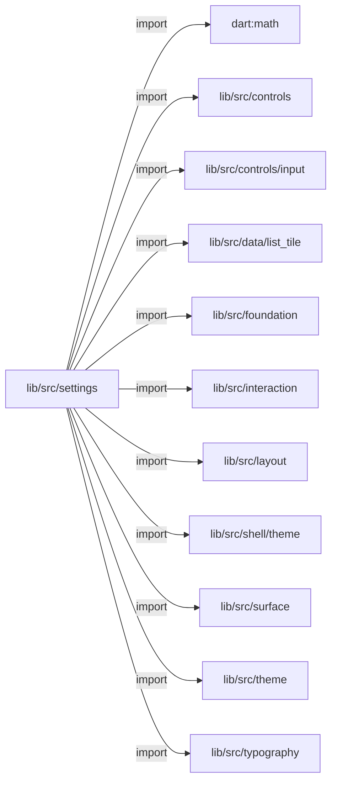
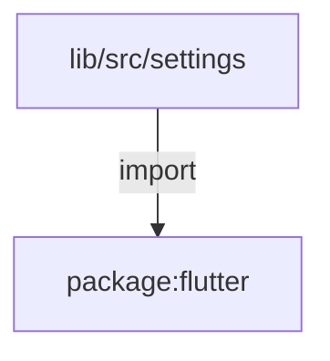
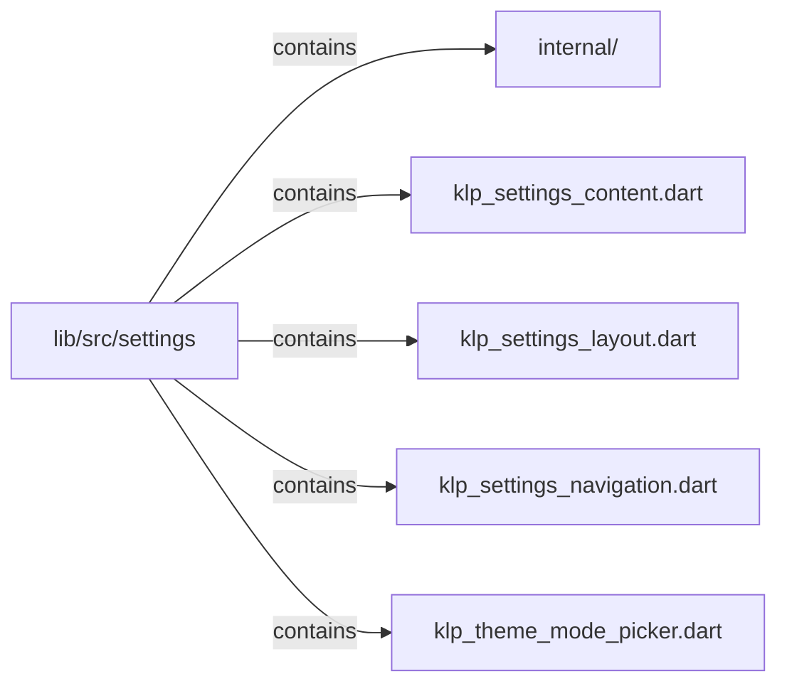

# lib/src/settings：架構分析入口

[上一層](../README.md)

## 範圍

閱讀 `lib/src/settings` 的直接子目錄與 Dart 檔案。結構圖表示實際檔案包含關係；依賴圖表示本層檔案明寫的 directives。每個檔案頁另列直接依賴、宣告、欄位、方法、建構子及行號證據。

## 模組閱讀重點

## 分析入口

此目錄組成設定頁、導覽 pane、內容 pane、欄位與主題模式選擇的視覺介面。`internal/klp_settings_scope.dart` 持有 pane scope，與外部傳入 selectedIndex 的 scope switcher 是不同角色。資料持久化或設定服務不應由這些畫面名稱推論。

| 想回答的問題 | 精確符號與來源 |
| --- | --- |
| 設定頁布局的入口在哪裡？ | `KlpSettingsPage`：lib/src/settings/klp_settings_layout.dart:48 |
| 導覽與內容區域如何分開？ | `KlpSettingsNavigationPane`、`KlpSettingsContentPane`：lib/src/settings/klp_settings_layout.dart:139、186 |
| scope UI 與內部繼承元件在哪裡？ | `KlpSettingsScopeSwitcher`：lib/src/settings/klp_settings_navigation.dart:23；`KlpSettingsPaneScope`：lib/src/settings/internal/klp_settings_scope.dart:3 |

重要依賴：`klp_settings_navigation.dart:52` 將 press 回呼轉為 `onSelected(index)`；:40 建構 `KlpSurface`。`klp_settings_layout.dart:5` 匯入 layout 模組，這是靜態依賴，不能據此宣稱資料更新或保存流程。

## 本層直接依賴圖

箭頭以本層 Dart 檔案明寫的 directive 彙總到目標所在目錄或外部套件邊界；不遞迴將子目錄依賴算入本層。相同目標的不同 directive 類型分開計數。

| 目標邊界 | 關係 | directive 數 | 第一筆來源證據 |
|---|---|---|---|
| <code>dart:math</code> | import | 2 | [lib/src/settings/klp_settings_layout.dart:1](../../../../lib/src/settings/klp_settings_layout.dart#L1) |
| <code>lib/src/controls</code> | import | 1 | [lib/src/settings/klp_settings_navigation.dart:3](../../../../lib/src/settings/klp_settings_navigation.dart#L3) |
| <code>lib/src/controls/input</code> | import | 1 | [lib/src/settings/klp_settings_navigation.dart:4](../../../../lib/src/settings/klp_settings_navigation.dart#L4) |
| <code>lib/src/data/list_tile</code> | import | 1 | [lib/src/settings/klp_settings_navigation.dart:5](../../../../lib/src/settings/klp_settings_navigation.dart#L5) |
| <code>lib/src/foundation</code> | import | 2 | [lib/src/settings/klp_settings_navigation.dart:6](../../../../lib/src/settings/klp_settings_navigation.dart#L6) |
| <code>lib/src/interaction</code> | import | 1 | [lib/src/settings/klp_settings_navigation.dart:8](../../../../lib/src/settings/klp_settings_navigation.dart#L8) |
| <code>lib/src/layout</code> | import | 1 | [lib/src/settings/klp_settings_layout.dart:5](../../../../lib/src/settings/klp_settings_layout.dart#L5) |
| <code>lib/src/shell/theme</code> | import | 1 | [lib/src/settings/klp_theme_mode_picker.dart:5](../../../../lib/src/settings/klp_theme_mode_picker.dart#L5) |
| <code>lib/src/surface</code> | import | 3 | [lib/src/settings/klp_settings_content.dart:3](../../../../lib/src/settings/klp_settings_content.dart#L3) |
| <code>lib/src/theme</code> | import | 4 | [lib/src/settings/klp_settings_content.dart:4](../../../../lib/src/settings/klp_settings_content.dart#L4) |
| <code>lib/src/typography</code> | import | 3 | [lib/src/settings/klp_settings_content.dart:5](../../../../lib/src/settings/klp_settings_content.dart#L5) |
| <code>package:flutter</code> | import | 4 | [lib/src/settings/klp_settings_content.dart:1](../../../../lib/src/settings/klp_settings_content.dart#L1) |

## 目錄結構圖

## 子目錄

| 目錄 | 導航 | 來源證據 |
|---|---|---|
| `internal/` | [架構入口](internal/README.md) | [來源目錄](../../../../lib/src/settings/internal) |

## 本層檔案

| 檔案 | 宣告 | 細節 | 來源證據 |
|---|---|---|---|
| `klp_settings_content.dart` | KlpSettingsField, KlpSettingsActionBar | [架構與 API](klp_settings_content.md) | [lib/src/settings/klp_settings_content.dart:1](../../../../lib/src/settings/klp_settings_content.dart#L1) |
| `klp_settings_layout.dart` | KlpSettingsDialog, KlpSettingsPage, KlpSettingsNavigationPane, KlpSettingsContentPane, KlpSettingsContentHeader | [架構與 API](klp_settings_layout.md) | [lib/src/settings/klp_settings_layout.dart:1](../../../../lib/src/settings/klp_settings_layout.dart#L1) |
| `klp_settings_navigation.dart` | KlpSettingsScopeOption, KlpSettingsScopeSwitcher, KlpSettingsNavigationHeader, KlpSettingsSearchField, KlpSettingsNavigationGroup, KlpSettingsNavigationItem | [架構與 API](klp_settings_navigation.md) | [lib/src/settings/klp_settings_navigation.dart:1](../../../../lib/src/settings/klp_settings_navigation.dart#L1) |
| `klp_theme_mode_picker.dart` | KlpThemeModeOption, KlpThemeModePicker | [架構與 API](klp_theme_mode_picker.md) | [lib/src/settings/klp_theme_mode_picker.dart:1](../../../../lib/src/settings/klp_theme_mode_picker.dart#L1) |

## 閱讀說明

箭頭只表示來源明寫的靜態關係；import 不等於呼叫。未分析動態呼叫、欄位的實際物件擁有權、狀態轉移或渲染流程；型別未進行語意解析，繼承目標保留原始型別拼寫。public／private 依 Dart 名稱前綴判斷；public 宣告不代表已由 `lib/kallopis.dart` 匯出。

本頁的目錄與檔案由來源清冊產生；`manifest.json` 位於本圖集根目錄，可核對 SHA-256 與覆蓋數。人工模組摘要存於 `tool/architecture_atlas/briefs/`，重新生成時保留。
