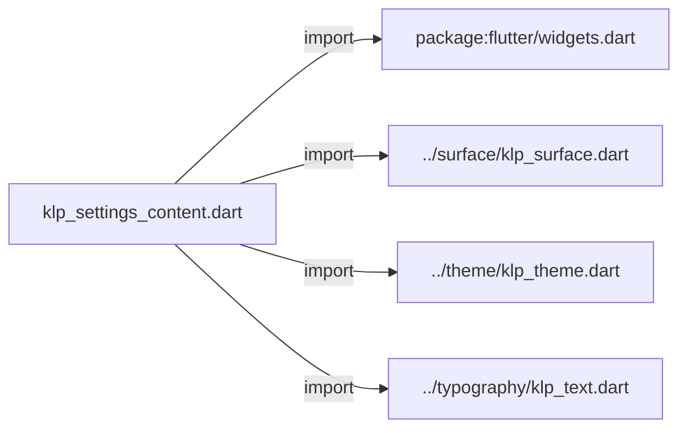
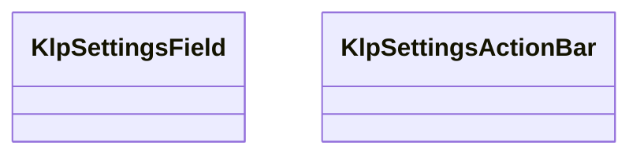
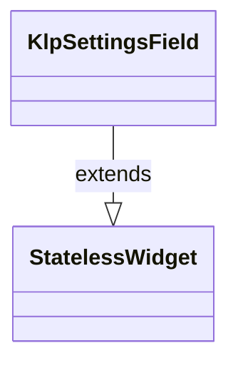
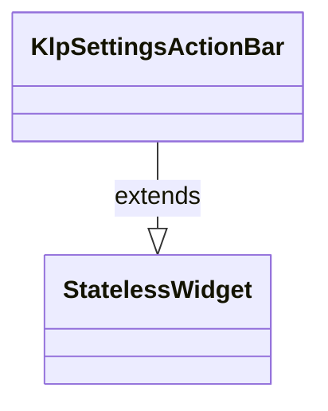

# klp_settings_content.dart：直接依賴與宣告架構

[回到目錄](README.md) · [來源檔案](../../../../lib/src/settings/klp_settings_content.dart)

## 範圍

核心是 `lib/src/settings/klp_settings_content.dart`。主要視角為該檔案明寫的 import／export／part；輔助視角為本檔宣告及 extends／implements／with／on 關係。只展開一層外部邊界。

## 直接依賴圖

## 依賴證據

| 關係 | 原始 directive | 來源 |
|---|---|---|
| import | <code>import &#x27;package:flutter/widgets.dart&#x27;;</code> | [lib/src/settings/klp_settings_content.dart:1](../../../../lib/src/settings/klp_settings_content.dart#L1) |
| import | <code>import &#x27;../surface/klp_surface.dart&#x27;;</code> | [lib/src/settings/klp_settings_content.dart:3](../../../../lib/src/settings/klp_settings_content.dart#L3) |
| import | <code>import &#x27;../theme/klp_theme.dart&#x27;;</code> | [lib/src/settings/klp_settings_content.dart:4](../../../../lib/src/settings/klp_settings_content.dart#L4) |
| import | <code>import &#x27;../typography/klp_text.dart&#x27;;</code> | [lib/src/settings/klp_settings_content.dart:5](../../../../lib/src/settings/klp_settings_content.dart#L5) |

## 宣告關係圖

本組節點是本檔宣告；沒有箭頭的宣告未在此圖主張互相依賴。

## 宣告與成員證據

成員包含 public 與 private；簽章取自來源，省略函式本體與欄位初始值。`(inferred)` 表示來源未明寫型別；建構子只顯示參數部分，不含初始化列表。

### KlpSettingsField

ClassDeclaration · public · [lib/src/settings/klp_settings_content.dart:7](../../../../lib/src/settings/klp_settings_content.dart#L7)

<code>class KlpSettingsField extends StatelessWidget</code>

來源註解摘要：設定欄位的標題、說明、控制項與 deep-link 定位表面。

- `extends` → <code>StatelessWidget</code>：[lib/src/settings/klp_settings_content.dart:8](../../../../lib/src/settings/klp_settings_content.dart#L8)

| 成員 | 可見性 | 簽章／型別 | 來源註解摘要 | 證據 |
|---|---|---|---|---|
| constructor <code>KlpSettingsField</code> | public | <code>const KlpSettingsField({ super.key, required this.title, required this.child, this.description, this.highlighted = false, })</code> |  | [lib/src/settings/klp_settings_content.dart:9](../../../../lib/src/settings/klp_settings_content.dart#L9) |
| field <code>title</code> | public | <code>final String title</code> |  | [lib/src/settings/klp_settings_content.dart:17](../../../../lib/src/settings/klp_settings_content.dart#L17) |
| field <code>description</code> | public | <code>final String? description</code> |  | [lib/src/settings/klp_settings_content.dart:18](../../../../lib/src/settings/klp_settings_content.dart#L18) |
| field <code>child</code> | public | <code>final Widget child</code> |  | [lib/src/settings/klp_settings_content.dart:19](../../../../lib/src/settings/klp_settings_content.dart#L19) |
| field <code>highlighted</code> | public | <code>final bool highlighted</code> |  | [lib/src/settings/klp_settings_content.dart:20](../../../../lib/src/settings/klp_settings_content.dart#L20) |
| method <code>build</code> | public | <code>Widget build(BuildContext context)</code> |  | [lib/src/settings/klp_settings_content.dart:22](../../../../lib/src/settings/klp_settings_content.dart#L22) |

### KlpSettingsActionBar

ClassDeclaration · public · [lib/src/settings/klp_settings_content.dart:45](../../../../lib/src/settings/klp_settings_content.dart#L45)

<code>class KlpSettingsActionBar extends StatelessWidget</code>

來源註解摘要：固定於設定內容捲動區外的狀態與動作列。 此元件只負責呈現；dirty／saving／failure 等狀態機由消費者決定。

- `extends` → <code>StatelessWidget</code>：[lib/src/settings/klp_settings_content.dart:48](../../../../lib/src/settings/klp_settings_content.dart#L48)

| 成員 | 可見性 | 簽章／型別 | 來源註解摘要 | 證據 |
|---|---|---|---|---|
| constructor <code>KlpSettingsActionBar</code> | public | <code>const KlpSettingsActionBar({ super.key, required this.message, required this.actions, this.tone = KlpTextTone.muted, })</code> |  | [lib/src/settings/klp_settings_content.dart:49](../../../../lib/src/settings/klp_settings_content.dart#L49) |
| field <code>message</code> | public | <code>final String message</code> |  | [lib/src/settings/klp_settings_content.dart:56](../../../../lib/src/settings/klp_settings_content.dart#L56) |
| field <code>tone</code> | public | <code>final KlpTextTone tone</code> |  | [lib/src/settings/klp_settings_content.dart:57](../../../../lib/src/settings/klp_settings_content.dart#L57) |
| field <code>actions</code> | public | <code>final List&lt;Widget&gt; actions</code> |  | [lib/src/settings/klp_settings_content.dart:58](../../../../lib/src/settings/klp_settings_content.dart#L58) |
| method <code>build</code> | public | <code>Widget build(BuildContext context)</code> |  | [lib/src/settings/klp_settings_content.dart:60](../../../../lib/src/settings/klp_settings_content.dart#L60) |

## 閱讀說明與限制

箭頭只表示來源明寫的靜態關係；import 不等於呼叫。未分析動態呼叫、欄位的實際物件擁有權、狀態轉移或渲染流程；型別未進行語意解析，繼承目標保留原始型別拼寫。public／private 依 Dart 名稱前綴判斷；public 宣告不代表已由 `lib/kallopis.dart` 匯出。

本頁由 `tool/architecture_atlas` 產生；編輯來源或生成工具後重新產生，避免手改本頁。
