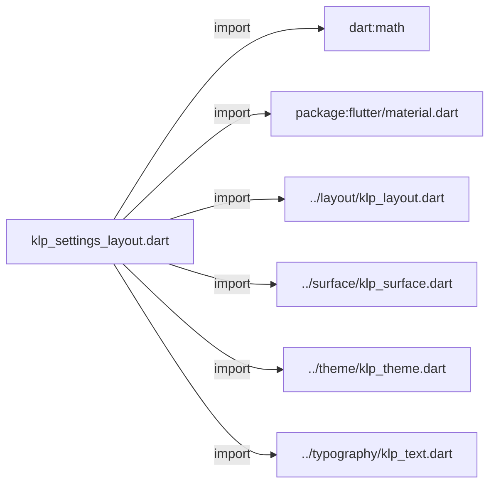
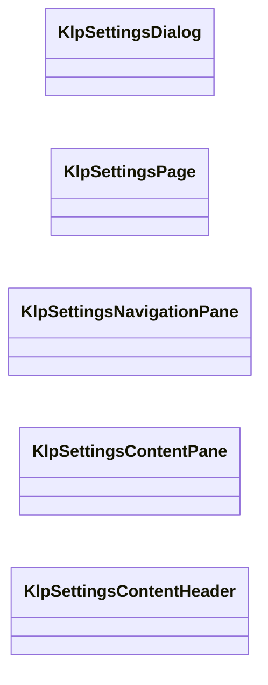
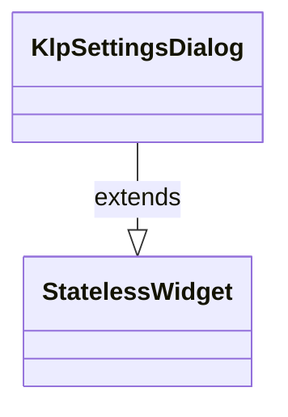
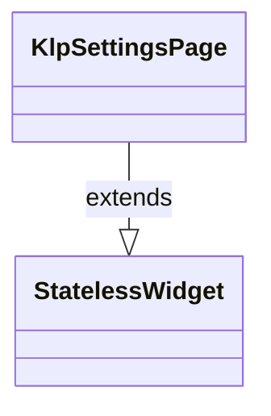
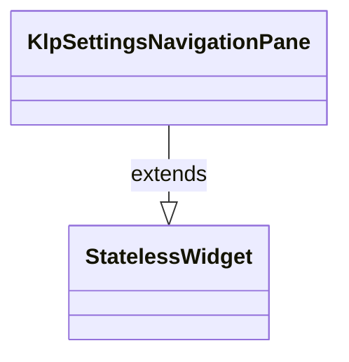
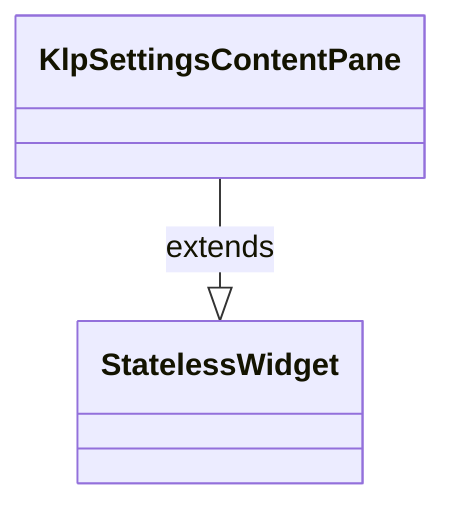
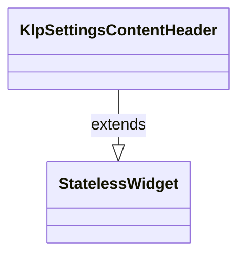

# klp_settings_layout.dart：直接依賴與宣告架構

[回到目錄](README.md) · [來源檔案](../../../../lib/src/settings/klp_settings_layout.dart)

## 範圍

核心是 `lib/src/settings/klp_settings_layout.dart`。主要視角為該檔案明寫的 import／export／part；輔助視角為本檔宣告及 extends／implements／with／on 關係。只展開一層外部邊界。

## 直接依賴圖

## 依賴證據

| 關係 | 原始 directive | 來源 |
|---|---|---|
| import | <code>import &#x27;dart:math&#x27; as math;</code> | [lib/src/settings/klp_settings_layout.dart:1](../../../../lib/src/settings/klp_settings_layout.dart#L1) |
| import | <code>import &#x27;package:flutter/material.dart&#x27;;</code> | [lib/src/settings/klp_settings_layout.dart:3](../../../../lib/src/settings/klp_settings_layout.dart#L3) |
| import | <code>import &#x27;../layout/klp_layout.dart&#x27;;</code> | [lib/src/settings/klp_settings_layout.dart:5](../../../../lib/src/settings/klp_settings_layout.dart#L5) |
| import | <code>import &#x27;../surface/klp_surface.dart&#x27;;</code> | [lib/src/settings/klp_settings_layout.dart:6](../../../../lib/src/settings/klp_settings_layout.dart#L6) |
| import | <code>import &#x27;../theme/klp_theme.dart&#x27;;</code> | [lib/src/settings/klp_settings_layout.dart:7](../../../../lib/src/settings/klp_settings_layout.dart#L7) |
| import | <code>import &#x27;../typography/klp_text.dart&#x27;;</code> | [lib/src/settings/klp_settings_layout.dart:8](../../../../lib/src/settings/klp_settings_layout.dart#L8) |

## 宣告關係圖

本組節點是本檔宣告；沒有箭頭的宣告未在此圖主張互相依賴。

## 宣告與成員證據

成員包含 public 與 private；簽章取自來源，省略函式本體與欄位初始值。`(inferred)` 表示來源未明寫型別；建構子只顯示參數部分，不含初始化列表。

### KlpSettingsDialog

ClassDeclaration · public · [lib/src/settings/klp_settings_layout.dart:10](../../../../lib/src/settings/klp_settings_layout.dart#L10)

<code>class KlpSettingsDialog extends StatelessWidget</code>

來源註解摘要：Settings modal 的桌面框架；尺寸、置中與透明 Dialog chrome 全由 Kallopis 管理。

- `extends` → <code>StatelessWidget</code>：[lib/src/settings/klp_settings_layout.dart:11](../../../../lib/src/settings/klp_settings_layout.dart#L11)

| 成員 | 可見性 | 簽章／型別 | 來源註解摘要 | 證據 |
|---|---|---|---|---|
| constructor <code>KlpSettingsDialog</code> | public | <code>const KlpSettingsDialog({super.key, required this.child})</code> |  | [lib/src/settings/klp_settings_layout.dart:12](../../../../lib/src/settings/klp_settings_layout.dart#L12) |
| field <code>child</code> | public | <code>final Widget child</code> |  | [lib/src/settings/klp_settings_layout.dart:14](../../../../lib/src/settings/klp_settings_layout.dart#L14) |
| method <code>build</code> | public | <code>Widget build(BuildContext context)</code> |  | [lib/src/settings/klp_settings_layout.dart:16](../../../../lib/src/settings/klp_settings_layout.dart#L16) |

### KlpSettingsPage

ClassDeclaration · public · [lib/src/settings/klp_settings_layout.dart:45](../../../../lib/src/settings/klp_settings_layout.dart#L45)

<code>class KlpSettingsPage extends StatelessWidget</code>

來源註解摘要：設定頁的自適應雙 pane 版面。 只安排 navigation 與 content；route、Popup 與設定狀態由產品層負責。

- `extends` → <code>StatelessWidget</code>：[lib/src/settings/klp_settings_layout.dart:48](../../../../lib/src/settings/klp_settings_layout.dart#L48)

| 成員 | 可見性 | 簽章／型別 | 來源註解摘要 | 證據 |
|---|---|---|---|---|
| constructor <code>KlpSettingsPage</code> | public | <code>const KlpSettingsPage({ super.key, required this.navigation, required this.content, this.navigationWidth, this.twoColumnBreakpoint, this.onNavigationWidthChanged, this.navigationResizeLabel, })</code> |  | [lib/src/settings/klp_settings_layout.dart:49](../../../../lib/src/settings/klp_settings_layout.dart#L49) |
| field <code>navigation</code> | public | <code>final Widget navigation</code> |  | [lib/src/settings/klp_settings_layout.dart:59](../../../../lib/src/settings/klp_settings_layout.dart#L59) |
| field <code>content</code> | public | <code>final Widget content</code> |  | [lib/src/settings/klp_settings_layout.dart:60](../../../../lib/src/settings/klp_settings_layout.dart#L60) |
| field <code>navigationWidth</code> | public | <code>final double? navigationWidth</code> | `null` 時使用 theme 的 settings navigation 寬度。 | [lib/src/settings/klp_settings_layout.dart:63](../../../../lib/src/settings/klp_settings_layout.dart#L63) |
| field <code>twoColumnBreakpoint</code> | public | <code>final double? twoColumnBreakpoint</code> | `null` 時使用 theme 的 primary pane content breakpoint。 | [lib/src/settings/klp_settings_layout.dart:66](../../../../lib/src/settings/klp_settings_layout.dart#L66) |
| field <code>onNavigationWidthChanged</code> | public | <code>final ValueChanged&lt;double&gt;? onNavigationWidthChanged</code> | 非 `null` 時寬版導覽欄可拖曳調整；寬度狀態由消費者持有。 | [lib/src/settings/klp_settings_layout.dart:69](../../../../lib/src/settings/klp_settings_layout.dart#L69) |
| field <code>navigationResizeLabel</code> | public | <code>final String? navigationResizeLabel</code> | 導覽欄拖曳把手的無障礙標籤。 | [lib/src/settings/klp_settings_layout.dart:72](../../../../lib/src/settings/klp_settings_layout.dart#L72) |
| method <code>build</code> | public | <code>Widget build(BuildContext context)</code> |  | [lib/src/settings/klp_settings_layout.dart:74](../../../../lib/src/settings/klp_settings_layout.dart#L74) |

### KlpSettingsNavigationPane

ClassDeclaration · public · [lib/src/settings/klp_settings_layout.dart:138](../../../../lib/src/settings/klp_settings_layout.dart#L138)

<code>class KlpSettingsNavigationPane extends StatelessWidget</code>

來源註解摘要：設定導覽 pane 的預設表面、內距與捲動行為。

- `extends` → <code>StatelessWidget</code>：[lib/src/settings/klp_settings_layout.dart:139](../../../../lib/src/settings/klp_settings_layout.dart#L139)

| 成員 | 可見性 | 簽章／型別 | 來源註解摘要 | 證據 |
|---|---|---|---|---|
| constructor <code>KlpSettingsNavigationPane</code> | public | <code>const KlpSettingsNavigationPane({ super.key, required this.children, this.header, this.controller, })</code> |  | [lib/src/settings/klp_settings_layout.dart:140](../../../../lib/src/settings/klp_settings_layout.dart#L140) |
| field <code>header</code> | public | <code>final Widget? header</code> |  | [lib/src/settings/klp_settings_layout.dart:147](../../../../lib/src/settings/klp_settings_layout.dart#L147) |
| field <code>children</code> | public | <code>final List&lt;Widget&gt; children</code> |  | [lib/src/settings/klp_settings_layout.dart:148](../../../../lib/src/settings/klp_settings_layout.dart#L148) |
| field <code>controller</code> | public | <code>final ScrollController? controller</code> |  | [lib/src/settings/klp_settings_layout.dart:149](../../../../lib/src/settings/klp_settings_layout.dart#L149) |
| method <code>build</code> | public | <code>Widget build(BuildContext context)</code> |  | [lib/src/settings/klp_settings_layout.dart:151](../../../../lib/src/settings/klp_settings_layout.dart#L151) |

### KlpSettingsContentPane

ClassDeclaration · public · [lib/src/settings/klp_settings_layout.dart:185](../../../../lib/src/settings/klp_settings_layout.dart#L185)

<code>class KlpSettingsContentPane extends StatelessWidget</code>

來源註解摘要：設定內容 pane；內容可捲動，footer 固定於捲動區外。

- `extends` → <code>StatelessWidget</code>：[lib/src/settings/klp_settings_layout.dart:186](../../../../lib/src/settings/klp_settings_layout.dart#L186)

| 成員 | 可見性 | 簽章／型別 | 來源註解摘要 | 證據 |
|---|---|---|---|---|
| constructor <code>KlpSettingsContentPane</code> | public | <code>const KlpSettingsContentPane({ super.key, required this.title, required this.child, this.description, this.trailing, this.footer, this.controller, })</code> |  | [lib/src/settings/klp_settings_layout.dart:187](../../../../lib/src/settings/klp_settings_layout.dart#L187) |
| field <code>title</code> | public | <code>final String title</code> |  | [lib/src/settings/klp_settings_layout.dart:197](../../../../lib/src/settings/klp_settings_layout.dart#L197) |
| field <code>description</code> | public | <code>final String? description</code> |  | [lib/src/settings/klp_settings_layout.dart:198](../../../../lib/src/settings/klp_settings_layout.dart#L198) |
| field <code>child</code> | public | <code>final Widget child</code> |  | [lib/src/settings/klp_settings_layout.dart:199](../../../../lib/src/settings/klp_settings_layout.dart#L199) |
| field <code>trailing</code> | public | <code>final Widget? trailing</code> |  | [lib/src/settings/klp_settings_layout.dart:200](../../../../lib/src/settings/klp_settings_layout.dart#L200) |
| field <code>footer</code> | public | <code>final Widget? footer</code> |  | [lib/src/settings/klp_settings_layout.dart:201](../../../../lib/src/settings/klp_settings_layout.dart#L201) |
| field <code>controller</code> | public | <code>final ScrollController? controller</code> |  | [lib/src/settings/klp_settings_layout.dart:202](../../../../lib/src/settings/klp_settings_layout.dart#L202) |
| method <code>build</code> | public | <code>Widget build(BuildContext context)</code> |  | [lib/src/settings/klp_settings_layout.dart:204](../../../../lib/src/settings/klp_settings_layout.dart#L204) |

### KlpSettingsContentHeader

ClassDeclaration · public · [lib/src/settings/klp_settings_layout.dart:262](../../../../lib/src/settings/klp_settings_layout.dart#L262)

<code>class KlpSettingsContentHeader extends StatelessWidget</code>

來源註解摘要：Settings 右欄的固定標題組合，可單獨用於自訂內容 pane。

- `extends` → <code>StatelessWidget</code>：[lib/src/settings/klp_settings_layout.dart:263](../../../../lib/src/settings/klp_settings_layout.dart#L263)

| 成員 | 可見性 | 簽章／型別 | 來源註解摘要 | 證據 |
|---|---|---|---|---|
| constructor <code>KlpSettingsContentHeader</code> | public | <code>const KlpSettingsContentHeader({ super.key, required this.title, this.description, this.trailing, })</code> |  | [lib/src/settings/klp_settings_layout.dart:264](../../../../lib/src/settings/klp_settings_layout.dart#L264) |
| field <code>title</code> | public | <code>final String title</code> |  | [lib/src/settings/klp_settings_layout.dart:271](../../../../lib/src/settings/klp_settings_layout.dart#L271) |
| field <code>description</code> | public | <code>final String? description</code> |  | [lib/src/settings/klp_settings_layout.dart:272](../../../../lib/src/settings/klp_settings_layout.dart#L272) |
| field <code>trailing</code> | public | <code>final Widget? trailing</code> |  | [lib/src/settings/klp_settings_layout.dart:273](../../../../lib/src/settings/klp_settings_layout.dart#L273) |
| method <code>build</code> | public | <code>Widget build(BuildContext context)</code> |  | [lib/src/settings/klp_settings_layout.dart:275](../../../../lib/src/settings/klp_settings_layout.dart#L275) |

## 閱讀說明與限制

箭頭只表示來源明寫的靜態關係；import 不等於呼叫。未分析動態呼叫、欄位的實際物件擁有權、狀態轉移或渲染流程；型別未進行語意解析，繼承目標保留原始型別拼寫。public／private 依 Dart 名稱前綴判斷；public 宣告不代表已由 `lib/kallopis.dart` 匯出。

本頁由 `tool/architecture_atlas` 產生；編輯來源或生成工具後重新產生，避免手改本頁。
