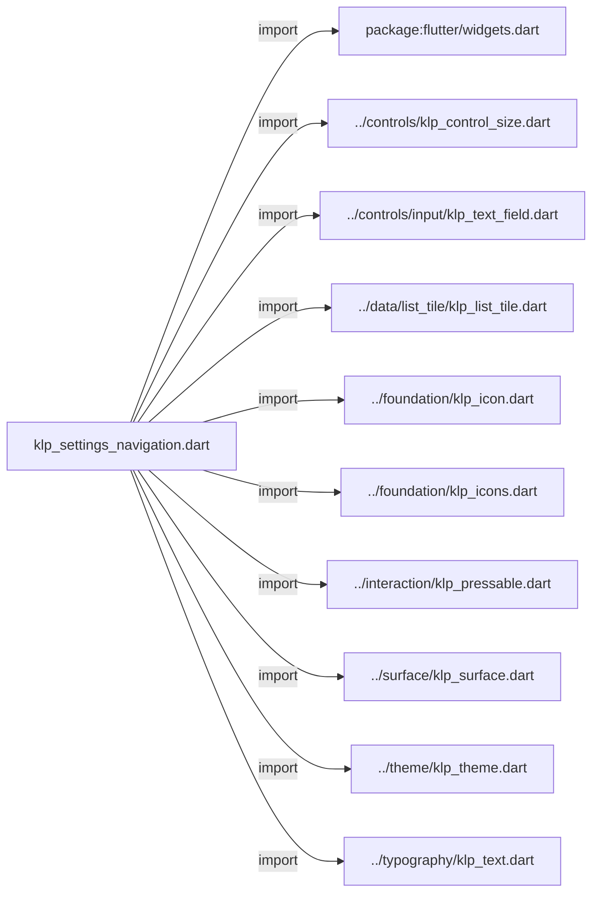
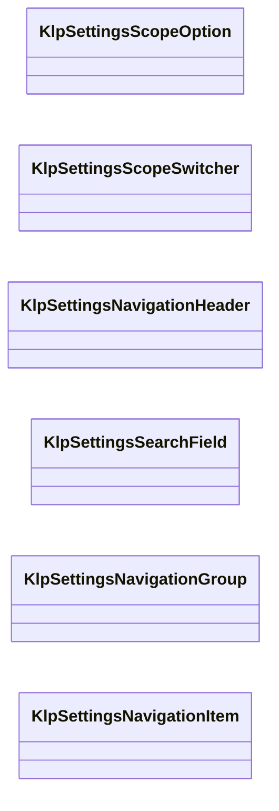
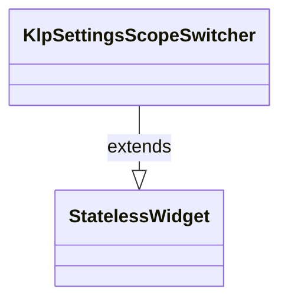
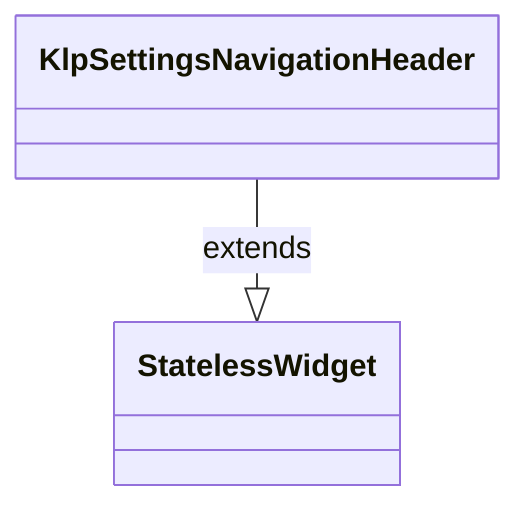
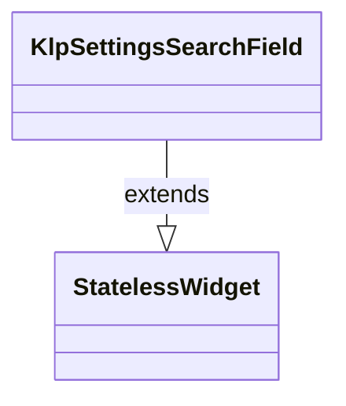
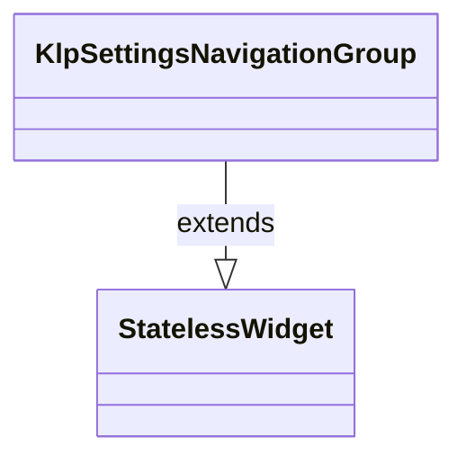
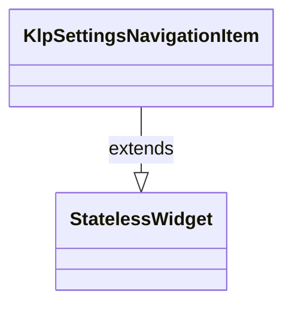

# klp_settings_navigation.dart：直接依賴與宣告架構

[回到目錄](README.md) · [來源檔案](../../../../lib/src/settings/klp_settings_navigation.dart)

## 範圍

核心是 `lib/src/settings/klp_settings_navigation.dart`。主要視角為該檔案明寫的 import／export／part；輔助視角為本檔宣告及 extends／implements／with／on 關係。只展開一層外部邊界。

## 直接依賴圖

## 依賴證據

| 關係 | 原始 directive | 來源 |
|---|---|---|
| import | <code>import &#x27;package:flutter/widgets.dart&#x27;;</code> | [lib/src/settings/klp_settings_navigation.dart:1](../../../../lib/src/settings/klp_settings_navigation.dart#L1) |
| import | <code>import &#x27;../controls/klp_control_size.dart&#x27;;</code> | [lib/src/settings/klp_settings_navigation.dart:3](../../../../lib/src/settings/klp_settings_navigation.dart#L3) |
| import | <code>import &#x27;../controls/input/klp_text_field.dart&#x27;;</code> | [lib/src/settings/klp_settings_navigation.dart:4](../../../../lib/src/settings/klp_settings_navigation.dart#L4) |
| import | <code>import &#x27;../data/list_tile/klp_list_tile.dart&#x27;;</code> | [lib/src/settings/klp_settings_navigation.dart:5](../../../../lib/src/settings/klp_settings_navigation.dart#L5) |
| import | <code>import &#x27;../foundation/klp_icon.dart&#x27;;</code> | [lib/src/settings/klp_settings_navigation.dart:6](../../../../lib/src/settings/klp_settings_navigation.dart#L6) |
| import | <code>import &#x27;../foundation/klp_icons.dart&#x27;;</code> | [lib/src/settings/klp_settings_navigation.dart:7](../../../../lib/src/settings/klp_settings_navigation.dart#L7) |
| import | <code>import &#x27;../interaction/klp_pressable.dart&#x27;;</code> | [lib/src/settings/klp_settings_navigation.dart:8](../../../../lib/src/settings/klp_settings_navigation.dart#L8) |
| import | <code>import &#x27;../surface/klp_surface.dart&#x27;;</code> | [lib/src/settings/klp_settings_navigation.dart:9](../../../../lib/src/settings/klp_settings_navigation.dart#L9) |
| import | <code>import &#x27;../theme/klp_theme.dart&#x27;;</code> | [lib/src/settings/klp_settings_navigation.dart:10](../../../../lib/src/settings/klp_settings_navigation.dart#L10) |
| import | <code>import &#x27;../typography/klp_text.dart&#x27;;</code> | [lib/src/settings/klp_settings_navigation.dart:11](../../../../lib/src/settings/klp_settings_navigation.dart#L11) |

## 宣告關係圖

本組節點是本檔宣告；沒有箭頭的宣告未在此圖主張互相依賴。

## 宣告與成員證據

成員包含 public 與 private；簽章取自來源，省略函式本體與欄位初始值。`(inferred)` 表示來源未明寫型別；建構子只顯示參數部分，不含初始化列表。

### KlpSettingsScopeOption

ClassDeclaration · public · [lib/src/settings/klp_settings_navigation.dart:13](../../../../lib/src/settings/klp_settings_navigation.dart#L13)

<code>class KlpSettingsScopeOption</code>

來源註解摘要：Settings 頂部 scope 切換器的產品中立資料。

| 成員 | 可見性 | 簽章／型別 | 來源註解摘要 | 證據 |
|---|---|---|---|---|
| constructor <code>KlpSettingsScopeOption</code> | public | <code>const KlpSettingsScopeOption({required this.label, required this.icon})</code> |  | [lib/src/settings/klp_settings_navigation.dart:16](../../../../lib/src/settings/klp_settings_navigation.dart#L16) |
| field <code>label</code> | public | <code>final String label</code> |  | [lib/src/settings/klp_settings_navigation.dart:18](../../../../lib/src/settings/klp_settings_navigation.dart#L18) |
| field <code>icon</code> | public | <code>final KlpIconData icon</code> |  | [lib/src/settings/klp_settings_navigation.dart:19](../../../../lib/src/settings/klp_settings_navigation.dart#L19) |

### KlpSettingsScopeSwitcher

ClassDeclaration · public · [lib/src/settings/klp_settings_navigation.dart:22](../../../../lib/src/settings/klp_settings_navigation.dart#L22)

<code>class KlpSettingsScopeSwitcher extends StatelessWidget</code>

來源註解摘要：固定於 Settings 導覽頂部的等寬 scope 切換器。

- `extends` → <code>StatelessWidget</code>：[lib/src/settings/klp_settings_navigation.dart:23](../../../../lib/src/settings/klp_settings_navigation.dart#L23)

| 成員 | 可見性 | 簽章／型別 | 來源註解摘要 | 證據 |
|---|---|---|---|---|
| constructor <code>KlpSettingsScopeSwitcher</code> | public | <code>const KlpSettingsScopeSwitcher({ super.key, required this.options, required this.selectedIndex, required this.onSelected, })</code> |  | [lib/src/settings/klp_settings_navigation.dart:24](../../../../lib/src/settings/klp_settings_navigation.dart#L24) |
| field <code>options</code> | public | <code>final List&lt;KlpSettingsScopeOption&gt; options</code> |  | [lib/src/settings/klp_settings_navigation.dart:32](../../../../lib/src/settings/klp_settings_navigation.dart#L32) |
| field <code>selectedIndex</code> | public | <code>final int selectedIndex</code> |  | [lib/src/settings/klp_settings_navigation.dart:33](../../../../lib/src/settings/klp_settings_navigation.dart#L33) |
| field <code>onSelected</code> | public | <code>final ValueChanged&lt;int&gt; onSelected</code> |  | [lib/src/settings/klp_settings_navigation.dart:34](../../../../lib/src/settings/klp_settings_navigation.dart#L34) |
| method <code>build</code> | public | <code>Widget build(BuildContext context)</code> |  | [lib/src/settings/klp_settings_navigation.dart:36](../../../../lib/src/settings/klp_settings_navigation.dart#L36) |

### KlpSettingsNavigationHeader

ClassDeclaration · public · [lib/src/settings/klp_settings_navigation.dart:82](../../../../lib/src/settings/klp_settings_navigation.dart#L82)

<code>class KlpSettingsNavigationHeader extends StatelessWidget</code>

來源註解摘要：Settings 左欄固定區域；組合 identity 與搜尋，但不持有帳號或搜尋狀態。

- `extends` → <code>StatelessWidget</code>：[lib/src/settings/klp_settings_navigation.dart:83](../../../../lib/src/settings/klp_settings_navigation.dart#L83)

| 成員 | 可見性 | 簽章／型別 | 來源註解摘要 | 證據 |
|---|---|---|---|---|
| constructor <code>KlpSettingsNavigationHeader</code> | public | <code>const KlpSettingsNavigationHeader({ super.key, this.title, this.subtitle, this.leading, this.trailing, this.scopeSwitcher, this.search, this.onIdentityPressed, })</code> |  | [lib/src/settings/klp_settings_navigation.dart:84](../../../../lib/src/settings/klp_settings_navigation.dart#L84) |
| field <code>title</code> | public | <code>final String? title</code> |  | [lib/src/settings/klp_settings_navigation.dart:95](../../../../lib/src/settings/klp_settings_navigation.dart#L95) |
| field <code>subtitle</code> | public | <code>final String? subtitle</code> |  | [lib/src/settings/klp_settings_navigation.dart:96](../../../../lib/src/settings/klp_settings_navigation.dart#L96) |
| field <code>leading</code> | public | <code>final Widget? leading</code> |  | [lib/src/settings/klp_settings_navigation.dart:97](../../../../lib/src/settings/klp_settings_navigation.dart#L97) |
| field <code>trailing</code> | public | <code>final Widget? trailing</code> |  | [lib/src/settings/klp_settings_navigation.dart:98](../../../../lib/src/settings/klp_settings_navigation.dart#L98) |
| field <code>scopeSwitcher</code> | public | <code>final Widget? scopeSwitcher</code> |  | [lib/src/settings/klp_settings_navigation.dart:99](../../../../lib/src/settings/klp_settings_navigation.dart#L99) |
| field <code>search</code> | public | <code>final Widget? search</code> |  | [lib/src/settings/klp_settings_navigation.dart:100](../../../../lib/src/settings/klp_settings_navigation.dart#L100) |
| field <code>onIdentityPressed</code> | public | <code>final VoidCallback? onIdentityPressed</code> |  | [lib/src/settings/klp_settings_navigation.dart:101](../../../../lib/src/settings/klp_settings_navigation.dart#L101) |
| method <code>build</code> | public | <code>Widget build(BuildContext context)</code> |  | [lib/src/settings/klp_settings_navigation.dart:103](../../../../lib/src/settings/klp_settings_navigation.dart#L103) |

### KlpSettingsSearchField

ClassDeclaration · public · [lib/src/settings/klp_settings_navigation.dart:172](../../../../lib/src/settings/klp_settings_navigation.dart#L172)

<code>class KlpSettingsSearchField extends StatelessWidget</code>

來源註解摘要：Settings 搜尋欄的標準組合；查詢與過濾仍由產品層處理。

- `extends` → <code>StatelessWidget</code>：[lib/src/settings/klp_settings_navigation.dart:173](../../../../lib/src/settings/klp_settings_navigation.dart#L173)

| 成員 | 可見性 | 簽章／型別 | 來源註解摘要 | 證據 |
|---|---|---|---|---|
| constructor <code>KlpSettingsSearchField</code> | public | <code>const KlpSettingsSearchField({ super.key, required this.placeholder, this.controller, this.onChanged, this.onSubmitted, })</code> |  | [lib/src/settings/klp_settings_navigation.dart:174](../../../../lib/src/settings/klp_settings_navigation.dart#L174) |
| field <code>placeholder</code> | public | <code>final String placeholder</code> |  | [lib/src/settings/klp_settings_navigation.dart:182](../../../../lib/src/settings/klp_settings_navigation.dart#L182) |
| field <code>controller</code> | public | <code>final TextEditingController? controller</code> |  | [lib/src/settings/klp_settings_navigation.dart:183](../../../../lib/src/settings/klp_settings_navigation.dart#L183) |
| field <code>onChanged</code> | public | <code>final ValueChanged&lt;String&gt;? onChanged</code> |  | [lib/src/settings/klp_settings_navigation.dart:184](../../../../lib/src/settings/klp_settings_navigation.dart#L184) |
| field <code>onSubmitted</code> | public | <code>final ValueChanged&lt;String&gt;? onSubmitted</code> |  | [lib/src/settings/klp_settings_navigation.dart:185](../../../../lib/src/settings/klp_settings_navigation.dart#L185) |
| method <code>build</code> | public | <code>Widget build(BuildContext context)</code> |  | [lib/src/settings/klp_settings_navigation.dart:187](../../../../lib/src/settings/klp_settings_navigation.dart#L187) |

### KlpSettingsNavigationGroup

ClassDeclaration · public · [lib/src/settings/klp_settings_navigation.dart:201](../../../../lib/src/settings/klp_settings_navigation.dart#L201)

<code>class KlpSettingsNavigationGroup extends StatelessWidget</code>

來源註解摘要：設定導覽中不可收縮的分類標題與 section 集合。

- `extends` → <code>StatelessWidget</code>：[lib/src/settings/klp_settings_navigation.dart:202](../../../../lib/src/settings/klp_settings_navigation.dart#L202)

| 成員 | 可見性 | 簽章／型別 | 來源註解摘要 | 證據 |
|---|---|---|---|---|
| constructor <code>KlpSettingsNavigationGroup</code> | public | <code>const KlpSettingsNavigationGroup({ super.key, required this.label, required this.children, })</code> |  | [lib/src/settings/klp_settings_navigation.dart:203](../../../../lib/src/settings/klp_settings_navigation.dart#L203) |
| field <code>label</code> | public | <code>final String label</code> |  | [lib/src/settings/klp_settings_navigation.dart:209](../../../../lib/src/settings/klp_settings_navigation.dart#L209) |
| field <code>children</code> | public | <code>final List&lt;Widget&gt; children</code> |  | [lib/src/settings/klp_settings_navigation.dart:210](../../../../lib/src/settings/klp_settings_navigation.dart#L210) |
| method <code>build</code> | public | <code>Widget build(BuildContext context)</code> |  | [lib/src/settings/klp_settings_navigation.dart:212](../../../../lib/src/settings/klp_settings_navigation.dart#L212) |

### KlpSettingsNavigationItem

ClassDeclaration · public · [lib/src/settings/klp_settings_navigation.dart:238](../../../../lib/src/settings/klp_settings_navigation.dart#L238)

<code>class KlpSettingsNavigationItem extends StatelessWidget</code>

來源註解摘要：設定 section 導覽列；只有選取項目會建立其 field deep links。

- `extends` → <code>StatelessWidget</code>：[lib/src/settings/klp_settings_navigation.dart:239](../../../../lib/src/settings/klp_settings_navigation.dart#L239)

| 成員 | 可見性 | 簽章／型別 | 來源註解摘要 | 證據 |
|---|---|---|---|---|
| constructor <code>KlpSettingsNavigationItem</code> | public | <code>const KlpSettingsNavigationItem({ super.key, required this.title, required this.onPressed, this.icon, this.trailing, this.selected = false, this.children = const [], })</code> |  | [lib/src/settings/klp_settings_navigation.dart:240](../../../../lib/src/settings/klp_settings_navigation.dart#L240) |
| field <code>title</code> | public | <code>final String title</code> |  | [lib/src/settings/klp_settings_navigation.dart:250](../../../../lib/src/settings/klp_settings_navigation.dart#L250) |
| field <code>icon</code> | public | <code>final KlpIconData? icon</code> |  | [lib/src/settings/klp_settings_navigation.dart:251](../../../../lib/src/settings/klp_settings_navigation.dart#L251) |
| field <code>trailing</code> | public | <code>final Widget? trailing</code> |  | [lib/src/settings/klp_settings_navigation.dart:252](../../../../lib/src/settings/klp_settings_navigation.dart#L252) |
| field <code>selected</code> | public | <code>final bool selected</code> |  | [lib/src/settings/klp_settings_navigation.dart:253](../../../../lib/src/settings/klp_settings_navigation.dart#L253) |
| field <code>onPressed</code> | public | <code>final VoidCallback? onPressed</code> |  | [lib/src/settings/klp_settings_navigation.dart:254](../../../../lib/src/settings/klp_settings_navigation.dart#L254) |
| field <code>children</code> | public | <code>final List&lt;Widget&gt; children</code> |  | [lib/src/settings/klp_settings_navigation.dart:255](../../../../lib/src/settings/klp_settings_navigation.dart#L255) |
| method <code>build</code> | public | <code>Widget build(BuildContext context)</code> |  | [lib/src/settings/klp_settings_navigation.dart:257](../../../../lib/src/settings/klp_settings_navigation.dart#L257) |

## 閱讀說明與限制

箭頭只表示來源明寫的靜態關係；import 不等於呼叫。未分析動態呼叫、欄位的實際物件擁有權、狀態轉移或渲染流程；型別未進行語意解析，繼承目標保留原始型別拼寫。public／private 依 Dart 名稱前綴判斷；public 宣告不代表已由 `lib/kallopis.dart` 匯出。

本頁由 `tool/architecture_atlas` 產生；編輯來源或生成工具後重新產生，避免手改本頁。
