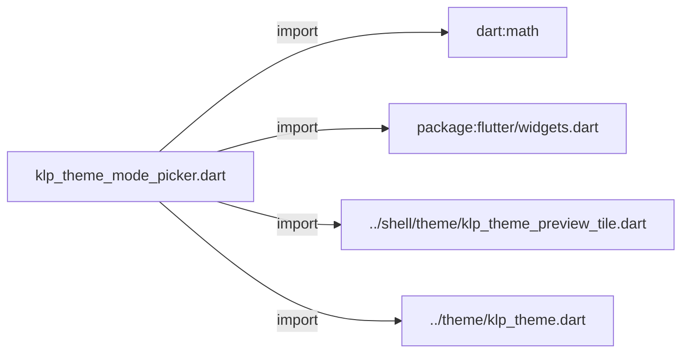
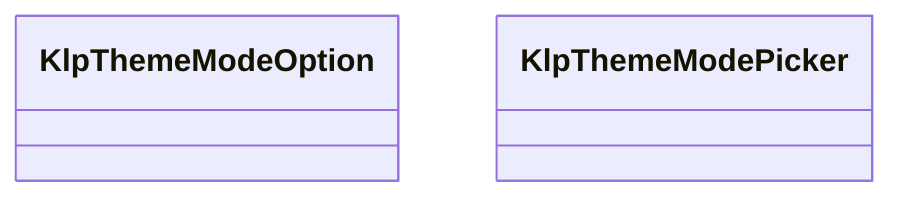
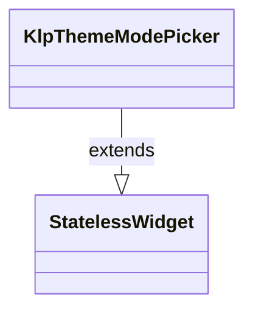

# klp_theme_mode_picker.dart：直接依賴與宣告架構

[回到目錄](README.md) · [來源檔案](../../../../lib/src/settings/klp_theme_mode_picker.dart)

## 範圍

核心是 `lib/src/settings/klp_theme_mode_picker.dart`。主要視角為該檔案明寫的 import／export／part；輔助視角為本檔宣告及 extends／implements／with／on 關係。只展開一層外部邊界。

## 直接依賴圖

## 依賴證據

| 關係 | 原始 directive | 來源 |
|---|---|---|
| import | <code>import &#x27;dart:math&#x27; as math;</code> | [lib/src/settings/klp_theme_mode_picker.dart:1](../../../../lib/src/settings/klp_theme_mode_picker.dart#L1) |
| import | <code>import &#x27;package:flutter/widgets.dart&#x27;;</code> | [lib/src/settings/klp_theme_mode_picker.dart:3](../../../../lib/src/settings/klp_theme_mode_picker.dart#L3) |
| import | <code>import &#x27;../shell/theme/klp_theme_preview_tile.dart&#x27;;</code> | [lib/src/settings/klp_theme_mode_picker.dart:5](../../../../lib/src/settings/klp_theme_mode_picker.dart#L5) |
| import | <code>import &#x27;../theme/klp_theme.dart&#x27;;</code> | [lib/src/settings/klp_theme_mode_picker.dart:6](../../../../lib/src/settings/klp_theme_mode_picker.dart#L6) |

## 宣告關係圖

本組節點是本檔宣告；沒有箭頭的宣告未在此圖主張互相依賴。

## 宣告與成員證據

成員包含 public 與 private；簽章取自來源，省略函式本體與欄位初始值。`(inferred)` 表示來源未明寫型別；建構子只顯示參數部分，不含初始化列表。

### KlpThemeModeOption

ClassDeclaration · public · [lib/src/settings/klp_theme_mode_picker.dart:8](../../../../lib/src/settings/klp_theme_mode_picker.dart#L8)

<code>class KlpThemeModeOption</code>

來源註解摘要：顏色模式預覽的文案與可用狀態。

| 成員 | 可見性 | 簽章／型別 | 來源註解摘要 | 證據 |
|---|---|---|---|---|
| constructor <code>KlpThemeModeOption</code> | public | <code>const KlpThemeModeOption({ required this.mode, required this.label, required this.description, this.enabled = true, })</code> |  | [lib/src/settings/klp_theme_mode_picker.dart:11](../../../../lib/src/settings/klp_theme_mode_picker.dart#L11) |
| field <code>mode</code> | public | <code>final KlpThemePreviewMode mode</code> |  | [lib/src/settings/klp_theme_mode_picker.dart:18](../../../../lib/src/settings/klp_theme_mode_picker.dart#L18) |
| field <code>label</code> | public | <code>final String label</code> |  | [lib/src/settings/klp_theme_mode_picker.dart:19](../../../../lib/src/settings/klp_theme_mode_picker.dart#L19) |
| field <code>description</code> | public | <code>final String description</code> |  | [lib/src/settings/klp_theme_mode_picker.dart:20](../../../../lib/src/settings/klp_theme_mode_picker.dart#L20) |
| field <code>enabled</code> | public | <code>final bool enabled</code> |  | [lib/src/settings/klp_theme_mode_picker.dart:21](../../../../lib/src/settings/klp_theme_mode_picker.dart#L21) |

### KlpThemeModePicker

ClassDeclaration · public · [lib/src/settings/klp_theme_mode_picker.dart:24](../../../../lib/src/settings/klp_theme_mode_picker.dart#L24)

<code>class KlpThemeModePicker extends StatelessWidget</code>

來源註解摘要：以 Kallopis 預覽磚排列受控的顏色模式選項。

- `extends` → <code>StatelessWidget</code>：[lib/src/settings/klp_theme_mode_picker.dart:25](../../../../lib/src/settings/klp_theme_mode_picker.dart#L25)

| 成員 | 可見性 | 簽章／型別 | 來源註解摘要 | 證據 |
|---|---|---|---|---|
| constructor <code>KlpThemeModePicker</code> | public | <code>const KlpThemeModePicker({ super.key, required this.options, required this.selected, required this.onSelected, })</code> |  | [lib/src/settings/klp_theme_mode_picker.dart:26](../../../../lib/src/settings/klp_theme_mode_picker.dart#L26) |
| field <code>options</code> | public | <code>final List&lt;KlpThemeModeOption&gt; options</code> |  | [lib/src/settings/klp_theme_mode_picker.dart:33](../../../../lib/src/settings/klp_theme_mode_picker.dart#L33) |
| field <code>selected</code> | public | <code>final KlpThemePreviewMode selected</code> |  | [lib/src/settings/klp_theme_mode_picker.dart:34](../../../../lib/src/settings/klp_theme_mode_picker.dart#L34) |
| field <code>onSelected</code> | public | <code>final ValueChanged&lt;KlpThemePreviewMode&gt; onSelected</code> |  | [lib/src/settings/klp_theme_mode_picker.dart:35](../../../../lib/src/settings/klp_theme_mode_picker.dart#L35) |
| method <code>build</code> | public | <code>Widget build(BuildContext context)</code> |  | [lib/src/settings/klp_theme_mode_picker.dart:37](../../../../lib/src/settings/klp_theme_mode_picker.dart#L37) |

## 閱讀說明與限制

箭頭只表示來源明寫的靜態關係；import 不等於呼叫。未分析動態呼叫、欄位的實際物件擁有權、狀態轉移或渲染流程；型別未進行語意解析，繼承目標保留原始型別拼寫。public／private 依 Dart 名稱前綴判斷；public 宣告不代表已由 `lib/kallopis.dart` 匯出。

本頁由 `tool/architecture_atlas` 產生；編輯來源或生成工具後重新產生，避免手改本頁。
