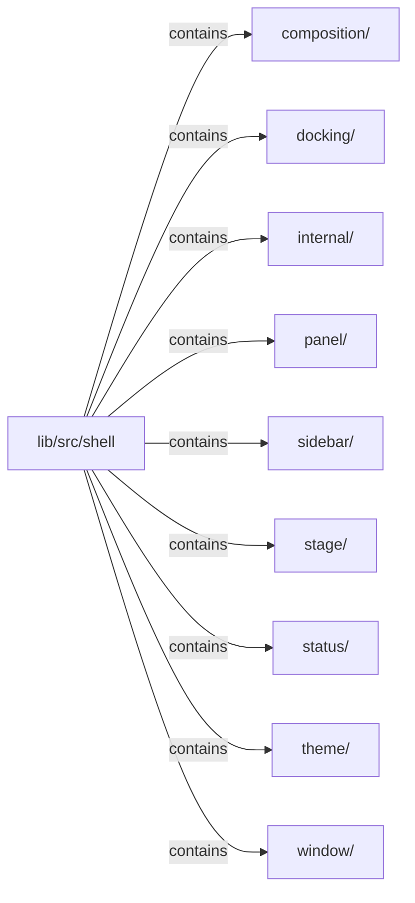

# lib/src/shell：架構分析入口

[上一層](../README.md)

## 範圍

閱讀 `lib/src/shell` 的直接子目錄與 Dart 檔案。結構圖表示實際檔案包含關係；依賴圖表示本層檔案明寫的 directives。每個檔案頁另列直接依賴、宣告、欄位、方法、建構子及行號證據。

## 模組閱讀重點

## 分析入口

此目錄提供工作台、window header、stage、panel 與狀態列的版面外殼；`KlpWorkbenchShell` 是主要組合入口。`docking/` 獨立持有 dock layout、models、header 與 panel；其 `internal/` 檔案是 layout 的 part。根層 `internal/` 另放 panel padding 與 header 支援，不能與 docking 內部單元混為一層。

| 想回答的問題 | 精確符號與來源 |
| --- | --- |
| 一般 shell 與 dock 模式從哪裡讀？ | `KlpWorkbenchShell`：lib/src/shell/klp_workbench_shell.dart:28 |
| Dock 的 state 與主要實作在哪裡？ | `KlpDockLayout`、`_KlpDockLayoutState`：lib/src/shell/docking/klp_dock_layout.dart:14、47 |
| 哪個 library 擁有 dock 的內部 part？ | part directives：lib/src/shell/docking/klp_dock_layout.dart:11、12 |

重要依賴：`klp_workbench_shell.dart:200` 實際建構 `KlpDockLayout`。同檔 :3–4 匯入 layout／theme；part 納入表示 library 所有權，不是執行時呼叫。此庫的 dock 能力不等於任何消費產品已啟用 split。

## 本層直接依賴圖

箭頭以本層 Dart 檔案明寫的 directive 彙總到目標所在目錄或外部套件邊界；不遞迴將子目錄依賴算入本層。相同目標的不同 directive 類型分開計數。

本層檔案未宣告跨目錄依賴；子目錄依賴請循下一層入口閱讀。

| 目標邊界 | 關係 | directive 數 | 第一筆來源證據 |
|---|---|---|---|
| 無 | — | 0 | 來源清單見本層檔案 |

## 目錄結構圖

## 子目錄

| 目錄 | 導航 | 來源證據 |
|---|---|---|
| `composition/` | [架構入口](composition/README.md) | [來源目錄](../../../../lib/src/shell/composition) |
| `docking/` | [架構入口](docking/README.md) | [來源目錄](../../../../lib/src/shell/docking) |
| `internal/` | [架構入口](internal/README.md) | [來源目錄](../../../../lib/src/shell/internal) |
| `panel/` | [架構入口](panel/README.md) | [來源目錄](../../../../lib/src/shell/panel) |
| `sidebar/` | [架構入口](sidebar/README.md) | [來源目錄](../../../../lib/src/shell/sidebar) |
| `stage/` | [架構入口](stage/README.md) | [來源目錄](../../../../lib/src/shell/stage) |
| `status/` | [架構入口](status/README.md) | [來源目錄](../../../../lib/src/shell/status) |
| `theme/` | [架構入口](theme/README.md) | [來源目錄](../../../../lib/src/shell/theme) |
| `window/` | [架構入口](window/README.md) | [來源目錄](../../../../lib/src/shell/window) |

## 本層檔案

| 檔案 | 宣告 | 細節 | 來源證據 |
|---|---|---|---|
| 無 | 本層沒有 Dart 檔案 | — | — |

## 閱讀說明

箭頭只表示來源明寫的靜態關係；import 不等於呼叫。未分析動態呼叫、欄位的實際物件擁有權、狀態轉移或渲染流程；型別未進行語意解析，繼承目標保留原始型別拼寫。public／private 依 Dart 名稱前綴判斷；public 宣告不代表已由 `lib/kallopis.dart` 匯出。

本頁的目錄與檔案由來源清冊產生；`manifest.json` 位於本圖集根目錄，可核對 SHA-256 與覆蓋數。人工模組摘要存於 `tool/architecture_atlas/briefs/`，重新生成時保留。
