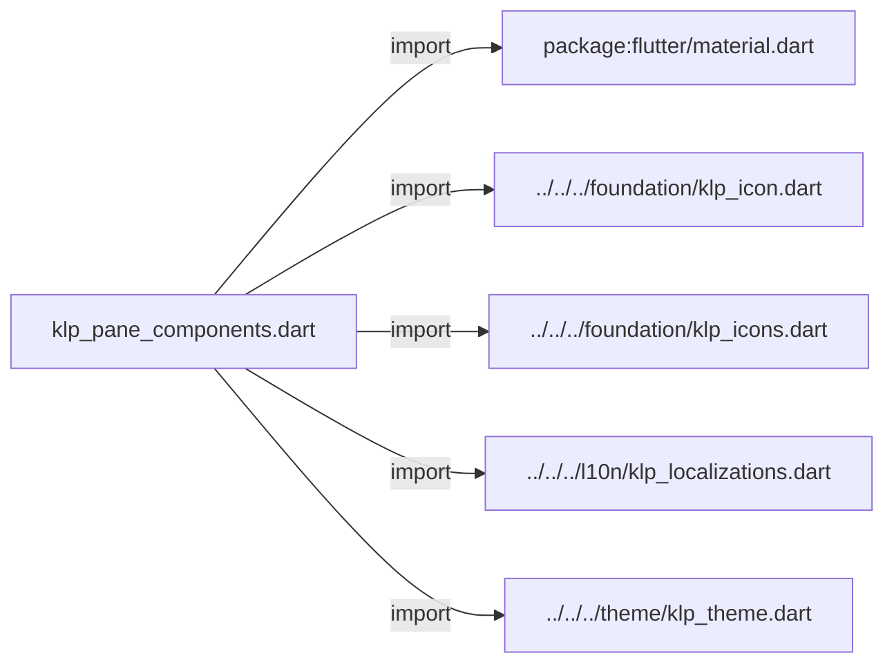
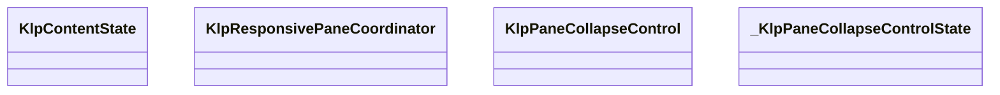
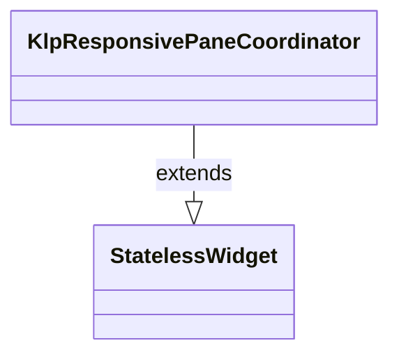
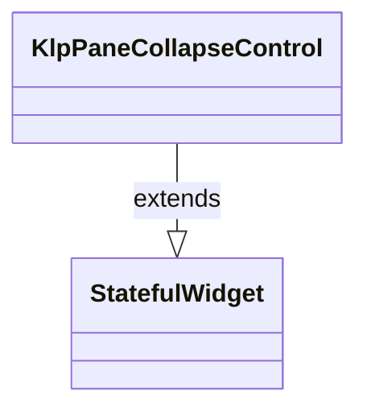
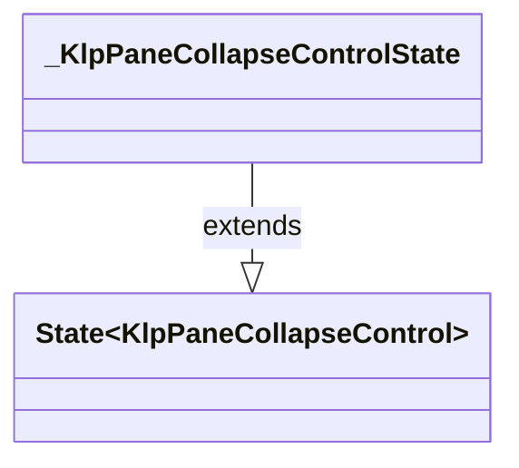

# klp_pane_components.dart：直接依賴與宣告架構

[回到目錄](README.md) · [來源檔案](../../../../../../lib/src/shell/composition/pane/klp_pane_components.dart)

## 範圍

核心是 `lib/src/shell/composition/pane/klp_pane_components.dart`。主要視角為該檔案明寫的 import／export／part；輔助視角為本檔宣告及 extends／implements／with／on 關係。只展開一層外部邊界。

## 直接依賴圖

## 依賴證據

| 關係 | 原始 directive | 來源 |
|---|---|---|
| import | <code>import &#x27;package:flutter/material.dart&#x27;;</code> | [lib/src/shell/composition/pane/klp_pane_components.dart:1](../../../../../../lib/src/shell/composition/pane/klp_pane_components.dart#L1) |
| import | <code>import &#x27;../../../foundation/klp_icon.dart&#x27;;</code> | [lib/src/shell/composition/pane/klp_pane_components.dart:3](../../../../../../lib/src/shell/composition/pane/klp_pane_components.dart#L3) |
| import | <code>import &#x27;../../../foundation/klp_icons.dart&#x27;;</code> | [lib/src/shell/composition/pane/klp_pane_components.dart:4](../../../../../../lib/src/shell/composition/pane/klp_pane_components.dart#L4) |
| import | <code>import &#x27;../../../l10n/klp_localizations.dart&#x27;;</code> | [lib/src/shell/composition/pane/klp_pane_components.dart:5](../../../../../../lib/src/shell/composition/pane/klp_pane_components.dart#L5) |
| import | <code>import &#x27;../../../theme/klp_theme.dart&#x27;;</code> | [lib/src/shell/composition/pane/klp_pane_components.dart:6](../../../../../../lib/src/shell/composition/pane/klp_pane_components.dart#L6) |

## 宣告關係圖

本組節點是本檔宣告；沒有箭頭的宣告未在此圖主張互相依賴。

## 宣告與成員證據

成員包含 public 與 private；簽章取自來源，省略函式本體與欄位初始值。`(inferred)` 表示來源未明寫型別；建構子只顯示參數部分，不含初始化列表。

### KlpContentState

EnumDeclaration · public · [lib/src/shell/composition/pane/klp_pane_components.dart:8](../../../../../../lib/src/shell/composition/pane/klp_pane_components.dart#L8)

<code>enum KlpContentState</code>

來源註解摘要：可由產品呈現的內容狀態。

| 成員 | 可見性 | 簽章／型別 | 來源註解摘要 | 證據 |
|---|---|---|---|---|
| enum value <code>loading</code> | public | <code>loading</code> |  | [lib/src/shell/composition/pane/klp_pane_components.dart:9](../../../../../../lib/src/shell/composition/pane/klp_pane_components.dart#L9) |
| enum value <code>ready</code> | public | <code>ready</code> |  | [lib/src/shell/composition/pane/klp_pane_components.dart:9](../../../../../../lib/src/shell/composition/pane/klp_pane_components.dart#L9) |
| enum value <code>empty</code> | public | <code>empty</code> |  | [lib/src/shell/composition/pane/klp_pane_components.dart:9](../../../../../../lib/src/shell/composition/pane/klp_pane_components.dart#L9) |
| enum value <code>error</code> | public | <code>error</code> |  | [lib/src/shell/composition/pane/klp_pane_components.dart:9](../../../../../../lib/src/shell/composition/pane/klp_pane_components.dart#L9) |
| enum value <code>permission</code> | public | <code>permission</code> |  | [lib/src/shell/composition/pane/klp_pane_components.dart:9](../../../../../../lib/src/shell/composition/pane/klp_pane_components.dart#L9) |

### KlpResponsivePaneCoordinator

ClassDeclaration · public · [lib/src/shell/composition/pane/klp_pane_components.dart:11](../../../../../../lib/src/shell/composition/pane/klp_pane_components.dart#L11)

<code>class KlpResponsivePaneCoordinator extends StatelessWidget</code>

來源註解摘要：依可用寬度切換 Pane 呈現的協調器。

- `extends` → <code>StatelessWidget</code>：[lib/src/shell/composition/pane/klp_pane_components.dart:12](../../../../../../lib/src/shell/composition/pane/klp_pane_components.dart#L12)

| 成員 | 可見性 | 簽章／型別 | 來源註解摘要 | 證據 |
|---|---|---|---|---|
| constructor <code>KlpResponsivePaneCoordinator</code> | public | <code>const KlpResponsivePaneCoordinator({ super.key, required this.wide, required this.compact, this.breakpoint = 960, })</code> |  | [lib/src/shell/composition/pane/klp_pane_components.dart:13](../../../../../../lib/src/shell/composition/pane/klp_pane_components.dart#L13) |
| field <code>wide</code> | public | <code>final Widget wide</code> |  | [lib/src/shell/composition/pane/klp_pane_components.dart:20](../../../../../../lib/src/shell/composition/pane/klp_pane_components.dart#L20) |
| field <code>compact</code> | public | <code>final Widget compact</code> |  | [lib/src/shell/composition/pane/klp_pane_components.dart:21](../../../../../../lib/src/shell/composition/pane/klp_pane_components.dart#L21) |
| field <code>breakpoint</code> | public | <code>final double breakpoint</code> |  | [lib/src/shell/composition/pane/klp_pane_components.dart:22](../../../../../../lib/src/shell/composition/pane/klp_pane_components.dart#L22) |
| method <code>build</code> | public | <code>Widget build(BuildContext context)</code> |  | [lib/src/shell/composition/pane/klp_pane_components.dart:24](../../../../../../lib/src/shell/composition/pane/klp_pane_components.dart#L24) |

### KlpPaneCollapseControl

ClassDeclaration · public · [lib/src/shell/composition/pane/klp_pane_components.dart:33](../../../../../../lib/src/shell/composition/pane/klp_pane_components.dart#L33)

<code>class KlpPaneCollapseControl extends StatefulWidget</code>

來源註解摘要：Pane 的收合互動控制。

- `extends` → <code>StatefulWidget</code>：[lib/src/shell/composition/pane/klp_pane_components.dart:34](../../../../../../lib/src/shell/composition/pane/klp_pane_components.dart#L34)

| 成員 | 可見性 | 簽章／型別 | 來源註解摘要 | 證據 |
|---|---|---|---|---|
| constructor <code>KlpPaneCollapseControl</code> | public | <code>const KlpPaneCollapseControl({ super.key, this.icon, this.label, required this.collapsed, required this.onToggle, })</code> |  | [lib/src/shell/composition/pane/klp_pane_components.dart:35](../../../../../../lib/src/shell/composition/pane/klp_pane_components.dart#L35) |
| field <code>icon</code> | public | <code>final KlpIconData? icon</code> |  | [lib/src/shell/composition/pane/klp_pane_components.dart:43](../../../../../../lib/src/shell/composition/pane/klp_pane_components.dart#L43) |
| field <code>label</code> | public | <code>final String? label</code> |  | [lib/src/shell/composition/pane/klp_pane_components.dart:44](../../../../../../lib/src/shell/composition/pane/klp_pane_components.dart#L44) |
| field <code>collapsed</code> | public | <code>final bool collapsed</code> |  | [lib/src/shell/composition/pane/klp_pane_components.dart:45](../../../../../../lib/src/shell/composition/pane/klp_pane_components.dart#L45) |
| field <code>onToggle</code> | public | <code>final VoidCallback? onToggle</code> |  | [lib/src/shell/composition/pane/klp_pane_components.dart:46](../../../../../../lib/src/shell/composition/pane/klp_pane_components.dart#L46) |
| method <code>createState</code> | public | <code>State&lt;KlpPaneCollapseControl&gt; createState()</code> |  | [lib/src/shell/composition/pane/klp_pane_components.dart:48](../../../../../../lib/src/shell/composition/pane/klp_pane_components.dart#L48) |

### _KlpPaneCollapseControlState

ClassDeclaration · private · [lib/src/shell/composition/pane/klp_pane_components.dart:52](../../../../../../lib/src/shell/composition/pane/klp_pane_components.dart#L52)

<code>class _KlpPaneCollapseControlState extends State&lt;KlpPaneCollapseControl&gt;</code>

- `extends` → <code>State&lt;KlpPaneCollapseControl&gt;</code>：[lib/src/shell/composition/pane/klp_pane_components.dart:52](../../../../../../lib/src/shell/composition/pane/klp_pane_components.dart#L52)

| 成員 | 可見性 | 簽章／型別 | 來源註解摘要 | 證據 |
|---|---|---|---|---|
| field <code>_hovered</code> | private | <code>bool _hovered</code> |  | [lib/src/shell/composition/pane/klp_pane_components.dart:53](../../../../../../lib/src/shell/composition/pane/klp_pane_components.dart#L53) |
| method <code>build</code> | public | <code>Widget build(BuildContext context)</code> |  | [lib/src/shell/composition/pane/klp_pane_components.dart:55](../../../../../../lib/src/shell/composition/pane/klp_pane_components.dart#L55) |

## 閱讀說明與限制

箭頭只表示來源明寫的靜態關係；import 不等於呼叫。未分析動態呼叫、欄位的實際物件擁有權、狀態轉移或渲染流程；型別未進行語意解析，繼承目標保留原始型別拼寫。public／private 依 Dart 名稱前綴判斷；public 宣告不代表已由 `lib/kallopis.dart` 匯出。

本頁由 `tool/architecture_atlas` 產生；編輯來源或生成工具後重新產生，避免手改本頁。
