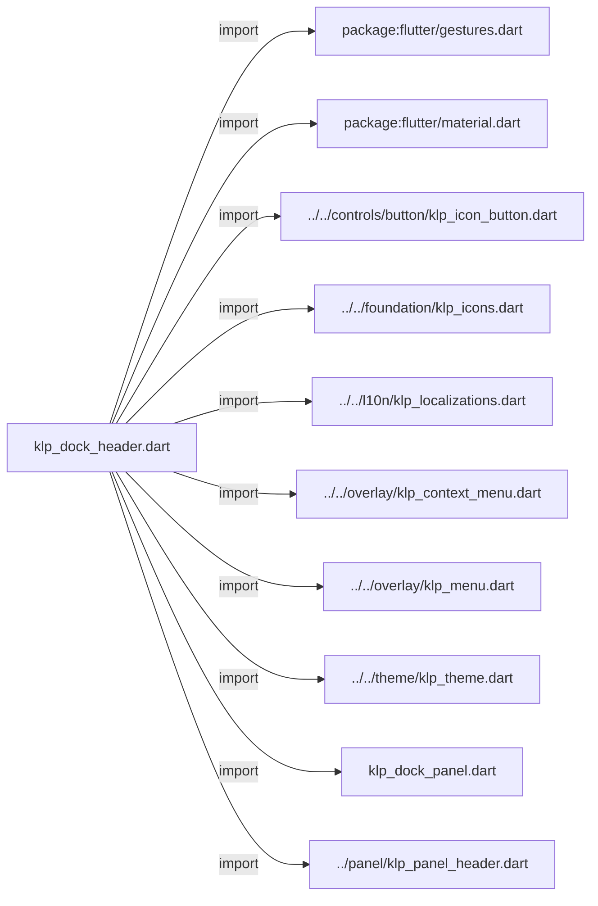
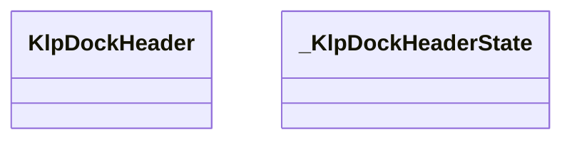
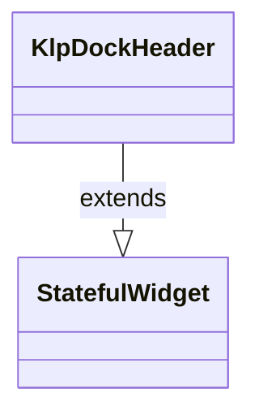
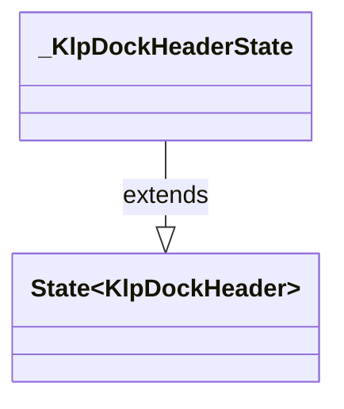

# klp_dock_header.dart：直接依賴與宣告架構

[回到目錄](README.md) · [來源檔案](../../../../../lib/src/shell/docking/klp_dock_header.dart)

## 範圍

核心是 `lib/src/shell/docking/klp_dock_header.dart`。主要視角為該檔案明寫的 import／export／part；輔助視角為本檔宣告及 extends／implements／with／on 關係。只展開一層外部邊界。

## 直接依賴圖

## 依賴證據

| 關係 | 原始 directive | 來源 |
|---|---|---|
| import | <code>import &#x27;package:flutter/gestures.dart&#x27;;</code> | [lib/src/shell/docking/klp_dock_header.dart:1](../../../../../lib/src/shell/docking/klp_dock_header.dart#L1) |
| import | <code>import &#x27;package:flutter/material.dart&#x27;;</code> | [lib/src/shell/docking/klp_dock_header.dart:2](../../../../../lib/src/shell/docking/klp_dock_header.dart#L2) |
| import | <code>import &#x27;../../controls/button/klp_icon_button.dart&#x27;;</code> | [lib/src/shell/docking/klp_dock_header.dart:4](../../../../../lib/src/shell/docking/klp_dock_header.dart#L4) |
| import | <code>import &#x27;../../foundation/klp_icons.dart&#x27;;</code> | [lib/src/shell/docking/klp_dock_header.dart:5](../../../../../lib/src/shell/docking/klp_dock_header.dart#L5) |
| import | <code>import &#x27;../../l10n/klp_localizations.dart&#x27;;</code> | [lib/src/shell/docking/klp_dock_header.dart:6](../../../../../lib/src/shell/docking/klp_dock_header.dart#L6) |
| import | <code>import &#x27;../../overlay/klp_context_menu.dart&#x27;;</code> | [lib/src/shell/docking/klp_dock_header.dart:7](../../../../../lib/src/shell/docking/klp_dock_header.dart#L7) |
| import | <code>import &#x27;../../overlay/klp_menu.dart&#x27;;</code> | [lib/src/shell/docking/klp_dock_header.dart:8](../../../../../lib/src/shell/docking/klp_dock_header.dart#L8) |
| import | <code>import &#x27;../../theme/klp_theme.dart&#x27;;</code> | [lib/src/shell/docking/klp_dock_header.dart:9](../../../../../lib/src/shell/docking/klp_dock_header.dart#L9) |
| import | <code>import &#x27;klp_dock_panel.dart&#x27;;</code> | [lib/src/shell/docking/klp_dock_header.dart:10](../../../../../lib/src/shell/docking/klp_dock_header.dart#L10) |
| import | <code>import &#x27;../panel/klp_panel_header.dart&#x27;;</code> | [lib/src/shell/docking/klp_dock_header.dart:11](../../../../../lib/src/shell/docking/klp_dock_header.dart#L11) |

## 宣告關係圖

本組節點是本檔宣告；沒有箭頭的宣告未在此圖主張互相依賴。

## 宣告與成員證據

成員包含 public 與 private；簽章取自來源，省略函式本體與欄位初始值。`(inferred)` 表示來源未明寫型別；建構子只顯示參數部分，不含初始化列表。

### KlpDockHeaderDragRegionBuilder

GenericTypeAlias · public · [lib/src/shell/docking/klp_dock_header.dart:13](../../../../../lib/src/shell/docking/klp_dock_header.dart#L13)

<code>typedef KlpDockHeaderDragRegionBuilder = Widget Function(Widget child);</code>

### KlpDockHeader

ClassDeclaration · public · [lib/src/shell/docking/klp_dock_header.dart:15](../../../../../lib/src/shell/docking/klp_dock_header.dart#L15)

<code>class KlpDockHeader extends StatefulWidget</code>

來源註解摘要：Dock Group 專用的緊湊 Header。 左側區域可由 Layout 包成拖曳來源；右側 actions 是獨立 clickable 區域， 因此操作按鈕不會誤觸 panel 拖曳。

- `extends` → <code>StatefulWidget</code>：[lib/src/shell/docking/klp_dock_header.dart:19](../../../../../lib/src/shell/docking/klp_dock_header.dart#L19)

| 成員 | 可見性 | 簽章／型別 | 來源註解摘要 | 證據 |
|---|---|---|---|---|
| field <code>extent</code> | public | <code>static const double extent</code> |  | [lib/src/shell/docking/klp_dock_header.dart:20](../../../../../lib/src/shell/docking/klp_dock_header.dart#L20) |
| constructor <code>KlpDockHeader</code> | public | <code>const KlpDockHeader({ super.key, required this.leading, this.actions = const [], this.dragRegionBuilder, })</code> |  | [lib/src/shell/docking/klp_dock_header.dart:22](../../../../../lib/src/shell/docking/klp_dock_header.dart#L22) |
| field <code>leading</code> | public | <code>final Widget leading</code> |  | [lib/src/shell/docking/klp_dock_header.dart:29](../../../../../lib/src/shell/docking/klp_dock_header.dart#L29) |
| field <code>actions</code> | public | <code>final List&lt;KlpDockHeaderAction&gt; actions</code> |  | [lib/src/shell/docking/klp_dock_header.dart:30](../../../../../lib/src/shell/docking/klp_dock_header.dart#L30) |
| field <code>dragRegionBuilder</code> | public | <code>final KlpDockHeaderDragRegionBuilder? dragRegionBuilder</code> |  | [lib/src/shell/docking/klp_dock_header.dart:31](../../../../../lib/src/shell/docking/klp_dock_header.dart#L31) |
| method <code>createState</code> | public | <code>State&lt;KlpDockHeader&gt; createState()</code> |  | [lib/src/shell/docking/klp_dock_header.dart:33](../../../../../lib/src/shell/docking/klp_dock_header.dart#L33) |

### _KlpDockHeaderState

ClassDeclaration · private · [lib/src/shell/docking/klp_dock_header.dart:37](../../../../../lib/src/shell/docking/klp_dock_header.dart#L37)

<code>class _KlpDockHeaderState extends State&lt;KlpDockHeader&gt;</code>

- `extends` → <code>State&lt;KlpDockHeader&gt;</code>：[lib/src/shell/docking/klp_dock_header.dart:37](../../../../../lib/src/shell/docking/klp_dock_header.dart#L37)

| 成員 | 可見性 | 簽章／型別 | 來源註解摘要 | 證據 |
|---|---|---|---|---|
| field <code>_scrollController</code> | private | <code>final ScrollController _scrollController</code> |  | [lib/src/shell/docking/klp_dock_header.dart:38](../../../../../lib/src/shell/docking/klp_dock_header.dart#L38) |
| field <code>_menuController</code> | private | <code>final KlpContextMenuController _menuController</code> |  | [lib/src/shell/docking/klp_dock_header.dart:39](../../../../../lib/src/shell/docking/klp_dock_header.dart#L39) |
| method <code>dispose</code> | public | <code>void dispose()</code> |  | [lib/src/shell/docking/klp_dock_header.dart:41](../../../../../lib/src/shell/docking/klp_dock_header.dart#L41) |
| method <code>_handlePointerSignal</code> | private | <code>void _handlePointerSignal(PointerSignalEvent event)</code> |  | [lib/src/shell/docking/klp_dock_header.dart:47](../../../../../lib/src/shell/docking/klp_dock_header.dart#L47) |
| method <code>build</code> | public | <code>Widget build(BuildContext context)</code> |  | [lib/src/shell/docking/klp_dock_header.dart:61](../../../../../lib/src/shell/docking/klp_dock_header.dart#L61) |

## 閱讀說明與限制

箭頭只表示來源明寫的靜態關係；import 不等於呼叫。未分析動態呼叫、欄位的實際物件擁有權、狀態轉移或渲染流程；型別未進行語意解析，繼承目標保留原始型別拼寫。public／private 依 Dart 名稱前綴判斷；public 宣告不代表已由 `lib/kallopis.dart` 匯出。

本頁由 `tool/architecture_atlas` 產生；編輯來源或生成工具後重新產生，避免手改本頁。
