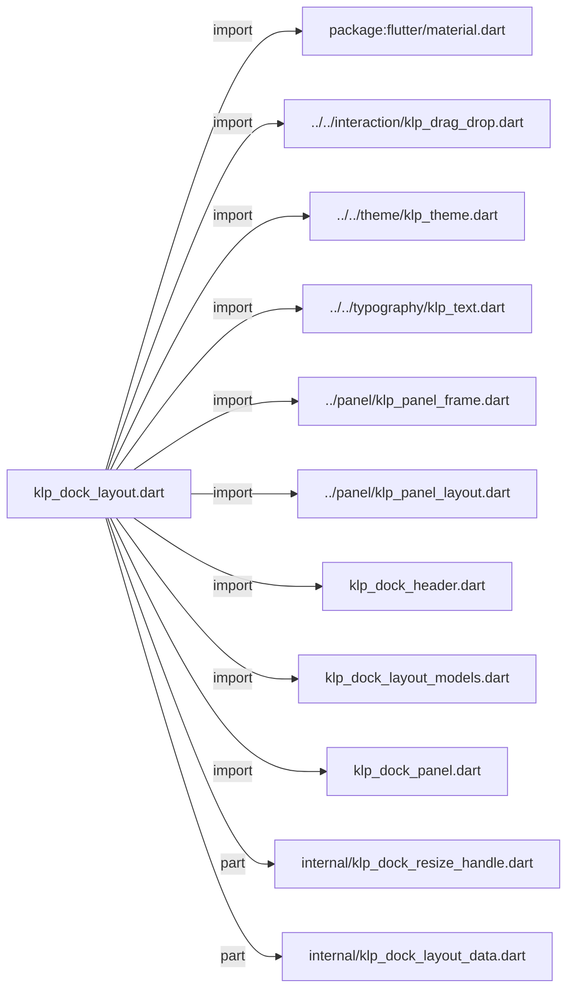
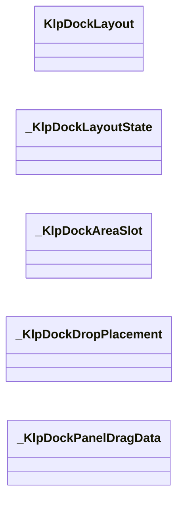
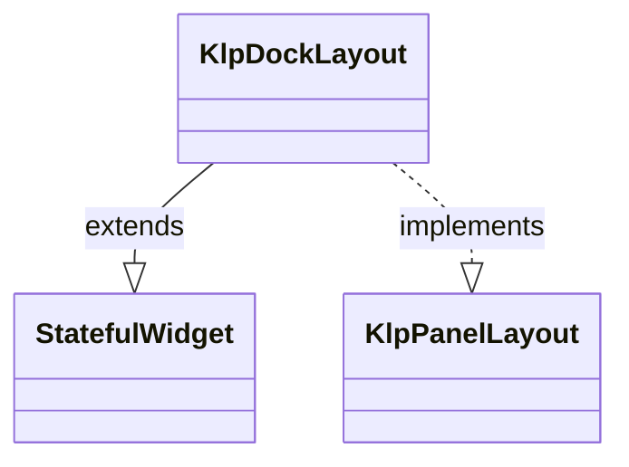
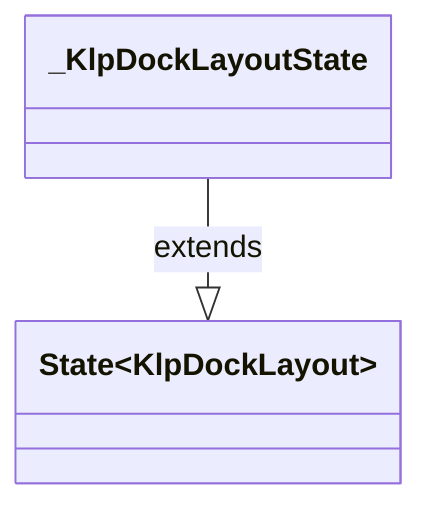

# klp_dock_layout.dart：直接依賴與宣告架構

[回到目錄](README.md) · [來源檔案](../../../../../lib/src/shell/docking/klp_dock_layout.dart)

## 範圍

核心是 `lib/src/shell/docking/klp_dock_layout.dart`。主要視角為該檔案明寫的 import／export／part；輔助視角為本檔宣告及 extends／implements／with／on 關係。只展開一層外部邊界。

## 直接依賴圖

## 依賴證據

| 關係 | 原始 directive | 來源 |
|---|---|---|
| import | <code>import &#x27;package:flutter/material.dart&#x27;;</code> | [lib/src/shell/docking/klp_dock_layout.dart:1](../../../../../lib/src/shell/docking/klp_dock_layout.dart#L1) |
| import | <code>import &#x27;../../interaction/klp_drag_drop.dart&#x27;;</code> | [lib/src/shell/docking/klp_dock_layout.dart:3](../../../../../lib/src/shell/docking/klp_dock_layout.dart#L3) |
| import | <code>import &#x27;../../theme/klp_theme.dart&#x27;;</code> | [lib/src/shell/docking/klp_dock_layout.dart:4](../../../../../lib/src/shell/docking/klp_dock_layout.dart#L4) |
| import | <code>import &#x27;../../typography/klp_text.dart&#x27;;</code> | [lib/src/shell/docking/klp_dock_layout.dart:5](../../../../../lib/src/shell/docking/klp_dock_layout.dart#L5) |
| import | <code>import &#x27;../panel/klp_panel_frame.dart&#x27;;</code> | [lib/src/shell/docking/klp_dock_layout.dart:6](../../../../../lib/src/shell/docking/klp_dock_layout.dart#L6) |
| import | <code>import &#x27;../panel/klp_panel_layout.dart&#x27;;</code> | [lib/src/shell/docking/klp_dock_layout.dart:7](../../../../../lib/src/shell/docking/klp_dock_layout.dart#L7) |
| import | <code>import &#x27;klp_dock_header.dart&#x27;;</code> | [lib/src/shell/docking/klp_dock_layout.dart:8](../../../../../lib/src/shell/docking/klp_dock_layout.dart#L8) |
| import | <code>import &#x27;klp_dock_layout_models.dart&#x27;;</code> | [lib/src/shell/docking/klp_dock_layout.dart:9](../../../../../lib/src/shell/docking/klp_dock_layout.dart#L9) |
| import | <code>import &#x27;klp_dock_panel.dart&#x27;;</code> | [lib/src/shell/docking/klp_dock_layout.dart:10](../../../../../lib/src/shell/docking/klp_dock_layout.dart#L10) |
| part | <code>part &#x27;internal/klp_dock_resize_handle.dart&#x27;;</code> | [lib/src/shell/docking/klp_dock_layout.dart:12](../../../../../lib/src/shell/docking/klp_dock_layout.dart#L12) |
| part | <code>part &#x27;internal/klp_dock_layout_data.dart&#x27;;</code> | [lib/src/shell/docking/klp_dock_layout.dart:13](../../../../../lib/src/shell/docking/klp_dock_layout.dart#L13) |

## 宣告關係圖

本組節點是本檔宣告；沒有箭頭的宣告未在此圖主張互相依賴。

## 宣告與成員證據

成員包含 public 與 private；簽章取自來源，省略函式本體與欄位初始值。`(inferred)` 表示來源未明寫型別；建構子只顯示參數部分，不含初始化列表。

### KlpDockLayout

ClassDeclaration · public · [lib/src/shell/docking/klp_dock_layout.dart:15](../../../../../lib/src/shell/docking/klp_dock_layout.dart#L15)

<code>class KlpDockLayout extends StatefulWidget implements KlpPanelLayout</code>

- `extends` → <code>StatefulWidget</code>：[lib/src/shell/docking/klp_dock_layout.dart:15](../../../../../lib/src/shell/docking/klp_dock_layout.dart#L15)
- `implements` → <code>KlpPanelLayout</code>：[lib/src/shell/docking/klp_dock_layout.dart:15](../../../../../lib/src/shell/docking/klp_dock_layout.dart#L15)

| 成員 | 可見性 | 簽章／型別 | 來源註解摘要 | 證據 |
|---|---|---|---|---|
| constructor <code>KlpDockLayout</code> | public | <code>const KlpDockLayout({ super.key, required this.stage, required this.panels, required this.layout, required this.onLayoutChanged, required this.leftConstraints, required this.rightConstraints, this.bottomConstraints, })</code> |  | [lib/src/shell/docking/klp_dock_layout.dart:16](../../../../../lib/src/shell/docking/klp_dock_layout.dart#L16) |
| field <code>stage</code> | public | <code>final KlpPanelFrame stage</code> |  | [lib/src/shell/docking/klp_dock_layout.dart:27](../../../../../lib/src/shell/docking/klp_dock_layout.dart#L27) |
| field <code>panels</code> | public | <code>final List&lt;KlpDockPanel&gt; panels</code> |  | [lib/src/shell/docking/klp_dock_layout.dart:28](../../../../../lib/src/shell/docking/klp_dock_layout.dart#L28) |
| field <code>layout</code> | public | <code>final KlpDockLayoutData layout</code> |  | [lib/src/shell/docking/klp_dock_layout.dart:29](../../../../../lib/src/shell/docking/klp_dock_layout.dart#L29) |
| field <code>onLayoutChanged</code> | public | <code>final ValueChanged&lt;KlpDockLayoutData&gt; onLayoutChanged</code> |  | [lib/src/shell/docking/klp_dock_layout.dart:30](../../../../../lib/src/shell/docking/klp_dock_layout.dart#L30) |
| field <code>leftConstraints</code> | public | <code>final KlpDockAreaConstraints leftConstraints</code> |  | [lib/src/shell/docking/klp_dock_layout.dart:31](../../../../../lib/src/shell/docking/klp_dock_layout.dart#L31) |
| field <code>rightConstraints</code> | public | <code>final KlpDockAreaConstraints rightConstraints</code> |  | [lib/src/shell/docking/klp_dock_layout.dart:32](../../../../../lib/src/shell/docking/klp_dock_layout.dart#L32) |
| field <code>bottomConstraints</code> | public | <code>final KlpDockAreaConstraints? bottomConstraints</code> | Bottom 可用時的高度限制；沒有任何 Bottom-capable panel 時可省略。 | [lib/src/shell/docking/klp_dock_layout.dart:35](../../../../../lib/src/shell/docking/klp_dock_layout.dart#L35) |
| method <code>createState</code> | public | <code>State&lt;KlpDockLayout&gt; createState()</code> |  | [lib/src/shell/docking/klp_dock_layout.dart:37](../../../../../lib/src/shell/docking/klp_dock_layout.dart#L37) |
| method <code>buildPanelLayout</code> | public | <code>Widget buildPanelLayout(BuildContext context)</code> |  | [lib/src/shell/docking/klp_dock_layout.dart:40](../../../../../lib/src/shell/docking/klp_dock_layout.dart#L40) |

### _KlpDockLayoutState

ClassDeclaration · private · [lib/src/shell/docking/klp_dock_layout.dart:44](../../../../../lib/src/shell/docking/klp_dock_layout.dart#L44)

<code>class _KlpDockLayoutState extends State&lt;KlpDockLayout&gt;</code>

- `extends` → <code>State&lt;KlpDockLayout&gt;</code>：[lib/src/shell/docking/klp_dock_layout.dart:44](../../../../../lib/src/shell/docking/klp_dock_layout.dart#L44)

| 成員 | 可見性 | 簽章／型別 | 來源註解摘要 | 證據 |
|---|---|---|---|---|
| field <code>_minHorizontalGroupExtent</code> | private | <code>static const double _minHorizontalGroupExtent</code> |  | [lib/src/shell/docking/klp_dock_layout.dart:45](../../../../../lib/src/shell/docking/klp_dock_layout.dart#L45) |
| field <code>_openingAreaSlots</code> | private | <code>final Set&lt;_KlpDockAreaSlot&gt; _openingAreaSlots</code> |  | [lib/src/shell/docking/klp_dock_layout.dart:47](../../../../../lib/src/shell/docking/klp_dock_layout.dart#L47) |
| field <code>_activeDropTarget</code> | private | <code>String? _activeDropTarget</code> |  | [lib/src/shell/docking/klp_dock_layout.dart:48](../../../../../lib/src/shell/docking/klp_dock_layout.dart#L48) |
| field <code>_activeDropPlacement</code> | private | <code>_KlpDockDropPlacement? _activeDropPlacement</code> |  | [lib/src/shell/docking/klp_dock_layout.dart:49](../../../../../lib/src/shell/docking/klp_dock_layout.dart#L49) |
| field <code>_groupSequence</code> | private | <code>int _groupSequence</code> |  | [lib/src/shell/docking/klp_dock_layout.dart:50](../../../../../lib/src/shell/docking/klp_dock_layout.dart#L50) |
| method <code>didUpdateWidget</code> | public | <code>void didUpdateWidget(KlpDockLayout oldWidget)</code> |  | [lib/src/shell/docking/klp_dock_layout.dart:52](../../../../../lib/src/shell/docking/klp_dock_layout.dart#L52) |
| method <code>build</code> | public | <code>Widget build(BuildContext context)</code> |  | [lib/src/shell/docking/klp_dock_layout.dart:63](../../../../../lib/src/shell/docking/klp_dock_layout.dart#L63) |
| method <code>_buildStage</code> | private | <code>Widget _buildStage()</code> |  | [lib/src/shell/docking/klp_dock_layout.dart:179](../../../../../lib/src/shell/docking/klp_dock_layout.dart#L179) |
| method <code>_buildAreaResizeOverlay</code> | private | <code>Widget _buildAreaResizeOverlay( BuildContext dockContext, _KlpDockAreaSlot slot, KlpDockAreaData area, KlpDockAreaConstraints constraints, { required bool showIndicator, double? left, double? top, double? right, double? bottom, double? width, double? height, })</code> |  | [lib/src/shell/docking/klp_dock_layout.dart:206](../../../../../lib/src/shell/docking/klp_dock_layout.dart#L206) |
| method <code>_buildArea</code> | private | <code>Widget _buildArea(_KlpDockAreaSlot slot, KlpDockAreaData area)</code> |  | [lib/src/shell/docking/klp_dock_layout.dart:245](../../../../../lib/src/shell/docking/klp_dock_layout.dart#L245) |
| method <code>_buildAreaGroups</code> | private | <code>Widget _buildAreaGroups( BuildContext context, _KlpDockAreaSlot slot, KlpDockAreaData area, BoxConstraints constraints, )</code> |  | [lib/src/shell/docking/klp_dock_layout.dart:252](../../../../../lib/src/shell/docking/klp_dock_layout.dart#L252) |
| method <code>_resolveGroupExtents</code> | private | <code>List&lt;double&gt; _resolveGroupExtents( KlpDockAreaData area, double availableExtent, double handleExtent, )</code> |  | [lib/src/shell/docking/klp_dock_layout.dart:331](../../../../../lib/src/shell/docking/klp_dock_layout.dart#L331) |
| method <code>_resolveGroupMinExtent</code> | private | <code>double _resolveGroupMinExtent(KlpDockAreaData area)</code> |  | [lib/src/shell/docking/klp_dock_layout.dart:374](../../../../../lib/src/shell/docking/klp_dock_layout.dart#L374) |
| method <code>_buildGroupDropTarget</code> | private | <code>Widget _buildGroupDropTarget( BuildContext context, _KlpDockAreaSlot slot, KlpDockAreaData area, KlpDockGroupData group, double groupExtent, double handleExtent, )</code> |  | [lib/src/shell/docking/klp_dock_layout.dart:380](../../../../../lib/src/shell/docking/klp_dock_layout.dart#L380) |
| method <code>_buildDropIndicator</code> | private | <code>Widget _buildDropIndicator({bool vertical = false})</code> |  | [lib/src/shell/docking/klp_dock_layout.dart:452](../../../../../lib/src/shell/docking/klp_dock_layout.dart#L452) |
| method <code>_buildHeaderDropIndicator</code> | private | <code>Widget _buildHeaderDropIndicator()</code> | Header 內的放置線與 code 標題使用相同的行高；DragTarget 仍由外層完整 header 承擔，因此滑鼠可以在 padding 區域開始拖放。 | [lib/src/shell/docking/klp_dock_layout.dart:467](../../../../../lib/src/shell/docking/klp_dock_layout.dart#L467) |
| method <code>_buildGroupSplitIndicator</code> | private | <code>Widget _buildGroupSplitIndicator(KlpDockAreaData area)</code> |  | [lib/src/shell/docking/klp_dock_layout.dart:491](../../../../../lib/src/shell/docking/klp_dock_layout.dart#L491) |
| method <code>_buildGroup</code> | private | <code>Widget _buildGroup( _KlpDockAreaSlot slot, KlpDockAreaData area, KlpDockGroupData group, { bool showTabInsertion = false, })</code> |  | [lib/src/shell/docking/klp_dock_layout.dart:509](../../../../../lib/src/shell/docking/klp_dock_layout.dart#L509) |
| method <code>_buildSinglePanelHeader</code> | private | <code>Widget _buildSinglePanelHeader( KlpDockPanel panel, { bool showTabInsertion = false, })</code> |  | [lib/src/shell/docking/klp_dock_layout.dart:551](../../../../../lib/src/shell/docking/klp_dock_layout.dart#L551) |
| method <code>_buildGroupTabs</code> | private | <code>Widget _buildGroupTabs( _KlpDockAreaSlot slot, KlpDockAreaData area, KlpDockGroupData group, { bool showTabInsertion = false, })</code> |  | [lib/src/shell/docking/klp_dock_layout.dart:563](../../../../../lib/src/shell/docking/klp_dock_layout.dart#L563) |
| method <code>_buildDockTab</code> | private | <code>Widget _buildDockTab( _KlpDockAreaSlot slot, KlpDockAreaData area, KlpDockGroupData group, int index, )</code> |  | [lib/src/shell/docking/klp_dock_layout.dart:581](../../../../../lib/src/shell/docking/klp_dock_layout.dart#L581) |
| method <code>_buildDockTabSurface</code> | private | <code>Widget _buildDockTabSurface( KlpDockPanel? panel, String panelId, bool selected, VoidCallback onPressed, )</code> |  | [lib/src/shell/docking/klp_dock_layout.dart:641](../../../../../lib/src/shell/docking/klp_dock_layout.dart#L641) |
| method <code>_buildHeaderContent</code> | private | <code>Widget _buildHeaderContent(Widget child)</code> |  | [lib/src/shell/docking/klp_dock_layout.dart:666](../../../../../lib/src/shell/docking/klp_dock_layout.dart#L666) |
| method <code>_buildPanelDraggable</code> | private | <code>Widget _buildPanelDraggable( _KlpDockPanelDragData data, KlpDockPanel panel, Widget child, )</code> |  | [lib/src/shell/docking/klp_dock_layout.dart:683](../../../../../lib/src/shell/docking/klp_dock_layout.dart#L683) |
| method <code>_findPanel</code> | private | <code>KlpDockPanel? _findPanel(String panelId)</code> |  | [lib/src/shell/docking/klp_dock_layout.dart:714](../../../../../lib/src/shell/docking/klp_dock_layout.dart#L714) |
| method <code>_canDropPanelInSlot</code> | private | <code>bool _canDropPanelInSlot(String panelId, _KlpDockAreaSlot slot)</code> |  | [lib/src/shell/docking/klp_dock_layout.dart:722](../../../../../lib/src/shell/docking/klp_dock_layout.dart#L722) |
| method <code>_selectPanel</code> | private | <code>void _selectPanel( _KlpDockAreaSlot slot, KlpDockAreaData area, String groupId, String panelId, )</code> |  | [lib/src/shell/docking/klp_dock_layout.dart:735](../../../../../lib/src/shell/docking/klp_dock_layout.dart#L735) |
| method <code>_updateGroupDropTarget</code> | private | <code>void _updateGroupDropTarget( BuildContext targetContext, String targetId, KlpDockAreaData area, KlpDockGroupData group, Offset globalOffset, )</code> |  | [lib/src/shell/docking/klp_dock_layout.dart:751](../../../../../lib/src/shell/docking/klp_dock_layout.dart#L751) |
| method <code>_resolveGroupDropPlacement</code> | private | <code>_KlpDockDropPlacement? _resolveGroupDropPlacement( BuildContext targetContext, KlpDockAreaData area, KlpDockGroupData group, Offset globalOffset, )</code> |  | [lib/src/shell/docking/klp_dock_layout.dart:772](../../../../../lib/src/shell/docking/klp_dock_layout.dart#L772) |
| method <code>_groupHasHeader</code> | private | <code>bool _groupHasHeader(KlpDockGroupData group)</code> |  | [lib/src/shell/docking/klp_dock_layout.dart:800](../../../../../lib/src/shell/docking/klp_dock_layout.dart#L800) |
| method <code>_updateStageDropTarget</code> | private | <code>void _updateStageDropTarget( BuildContext targetContext, _KlpDockPanelDragData data, Offset globalOffset, )</code> |  | [lib/src/shell/docking/klp_dock_layout.dart:807](../../../../../lib/src/shell/docking/klp_dock_layout.dart#L807) |
| method <code>_resolveStageDestination</code> | private | <code>_KlpDockAreaSlot? _resolveStageDestination( BuildContext targetContext, _KlpDockPanelDragData data, Offset globalOffset, { required bool expandHiddenArea, })</code> |  | [lib/src/shell/docking/klp_dock_layout.dart:826](../../../../../lib/src/shell/docking/klp_dock_layout.dart#L826) |
| method <code>_hasStageDestination</code> | private | <code>bool _hasStageDestination(String panelId)</code> |  | [lib/src/shell/docking/klp_dock_layout.dart:875](../../../../../lib/src/shell/docking/klp_dock_layout.dart#L875) |
| method <code>_openAreaForDrop</code> | private | <code>void _openAreaForDrop( _KlpDockAreaSlot slot, KlpDockAreaData area, KlpDockAreaConstraints constraints, )</code> |  | [lib/src/shell/docking/klp_dock_layout.dart:891](../../../../../lib/src/shell/docking/klp_dock_layout.dart#L891) |
| method <code>_constraintsForSlot</code> | private | <code>KlpDockAreaConstraints _constraintsForSlot(_KlpDockAreaSlot slot)</code> |  | [lib/src/shell/docking/klp_dock_layout.dart:906](../../../../../lib/src/shell/docking/klp_dock_layout.dart#L906) |
| method <code>_buildStageDropIndicator</code> | private | <code>Widget _buildStageDropIndicator(String targetId)</code> |  | [lib/src/shell/docking/klp_dock_layout.dart:917](../../../../../lib/src/shell/docking/klp_dock_layout.dart#L917) |
| method <code>_activateDropTarget</code> | private | <code>void _activateDropTarget(String targetId, _KlpDockDropPlacement placement)</code> |  | [lib/src/shell/docking/klp_dock_layout.dart:960](../../../../../lib/src/shell/docking/klp_dock_layout.dart#L960) |
| method <code>_clearDropTarget</code> | private | <code>void _clearDropTarget([String? targetId])</code> |  | [lib/src/shell/docking/klp_dock_layout.dart:971](../../../../../lib/src/shell/docking/klp_dock_layout.dart#L971) |
| method <code>_dropTargetId</code> | private | <code>String _dropTargetId(_KlpDockAreaSlot slot, String groupId)</code> |  | [lib/src/shell/docking/klp_dock_layout.dart:984](../../../../../lib/src/shell/docking/klp_dock_layout.dart#L984) |
| method <code>_handleAreaResizeAt</code> | private | <code>void _handleAreaResizeAt( BuildContext dockContext, _KlpDockAreaSlot slot, KlpDockAreaData area, KlpDockAreaConstraints constraints, Offset globalPosition, )</code> |  | [lib/src/shell/docking/klp_dock_layout.dart:987](../../../../../lib/src/shell/docking/klp_dock_layout.dart#L987) |
| method <code>_handleGroupResizeAt</code> | private | <code>void _handleGroupResizeAt( BuildContext areaContext, _KlpDockAreaSlot slot, KlpDockAreaData area, int leadingIndex, List&lt;double&gt; groupExtents, double handleExtent, Offset globalPosition, )</code> |  | [lib/src/shell/docking/klp_dock_layout.dart:1022](../../../../../lib/src/shell/docking/klp_dock_layout.dart#L1022) |
| method <code>_emitAreaChange</code> | private | <code>void _emitAreaChange(_KlpDockAreaSlot slot, KlpDockAreaData area)</code> |  | [lib/src/shell/docking/klp_dock_layout.dart:1072](../../../../../lib/src/shell/docking/klp_dock_layout.dart#L1072) |
| method <code>_replaceArea</code> | private | <code>KlpDockLayoutData _replaceArea( KlpDockLayoutData layout, _KlpDockAreaSlot slot, KlpDockAreaData area, )</code> |  | [lib/src/shell/docking/klp_dock_layout.dart:1076](../../../../../lib/src/shell/docking/klp_dock_layout.dart#L1076) |

### _KlpDockAreaSlot

EnumDeclaration · private · [lib/src/shell/docking/klp_dock_layout.dart:1092](../../../../../lib/src/shell/docking/klp_dock_layout.dart#L1092)

<code>enum _KlpDockAreaSlot</code>

| 成員 | 可見性 | 簽章／型別 | 來源註解摘要 | 證據 |
|---|---|---|---|---|
| enum value <code>left</code> | public | <code>left</code> |  | [lib/src/shell/docking/klp_dock_layout.dart:1092](../../../../../lib/src/shell/docking/klp_dock_layout.dart#L1092) |
| enum value <code>right</code> | public | <code>right</code> |  | [lib/src/shell/docking/klp_dock_layout.dart:1092](../../../../../lib/src/shell/docking/klp_dock_layout.dart#L1092) |
| enum value <code>bottom</code> | public | <code>bottom</code> |  | [lib/src/shell/docking/klp_dock_layout.dart:1092](../../../../../lib/src/shell/docking/klp_dock_layout.dart#L1092) |

### _KlpDockDropPlacement

EnumDeclaration · private · [lib/src/shell/docking/klp_dock_layout.dart:1094](../../../../../lib/src/shell/docking/klp_dock_layout.dart#L1094)

<code>enum _KlpDockDropPlacement</code>

| 成員 | 可見性 | 簽章／型別 | 來源註解摘要 | 證據 |
|---|---|---|---|---|
| enum value <code>merge</code> | public | <code>merge</code> |  | [lib/src/shell/docking/klp_dock_layout.dart:1094](../../../../../lib/src/shell/docking/klp_dock_layout.dart#L1094) |
| enum value <code>splitAfter</code> | public | <code>splitAfter</code> |  | [lib/src/shell/docking/klp_dock_layout.dart:1094](../../../../../lib/src/shell/docking/klp_dock_layout.dart#L1094) |
| enum value <code>createArea</code> | public | <code>createArea</code> |  | [lib/src/shell/docking/klp_dock_layout.dart:1094](../../../../../lib/src/shell/docking/klp_dock_layout.dart#L1094) |

### _KlpDockPanelDragData

ClassDeclaration · private · [lib/src/shell/docking/klp_dock_layout.dart:1096](../../../../../lib/src/shell/docking/klp_dock_layout.dart#L1096)

<code>class _KlpDockPanelDragData</code>

| 成員 | 可見性 | 簽章／型別 | 來源註解摘要 | 證據 |
|---|---|---|---|---|
| field <code>slot</code> | public | <code>final _KlpDockAreaSlot slot</code> |  | [lib/src/shell/docking/klp_dock_layout.dart:1098](../../../../../lib/src/shell/docking/klp_dock_layout.dart#L1098) |
| field <code>groupId</code> | public | <code>final String groupId</code> |  | [lib/src/shell/docking/klp_dock_layout.dart:1099](../../../../../lib/src/shell/docking/klp_dock_layout.dart#L1099) |
| field <code>panelId</code> | public | <code>final String panelId</code> |  | [lib/src/shell/docking/klp_dock_layout.dart:1100](../../../../../lib/src/shell/docking/klp_dock_layout.dart#L1100) |
| constructor <code>_KlpDockPanelDragData</code> | private | <code>const _KlpDockPanelDragData({ required this.slot, required this.groupId, required this.panelId, })</code> |  | [lib/src/shell/docking/klp_dock_layout.dart:1102](../../../../../lib/src/shell/docking/klp_dock_layout.dart#L1102) |

## 閱讀說明與限制

箭頭只表示來源明寫的靜態關係；import 不等於呼叫。未分析動態呼叫、欄位的實際物件擁有權、狀態轉移或渲染流程；型別未進行語意解析，繼承目標保留原始型別拼寫。public／private 依 Dart 名稱前綴判斷；public 宣告不代表已由 `lib/kallopis.dart` 匯出。

本頁由 `tool/architecture_atlas` 產生；編輯來源或生成工具後重新產生，避免手改本頁。
