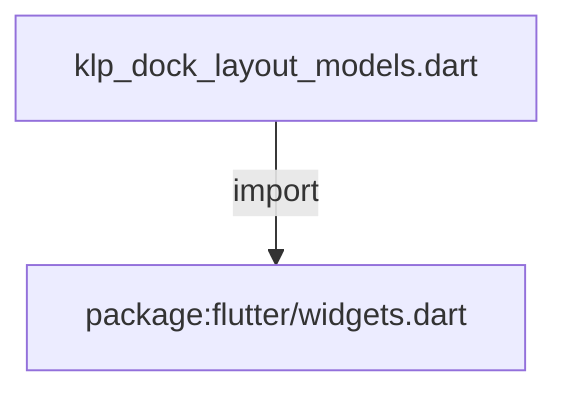
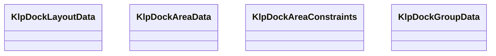

# klp_dock_layout_models.dart：直接依賴與宣告架構

[回到目錄](README.md) · [來源檔案](../../../../../lib/src/shell/docking/klp_dock_layout_models.dart)

## 範圍

核心是 `lib/src/shell/docking/klp_dock_layout_models.dart`。主要視角為該檔案明寫的 import／export／part；輔助視角為本檔宣告及 extends／implements／with／on 關係。只展開一層外部邊界。

## 直接依賴圖

## 依賴證據

| 關係 | 原始 directive | 來源 |
|---|---|---|
| import | <code>import &#x27;package:flutter/widgets.dart&#x27;;</code> | [lib/src/shell/docking/klp_dock_layout_models.dart:1](../../../../../lib/src/shell/docking/klp_dock_layout_models.dart#L1) |

## 宣告關係圖

本組節點是本檔宣告；沒有箭頭的宣告未在此圖主張互相依賴。

## 宣告與成員證據

成員包含 public 與 private；簽章取自來源，省略函式本體與欄位初始值。`(inferred)` 表示來源未明寫型別；建構子只顯示參數部分，不含初始化列表。

### KlpDockLayoutData

ClassDeclaration · public · [lib/src/shell/docking/klp_dock_layout_models.dart:3](../../../../../lib/src/shell/docking/klp_dock_layout_models.dart#L3)

<code>class KlpDockLayoutData</code>

來源註解摘要：描述固定 Stage 周圍三個可停駐區域的受控布局狀態。

| 成員 | 可見性 | 簽章／型別 | 來源註解摘要 | 證據 |
|---|---|---|---|---|
| field <code>left</code> | public | <code>final KlpDockAreaData left</code> |  | [lib/src/shell/docking/klp_dock_layout_models.dart:6](../../../../../lib/src/shell/docking/klp_dock_layout_models.dart#L6) |
| field <code>right</code> | public | <code>final KlpDockAreaData right</code> |  | [lib/src/shell/docking/klp_dock_layout_models.dart:7](../../../../../lib/src/shell/docking/klp_dock_layout_models.dart#L7) |
| field <code>bottom</code> | public | <code>final KlpDockAreaData bottom</code> |  | [lib/src/shell/docking/klp_dock_layout_models.dart:8](../../../../../lib/src/shell/docking/klp_dock_layout_models.dart#L8) |
| constructor <code>KlpDockLayoutData</code> | public | <code>const KlpDockLayoutData({ required this.left, required this.right, required this.bottom, })</code> |  | [lib/src/shell/docking/klp_dock_layout_models.dart:10](../../../../../lib/src/shell/docking/klp_dock_layout_models.dart#L10) |
| method <code>copyWith</code> | public | <code>KlpDockLayoutData copyWith({ KlpDockAreaData? left, KlpDockAreaData? right, KlpDockAreaData? bottom, })</code> |  | [lib/src/shell/docking/klp_dock_layout_models.dart:16](../../../../../lib/src/shell/docking/klp_dock_layout_models.dart#L16) |

### KlpDockAreaData

ClassDeclaration · public · [lib/src/shell/docking/klp_dock_layout_models.dart:29](../../../../../lib/src/shell/docking/klp_dock_layout_models.dart#L29)

<code>class KlpDockAreaData</code>

來源註解摘要：描述單一可停駐區域的方向、群組、可見性與像素尺寸。

| 成員 | 可見性 | 簽章／型別 | 來源註解摘要 | 證據 |
|---|---|---|---|---|
| field <code>axis</code> | public | <code>final Axis axis</code> | Area 內部 group 的排列方向。 | [lib/src/shell/docking/klp_dock_layout_models.dart:33](../../../../../lib/src/shell/docking/klp_dock_layout_models.dart#L33) |
| field <code>groups</code> | public | <code>final List&lt;KlpDockGroupData&gt; groups</code> |  | [lib/src/shell/docking/klp_dock_layout_models.dart:34](../../../../../lib/src/shell/docking/klp_dock_layout_models.dart#L34) |
| field <code>isVisible</code> | public | <code>final bool isVisible</code> |  | [lib/src/shell/docking/klp_dock_layout_models.dart:35](../../../../../lib/src/shell/docking/klp_dock_layout_models.dart#L35) |
| field <code>extent</code> | public | <code>final double extent</code> | 左右 Area 代表寬度，Bottom Area 代表高度。 | [lib/src/shell/docking/klp_dock_layout_models.dart:38](../../../../../lib/src/shell/docking/klp_dock_layout_models.dart#L38) |
| constructor <code>KlpDockAreaData</code> | public | <code>const KlpDockAreaData({ required this.axis, required this.groups, required this.extent, this.isVisible = true, })</code> |  | [lib/src/shell/docking/klp_dock_layout_models.dart:40](../../../../../lib/src/shell/docking/klp_dock_layout_models.dart#L40) |
| method <code>copyWith</code> | public | <code>KlpDockAreaData copyWith({ Axis? axis, List&lt;KlpDockGroupData&gt;? groups, bool? isVisible, double? extent, })</code> |  | [lib/src/shell/docking/klp_dock_layout_models.dart:47](../../../../../lib/src/shell/docking/klp_dock_layout_models.dart#L47) |

### KlpDockAreaConstraints

ClassDeclaration · public · [lib/src/shell/docking/klp_dock_layout_models.dart:62](../../../../../lib/src/shell/docking/klp_dock_layout_models.dart#L62)

<code>class KlpDockAreaConstraints</code>

來源註解摘要：限制可停駐區域的最小與最大像素尺寸，不決定產品保存策略。

| 成員 | 可見性 | 簽章／型別 | 來源註解摘要 | 證據 |
|---|---|---|---|---|
| field <code>minExtent</code> | public | <code>final double minExtent</code> |  | [lib/src/shell/docking/klp_dock_layout_models.dart:65](../../../../../lib/src/shell/docking/klp_dock_layout_models.dart#L65) |
| field <code>maxExtent</code> | public | <code>final double maxExtent</code> |  | [lib/src/shell/docking/klp_dock_layout_models.dart:66](../../../../../lib/src/shell/docking/klp_dock_layout_models.dart#L66) |
| constructor <code>KlpDockAreaConstraints</code> | public | <code>const KlpDockAreaConstraints({ required this.minExtent, required this.maxExtent, })</code> |  | [lib/src/shell/docking/klp_dock_layout_models.dart:68](../../../../../lib/src/shell/docking/klp_dock_layout_models.dart#L68) |
| getter <code>closeThreshold</code> | public | <code>double get closeThreshold</code> |  | [lib/src/shell/docking/klp_dock_layout_models.dart:74](../../../../../lib/src/shell/docking/klp_dock_layout_models.dart#L74) |

### KlpDockGroupData

ClassDeclaration · public · [lib/src/shell/docking/klp_dock_layout_models.dart:77](../../../../../lib/src/shell/docking/klp_dock_layout_models.dart#L77)

<code>class KlpDockGroupData</code>

來源註解摘要：描述同一可停駐區域內的一組分頁及目前顯示項目。

| 成員 | 可見性 | 簽章／型別 | 來源註解摘要 | 證據 |
|---|---|---|---|---|
| field <code>id</code> | public | <code>final String id</code> |  | [lib/src/shell/docking/klp_dock_layout_models.dart:80](../../../../../lib/src/shell/docking/klp_dock_layout_models.dart#L80) |
| field <code>panelIds</code> | public | <code>final List&lt;String&gt; panelIds</code> | 群組內的分頁，由左到右排列。 | [lib/src/shell/docking/klp_dock_layout_models.dart:83](../../../../../lib/src/shell/docking/klp_dock_layout_models.dart#L83) |
| field <code>activePanelId</code> | public | <code>final String activePanelId</code> | 目前顯示的 panel。 | [lib/src/shell/docking/klp_dock_layout_models.dart:86](../../../../../lib/src/shell/docking/klp_dock_layout_models.dart#L86) |
| field <code>mainAxisExtent</code> | public | <code>final double mainAxisExtent</code> | Group 沿著 Area 排列方向的像素尺寸。 | [lib/src/shell/docking/klp_dock_layout_models.dart:89](../../../../../lib/src/shell/docking/klp_dock_layout_models.dart#L89) |
| constructor <code>KlpDockGroupData</code> | public | <code>const KlpDockGroupData({ required this.id, required this.panelIds, required this.activePanelId, required this.mainAxisExtent, })</code> |  | [lib/src/shell/docking/klp_dock_layout_models.dart:91](../../../../../lib/src/shell/docking/klp_dock_layout_models.dart#L91) |
| method <code>copyWith</code> | public | <code>KlpDockGroupData copyWith({ String? id, List&lt;String&gt;? panelIds, String? activePanelId, double? mainAxisExtent, })</code> |  | [lib/src/shell/docking/klp_dock_layout_models.dart:98](../../../../../lib/src/shell/docking/klp_dock_layout_models.dart#L98) |

## 閱讀說明與限制

箭頭只表示來源明寫的靜態關係；import 不等於呼叫。未分析動態呼叫、欄位的實際物件擁有權、狀態轉移或渲染流程；型別未進行語意解析，繼承目標保留原始型別拼寫。public／private 依 Dart 名稱前綴判斷；public 宣告不代表已由 `lib/kallopis.dart` 匯出。

本頁由 `tool/architecture_atlas` 產生；編輯來源或生成工具後重新產生，避免手改本頁。
