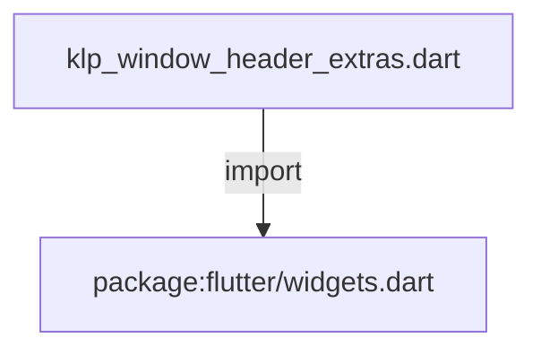
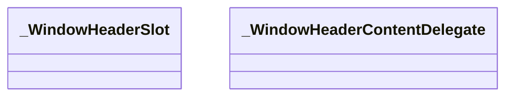
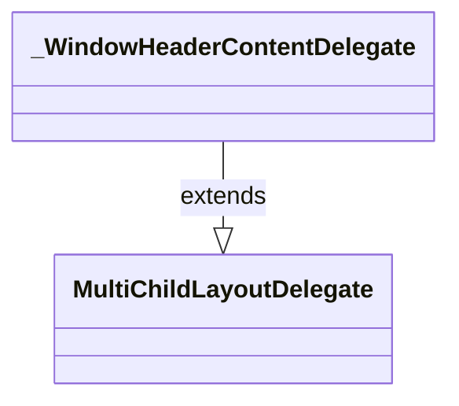

# klp_window_header_extras.dart：直接依賴與宣告架構

[回到目錄](README.md) · [來源檔案](../../../../../lib/src/shell/internal/klp_window_header_extras.dart)

## 範圍

核心是 `lib/src/shell/internal/klp_window_header_extras.dart`。主要視角為該檔案明寫的 import／export／part；輔助視角為本檔宣告及 extends／implements／with／on 關係。只展開一層外部邊界。

## 直接依賴圖

## 依賴證據

| 關係 | 原始 directive | 來源 |
|---|---|---|
| import | <code>import &#x27;package:flutter/widgets.dart&#x27;;</code> | [lib/src/shell/internal/klp_window_header_extras.dart:1](../../../../../lib/src/shell/internal/klp_window_header_extras.dart#L1) |

## 宣告關係圖

本組節點是本檔宣告；沒有箭頭的宣告未在此圖主張互相依賴。

## 宣告與成員證據

成員包含 public 與 private；簽章取自來源，省略函式本體與欄位初始值。`(inferred)` 表示來源未明寫型別；建構子只顯示參數部分，不含初始化列表。

### _WindowHeaderSlot

EnumDeclaration · private · [lib/src/shell/internal/klp_window_header_extras.dart:3](../../../../../lib/src/shell/internal/klp_window_header_extras.dart#L3)

<code>enum _WindowHeaderSlot</code>

| 成員 | 可見性 | 簽章／型別 | 來源註解摘要 | 證據 |
|---|---|---|---|---|
| enum value <code>identity</code> | public | <code>identity</code> |  | [lib/src/shell/internal/klp_window_header_extras.dart:3](../../../../../lib/src/shell/internal/klp_window_header_extras.dart#L3) |
| enum value <code>extras</code> | public | <code>extras</code> |  | [lib/src/shell/internal/klp_window_header_extras.dart:3](../../../../../lib/src/shell/internal/klp_window_header_extras.dart#L3) |

### buildKlpWindowHeaderRegion

FunctionDeclaration · public · [lib/src/shell/internal/klp_window_header_extras.dart:5](../../../../../lib/src/shell/internal/klp_window_header_extras.dart#L5)

<code>Widget buildKlpWindowHeaderRegion({ required List&lt;Widget&gt; children, required AlignmentGeometry alignment, })</code>

來源註解摘要：建立可保留自然寬度，並在空間不足時依方向裁切的標題列區域。

### buildKlpWindowHeaderContent

FunctionDeclaration · public · [lib/src/shell/internal/klp_window_header_extras.dart:21](../../../../../lib/src/shell/internal/klp_window_header_extras.dart#L21)

<code>Widget buildKlpWindowHeaderContent({required Widget identity, Widget? extras})</code>

來源註解摘要：先配置右側次要內容，再把剩餘空間完整交給標題識別區。

### _WindowHeaderContentDelegate

ClassDeclaration · private · [lib/src/shell/internal/klp_window_header_extras.dart:32](../../../../../lib/src/shell/internal/klp_window_header_extras.dart#L32)

<code>class _WindowHeaderContentDelegate extends MultiChildLayoutDelegate</code>

- `extends` → <code>MultiChildLayoutDelegate</code>：[lib/src/shell/internal/klp_window_header_extras.dart:32](../../../../../lib/src/shell/internal/klp_window_header_extras.dart#L32)

| 成員 | 可見性 | 簽章／型別 | 來源註解摘要 | 證據 |
|---|---|---|---|---|
| method <code>performLayout</code> | public | <code>void performLayout(Size size)</code> |  | [lib/src/shell/internal/klp_window_header_extras.dart:33](../../../../../lib/src/shell/internal/klp_window_header_extras.dart#L33) |
| method <code>shouldRelayout</code> | public | <code>bool shouldRelayout(_WindowHeaderContentDelegate oldDelegate)</code> |  | [lib/src/shell/internal/klp_window_header_extras.dart:56](../../../../../lib/src/shell/internal/klp_window_header_extras.dart#L56) |

## 閱讀說明與限制

箭頭只表示來源明寫的靜態關係；import 不等於呼叫。未分析動態呼叫、欄位的實際物件擁有權、狀態轉移或渲染流程；型別未進行語意解析，繼承目標保留原始型別拼寫。public／private 依 Dart 名稱前綴判斷；public 宣告不代表已由 `lib/kallopis.dart` 匯出。

本頁由 `tool/architecture_atlas` 產生；編輯來源或生成工具後重新產生，避免手改本頁。
