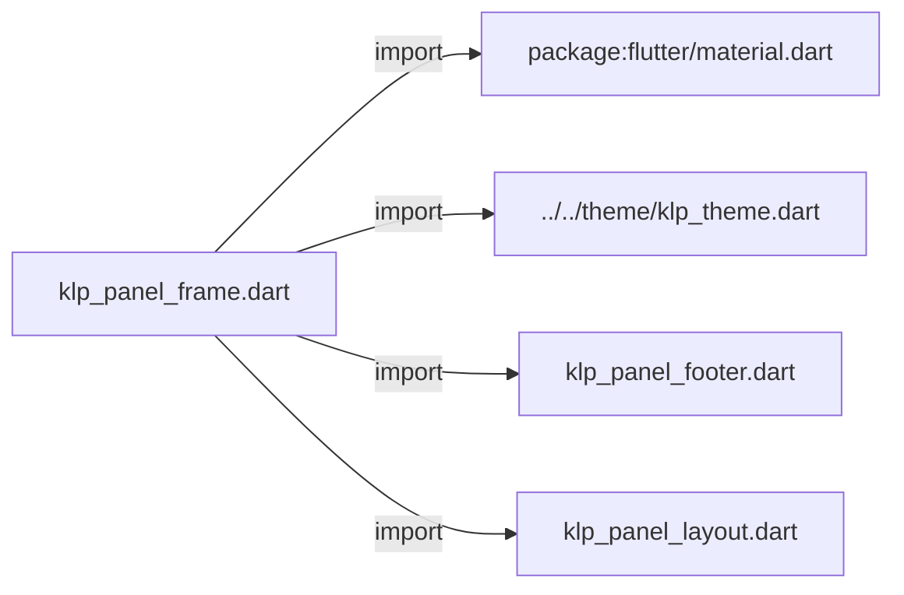
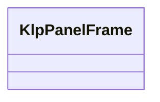
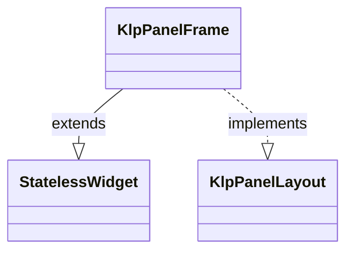

# klp_panel_frame.dart：直接依賴與宣告架構

[回到目錄](README.md) · [來源檔案](../../../../../lib/src/shell/panel/klp_panel_frame.dart)

## 範圍

核心是 `lib/src/shell/panel/klp_panel_frame.dart`。主要視角為該檔案明寫的 import／export／part；輔助視角為本檔宣告及 extends／implements／with／on 關係。只展開一層外部邊界。

## 直接依賴圖

## 依賴證據

| 關係 | 原始 directive | 來源 |
|---|---|---|
| import | <code>import &#x27;package:flutter/material.dart&#x27;;</code> | [lib/src/shell/panel/klp_panel_frame.dart:1](../../../../../lib/src/shell/panel/klp_panel_frame.dart#L1) |
| import | <code>import &#x27;../../theme/klp_theme.dart&#x27;;</code> | [lib/src/shell/panel/klp_panel_frame.dart:3](../../../../../lib/src/shell/panel/klp_panel_frame.dart#L3) |
| import | <code>import &#x27;klp_panel_footer.dart&#x27;;</code> | [lib/src/shell/panel/klp_panel_frame.dart:4](../../../../../lib/src/shell/panel/klp_panel_frame.dart#L4) |
| import | <code>import &#x27;klp_panel_layout.dart&#x27;;</code> | [lib/src/shell/panel/klp_panel_frame.dart:5](../../../../../lib/src/shell/panel/klp_panel_frame.dart#L5) |

## 宣告關係圖

本組節點是本檔宣告；沒有箭頭的宣告未在此圖主張互相依賴。

## 宣告與成員證據

成員包含 public 與 private；簽章取自來源，省略函式本體與欄位初始值。`(inferred)` 表示來源未明寫型別；建構子只顯示參數部分，不含初始化列表。

### KlpPanelFrame

ClassDeclaration · public · [lib/src/shell/panel/klp_panel_frame.dart:7](../../../../../lib/src/shell/panel/klp_panel_frame.dart#L7)

<code>class KlpPanelFrame extends StatelessWidget implements KlpPanelLayout</code>

來源註解摘要：通用面板：header 與 content，選用 footer。圓角使用較緊湊的 card 語意， 高度預設沿用 theme 的外殼密度。 文字顏色依據背景顏色階梯（500 以下為深色文字，600 以上為淺色文字）渲染。

- `extends` → <code>StatelessWidget</code>：[lib/src/shell/panel/klp_panel_frame.dart:10](../../../../../lib/src/shell/panel/klp_panel_frame.dart#L10)
- `implements` → <code>KlpPanelLayout</code>：[lib/src/shell/panel/klp_panel_frame.dart:10](../../../../../lib/src/shell/panel/klp_panel_frame.dart#L10)

| 成員 | 可見性 | 簽章／型別 | 來源註解摘要 | 證據 |
|---|---|---|---|---|
| constructor <code>KlpPanelFrame</code> | public | <code>const KlpPanelFrame({ super.key, this.header, required this.content, this.footer, this.headerHeight, this.footerHeight, this.background, this.padding, this.contentScrollController, })</code> |  | [lib/src/shell/panel/klp_panel_frame.dart:11](../../../../../lib/src/shell/panel/klp_panel_frame.dart#L11) |
| field <code>header</code> | public | <code>final Widget? header</code> |  | [lib/src/shell/panel/klp_panel_frame.dart:23](../../../../../lib/src/shell/panel/klp_panel_frame.dart#L23) |
| field <code>content</code> | public | <code>final Widget content</code> |  | [lib/src/shell/panel/klp_panel_frame.dart:24](../../../../../lib/src/shell/panel/klp_panel_frame.dart#L24) |
| field <code>footer</code> | public | <code>final Widget? footer</code> |  | [lib/src/shell/panel/klp_panel_frame.dart:25](../../../../../lib/src/shell/panel/klp_panel_frame.dart#L25) |
| field <code>headerHeight</code> | public | <code>final double? headerHeight</code> | `null` 表示沿用 theme 的外殼高度。 | [lib/src/shell/panel/klp_panel_frame.dart:28](../../../../../lib/src/shell/panel/klp_panel_frame.dart#L28) |
| field <code>footerHeight</code> | public | <code>final double? footerHeight</code> |  | [lib/src/shell/panel/klp_panel_frame.dart:29](../../../../../lib/src/shell/panel/klp_panel_frame.dart#L29) |
| field <code>background</code> | public | <code>final Color? background</code> |  | [lib/src/shell/panel/klp_panel_frame.dart:30](../../../../../lib/src/shell/panel/klp_panel_frame.dart#L30) |
| field <code>padding</code> | public | <code>final EdgeInsetsGeometry? padding</code> | 舊版 API 相容欄位；PanelFrame 不再讀取此值，內距一律由 [content]、 [header] 與 [footer] 自行提供。 | [lib/src/shell/panel/klp_panel_frame.dart:35](../../../../../lib/src/shell/panel/klp_panel_frame.dart#L35) |
| field <code>contentScrollController</code> | public | <code>final ScrollController? contentScrollController</code> | 內容區的捲動控制器。提供時，Frame 只負責繪製 Scrollbar；內容的 內距由 [content] 自己決定。 | [lib/src/shell/panel/klp_panel_frame.dart:39](../../../../../lib/src/shell/panel/klp_panel_frame.dart#L39) |
| method <code>build</code> | public | <code>Widget build(BuildContext context)</code> |  | [lib/src/shell/panel/klp_panel_frame.dart:41](../../../../../lib/src/shell/panel/klp_panel_frame.dart#L41) |
| method <code>buildPanelLayout</code> | public | <code>Widget buildPanelLayout(BuildContext context)</code> |  | [lib/src/shell/panel/klp_panel_frame.dart:83](../../../../../lib/src/shell/panel/klp_panel_frame.dart#L83) |
| method <code>_buildContentRegion</code> | private | <code>Widget _buildContentRegion(BuildContext context)</code> |  | [lib/src/shell/panel/klp_panel_frame.dart:86](../../../../../lib/src/shell/panel/klp_panel_frame.dart#L86) |

## 閱讀說明與限制

箭頭只表示來源明寫的靜態關係；import 不等於呼叫。未分析動態呼叫、欄位的實際物件擁有權、狀態轉移或渲染流程；型別未進行語意解析，繼承目標保留原始型別拼寫。public／private 依 Dart 名稱前綴判斷；public 宣告不代表已由 `lib/kallopis.dart` 匯出。

本頁由 `tool/architecture_atlas` 產生；編輯來源或生成工具後重新產生，避免手改本頁。
