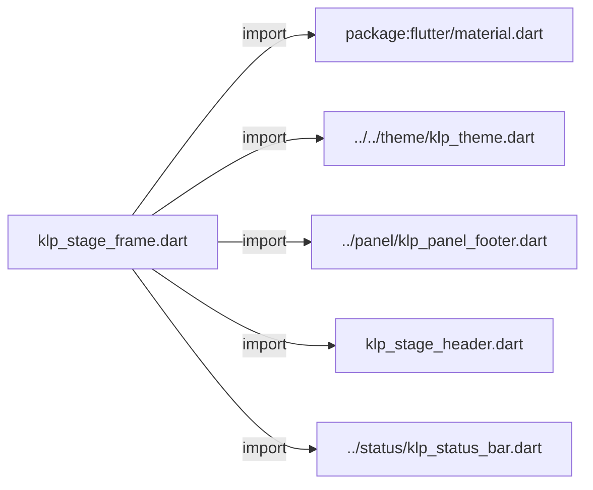
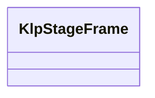
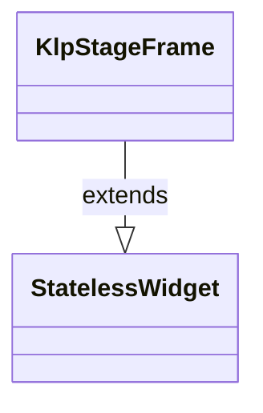

# klp_stage_frame.dart：直接依賴與宣告架構

[回到目錄](README.md) · [來源檔案](../../../../../lib/src/shell/stage/klp_stage_frame.dart)

## 範圍

核心是 `lib/src/shell/stage/klp_stage_frame.dart`。主要視角為該檔案明寫的 import／export／part；輔助視角為本檔宣告及 extends／implements／with／on 關係。只展開一層外部邊界。

## 直接依賴圖

## 依賴證據

| 關係 | 原始 directive | 來源 |
|---|---|---|
| import | <code>import &#x27;package:flutter/material.dart&#x27;;</code> | [lib/src/shell/stage/klp_stage_frame.dart:1](../../../../../lib/src/shell/stage/klp_stage_frame.dart#L1) |
| import | <code>import &#x27;../../theme/klp_theme.dart&#x27;;</code> | [lib/src/shell/stage/klp_stage_frame.dart:3](../../../../../lib/src/shell/stage/klp_stage_frame.dart#L3) |
| import | <code>import &#x27;../panel/klp_panel_footer.dart&#x27;;</code> | [lib/src/shell/stage/klp_stage_frame.dart:5](../../../../../lib/src/shell/stage/klp_stage_frame.dart#L5) |
| import | <code>import &#x27;klp_stage_header.dart&#x27;;</code> | [lib/src/shell/stage/klp_stage_frame.dart:6](../../../../../lib/src/shell/stage/klp_stage_frame.dart#L6) |
| import | <code>import &#x27;../status/klp_status_bar.dart&#x27;;</code> | [lib/src/shell/stage/klp_stage_frame.dart:7](../../../../../lib/src/shell/stage/klp_stage_frame.dart#L7) |

## 宣告關係圖

本組節點是本檔宣告；沒有箭頭的宣告未在此圖主張互相依賴。

## 宣告與成員證據

成員包含 public 與 private；簽章取自來源，省略函式本體與欄位初始值。`(inferred)` 表示來源未明寫型別；建構子只顯示參數部分，不含初始化列表。

### KlpStageFrame

ClassDeclaration · public · [lib/src/shell/stage/klp_stage_frame.dart:9](../../../../../lib/src/shell/stage/klp_stage_frame.dart#L9)

<code>class KlpStageFrame extends StatelessWidget</code>

來源註解摘要：舞台區：選用的頂部 header、中央 content、底部選用的 status 列。

- `extends` → <code>StatelessWidget</code>：[lib/src/shell/stage/klp_stage_frame.dart:10](../../../../../lib/src/shell/stage/klp_stage_frame.dart#L10)

| 成員 | 可見性 | 簽章／型別 | 來源註解摘要 | 證據 |
|---|---|---|---|---|
| constructor <code>KlpStageFrame</code> | public | <code>const KlpStageFrame({ super.key, this.header, required this.content, this.status, this.padding, })</code> |  | [lib/src/shell/stage/klp_stage_frame.dart:11](../../../../../lib/src/shell/stage/klp_stage_frame.dart#L11) |
| constructor <code>workbench</code> | public | <code>factory KlpStageFrame.workbench({ Key? key, required String projectName, required String sectionLabel, required String title, required String typeLabel, required Widget content, String? statusLeading, String? statusTrailing, bool statusActive = true, })</code> | 建立具備 Kallopis 標準識別列與狀態列的工作舞台。 產品只提供語意資料與主要內容；header、status 的元件選擇、排列、間距與 響應式行為都留在 Kallopis。若提供狀態文字，leading 與 trailing 必須成對。 | [lib/src/shell/stage/klp_stage_frame.dart:19](../../../../../lib/src/shell/stage/klp_stage_frame.dart#L19) |
| field <code>header</code> | public | <code>final Widget? header</code> |  | [lib/src/shell/stage/klp_stage_frame.dart:57](../../../../../lib/src/shell/stage/klp_stage_frame.dart#L57) |
| field <code>content</code> | public | <code>final Widget content</code> |  | [lib/src/shell/stage/klp_stage_frame.dart:58](../../../../../lib/src/shell/stage/klp_stage_frame.dart#L58) |
| field <code>status</code> | public | <code>final Widget? status</code> |  | [lib/src/shell/stage/klp_stage_frame.dart:59](../../../../../lib/src/shell/stage/klp_stage_frame.dart#L59) |
| field <code>padding</code> | public | <code>final EdgeInsetsGeometry? padding</code> | 內容與舞台區之間的內距。預設為 `context.klp.space.base`。 | [lib/src/shell/stage/klp_stage_frame.dart:62](../../../../../lib/src/shell/stage/klp_stage_frame.dart#L62) |
| method <code>build</code> | public | <code>Widget build(BuildContext context)</code> |  | [lib/src/shell/stage/klp_stage_frame.dart:64](../../../../../lib/src/shell/stage/klp_stage_frame.dart#L64) |

## 閱讀說明與限制

箭頭只表示來源明寫的靜態關係；import 不等於呼叫。未分析動態呼叫、欄位的實際物件擁有權、狀態轉移或渲染流程；型別未進行語意解析，繼承目標保留原始型別拼寫。public／private 依 Dart 名稱前綴判斷；public 宣告不代表已由 `lib/kallopis.dart` 匯出。

本頁由 `tool/architecture_atlas` 產生；編輯來源或生成工具後重新產生，避免手改本頁。
