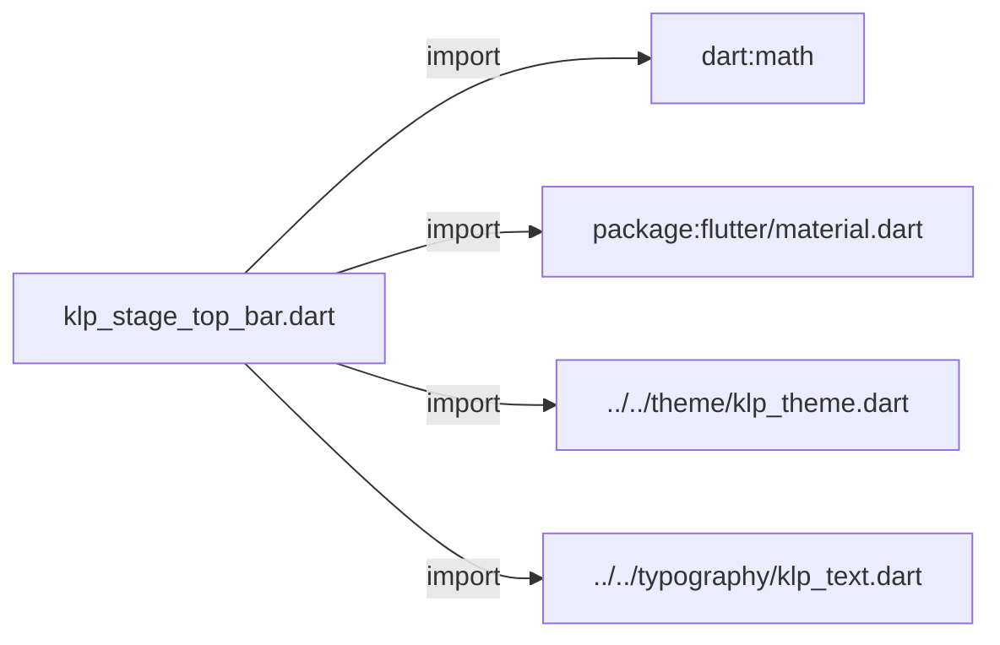
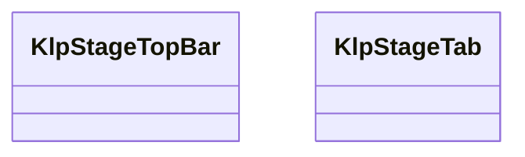
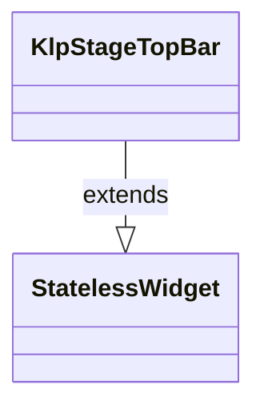
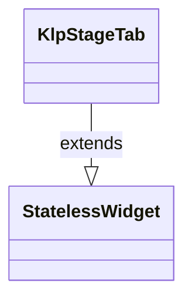

# klp_stage_top_bar.dart：直接依賴與宣告架構

[回到目錄](README.md) · [來源檔案](../../../../../lib/src/shell/stage/klp_stage_top_bar.dart)

## 範圍

核心是 `lib/src/shell/stage/klp_stage_top_bar.dart`。主要視角為該檔案明寫的 import／export／part；輔助視角為本檔宣告及 extends／implements／with／on 關係。只展開一層外部邊界。

## 直接依賴圖

## 依賴證據

| 關係 | 原始 directive | 來源 |
|---|---|---|
| import | <code>import &#x27;dart:math&#x27; as math;</code> | [lib/src/shell/stage/klp_stage_top_bar.dart:1](../../../../../lib/src/shell/stage/klp_stage_top_bar.dart#L1) |
| import | <code>import &#x27;package:flutter/material.dart&#x27;;</code> | [lib/src/shell/stage/klp_stage_top_bar.dart:3](../../../../../lib/src/shell/stage/klp_stage_top_bar.dart#L3) |
| import | <code>import &#x27;../../theme/klp_theme.dart&#x27;;</code> | [lib/src/shell/stage/klp_stage_top_bar.dart:5](../../../../../lib/src/shell/stage/klp_stage_top_bar.dart#L5) |
| import | <code>import &#x27;../../typography/klp_text.dart&#x27;;</code> | [lib/src/shell/stage/klp_stage_top_bar.dart:6](../../../../../lib/src/shell/stage/klp_stage_top_bar.dart#L6) |

## 宣告關係圖

本組節點是本檔宣告；沒有箭頭的宣告未在此圖主張互相依賴。

## 宣告與成員證據

成員包含 public 與 private；簽章取自來源，省略函式本體與欄位初始值。`(inferred)` 表示來源未明寫型別；建構子只顯示參數部分，不含初始化列表。

### KlpStageTopBar

ClassDeclaration · public · [lib/src/shell/stage/klp_stage_top_bar.dart:8](../../../../../lib/src/shell/stage/klp_stage_top_bar.dart#L8)

<code>class KlpStageTopBar extends StatelessWidget</code>

來源註解摘要：位於 Workbench window header 中央 Stage 區域的檔案分頁與動作列。 此列不屬於 Stage body。產品只注入檔案分頁與動作，不自行決定對齊。

- `extends` → <code>StatelessWidget</code>：[lib/src/shell/stage/klp_stage_top_bar.dart:11](../../../../../lib/src/shell/stage/klp_stage_top_bar.dart#L11)

| 成員 | 可見性 | 簽章／型別 | 來源註解摘要 | 證據 |
|---|---|---|---|---|
| constructor <code>KlpStageTopBar</code> | public | <code>const KlpStageTopBar({super.key, required this.tab, this.actions = const []})</code> |  | [lib/src/shell/stage/klp_stage_top_bar.dart:12](../../../../../lib/src/shell/stage/klp_stage_top_bar.dart#L12) |
| field <code>tab</code> | public | <code>final Widget tab</code> |  | [lib/src/shell/stage/klp_stage_top_bar.dart:14](../../../../../lib/src/shell/stage/klp_stage_top_bar.dart#L14) |
| field <code>actions</code> | public | <code>final List&lt;Widget&gt; actions</code> |  | [lib/src/shell/stage/klp_stage_top_bar.dart:15](../../../../../lib/src/shell/stage/klp_stage_top_bar.dart#L15) |
| method <code>build</code> | public | <code>Widget build(BuildContext context)</code> |  | [lib/src/shell/stage/klp_stage_top_bar.dart:17](../../../../../lib/src/shell/stage/klp_stage_top_bar.dart#L17) |

### KlpStageTab

ClassDeclaration · public · [lib/src/shell/stage/klp_stage_top_bar.dart:45](../../../../../lib/src/shell/stage/klp_stage_top_bar.dart#L45)

<code>class KlpStageTab extends StatelessWidget</code>

來源註解摘要：顯示目前 Stage 項目的單一檔案分頁。 此元件只擁有分頁的視覺語言；檔名與目前項目的資料來源由產品提供。

- `extends` → <code>StatelessWidget</code>：[lib/src/shell/stage/klp_stage_top_bar.dart:48](../../../../../lib/src/shell/stage/klp_stage_top_bar.dart#L48)

| 成員 | 可見性 | 簽章／型別 | 來源註解摘要 | 證據 |
|---|---|---|---|---|
| constructor <code>KlpStageTab</code> | public | <code>const KlpStageTab({super.key, required this.label})</code> |  | [lib/src/shell/stage/klp_stage_top_bar.dart:49](../../../../../lib/src/shell/stage/klp_stage_top_bar.dart#L49) |
| field <code>label</code> | public | <code>final String label</code> |  | [lib/src/shell/stage/klp_stage_top_bar.dart:51](../../../../../lib/src/shell/stage/klp_stage_top_bar.dart#L51) |
| method <code>build</code> | public | <code>Widget build(BuildContext context)</code> |  | [lib/src/shell/stage/klp_stage_top_bar.dart:53](../../../../../lib/src/shell/stage/klp_stage_top_bar.dart#L53) |

## 閱讀說明與限制

箭頭只表示來源明寫的靜態關係；import 不等於呼叫。未分析動態呼叫、欄位的實際物件擁有權、狀態轉移或渲染流程；型別未進行語意解析，繼承目標保留原始型別拼寫。public／private 依 Dart 名稱前綴判斷；public 宣告不代表已由 `lib/kallopis.dart` 匯出。

本頁由 `tool/architecture_atlas` 產生；編輯來源或生成工具後重新產生，避免手改本頁。
