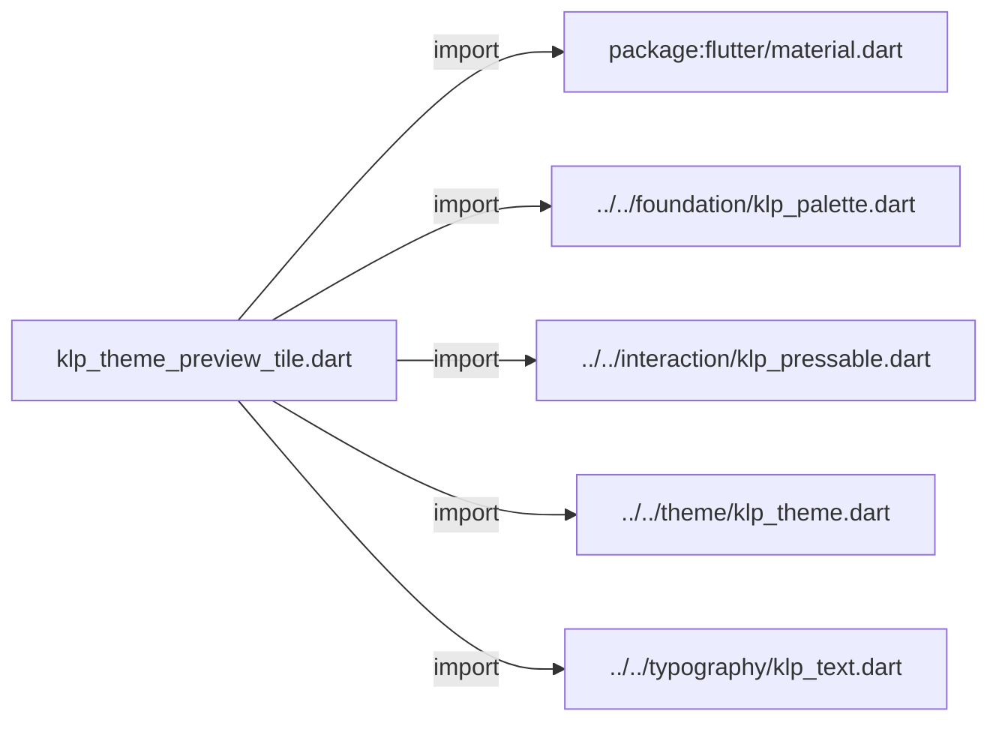
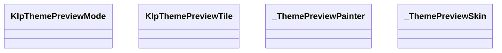
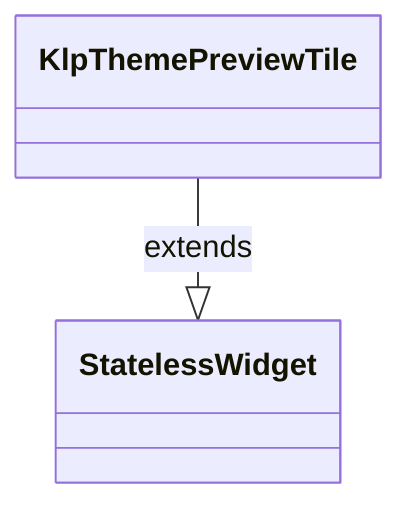
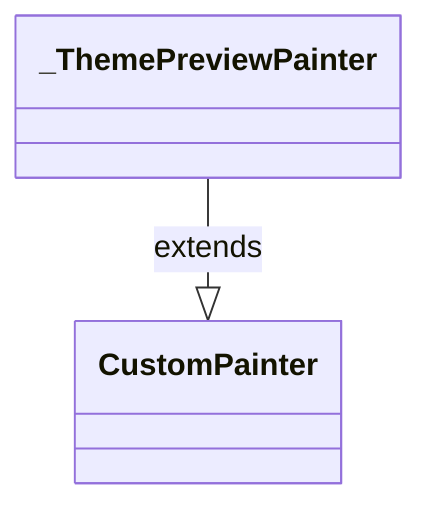

# klp_theme_preview_tile.dart：直接依賴與宣告架構

[回到目錄](README.md) · [來源檔案](../../../../../lib/src/shell/theme/klp_theme_preview_tile.dart)

## 範圍

核心是 `lib/src/shell/theme/klp_theme_preview_tile.dart`。主要視角為該檔案明寫的 import／export／part；輔助視角為本檔宣告及 extends／implements／with／on 關係。只展開一層外部邊界。

## 直接依賴圖

## 依賴證據

| 關係 | 原始 directive | 來源 |
|---|---|---|
| import | <code>import &#x27;package:flutter/material.dart&#x27;;</code> | [lib/src/shell/theme/klp_theme_preview_tile.dart:1](../../../../../lib/src/shell/theme/klp_theme_preview_tile.dart#L1) |
| import | <code>import &#x27;../../foundation/klp_palette.dart&#x27;;</code> | [lib/src/shell/theme/klp_theme_preview_tile.dart:3](../../../../../lib/src/shell/theme/klp_theme_preview_tile.dart#L3) |
| import | <code>import &#x27;../../interaction/klp_pressable.dart&#x27;;</code> | [lib/src/shell/theme/klp_theme_preview_tile.dart:4](../../../../../lib/src/shell/theme/klp_theme_preview_tile.dart#L4) |
| import | <code>import &#x27;../../theme/klp_theme.dart&#x27;;</code> | [lib/src/shell/theme/klp_theme_preview_tile.dart:5](../../../../../lib/src/shell/theme/klp_theme_preview_tile.dart#L5) |
| import | <code>import &#x27;../../typography/klp_text.dart&#x27;;</code> | [lib/src/shell/theme/klp_theme_preview_tile.dart:6](../../../../../lib/src/shell/theme/klp_theme_preview_tile.dart#L6) |

## 宣告關係圖

本組節點是本檔宣告；沒有箭頭的宣告未在此圖主張互相依賴。

## 宣告與成員證據

成員包含 public 與 private；簽章取自來源，省略函式本體與欄位初始值。`(inferred)` 表示來源未明寫型別；建構子只顯示參數部分，不含初始化列表。

### KlpThemePreviewMode

EnumDeclaration · public · [lib/src/shell/theme/klp_theme_preview_tile.dart:8](../../../../../lib/src/shell/theme/klp_theme_preview_tile.dart#L8)

<code>enum KlpThemePreviewMode</code>

| 成員 | 可見性 | 簽章／型別 | 來源註解摘要 | 證據 |
|---|---|---|---|---|
| enum value <code>light</code> | public | <code>light</code> |  | [lib/src/shell/theme/klp_theme_preview_tile.dart:8](../../../../../lib/src/shell/theme/klp_theme_preview_tile.dart#L8) |
| enum value <code>dark</code> | public | <code>dark</code> |  | [lib/src/shell/theme/klp_theme_preview_tile.dart:8](../../../../../lib/src/shell/theme/klp_theme_preview_tile.dart#L8) |
| enum value <code>ultraDark</code> | public | <code>ultraDark</code> |  | [lib/src/shell/theme/klp_theme_preview_tile.dart:8](../../../../../lib/src/shell/theme/klp_theme_preview_tile.dart#L8) |
| enum value <code>system</code> | public | <code>system</code> |  | [lib/src/shell/theme/klp_theme_preview_tile.dart:8](../../../../../lib/src/shell/theme/klp_theme_preview_tile.dart#L8) |
| enum value <code>transparent</code> | public | <code>transparent</code> |  | [lib/src/shell/theme/klp_theme_preview_tile.dart:8](../../../../../lib/src/shell/theme/klp_theme_preview_tile.dart#L8) |

### KlpThemePreviewTile

ClassDeclaration · public · [lib/src/shell/theme/klp_theme_preview_tile.dart:10](../../../../../lib/src/shell/theme/klp_theme_preview_tile.dart#L10)

<code>class KlpThemePreviewTile extends StatelessWidget</code>

- `extends` → <code>StatelessWidget</code>：[lib/src/shell/theme/klp_theme_preview_tile.dart:10](../../../../../lib/src/shell/theme/klp_theme_preview_tile.dart#L10)

| 成員 | 可見性 | 簽章／型別 | 來源註解摘要 | 證據 |
|---|---|---|---|---|
| constructor <code>KlpThemePreviewTile</code> | public | <code>const KlpThemePreviewTile({ super.key, required this.mode, required this.label, required this.description, this.width, this.selected = false, this.enabled = true, this.onSelected, })</code> |  | [lib/src/shell/theme/klp_theme_preview_tile.dart:11](../../../../../lib/src/shell/theme/klp_theme_preview_tile.dart#L11) |
| field <code>mode</code> | public | <code>final KlpThemePreviewMode mode</code> |  | [lib/src/shell/theme/klp_theme_preview_tile.dart:22](../../../../../lib/src/shell/theme/klp_theme_preview_tile.dart#L22) |
| field <code>label</code> | public | <code>final String label</code> |  | [lib/src/shell/theme/klp_theme_preview_tile.dart:23](../../../../../lib/src/shell/theme/klp_theme_preview_tile.dart#L23) |
| field <code>description</code> | public | <code>final String description</code> |  | [lib/src/shell/theme/klp_theme_preview_tile.dart:24](../../../../../lib/src/shell/theme/klp_theme_preview_tile.dart#L24) |
| field <code>width</code> | public | <code>final double? width</code> | `null` 時使用 theme 的預覽磚寬度；消費者通常不需要指定。 | [lib/src/shell/theme/klp_theme_preview_tile.dart:27](../../../../../lib/src/shell/theme/klp_theme_preview_tile.dart#L27) |
| field <code>selected</code> | public | <code>final bool selected</code> |  | [lib/src/shell/theme/klp_theme_preview_tile.dart:28](../../../../../lib/src/shell/theme/klp_theme_preview_tile.dart#L28) |
| field <code>enabled</code> | public | <code>final bool enabled</code> |  | [lib/src/shell/theme/klp_theme_preview_tile.dart:29](../../../../../lib/src/shell/theme/klp_theme_preview_tile.dart#L29) |
| field <code>onSelected</code> | public | <code>final VoidCallback? onSelected</code> |  | [lib/src/shell/theme/klp_theme_preview_tile.dart:30](../../../../../lib/src/shell/theme/klp_theme_preview_tile.dart#L30) |
| method <code>build</code> | public | <code>Widget build(BuildContext context)</code> |  | [lib/src/shell/theme/klp_theme_preview_tile.dart:32](../../../../../lib/src/shell/theme/klp_theme_preview_tile.dart#L32) |

### _ThemePreviewPainter

ClassDeclaration · private · [lib/src/shell/theme/klp_theme_preview_tile.dart:93](../../../../../lib/src/shell/theme/klp_theme_preview_tile.dart#L93)

<code>class _ThemePreviewPainter extends CustomPainter</code>

- `extends` → <code>CustomPainter</code>：[lib/src/shell/theme/klp_theme_preview_tile.dart:93](../../../../../lib/src/shell/theme/klp_theme_preview_tile.dart#L93)

| 成員 | 可見性 | 簽章／型別 | 來源註解摘要 | 證據 |
|---|---|---|---|---|
| constructor <code>_ThemePreviewPainter</code> | private | <code>const _ThemePreviewPainter(this.mode, this.cornerRadius)</code> |  | [lib/src/shell/theme/klp_theme_preview_tile.dart:94](../../../../../lib/src/shell/theme/klp_theme_preview_tile.dart#L94) |
| field <code>mode</code> | public | <code>final KlpThemePreviewMode mode</code> |  | [lib/src/shell/theme/klp_theme_preview_tile.dart:96](../../../../../lib/src/shell/theme/klp_theme_preview_tile.dart#L96) |
| field <code>cornerRadius</code> | public | <code>final double cornerRadius</code> |  | [lib/src/shell/theme/klp_theme_preview_tile.dart:97](../../../../../lib/src/shell/theme/klp_theme_preview_tile.dart#L97) |
| method <code>paint</code> | public | <code>void paint(Canvas canvas, Size size)</code> |  | [lib/src/shell/theme/klp_theme_preview_tile.dart:99](../../../../../lib/src/shell/theme/klp_theme_preview_tile.dart#L99) |
| method <code>_paintBackdrop</code> | private | <code>void _paintBackdrop( Canvas canvas, Rect rect, _ThemePreviewSkin front, _ThemePreviewSkin back, )</code> |  | [lib/src/shell/theme/klp_theme_preview_tile.dart:132](../../../../../lib/src/shell/theme/klp_theme_preview_tile.dart#L132) |
| method <code>_paintWindow</code> | private | <code>void _paintWindow( Canvas canvas, Rect rect, _ThemePreviewSkin skin, { bool dimTraffic = false, bool glass = false, })</code> |  | [lib/src/shell/theme/klp_theme_preview_tile.dart:168](../../../../../lib/src/shell/theme/klp_theme_preview_tile.dart#L168) |
| method <code>_paintTrafficLights</code> | private | <code>void _paintTrafficLights( Canvas canvas, Rect titleBar, _ThemePreviewSkin skin, bool dim, )</code> |  | [lib/src/shell/theme/klp_theme_preview_tile.dart:229](../../../../../lib/src/shell/theme/klp_theme_preview_tile.dart#L229) |
| method <code>_paintRules</code> | private | <code>void _paintRules( Canvas canvas, Rect rect, _ThemePreviewSkin skin, List&lt;double&gt; widths, )</code> |  | [lib/src/shell/theme/klp_theme_preview_tile.dart:245](../../../../../lib/src/shell/theme/klp_theme_preview_tile.dart#L245) |
| method <code>_skinFor</code> | private | <code>_ThemePreviewSkin _skinFor(KlpThemePreviewMode value)</code> |  | [lib/src/shell/theme/klp_theme_preview_tile.dart:268](../../../../../lib/src/shell/theme/klp_theme_preview_tile.dart#L268) |
| method <code>shouldRepaint</code> | public | <code>bool shouldRepaint(covariant _ThemePreviewPainter oldDelegate)</code> |  | [lib/src/shell/theme/klp_theme_preview_tile.dart:278](../../../../../lib/src/shell/theme/klp_theme_preview_tile.dart#L278) |

### _ThemePreviewSkin

ClassDeclaration · private · [lib/src/shell/theme/klp_theme_preview_tile.dart:284](../../../../../lib/src/shell/theme/klp_theme_preview_tile.dart#L284)

<code>class _ThemePreviewSkin</code>

來源註解摘要：預覽磚裡那扇模擬視窗用的顏色。 **直接由 [KlpThemeData] 的 preset 推導，不另外抄一份。** 原本這裡有四組手寫的色值， 與 preset 是同一組規則的兩份實作——改了 preset 而忘記改這裡，預覽會顯示一個 已經不存在的主題，而且不會有任何徵兆。

| 成員 | 可見性 | 簽章／型別 | 來源註解摘要 | 證據 |
|---|---|---|---|---|
| constructor <code>_ThemePreviewSkin</code> | private | <code>const _ThemePreviewSkin({ required this.app, required this.surface, required this.well, required this.outline, required this.ink, required this.faint, })</code> |  | [lib/src/shell/theme/klp_theme_preview_tile.dart:290](../../../../../lib/src/shell/theme/klp_theme_preview_tile.dart#L290) |
| constructor <code>from</code> | public | <code>factory _ThemePreviewSkin.from(KlpThemeData tokens)</code> |  | [lib/src/shell/theme/klp_theme_preview_tile.dart:299](../../../../../lib/src/shell/theme/klp_theme_preview_tile.dart#L299) |
| field <code>app</code> | public | <code>final Color app</code> |  | [lib/src/shell/theme/klp_theme_preview_tile.dart:308](../../../../../lib/src/shell/theme/klp_theme_preview_tile.dart#L308) |
| field <code>surface</code> | public | <code>final Color surface</code> |  | [lib/src/shell/theme/klp_theme_preview_tile.dart:309](../../../../../lib/src/shell/theme/klp_theme_preview_tile.dart#L309) |
| field <code>well</code> | public | <code>final Color well</code> |  | [lib/src/shell/theme/klp_theme_preview_tile.dart:310](../../../../../lib/src/shell/theme/klp_theme_preview_tile.dart#L310) |
| field <code>outline</code> | public | <code>final Color outline</code> |  | [lib/src/shell/theme/klp_theme_preview_tile.dart:311](../../../../../lib/src/shell/theme/klp_theme_preview_tile.dart#L311) |
| field <code>ink</code> | public | <code>final Color ink</code> |  | [lib/src/shell/theme/klp_theme_preview_tile.dart:312](../../../../../lib/src/shell/theme/klp_theme_preview_tile.dart#L312) |
| field <code>faint</code> | public | <code>final Color faint</code> |  | [lib/src/shell/theme/klp_theme_preview_tile.dart:313](../../../../../lib/src/shell/theme/klp_theme_preview_tile.dart#L313) |
| field <code>light</code> | public | <code>static final (inferred) light</code> |  | [lib/src/shell/theme/klp_theme_preview_tile.dart:315](../../../../../lib/src/shell/theme/klp_theme_preview_tile.dart#L315) |
| field <code>dark</code> | public | <code>static final (inferred) dark</code> |  | [lib/src/shell/theme/klp_theme_preview_tile.dart:316](../../../../../lib/src/shell/theme/klp_theme_preview_tile.dart#L316) |
| field <code>ultraDark</code> | public | <code>static final (inferred) ultraDark</code> |  | [lib/src/shell/theme/klp_theme_preview_tile.dart:317](../../../../../lib/src/shell/theme/klp_theme_preview_tile.dart#L317) |
| field <code>transparent</code> | public | <code>static final (inferred) transparent</code> |  | [lib/src/shell/theme/klp_theme_preview_tile.dart:319](../../../../../lib/src/shell/theme/klp_theme_preview_tile.dart#L319) |

## 閱讀說明與限制

箭頭只表示來源明寫的靜態關係；import 不等於呼叫。未分析動態呼叫、欄位的實際物件擁有權、狀態轉移或渲染流程；型別未進行語意解析，繼承目標保留原始型別拼寫。public／private 依 Dart 名稱前綴判斷；public 宣告不代表已由 `lib/kallopis.dart` 匯出。

本頁由 `tool/architecture_atlas` 產生；編輯來源或生成工具後重新產生，避免手改本頁。
