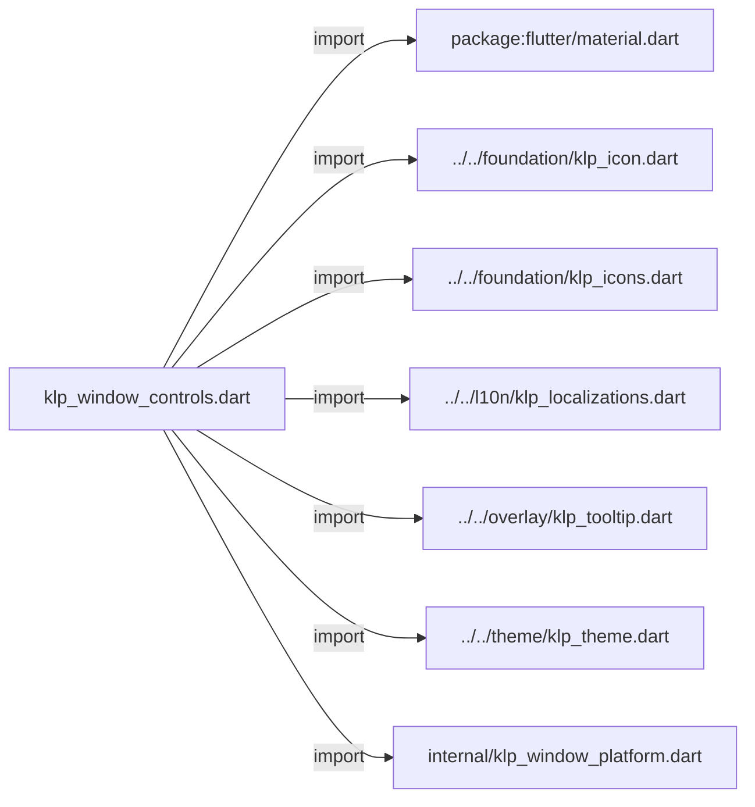
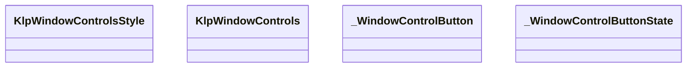
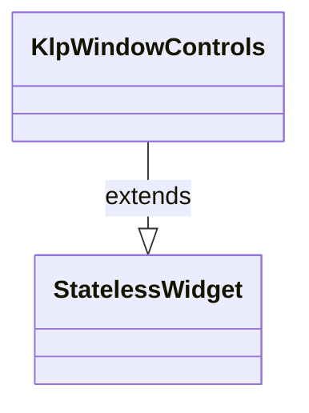
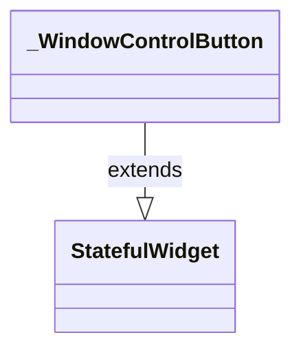
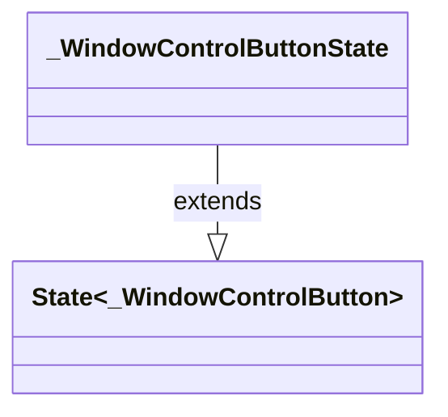

# klp_window_controls.dart：直接依賴與宣告架構

[回到目錄](README.md) · [來源檔案](../../../../../lib/src/shell/window/klp_window_controls.dart)

## 範圍

核心是 `lib/src/shell/window/klp_window_controls.dart`。主要視角為該檔案明寫的 import／export／part；輔助視角為本檔宣告及 extends／implements／with／on 關係。只展開一層外部邊界。

## 直接依賴圖

## 依賴證據

| 關係 | 原始 directive | 來源 |
|---|---|---|
| import | <code>import &#x27;package:flutter/material.dart&#x27;;</code> | [lib/src/shell/window/klp_window_controls.dart:1](../../../../../lib/src/shell/window/klp_window_controls.dart#L1) |
| import | <code>import &#x27;../../foundation/klp_icon.dart&#x27;;</code> | [lib/src/shell/window/klp_window_controls.dart:3](../../../../../lib/src/shell/window/klp_window_controls.dart#L3) |
| import | <code>import &#x27;../../foundation/klp_icons.dart&#x27;;</code> | [lib/src/shell/window/klp_window_controls.dart:4](../../../../../lib/src/shell/window/klp_window_controls.dart#L4) |
| import | <code>import &#x27;../../l10n/klp_localizations.dart&#x27;;</code> | [lib/src/shell/window/klp_window_controls.dart:5](../../../../../lib/src/shell/window/klp_window_controls.dart#L5) |
| import | <code>import &#x27;../../overlay/klp_tooltip.dart&#x27;;</code> | [lib/src/shell/window/klp_window_controls.dart:6](../../../../../lib/src/shell/window/klp_window_controls.dart#L6) |
| import | <code>import &#x27;../../theme/klp_theme.dart&#x27;;</code> | [lib/src/shell/window/klp_window_controls.dart:7](../../../../../lib/src/shell/window/klp_window_controls.dart#L7) |
| import | <code>import &#x27;internal/klp_window_platform.dart&#x27;;</code> | [lib/src/shell/window/klp_window_controls.dart:8](../../../../../lib/src/shell/window/klp_window_controls.dart#L8) |

## 宣告關係圖

本組節點是本檔宣告；沒有箭頭的宣告未在此圖主張互相依賴。

## 宣告與成員證據

成員包含 public 與 private；簽章取自來源，省略函式本體與欄位初始值。`(inferred)` 表示來源未明寫型別；建構子只顯示參數部分，不含初始化列表。

### KlpWindowControlsStyle

EnumDeclaration · public · [lib/src/shell/window/klp_window_controls.dart:10](../../../../../lib/src/shell/window/klp_window_controls.dart#L10)

<code>enum KlpWindowControlsStyle</code>

來源註解摘要：視窗控制按鈕樣式。

| 成員 | 可見性 | 簽章／型別 | 來源註解摘要 | 證據 |
|---|---|---|---|---|
| enum value <code>adaptive</code> | public | <code>adaptive</code> | 自動依據執行平台判斷。 | [lib/src/shell/window/klp_window_controls.dart:12](../../../../../lib/src/shell/window/klp_window_controls.dart#L12) |
| enum value <code>windows</code> | public | <code>windows</code> | Windows / Linux 風格（最小化、最大化、關閉）。 | [lib/src/shell/window/klp_window_controls.dart:15](../../../../../lib/src/shell/window/klp_window_controls.dart#L15) |
| enum value <code>macOS</code> | public | <code>macOS</code> | macOS 風格（關閉、最小化、最大化）。 | [lib/src/shell/window/klp_window_controls.dart:18](../../../../../lib/src/shell/window/klp_window_controls.dart#L18) |

### KlpWindowControls

ClassDeclaration · public · [lib/src/shell/window/klp_window_controls.dart:22](../../../../../lib/src/shell/window/klp_window_controls.dart#L22)

<code>class KlpWindowControls extends StatelessWidget</code>

- `extends` → <code>StatelessWidget</code>：[lib/src/shell/window/klp_window_controls.dart:22](../../../../../lib/src/shell/window/klp_window_controls.dart#L22)

| 成員 | 可見性 | 簽章／型別 | 來源註解摘要 | 證據 |
|---|---|---|---|---|
| constructor <code>KlpWindowControls</code> | public | <code>const KlpWindowControls({ super.key, required this.onMinimize, required this.onToggleMaximize, required this.onClose, this.isMaximized = false, this.style = KlpWindowControlsStyle.adaptive, this.extent, this.minimizeKey, this.maximizeKey, this.closeKey, })</code> |  | [lib/src/shell/window/klp_window_controls.dart:23](../../../../../lib/src/shell/window/klp_window_controls.dart#L23) |
| field <code>onMinimize</code> | public | <code>final VoidCallback? onMinimize</code> |  | [lib/src/shell/window/klp_window_controls.dart:36](../../../../../lib/src/shell/window/klp_window_controls.dart#L36) |
| field <code>onToggleMaximize</code> | public | <code>final VoidCallback? onToggleMaximize</code> |  | [lib/src/shell/window/klp_window_controls.dart:37](../../../../../lib/src/shell/window/klp_window_controls.dart#L37) |
| field <code>onClose</code> | public | <code>final VoidCallback? onClose</code> |  | [lib/src/shell/window/klp_window_controls.dart:38](../../../../../lib/src/shell/window/klp_window_controls.dart#L38) |
| field <code>isMaximized</code> | public | <code>final bool isMaximized</code> |  | [lib/src/shell/window/klp_window_controls.dart:39](../../../../../lib/src/shell/window/klp_window_controls.dart#L39) |
| field <code>style</code> | public | <code>final KlpWindowControlsStyle style</code> |  | [lib/src/shell/window/klp_window_controls.dart:40](../../../../../lib/src/shell/window/klp_window_controls.dart#L40) |
| field <code>extent</code> | public | <code>final double? extent</code> | 控制鈕的正方形邊長；未指定時使用主題的 Header 控制尺寸。 | [lib/src/shell/window/klp_window_controls.dart:43](../../../../../lib/src/shell/window/klp_window_controls.dart#L43) |
| field <code>minimizeKey</code> | public | <code>final Key? minimizeKey</code> |  | [lib/src/shell/window/klp_window_controls.dart:44](../../../../../lib/src/shell/window/klp_window_controls.dart#L44) |
| field <code>maximizeKey</code> | public | <code>final Key? maximizeKey</code> |  | [lib/src/shell/window/klp_window_controls.dart:45](../../../../../lib/src/shell/window/klp_window_controls.dart#L45) |
| field <code>closeKey</code> | public | <code>final Key? closeKey</code> |  | [lib/src/shell/window/klp_window_controls.dart:46](../../../../../lib/src/shell/window/klp_window_controls.dart#L46) |
| method <code>build</code> | public | <code>Widget build(BuildContext context)</code> |  | [lib/src/shell/window/klp_window_controls.dart:48](../../../../../lib/src/shell/window/klp_window_controls.dart#L48) |

### _WindowControlButton

ClassDeclaration · private · [lib/src/shell/window/klp_window_controls.dart:91](../../../../../lib/src/shell/window/klp_window_controls.dart#L91)

<code>class _WindowControlButton extends StatefulWidget</code>

- `extends` → <code>StatefulWidget</code>：[lib/src/shell/window/klp_window_controls.dart:91](../../../../../lib/src/shell/window/klp_window_controls.dart#L91)

| 成員 | 可見性 | 簽章／型別 | 來源註解摘要 | 證據 |
|---|---|---|---|---|
| constructor <code>_WindowControlButton</code> | private | <code>const _WindowControlButton({ super.key, required this.icon, required this.label, required this.onPressed, this.destructive = false, this.extent, })</code> |  | [lib/src/shell/window/klp_window_controls.dart:92](../../../../../lib/src/shell/window/klp_window_controls.dart#L92) |
| field <code>icon</code> | public | <code>final KlpIconData icon</code> |  | [lib/src/shell/window/klp_window_controls.dart:101](../../../../../lib/src/shell/window/klp_window_controls.dart#L101) |
| field <code>label</code> | public | <code>final String label</code> |  | [lib/src/shell/window/klp_window_controls.dart:102](../../../../../lib/src/shell/window/klp_window_controls.dart#L102) |
| field <code>onPressed</code> | public | <code>final VoidCallback? onPressed</code> |  | [lib/src/shell/window/klp_window_controls.dart:103](../../../../../lib/src/shell/window/klp_window_controls.dart#L103) |
| field <code>destructive</code> | public | <code>final bool destructive</code> |  | [lib/src/shell/window/klp_window_controls.dart:104](../../../../../lib/src/shell/window/klp_window_controls.dart#L104) |
| field <code>extent</code> | public | <code>final double? extent</code> |  | [lib/src/shell/window/klp_window_controls.dart:105](../../../../../lib/src/shell/window/klp_window_controls.dart#L105) |
| method <code>createState</code> | public | <code>State&lt;_WindowControlButton&gt; createState()</code> |  | [lib/src/shell/window/klp_window_controls.dart:107](../../../../../lib/src/shell/window/klp_window_controls.dart#L107) |

### _WindowControlButtonState

ClassDeclaration · private · [lib/src/shell/window/klp_window_controls.dart:111](../../../../../lib/src/shell/window/klp_window_controls.dart#L111)

<code>class _WindowControlButtonState extends State&lt;_WindowControlButton&gt;</code>

- `extends` → <code>State&lt;_WindowControlButton&gt;</code>：[lib/src/shell/window/klp_window_controls.dart:111](../../../../../lib/src/shell/window/klp_window_controls.dart#L111)

| 成員 | 可見性 | 簽章／型別 | 來源註解摘要 | 證據 |
|---|---|---|---|---|
| field <code>_hovered</code> | private | <code>bool _hovered</code> |  | [lib/src/shell/window/klp_window_controls.dart:112](../../../../../lib/src/shell/window/klp_window_controls.dart#L112) |
| field <code>_focused</code> | private | <code>bool _focused</code> |  | [lib/src/shell/window/klp_window_controls.dart:113](../../../../../lib/src/shell/window/klp_window_controls.dart#L113) |
| method <code>build</code> | public | <code>Widget build(BuildContext context)</code> |  | [lib/src/shell/window/klp_window_controls.dart:115](../../../../../lib/src/shell/window/klp_window_controls.dart#L115) |

## 閱讀說明與限制

箭頭只表示來源明寫的靜態關係；import 不等於呼叫。未分析動態呼叫、欄位的實際物件擁有權、狀態轉移或渲染流程；型別未進行語意解析，繼承目標保留原始型別拼寫。public／private 依 Dart 名稱前綴判斷；public 宣告不代表已由 `lib/kallopis.dart` 匯出。

本頁由 `tool/architecture_atlas` 產生；編輯來源或生成工具後重新產生，避免手改本頁。
