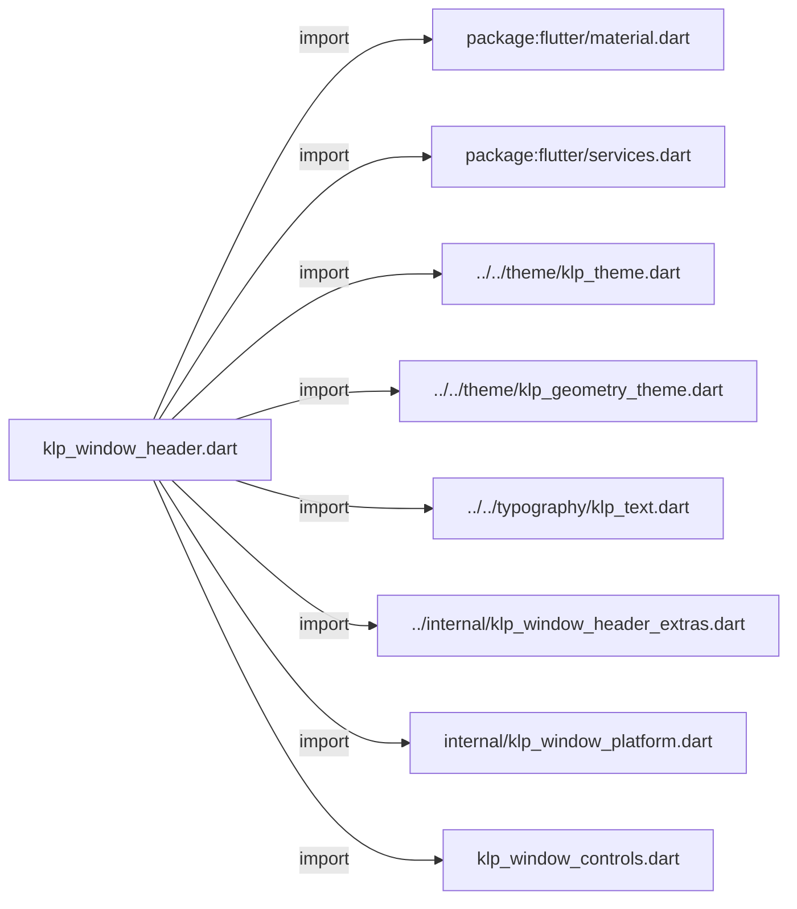
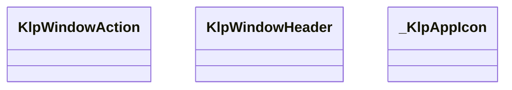
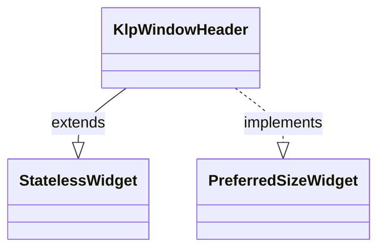
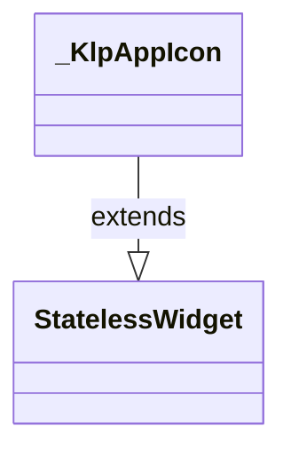

# klp_window_header.dart：直接依賴與宣告架構

[回到目錄](README.md) · [來源檔案](../../../../../lib/src/shell/window/klp_window_header.dart)

## 範圍

核心是 `lib/src/shell/window/klp_window_header.dart`。主要視角為該檔案明寫的 import／export／part；輔助視角為本檔宣告及 extends／implements／with／on 關係。只展開一層外部邊界。

## 直接依賴圖

## 依賴證據

| 關係 | 原始 directive | 來源 |
|---|---|---|
| import | <code>import &#x27;package:flutter/material.dart&#x27;;</code> | [lib/src/shell/window/klp_window_header.dart:1](../../../../../lib/src/shell/window/klp_window_header.dart#L1) |
| import | <code>import &#x27;package:flutter/services.dart&#x27;;</code> | [lib/src/shell/window/klp_window_header.dart:2](../../../../../lib/src/shell/window/klp_window_header.dart#L2) |
| import | <code>import &#x27;../../theme/klp_theme.dart&#x27;;</code> | [lib/src/shell/window/klp_window_header.dart:4](../../../../../lib/src/shell/window/klp_window_header.dart#L4) |
| import | <code>import &#x27;../../theme/klp_geometry_theme.dart&#x27;;</code> | [lib/src/shell/window/klp_window_header.dart:5](../../../../../lib/src/shell/window/klp_window_header.dart#L5) |
| import | <code>import &#x27;../../typography/klp_text.dart&#x27;;</code> | [lib/src/shell/window/klp_window_header.dart:6](../../../../../lib/src/shell/window/klp_window_header.dart#L6) |
| import | <code>import &#x27;../internal/klp_window_header_extras.dart&#x27;;</code> | [lib/src/shell/window/klp_window_header.dart:7](../../../../../lib/src/shell/window/klp_window_header.dart#L7) |
| import | <code>import &#x27;internal/klp_window_platform.dart&#x27;;</code> | [lib/src/shell/window/klp_window_header.dart:8](../../../../../lib/src/shell/window/klp_window_header.dart#L8) |
| import | <code>import &#x27;klp_window_controls.dart&#x27;;</code> | [lib/src/shell/window/klp_window_header.dart:9](../../../../../lib/src/shell/window/klp_window_header.dart#L9) |

## 宣告關係圖

本組節點是本檔宣告；沒有箭頭的宣告未在此圖主張互相依賴。

## 宣告與成員證據

成員包含 public 與 private；簽章取自來源，省略函式本體與欄位初始值。`(inferred)` 表示來源未明寫型別；建構子只顯示參數部分，不含初始化列表。

### klpWindowAppIconSlotKey

top-level variable · public · [lib/src/shell/window/klp_window_header.dart:12](../../../../../lib/src/shell/window/klp_window_header.dart#L12)

<code>const String klpWindowAppIconSlotKey</code>

來源註解摘要：視窗標題列的 App icon 固定槽位識別鍵。

### klpWindowHeaderSurfaceKey

top-level variable · public · [lib/src/shell/window/klp_window_header.dart:15](../../../../../lib/src/shell/window/klp_window_header.dart#L15)

<code>const String klpWindowHeaderSurfaceKey</code>

來源註解摘要：視窗標題列可視表面的識別鍵。

### klpWindowHeaderHeight

FunctionDeclaration · public · [lib/src/shell/window/klp_window_header.dart:17](../../../../../lib/src/shell/window/klp_window_header.dart#L17)

<code>double klpWindowHeaderHeight( KlpGeometryTheme geometry, { double? windowHeaderMargin, })</code>

來源註解摘要：Header 版面占位高度；windowHeaderMargin 僅作用於左右 padding。

### KlpWindowAction

ClassDeclaration · public · [lib/src/shell/window/klp_window_header.dart:23](../../../../../lib/src/shell/window/klp_window_header.dart#L23)

<code>abstract final class KlpWindowAction</code>

來源註解摘要：桌面平台視窗控制操作（最小化、最大化／還原、關閉、拖曳、限制尺寸）。

| 成員 | 可見性 | 簽章／型別 | 來源註解摘要 | 證據 |
|---|---|---|---|---|
| field <code>_channel</code> | private | <code>static const MethodChannel _channel</code> |  | [lib/src/shell/window/klp_window_header.dart:25](../../../../../lib/src/shell/window/klp_window_header.dart#L25) |
| method <code>minimize</code> | public | <code>static Future&lt;void&gt; minimize()</code> | 最小化目前視窗。 | [lib/src/shell/window/klp_window_header.dart:27](../../../../../lib/src/shell/window/klp_window_header.dart#L27) |
| method <code>toggleMaximize</code> | public | <code>static Future&lt;void&gt; toggleMaximize()</code> | 切換最大化／還原目前視窗。 | [lib/src/shell/window/klp_window_header.dart:34](../../../../../lib/src/shell/window/klp_window_header.dart#L34) |
| method <code>maximize</code> | public | <code>static Future&lt;void&gt; maximize()</code> | 確保目前視窗最大化；已最大化時不切換回視窗化。 | [lib/src/shell/window/klp_window_header.dart:41](../../../../../lib/src/shell/window/klp_window_header.dart#L41) |
| method <code>close</code> | public | <code>static Future&lt;void&gt; close()</code> | 關閉目前視窗。 | [lib/src/shell/window/klp_window_header.dart:50](../../../../../lib/src/shell/window/klp_window_header.dart#L50) |
| method <code>drag</code> | public | <code>static Future&lt;void&gt; drag()</code> | 開始拖曳目前視窗。 | [lib/src/shell/window/klp_window_header.dart:57](../../../../../lib/src/shell/window/klp_window_header.dart#L57) |
| method <code>setMinSize</code> | public | <code>static Future&lt;void&gt; setMinSize({double? minWidth, double? minHeight})</code> | 設定視窗最小寬高限制。 | [lib/src/shell/window/klp_window_header.dart:64](../../../../../lib/src/shell/window/klp_window_header.dart#L64) |
| method <code>checkIsMaximized</code> | public | <code>static Future&lt;bool&gt; checkIsMaximized()</code> | 查詢目前視窗是否處於最大化狀態。 | [lib/src/shell/window/klp_window_header.dart:74](../../../../../lib/src/shell/window/klp_window_header.dart#L74) |

### KlpWindowHeader

ClassDeclaration · public · [lib/src/shell/window/klp_window_header.dart:84](../../../../../lib/src/shell/window/klp_window_header.dart#L84)

<code>class KlpWindowHeader extends StatelessWidget implements PreferredSizeWidget</code>

來源註解摘要：桌面應用程式自帶視窗標題列（Chrome Header）。整個 Header 表面都可拖動視窗； 內部操作元件仍保留 tap 等自身事件。 - **Windows / Linux 模式**：左側展示 App Icon 與標題，右側展示自訂動作與視窗控制項。 - **macOS 模式**：左側展示視窗控制項（交通燈），中間展示 App Icon 與標題，右側展示自訂動作。

- `extends` → <code>StatelessWidget</code>：[lib/src/shell/window/klp_window_header.dart:89](../../../../../lib/src/shell/window/klp_window_header.dart#L89)
- `implements` → <code>PreferredSizeWidget</code>：[lib/src/shell/window/klp_window_header.dart:89](../../../../../lib/src/shell/window/klp_window_header.dart#L89)

| 成員 | 可見性 | 簽章／型別 | 來源註解摘要 | 證據 |
|---|---|---|---|---|
| constructor <code>KlpWindowHeader</code> | public | <code>const KlpWindowHeader({ super.key, this.title, this.titleText, this.titleRole = KlpTextRole.appTitle, this.titleTrailing, this.appIcon, this.appIconButton, this.actions, this.leading, this.trailing, this.platform, this.height, this.backgroundColor, this.onMinimize, this.onToggleMaximize, this.onClose, this.isMaximized = false, this.showWindowControls = true, })</code> |  | [lib/src/shell/window/klp_window_header.dart:90](../../../../../lib/src/shell/window/klp_window_header.dart#L90) |
| field <code>title</code> | public | <code>final Widget? title</code> | 自訂標題 Widget。優先於 [titleText]。 | [lib/src/shell/window/klp_window_header.dart:112](../../../../../lib/src/shell/window/klp_window_header.dart#L112) |
| field <code>titleText</code> | public | <code>final String? titleText</code> | 標題純文字。 | [lib/src/shell/window/klp_window_header.dart:115](../../../../../lib/src/shell/window/klp_window_header.dart#L115) |
| field <code>titleRole</code> | public | <code>final KlpTextRole titleRole</code> | 產品標題字體角色（預設使用 [KlpTextRole.appTitle]）。 | [lib/src/shell/window/klp_window_header.dart:118](../../../../../lib/src/shell/window/klp_window_header.dart#L118) |
| field <code>titleTrailing</code> | public | <code>final Widget? titleTrailing</code> | 緊接在標題右方的控制項；適合在面板收合後保留展開按鈕。 | [lib/src/shell/window/klp_window_header.dart:121](../../../../../lib/src/shell/window/klp_window_header.dart#L121) |
| field <code>appIcon</code> | public | <code>final Widget? appIcon</code> | 應用程式圖示。 | [lib/src/shell/window/klp_window_header.dart:124](../../../../../lib/src/shell/window/klp_window_header.dart#L124) |
| field <code>appIconButton</code> | public | <code>final Widget? appIconButton</code> | 佔用 App icon 槽位的互動按鈕。提供時優先於 [appIcon]。 | [lib/src/shell/window/klp_window_header.dart:127](../../../../../lib/src/shell/window/klp_window_header.dart#L127) |
| field <code>actions</code> | public | <code>final List&lt;Widget&gt;? actions</code> | 頂部自訂動作按鈕清單。 | [lib/src/shell/window/klp_window_header.dart:130](../../../../../lib/src/shell/window/klp_window_header.dart#L130) |
| field <code>leading</code> | public | <code>final Widget? leading</code> | 自訂最左側區域（若為 macOS 且提供則排在控制鈕後）。 | [lib/src/shell/window/klp_window_header.dart:133](../../../../../lib/src/shell/window/klp_window_header.dart#L133) |
| field <code>trailing</code> | public | <code>final Widget? trailing</code> | 自訂最右側區域。 | [lib/src/shell/window/klp_window_header.dart:136](../../../../../lib/src/shell/window/klp_window_header.dart#L136) |
| field <code>platform</code> | public | <code>final TargetPlatform? platform</code> | 手動指定平台外觀風格（預設依系統環境判定）。 | [lib/src/shell/window/klp_window_header.dart:139](../../../../../lib/src/shell/window/klp_window_header.dart#L139) |
| field <code>height</code> | public | <code>final double? height</code> | 標題列版面占位高度；未指定時為內容高度加上上下 margin。 | [lib/src/shell/window/klp_window_header.dart:142](../../../../../lib/src/shell/window/klp_window_header.dart#L142) |
| field <code>backgroundColor</code> | public | <code>final Color? backgroundColor</code> | 標題列背景色（預設為視窗底色 `tokens.app`）。 | [lib/src/shell/window/klp_window_header.dart:145](../../../../../lib/src/shell/window/klp_window_header.dart#L145) |
| field <code>onMinimize</code> | public | <code>final VoidCallback? onMinimize</code> | 最小化視窗回呼。 | [lib/src/shell/window/klp_window_header.dart:148](../../../../../lib/src/shell/window/klp_window_header.dart#L148) |
| field <code>onToggleMaximize</code> | public | <code>final VoidCallback? onToggleMaximize</code> | 最大化／還原視窗回呼。 | [lib/src/shell/window/klp_window_header.dart:151](../../../../../lib/src/shell/window/klp_window_header.dart#L151) |
| field <code>onClose</code> | public | <code>final VoidCallback? onClose</code> | 關閉視窗回呼。 | [lib/src/shell/window/klp_window_header.dart:154](../../../../../lib/src/shell/window/klp_window_header.dart#L154) |
| field <code>isMaximized</code> | public | <code>final bool isMaximized</code> | 目前視窗是否為最大化狀態。 | [lib/src/shell/window/klp_window_header.dart:157](../../../../../lib/src/shell/window/klp_window_header.dart#L157) |
| field <code>showWindowControls</code> | public | <code>final bool showWindowControls</code> | 是否顯示視窗控制按鈕（最小化、最大化、關閉）。 | [lib/src/shell/window/klp_window_header.dart:160](../../../../../lib/src/shell/window/klp_window_header.dart#L160) |
| getter <code>preferredSize</code> | public | <code>Size get preferredSize</code> |  | [lib/src/shell/window/klp_window_header.dart:162](../../../../../lib/src/shell/window/klp_window_header.dart#L162) |
| method <code>build</code> | public | <code>Widget build(BuildContext context)</code> |  | [lib/src/shell/window/klp_window_header.dart:167](../../../../../lib/src/shell/window/klp_window_header.dart#L167) |
| method <code>_buildWindowsLayout</code> | private | <code>Widget _buildWindowsLayout( BuildContext context, { required Widget identity, required Widget controls, required double controlExtent, })</code> |  | [lib/src/shell/window/klp_window_header.dart:259](../../../../../lib/src/shell/window/klp_window_header.dart#L259) |
| method <code>_buildMacLayout</code> | private | <code>Widget _buildMacLayout( BuildContext context, { required Widget identity, required Widget controls, })</code> |  | [lib/src/shell/window/klp_window_header.dart:327](../../../../../lib/src/shell/window/klp_window_header.dart#L327) |
| method <code>_buildDoubleTapRegion</code> | private | <code>Widget _buildDoubleTapRegion({required Widget child})</code> |  | [lib/src/shell/window/klp_window_header.dart:376](../../../../../lib/src/shell/window/klp_window_header.dart#L376) |

### _KlpAppIcon

ClassDeclaration · private · [lib/src/shell/window/klp_window_header.dart:385](../../../../../lib/src/shell/window/klp_window_header.dart#L385)

<code>class _KlpAppIcon extends StatelessWidget</code>

來源註解摘要：以視窗按鈕尺寸包裝消費端圖示，圖形本身維持 App icon 語意尺寸。

- `extends` → <code>StatelessWidget</code>：[lib/src/shell/window/klp_window_header.dart:386](../../../../../lib/src/shell/window/klp_window_header.dart#L386)

| 成員 | 可見性 | 簽章／型別 | 來源註解摘要 | 證據 |
|---|---|---|---|---|
| constructor <code>_KlpAppIcon</code> | private | <code>const _KlpAppIcon({ required this.controlExtent, required this.iconExtent, required this.child, })</code> |  | [lib/src/shell/window/klp_window_header.dart:387](../../../../../lib/src/shell/window/klp_window_header.dart#L387) |
| field <code>controlExtent</code> | public | <code>final double controlExtent</code> |  | [lib/src/shell/window/klp_window_header.dart:393](../../../../../lib/src/shell/window/klp_window_header.dart#L393) |
| field <code>iconExtent</code> | public | <code>final double iconExtent</code> |  | [lib/src/shell/window/klp_window_header.dart:394](../../../../../lib/src/shell/window/klp_window_header.dart#L394) |
| field <code>child</code> | public | <code>final Widget child</code> |  | [lib/src/shell/window/klp_window_header.dart:395](../../../../../lib/src/shell/window/klp_window_header.dart#L395) |
| method <code>build</code> | public | <code>Widget build(BuildContext context)</code> |  | [lib/src/shell/window/klp_window_header.dart:397](../../../../../lib/src/shell/window/klp_window_header.dart#L397) |

## 閱讀說明與限制

箭頭只表示來源明寫的靜態關係；import 不等於呼叫。未分析動態呼叫、欄位的實際物件擁有權、狀態轉移或渲染流程；型別未進行語意解析，繼承目標保留原始型別拼寫。public／private 依 Dart 名稱前綴判斷；public 宣告不代表已由 `lib/kallopis.dart` 匯出。

本頁由 `tool/architecture_atlas` 產生；編輯來源或生成工具後重新產生，避免手改本頁。
